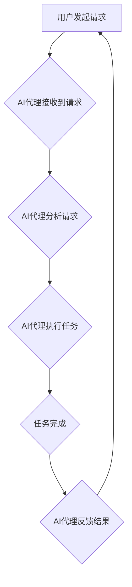

## AI代理与工作流自动化：提高业务效率

> 关键词：AI代理、工作流自动化、流程智能化、机器学习、自然语言处理、业务效率、流程优化

### 1. 背景介绍

在当今数字化时代，企业面临着日益复杂的业务流程和不断增长的工作量。传统的工作流管理方式难以应对这种快速变化的挑战，效率低下、成本高昂的问题日益突出。而人工智能（AI）技术的快速发展为企业提供了新的解决方案。

AI代理作为一种新兴的智能化技术，能够自动执行重复性任务、处理复杂决策和与用户进行自然交互，为企业工作流自动化带来了新的可能性。通过将AI代理融入到工作流程中，企业可以实现流程智能化，提高效率、降低成本、提升用户体验。

### 2. 核心概念与联系

#### 2.1 AI代理的概念

AI代理是一种能够自主执行任务的软件程序，它具备以下核心特征：

* **智能化：** 基于机器学习和深度学习等人工智能技术，能够学习和理解任务需求，并根据情况做出最佳决策。
* **自主性：** 可以独立完成任务，无需人工干预。
* **可扩展性：** 可以根据需要扩展功能，适应不同的业务场景。
* **交互性：** 可以与用户进行自然交互，例如通过语音或文本。

#### 2.2 工作流自动化的概念

工作流自动化是指利用软件工具自动执行一系列预定义的业务流程，减少人工干预，提高效率和准确性。

#### 2.3 AI代理与工作流自动化的联系

AI代理可以作为工作流自动化的关键组成部分，为工作流程注入智能化能力。

**流程图：**



### 3. 核心算法原理 & 具体操作步骤

#### 3.1 算法原理概述

AI代理的工作流程通常包括以下几个步骤：

1. **任务理解：** AI代理需要首先理解用户的请求，并将其转化为可执行的任务。这通常需要结合自然语言处理（NLP）技术，例如文本分类、实体识别和意图识别。
2. **决策制定：** 根据任务需求和已有的知识库，AI代理需要做出最佳的决策，确定执行步骤和所需资源。这通常需要结合机器学习（ML）技术，例如决策树、支持向量机和强化学习。
3. **任务执行：** AI代理根据决策结果执行相应的任务，例如访问数据库、发送邮件、调用API等。
4. **结果反馈：** AI代理将任务执行结果反馈给用户，并根据用户反馈进行学习和改进。

#### 3.2 算法步骤详解

1. **任务理解：**

* **文本预处理：** 对用户输入的文本进行清洗、分词、词性标注等预处理，去除无关信息，提取关键语义。
* **意图识别：** 利用机器学习模型识别用户请求的意图，例如查询信息、提交申请、预约服务等。
* **实体识别：** 从文本中识别出关键实体，例如时间、地点、人物、产品等。

2. **决策制定：**

* **知识库构建：** 建立一个包含业务规则、流程图、数据字典等信息的知识库，为AI代理提供决策依据。
* **规则引擎：** 利用规则引擎根据用户请求和知识库中的规则，确定执行步骤和所需资源。
* **机器学习模型：** 利用机器学习模型分析历史数据，预测用户需求和最佳决策方案。

3. **任务执行：**

* **API调用：** 调用外部API接口，例如数据库、邮件系统、支付平台等，完成任务执行。
* **流程自动化：** 利用工作流引擎自动执行预定义的流程，例如审批流程、订单处理流程等。
* **数据处理：** 对任务执行结果进行处理和分析，例如生成报表、发送通知等。

4. **结果反馈：**

* **自然语言回复：** 利用自然语言生成技术，为用户提供简洁明了的回复。
* **多模态交互：** 通过语音、图像、视频等多种方式与用户进行交互。
* **用户反馈收集：** 收集用户反馈，用于模型训练和流程优化。

#### 3.3 算法优缺点

**优点：**

* **提高效率：** 自动化重复性任务，释放人力资源，提高工作效率。
* **降低成本：** 减少人工操作，降低人力成本和错误率。
* **提升用户体验：** 提供快速、便捷、个性化的服务体验。
* **增强决策能力：** 基于数据分析，提供更准确、更智能的决策建议。

**缺点：**

* **技术门槛高：** 需要具备一定的AI和软件开发技术。
* **数据依赖性强：** 需要大量的数据进行训练和优化。
* **安全风险：** AI代理可能存在安全漏洞，需要做好防护措施。
* **伦理问题：** AI代理的决策可能会存在偏见或不公平性，需要进行伦理评估。

#### 3.4 算法应用领域

AI代理与工作流自动化技术在各个行业都有广泛的应用，例如：

* **金融行业：** 自动化贷款审批、风险评估、客户服务等流程。
* **医疗行业：** 自动化病历录入、预约挂号、药品配送等流程。
* **制造业：** 自动化生产调度、质量控制、设备维护等流程。
* **电商行业：** 自动化订单处理、物流配送、客户服务等流程。

### 4. 数学模型和公式 & 详细讲解 & 举例说明

#### 4.1 数学模型构建

AI代理的工作流程可以抽象为一个状态机模型，其中每个状态代表一个任务阶段，每个状态之间的转换由条件触发。

**状态机模型：**

```
状态：
- 初始化
- 任务理解
- 决策制定
- 任务执行
- 结果反馈

条件：
- 用户请求
- 任务完成
- 用户反馈

转换：
- 初始化 -> 任务理解：用户发起请求
- 任务理解 -> 决策制定：任务意图识别成功
- 决策制定 -> 任务执行：决策方案确定
- 任务执行 -> 结果反馈：任务执行完成
- 结果反馈 -> 任务理解：用户反馈存在新的请求
```

#### 4.2 公式推导过程

在决策制定阶段，AI代理可以使用决策树模型进行决策。决策树是一种树形结构的模型，每个节点代表一个决策条件，每个分支代表一个决策结果。

**决策树公式：**

```
决策结果 = f(特征1, 特征2,..., 特征n)
```

其中，f()为决策函数，特征1、特征2、...、特征n为用户请求的特征信息。

#### 4.3 案例分析与讲解

例如，在金融行业，AI代理可以用于自动化贷款审批流程。

**决策树示例：**

```
节点1：用户信用评分
    - 高分 -> 节点2
    - 低分 -> 拒绝贷款
节点2：用户收入水平
    - 高 -> 批准贷款
    - 低 -> 拒绝贷款
```

在这个例子中，AI代理根据用户的信用评分和收入水平进行决策，如果用户的信用评分高且收入水平高，则批准贷款；否则，拒绝贷款。

### 5. 项目实践：代码实例和详细解释说明

#### 5.1 开发环境搭建

* **操作系统：** Ubuntu 20.04 LTS
* **编程语言：** Python 3.8
* **开发工具：** VS Code
* **库依赖：**

```
pip install requests numpy pandas scikit-learn nltk
```

#### 5.2 源代码详细实现

```python
import requests
import numpy as np
from sklearn.tree import DecisionTreeClassifier
from nltk.tokenize import word_tokenize

# 知识库
loan_data = {
    "信用评分": ["高", "中", "低"],
    "收入水平": ["高", "中", "低"],
    "贷款金额": ["小", "中", "大"],
    "贷款用途": ["购房", "创业", "消费"],
    "决策": ["批准", "拒绝"]
}

# 训练数据
X_train = np.array([
    [1, 1, 1, 1],
    [0, 1, 1, 0],
    [1, 0, 1, 1],
    [0, 0, 1, 0],
    [1, 1, 0, 1]
])
y_train = np.array([1, 0, 1, 0, 1])

# 决策树模型
clf = DecisionTreeClassifier()
clf.fit(X_train, y_train)

# 用户请求
user_request = "我的信用评分很高，收入水平也高，想申请一笔中额度的贷款用于购房。"

# 任务理解
tokens = word_tokenize(user_request)
features = []
for token in tokens:
    if token in loan_data["信用评分"]:
        features.append(1)
    elif token in loan_data["收入水平"]:
        features.append(1)
    else:
        features.append(0)

# 决策制定
prediction = clf.predict([features])[0]

# 结果反馈
if prediction == 1:
    print("恭喜您，贷款申请已获批准！")
else:
    print("很抱歉，您的贷款申请未获批准。")
```

#### 5.3 代码解读与分析

* **知识库：** 存储了贷款审批相关的业务规则和数据。
* **训练数据：** 用于训练决策树模型，包含用户的特征信息和贷款审批结果。
* **决策树模型：** 使用Scikit-learn库中的DecisionTreeClassifier类构建决策树模型。
* **任务理解：** 对用户请求进行文本分析，提取关键特征信息。
* **决策制定：** 利用训练好的决策树模型，根据用户特征信息进行决策。
* **结果反馈：** 将决策结果以自然语言形式反馈给用户。

#### 5.4 运行结果展示

当用户输入“我的信用评分很高，收入水平也高，想申请一笔中额度的贷款用于购房。”时，AI代理会输出“恭喜您，贷款申请已获批准！”

### 6. 实际应用场景

#### 6.1 金融行业

* **自动化的贷款审批流程：** AI代理可以根据用户的信用评分、收入水平、贷款金额等信息，自动审批贷款申请，提高审批效率和准确性。
* **智能化的客户服务：** AI代理可以接入客服系统，自动回答客户常见问题，例如账户余额查询、交易记录查询等，提升客户服务效率。
* **风险评估和防控：** AI代理可以分析用户的交易行为、信用记录等数据，识别潜在的风险，并采取相应的防控措施。

#### 6.2 医疗行业

* **自动化的病历录入：** AI代理可以识别和提取病历中的关键信息，自动录入到电子病历系统，提高效率和准确性。
* **智能化的预约挂号：** AI代理可以接入医院预约系统，帮助患者在线预约挂号，减少排队等待时间。
* **药品配送和管理：** AI代理可以自动生成药品配送清单，并跟踪药品配送状态，提高药品配送效率和安全性。

#### 6.3 制造业

* **自动化的生产调度：** AI代理可以根据生产计划、设备状态、物料库存等信息，自动优化生产调度，提高生产效率和产出率。
* **智能化的质量控制：** AI代理可以利用机器视觉技术，对生产过程中的产品进行实时检测，识别缺陷，提高产品质量。
* **设备维护和保养：** AI代理可以分析设备运行数据，预测设备故障，并提醒进行维护保养，降低设备故障率。

#### 6.4 未来应用展望

随着AI技术的不断发展，AI代理与工作流自动化的应用场景将更加广泛，例如：

* **个性化服务：