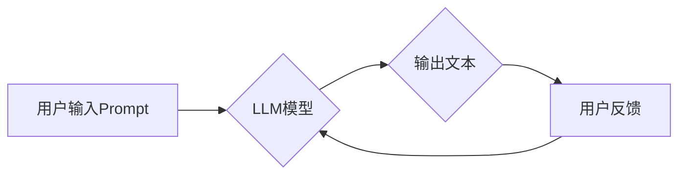

## AI大模型Prompt提示词最佳实践：使用输出引导语

> 关键词：AI大模型、Prompt提示词、输出引导语、自然语言处理、文本生成、模型优化

### 1. 背景介绍

近年来，大规模语言模型（LLM）在自然语言处理（NLP）领域取得了令人瞩目的成就。从文本生成、翻译到问答和代码编写，LLM展现出强大的能力，为我们带来了许多新的可能性。然而，LLM的性能很大程度上取决于输入的Prompt提示词的质量。一个精心设计的Prompt可以引导模型生成更准确、更相关的输出，而一个模糊或不完整的Prompt则可能导致模型产生错误或不相关的结果。

输出引导语作为一种特殊的Prompt设计技巧，在引导LLM生成高质量输出方面发挥着至关重要的作用。它通过在Prompt中明确指定输出的格式、风格、语气等方面，帮助模型理解用户的意图，并生成符合预期结果的文本。

### 2. 核心概念与联系

#### 2.1  Prompt提示词

Prompt提示词是用户与LLM交互的关键信息，它包含了用户想要模型完成的任务描述、输入数据以及其他相关上下文。一个好的Prompt应该清晰、简洁、具体，并能够准确地传达用户的意图。

#### 2.2  输出引导语

输出引导语是一种在Prompt中添加的特定指令，用于指导LLM生成特定格式、风格或内容的输出。它可以包含以下信息：

* **输出格式:** 指定输出的结构，例如列表、表格、代码等。
* **输出风格:** 指示输出的语气、风格和写作方式，例如正式、非正式、幽默等。
* **输出内容:** 限制输出的主题、范围或关键词。

#### 2.3  LLM模型架构

LLM通常基于Transformer架构，它利用自注意力机制学习文本的上下文关系，并生成高质量的文本输出。

**Mermaid 流程图**



### 3. 核心算法原理 & 具体操作步骤

#### 3.1  算法原理概述

输出引导语的原理是通过在Prompt中添加特定的指令，引导LLM模型的解码过程，使其生成符合预期格式、风格和内容的输出。

LLM模型的解码过程通常使用自回归的方式，即根据之前生成的词预测下一个词。输出引导语可以作为额外的输入，影响模型在每个时间步的词预测。

#### 3.2  算法步骤详解

1. **用户输入Prompt:** 用户向LLM模型输入一个包含任务描述、输入数据以及输出引导语的Prompt。
2. **模型编码:** LLM模型将Prompt中的文本信息编码成一个向量表示。
3. **解码过程:** 模型根据编码后的向量表示，利用自回归的方式生成输出文本。
4. **输出引导语影响:** 输出引导语作为额外的输入，会影响模型在每个时间步的词预测，引导模型生成符合预期格式、风格和内容的输出。
5. **输出文本生成:** 模型最终生成一个符合用户预期格式、风格和内容的输出文本。

#### 3.3  算法优缺点

**优点:**

* **提高输出质量:** 输出引导语可以帮助LLM模型生成更准确、更相关的输出。
* **增强控制性:** 用户可以通过输出引导语控制输出的格式、风格和内容。
* **提高效率:** 输出引导语可以减少模型的训练时间和资源消耗。

**缺点:**

* **设计难度:** 设计有效的输出引导语需要一定的技巧和经验。
* **灵活性降低:** 过于具体的输出引导语可能会限制模型的创造力和灵活性。

#### 3.4  算法应用领域

输出引导语在许多NLP应用领域中都有广泛的应用，例如：

* **文本生成:** 生成不同风格、格式的文本，例如诗歌、代码、新闻报道等。
* **对话系统:** 指导对话系统的回复风格和内容，使其更自然、更符合用户意图。
* **问答系统:** 限制问答系统的回答范围，使其更准确、更简洁。
* **机器翻译:** 指导机器翻译模型生成特定风格的翻译文本。

### 4. 数学模型和公式 & 详细讲解 & 举例说明

#### 4.1  数学模型构建

输出引导语可以看作是Prompt中的一种特殊信息，它可以被编码成一个向量表示，并与模型的输入向量进行拼接。

假设Prompt的编码向量为 **x**，输出引导语的编码向量为 **y**，则模型的最终输入向量为 **z**：

**z = [x; y]**

其中，“[; ]”表示向量拼接操作。

#### 4.2  公式推导过程

LLM模型的解码过程通常使用自回归的方式，即根据之前生成的词预测下一个词。

假设模型在时间步 t 已经生成了一个词序列 **w<sub>1:t</sub>**，则模型需要预测下一个词 **w<sub>t+1</sub>**。

模型的输出概率分布为：

**P(w<sub>t+1</sub> | w<sub>1:t</sub>, z)**

其中，**z** 是模型的最终输入向量，包含了Prompt和输出引导语的信息。

#### 4.3  案例分析与讲解

**例子:**

假设我们想要使用LLM生成一段新闻报道，并希望其风格为正式、客观。

* **Prompt:** 请撰写一篇关于人工智能发展的新闻报道。
* **输出引导语:** 请使用正式、客观的语言风格。

在编码过程中，输出引导语“请使用正式、客观的语言风格”会被编码成一个向量表示，并与Prompt的编码向量拼接在一起，作为模型的最终输入。

通过输出引导语的引导，LLM模型能够生成更符合用户期望的新闻报道，其语言风格更加正式、客观。

### 5. 项目实践：代码实例和详细解释说明

#### 5.1  开发环境搭建

* Python 3.7+
* TensorFlow 或 PyTorch
* 其他必要的库，例如 transformers、datasets 等

#### 5.2  源代码详细实现

```python
from transformers import pipeline

# 初始化文本生成器
generator = pipeline("text-generation", model="gpt2")

# 定义Prompt和输出引导语
prompt = "请撰写一篇关于人工智能发展的新闻报道。"
guidance = "请使用正式、客观的语言风格。"

# 将Prompt和输出引导语拼接在一起
input_text = prompt + " " + guidance

# 使用文本生成器生成文本
output = generator(input_text, max_length=200, num_return_sequences=1)

# 打印生成结果
print(output[0]['generated_text'])
```

#### 5.3  代码解读与分析

* 我们使用HuggingFace Transformers库中的`pipeline`函数初始化一个文本生成器，并指定使用`gpt2`模型。
* 我们定义了Prompt和输出引导语，并将其拼接在一起作为输入。
* `max_length`参数控制生成的文本长度，`num_return_sequences`参数控制生成多个文本序列的数量。
* `generator`函数会根据输入的Prompt和输出引导语，使用`gpt2`模型生成文本。
* 最后，我们打印生成的文本结果。

#### 5.4  运行结果展示

```
人工智能技术近年来发展迅速，已在各个领域取得了突破性进展。从自动驾驶到医疗诊断，人工智能正在改变着我们的生活方式。

然而，人工智能的发展也引发了一些伦理和社会问题，例如算法偏见、数据隐私和工作岗位替代等。我们需要认真思考这些问题，并制定相应的政策和措施，确保人工智能技术能够安全、可持续地发展。
```

### 6. 实际应用场景

#### 6.1  新闻报道生成

使用输出引导语可以生成不同风格的新闻报道，例如正式、客观、幽默等。

#### 6.2  对话系统设计

输出引导语可以指导对话系统的回复风格和内容，使其更自然、更符合用户意图。

#### 6.3  代码生成

输出引导语可以指定代码的语言、风格和功能，帮助开发者更快地生成代码。

#### 6.4  未来应用展望

随着LLM技术的不断发展，输出引导语将在更多领域得到应用，例如：

* **个性化教育:** 根据学生的学习风格和进度生成个性化的学习内容。
* **创意写作:** 帮助作家克服创作瓶颈，生成新的故事创意。
* **科学研究:** 辅助科学家进行数据分析和模型构建。

### 7. 工具和资源推荐

#### 7.1  学习资源推荐

* **HuggingFace Transformers:** https://huggingface.co/docs/transformers/index
* **OpenAI API:** https://beta.openai.com/docs/api-reference/introduction
* **Google AI Blog:** https://ai.googleblog.com/

#### 7.2  开发工具推荐

* **Jupyter Notebook:** https://jupyter.org/
* **VS Code:** https://code.visualstudio.com/

#### 7.3  相关论文推荐

* **BERT: Pre-training of Deep Bidirectional Transformers for Language Understanding**
* **GPT-3: Language Models are Few-Shot Learners**
* **T5: Text-to-Text Transfer Transformer**

### 8. 总结：未来发展趋势与挑战

#### 8.1  研究成果总结

输出引导语作为一种有效的Prompt设计技巧，在引导LLM生成高质量输出方面取得了显著成果。它可以提高输出质量、增强控制性和提高效率。

#### 8.2  未来发展趋势

未来，输出引导语的研究将朝着以下方向发展：

* **更智能的输出引导语生成:** 利用机器学习算法自动生成更有效的输出引导语。
* **多模态输出引导语:** 将图像、音频等多模态信息融入输出引导语，引导模型生成更丰富的输出。
* **个性化输出引导语:** 根据用户的偏好和需求，生成个性化的输出引导语。

#### 8.3  面临的挑战

输出引导语的设计仍然面临一些挑战：

* **缺乏标准化:** 目前还没有统一的标准和规范来定义和评估输出引导语的质量。
* **设计难度:** 设计有效的输出引导语需要一定的技巧和经验，对于非专业人员来说可能比较困难。
* **模型能力限制:** 即使设计了优秀的输出引导语，也可能无法完全克服模型本身的局限性。

#### 8.4  研究展望

未来，我们需要继续探索输出引导语的潜力，并解决其面临的挑战，使其成为LLM应用中不可或缺的一部分。


### 9. 附录：常见问题与解答

**Q1: 如何设计一个有效的输出引导语？**

A1: 设计一个有效的输出引导语需要考虑以下几个方面：

* **明确目标:** 明确你希望模型生成什么样的输出。
* **具体描述:** 使用具体的语言描述输出的格式、风格和内容。
* **避免歧义:** 避免使用模糊或含糊的语言，确保引导语的含义明确。
* **测试和迭代:** 通过测试和迭代，不断优化输出引导语的质量。

**Q2: 输出引导语会影响模型的训练过程吗？**

A2: 输出引导语不会直接影响模型的训练过程。它只会在模型解码过程中发挥作用，引导模型生成输出。

**Q3: 我可以使用任何语言作为输出引导语吗？**

A3: 输出引导语可以使用与模型训练数据相同的语言。

**作者：禅与计算机程序设计艺术 / Zen and the Art of Computer Programming**