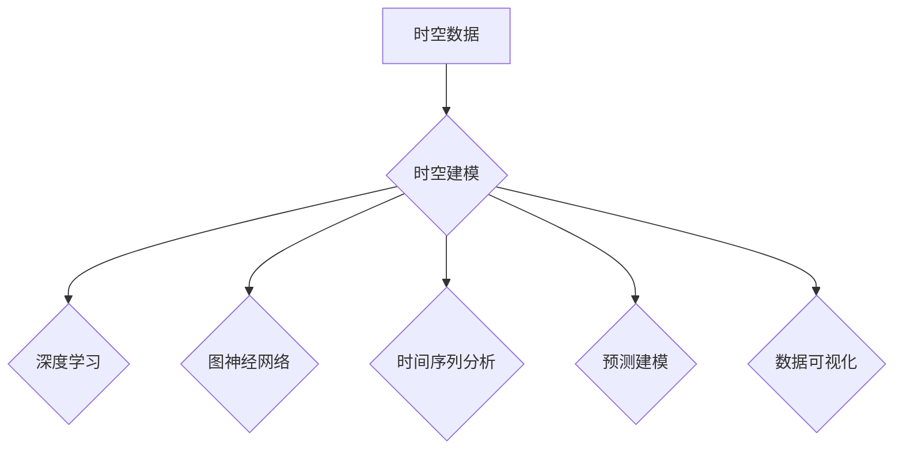

## AI时空建模的关键技术步骤解析

> 关键词：时空建模，人工智能，深度学习，图神经网络，时间序列分析，预测建模，数据可视化

### 1. 背景介绍

随着人工智能技术的飞速发展，时空数据在各个领域得到了广泛应用，例如交通预测、城市规划、疫情防控、金融风险管理等。时空数据具有时间和空间两个维度，其内在的复杂性和动态性使得传统的分析方法难以有效处理。因此，构建有效的时空建模方法成为人工智能领域的重要研究方向。

时空建模旨在通过构建数学模型和算法，对时空数据进行分析、理解和预测。它可以帮助我们揭示时空数据的内在规律，预测未来事件发生，并为决策提供支持。

### 2. 核心概念与联系

**2.1 时空数据**

时空数据是指包含时间和空间信息的各种数据，例如地理位置数据、传感器数据、社交媒体数据等。

**2.2 时空建模**

时空建模是指利用数学模型和算法对时空数据进行分析、理解和预测。

**2.3 深度学习**

深度学习是一种机器学习方法，它利用多层神经网络来学习数据中的复杂特征。

**2.4 图神经网络**

图神经网络是一种专门用于处理图结构数据的深度学习方法。它可以学习图中节点和边的关系，并进行节点分类、边预测等任务。

**2.5 时间序列分析**

时间序列分析是一种统计方法，它用于分析时间顺序的数据，例如股票价格、气温等。

**2.6 预测建模**

预测建模是指利用历史数据预测未来事件发生。

**2.7 数据可视化**

数据可视化是指将数据以图形化的形式呈现，以便于理解和分析。

**2.8 Mermaid 流程图**



### 3. 核心算法原理 & 具体操作步骤

**3.1 算法原理概述**

时空建模的核心算法原理是利用深度学习、图神经网络、时间序列分析等技术，对时空数据进行特征提取、关系建模和预测建模。

**3.2 算法步骤详解**

1. **数据预处理:** 对时空数据进行清洗、转换、归一化等操作，使其适合模型训练。
2. **特征提取:** 利用深度学习、图神经网络等技术，从时空数据中提取时间、空间、属性等特征。
3. **关系建模:** 利用图神经网络等技术，构建时空数据的节点和边关系，刻画时空数据之间的关联性。
4. **预测建模:** 利用深度学习、时间序列分析等技术，构建预测模型，对未来事件进行预测。
5. **结果评估:** 利用指标如准确率、召回率、F1-score等，评估模型的预测性能。

**3.3 算法优缺点**

**优点:**

* 可以处理复杂时空数据。
* 可以学习时空数据的内在规律。
* 可以进行准确的预测。

**缺点:**

* 需要大量的训练数据。
* 计算复杂度高。
* 模型解释性较差。

**3.4 算法应用领域**

* 交通预测
* 城市规划
* 疫情防控
* 金融风险管理
* 物流优化
* 犯罪预测

### 4. 数学模型和公式 & 详细讲解 & 举例说明

**4.1 数学模型构建**

时空建模通常采用以下数学模型：

* **空间模型:**  例如，可以使用距离、方向、密度等指标来描述空间关系。
* **时间模型:**  例如，可以使用时间序列分析、差分方程等方法来描述时间变化趋势。
* **时空模型:**  例如，可以使用空间-时间关联分析、时空聚类等方法来描述时空关系。

**4.2 公式推导过程**

具体公式推导过程取决于所选用的数学模型和算法。例如，在使用时间序列分析模型时，可以利用ARIMA模型的公式进行预测。

**4.3 案例分析与讲解**

例如，在交通预测领域，可以使用时空建模方法预测交通流量。可以构建一个空间模型，描述道路网络的拓扑结构和交通流量的分布；可以构建一个时间模型，描述交通流量随时间变化的趋势；然后，可以结合空间和时间模型，构建一个时空模型，对未来交通流量进行预测。

### 5. 项目实践：代码实例和详细解释说明

**5.1 开发环境搭建**

* Python 3.x
* TensorFlow 或 PyTorch
* Geopandas
* NetworkX

**5.2 源代码详细实现**

```python
import tensorflow as tf
from tensorflow.keras.models import Sequential
from tensorflow.keras.layers import LSTM, Dense

# 数据预处理
#...

# 模型构建
model = Sequential()
model.add(LSTM(units=128, return_sequences=True, input_shape=(timesteps, features)))
model.add(LSTM(units=64))
model.add(Dense(units=1))

# 模型编译
model.compile(loss='mean_squared_error', optimizer='adam')

# 模型训练
model.fit(X_train, y_train, epochs=10, batch_size=32)

# 模型预测
predictions = model.predict(X_test)
```

**5.3 代码解读与分析**

* 该代码示例使用LSTM网络进行时间序列预测。
* LSTM网络是一种专门用于处理时间序列数据的深度学习模型。
* 模型输入为时间序列数据，输出为预测值。

**5.4 运行结果展示**

* 可以使用绘图工具，例如Matplotlib，将预测结果与真实值进行对比。

### 6. 实际应用场景

**6.1 交通预测**

* 预测道路交通流量、拥堵情况、交通事故发生概率等。

**6.2 城市规划**

* 预测人口流动、城市发展趋势、公共设施需求等。

**6.3 疫情防控**

* 预测疫情传播路径、感染人数、医疗资源需求等。

**6.4 未来应用展望**

* 智能交通系统
* 智能城市建设
* 智慧医疗
* 精准营销

### 7. 工具和资源推荐

**7.1 学习资源推荐**

* 书籍：《深度学习》、《图神经网络》
* 在线课程：Coursera、edX、Udacity

**7.2 开发工具推荐**

* Python
* TensorFlow
* PyTorch
* Geopandas
* NetworkX

**7.3 相关论文推荐**

* [时空建模综述](https://arxiv.org/abs/2003.09427)
* [图神经网络在时空建模中的应用](https://arxiv.org/abs/2103.04947)

### 8. 总结：未来发展趋势与挑战

**8.1 研究成果总结**

时空建模在人工智能领域取得了显著进展，为解决各种实际问题提供了有效方法。

**8.2 未来发展趋势**

* 更强大的计算能力和数据处理能力
* 更先进的深度学习算法和模型
* 更有效的时空数据融合方法
* 更强的模型解释性和可解释性

**8.3 面临的挑战**

* 数据质量和可用性
* 模型复杂性和可解释性
* 隐私保护和数据安全

**8.4 研究展望**

未来时空建模的研究将更加注重以下方面：

* 构建更灵活、更鲁棒的时空建模方法
* 开发更有效的时空数据融合方法
* 提高模型的解释性和可解释性
* 解决时空建模中的隐私保护和数据安全问题

### 9. 附录：常见问题与解答

**9.1 什么是时空建模？**

时空建模是指利用数学模型和算法对时空数据进行分析、理解和预测。

**9.2 时空建模有哪些应用场景？**

时空建模的应用场景非常广泛，例如交通预测、城市规划、疫情防控、金融风险管理等。

**9.3 如何进行时空建模？**

时空建模的具体步骤包括数据预处理、特征提取、关系建模、预测建模和结果评估。

**9.4 时空建模有哪些技术方法？**

常用的时空建模技术方法包括深度学习、图神经网络、时间序列分析等。

**9.5 时空建模有哪些挑战？**

时空建模面临的挑战包括数据质量和可用性、模型复杂性和可解释性、隐私保护和数据安全等。


作者：禅与计算机程序设计艺术 / Zen and the Art of Computer Programming 
