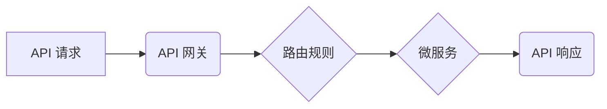

## 1. 背景介绍

在当今以微服务架构为主导的软件开发时代，API 网关扮演着越来越重要的角色。它作为应用程序和微服务之间的桥梁，提供了一系列功能，以管理、保护和增强 API 的安全性、可扩展性和性能。随着 API 的日益普及，API 网关也逐渐成为现代软件系统不可或缺的一部分。

### 1.1 API 的发展趋势

API（Application Programming Interface，应用程序编程接口）是一种软件组件之间通信的规范，它允许不同的应用程序相互交互和共享数据。随着互联网和云计算的发展，API 的应用范围越来越广，从简单的网站数据获取到复杂的业务流程集成，API 已经成为构建现代软件系统的重要基础。

### 1.2 微服务架构的兴起

微服务架构是一种将大型应用程序分解成多个小型、独立的服务的架构模式。每个微服务专注于特定的业务功能，并通过轻量级的通信协议（如 RESTful API）相互交互。微服务架构具有许多优点，例如可扩展性、弹性、独立部署和技术多样性，但同时也带来了新的挑战，例如 API 管理、服务发现和安全保障。

### 1.3 API 网关的必要性

在微服务架构中，API 网关作为应用程序和微服务之间的入口点，承担着重要的职责：

* **统一入口:** 提供一个统一的入口点，使应用程序可以访问所有微服务，无需了解每个微服务的具体地址和接口。
* **流量管理:** 控制 API 的流量，防止过载和攻击，保障系统稳定运行。
* **安全保障:** 对 API 进行身份验证和授权，保护敏感数据和业务逻辑。
* **监控和日志:** 收集 API 的调用信息，进行监控和分析，帮助开发人员快速定位问题。
* **版本控制:** 管理 API 的不同版本，确保应用程序能够兼容不同的微服务版本。

## 2. 核心概念与联系

API 网关的核心概念包括：

* **代理:** API 网关通过代理机制转发 API 请求到相应的微服务。
* **路由:** 根据请求路径和其他条件，将请求转发到正确的微服务。
* **安全:** 对 API 请求进行身份验证和授权，确保只有授权用户才能访问特定资源。
* **监控:** 收集 API 调用信息，进行监控和分析，帮助开发人员了解 API 的性能和使用情况。

**API 网关架构**



## 3. 核心算法原理 & 具体操作步骤

### 3.1 算法原理概述

API 网关的核心算法主要包括路由算法、安全算法和监控算法。

* **路由算法:** 根据请求路径、请求头、请求参数等信息，将请求转发到相应的微服务。常见的路由算法包括正则表达式匹配、哈希路由和基于服务的路由。
* **安全算法:** 对 API 请求进行身份验证和授权，确保只有授权用户才能访问特定资源。常见的安全算法包括 OAuth 2.0、JWT 和 API 密钥。
* **监控算法:** 收集 API 调用信息，进行监控和分析，帮助开发人员了解 API 的性能和使用情况。常见的监控算法包括统计分析、事件驱动和机器学习。

### 3.2 算法步骤详解

**路由算法步骤:**

1. API 网关接收 API 请求。
2. 解析请求路径、请求头、请求参数等信息。
3. 根据路由规则，匹配请求到相应的微服务。
4. 将请求转发到匹配的微服务。

**安全算法步骤:**

1. API 网关接收 API 请求。
2. 验证请求的身份信息，例如 API 密钥、OAuth 2.0 授权码或 JWT 令牌。
3. 根据身份信息，授权访问权限。
4. 如果授权成功，则转发请求到相应的微服务。否则，返回错误信息。

**监控算法步骤:**

1. API 网关接收 API 请求。
2. 记录请求信息，例如请求时间、请求路径、请求参数、响应时间等。
3. 将请求信息发送到监控系统。
4. 监控系统对请求信息进行统计分析、事件驱动和机器学习等处理，生成监控报表和告警信息。

### 3.3 算法优缺点

**路由算法:**

* **优点:** 灵活、可扩展、易于维护。
* **缺点:** 复杂度较高，性能可能受限于路由规则的复杂度。

**安全算法:**

* **优点:** 能够有效地保护 API 的安全性。
* **缺点:** 需要复杂的配置和管理。

**监控算法:**

* **优点:** 可以帮助开发人员了解 API 的性能和使用情况，及时发现问题。
* **缺点:** 需要收集和处理大量的数据，对系统资源有一定的消耗。

### 3.4 算法应用领域

API 网关的算法应用领域广泛，包括：

* **电商平台:** 管理商品、订单、用户等 API 的访问。
* **金融系统:** 提供支付、转账、查询等金融服务的 API。
* **社交媒体:** 管理用户、帖子、评论等 API 的访问。
* **云计算平台:** 提供云存储、云计算、云数据库等服务的 API。

## 4. 数学模型和公式 & 详细讲解 & 举例说明

### 4.1 数学模型构建

API 网关的路由算法可以抽象为一个图论模型，其中：

* **节点:** 代表微服务。
* **边:** 代表微服务之间的 API 调用关系。

路由算法的目标是找到从 API 请求节点到目标微服务节点的最短路径。

### 4.2 公式推导过程

可以使用 Dijkstra 算法或 Bellman-Ford 算法来求解最短路径。

**Dijkstra 算法:**

1. 初始化距离数组，将所有节点的距离设置为无穷大，除了起点节点，其距离设置为 0。
2. 选择距离最小的节点，将其标记为已访问节点。
3. 更新相邻节点的距离，如果通过当前节点到达相邻节点的距离比当前相邻节点的距离更短，则更新相邻节点的距离。
4. 重复步骤 2 和 3，直到所有节点都被访问。

**Bellman-Ford 算法:**

1. 初始化距离数组，将所有节点的距离设置为无穷大，除了起点节点，其距离设置为 0。
2. 迭代执行 n-1 次松弛操作，其中 n 是节点数。
3. 在每次松弛操作中，检查所有边，如果通过当前边到达相邻节点的距离比当前相邻节点的距离更短，则更新相邻节点的距离。
4. 执行一次额外的松弛操作，如果发现距离更新，则表示存在负权回路，算法失败。

### 4.3 案例分析与讲解

假设有一个 API 网关，管理三个微服务：用户服务、商品服务和订单服务。

* 用户服务提供用户注册、登录等功能。
* 商品服务提供商品查询、添加购物车等功能。
* 订单服务提供下单、支付等功能。

当用户访问商品列表页面时，API 网关需要将请求转发到商品服务。

使用 Dijkstra 算法，可以找到从用户请求节点到商品服务节点的最短路径，并根据路由规则转发请求。

## 5. 项目实践：代码实例和详细解释说明

### 5.1 开发环境搭建

* 操作系统: Ubuntu 20.04
* 编程语言: Python 3.8
* 框架: FastAPI

### 5.2 源代码详细实现

```python
from fastapi import FastAPI, Request

app = FastAPI()

# 路由规则
@app.get("/products")
async def get_products(request: Request):
    # 获取请求参数
    category = request.query_params.get("category")

    # 根据路由规则转发请求到商品服务
    #...

    return products

```

### 5.3 代码解读与分析

* `FastAPI` 是一个现代的 Python Web 框架，用于构建高性能、易于维护的 API。
* `@app.get("/products")` 定义了一个 GET 请求路由规则，当用户访问 `/products` 路径时，会调用 `get_products` 函数。
* `request: Request` 表示请求对象，可以从中获取请求参数等信息。
* `category = request.query_params.get("category")` 获取请求参数 `category` 的值。
* `# 根据路由规则转发请求到商品服务` 这里需要根据具体的路由规则，将请求转发到相应的微服务。
* `return products` 返回商品列表数据。

### 5.4 运行结果展示

当用户访问 `/products` 路径时，API 网关会根据路由规则转发请求到商品服务，并返回商品列表数据。

## 6. 实际应用场景

### 6.1 电商平台

API 网关可以管理商品、订单、用户等 API 的访问，提供统一的入口点，保障 API 的安全性、可扩展性和性能。

### 6.2 金融系统

API 网关可以提供支付、转账、查询等金融服务的 API，并进行身份验证和授权，保障金融数据的安全。

### 6.3 社交媒体

API 网关可以管理用户、帖子、评论等 API 的访问，控制用户行为，防止恶意攻击。

### 6.4 未来应用展望

随着微服务架构的普及，API 网关的应用场景将会更加广泛，例如：

* **边缘计算:** 在边缘设备上部署 API 网关，提供本地化服务。
* **物联网:** 连接各种物联网设备，提供统一的 API 接口。
* **区块链:** 与区块链网络集成，提供基于区块链的 API 服务。

## 7. 工具和资源推荐

### 7.1 学习资源推荐

* **书籍:**
    * API Gateway Design and Implementation
    * Building Microservices

* **在线课程:**
    * Udemy: API Gateway Design and Development
    * Coursera: Microservices Architecture

### 7.2 开发工具推荐

* **Kong:** 开源 API 网关，支持多种协议和插件。
* **Tyk:** 开源 API 网关，提供丰富的功能和灵活的配置。
* **Apigee:** 企业级 API 网关，提供强大的管理和监控功能。

### 7.3 相关论文推荐

* **API Gateway Design Patterns**
* **Microservices Architecture: Principles and Patterns**

## 8. 总结：未来发展趋势与挑战

### 8.1 研究成果总结

API 网关已经成为现代软件系统不可或缺的一部分，它提供了统一的入口点，保障 API 的安全性、可扩展性和性能。

### 8.2 未来发展趋势

* **人工智能:** 利用人工智能技术，实现智能路由、自动安全策略配置和智能监控。
* **Serverless:** 与 Serverless 计算平台集成，提供更灵活和弹性的 API 网关服务。
* **边缘计算:** 在边缘设备上部署 API 网关，提供本地化服务。

### 8.3 面临的挑战

* **复杂性:** API 网关的架构和功能越来越复杂，需要更强大的管理和监控工具。
* **安全:** API 网关需要应对越来越复杂的网络攻击，需要不断更新安全策略和技术。
* **可扩展性:** API 网关需要能够应对不断增长的 API 调用量，需要具有良好的可扩展性。

### 8.4 研究展望

未来，API 网关的研究方向将集中在以下几个方面：

* **智能化:** 利用人工智能技术，实现 API 网关的智能化管理和运营。
* **安全:** 研究更有效的 API 安全策略和技术，保障 API 的安全性。
* **可扩展性:** 研究更灵活和可扩展的 API 网关架构，满足未来发展的需求。


## 9. 附录：常见问题与解答

### 9.1 什么是 API 网关？

API 网关是一个用于管理、保护和增强 API 的中间层软件。它位于应用程序和微服务之间，提供了一个统一的入口点，并执行各种功能，例如路由、安全、监控和流量管理。

### 9.2 API 网关有什么优势？

API 网关可以带来以下优势：

* **统一入口:** 提供一个统一的入口点，使应用程序可以访问所有微服务。
* **流量管理:** 控制 API 的流量，防止过载和攻击。
* **安全保障:** 对 API 请求