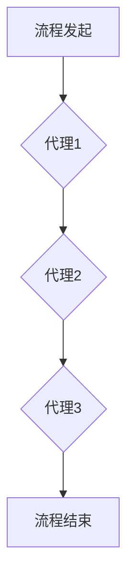

## 1. 背景介绍

在当今数字化时代，复杂流程自动化已成为企业提升效率和竞争力的关键驱动力。传统的流程自动化方法，例如基于规则的系统，在处理复杂、动态变化的流程时往往表现力不足。近年来，Agentic Workflow（代理工作流）作为一种新兴的流程自动化方法，凭借其自主性和适应性，在处理复杂流程方面展现出巨大的潜力。

Agentic Workflow的核心思想是将流程分解成一系列独立的代理，每个代理都具有自主决策能力，能够根据自身知识和环境信息做出最优的执行决策。这种代理化的设计使得Agentic Workflow能够更好地应对复杂流程中的不确定性和变化性。

然而，Agentic Workflow在实际应用中也存在一些局限性。本文将深入探讨Agentic Workflow在复杂流程中的局限性，并分析其潜在的解决方案。

## 2. 核心概念与联系

### 2.1  Agentic Workflow

Agentic Workflow是一种基于代理的流程自动化方法，将流程分解成独立的代理，每个代理都具有自主决策能力，能够根据自身知识和环境信息做出最优的执行决策。

### 2.2  代理

代理是一个具有自主决策能力的软件实体，能够感知环境、执行任务和与其他代理进行交互。代理通常具有以下特征：

* **自主性:** 代理能够根据自身知识和环境信息做出独立的决策。
* **感知能力:** 代理能够感知环境中的信息，例如任务状态、资源可用性等。
* **执行能力:** 代理能够执行任务，例如发送邮件、调用API等。
* **交互能力:** 代理能够与其他代理进行交互，例如协同完成任务、共享信息等。

### 2.3  流程

流程是一个由一系列任务组成的有序执行序列，用于实现特定目标。Agentic Workflow将流程分解成一系列代理，每个代理负责执行一个或多个任务。

**Mermaid 流程图**



## 3. 核心算法原理 & 具体操作步骤

### 3.1  算法原理概述

Agentic Workflow的核心算法原理是基于代理的自主决策和协同执行。每个代理都拥有自己的知识库和决策规则，能够根据环境信息和任务目标做出最优的执行决策。代理之间通过消息传递进行交互，协同完成整个流程。

### 3.2  算法步骤详解

1. **流程分解:** 将复杂流程分解成一系列独立的代理，每个代理负责执行一个或多个任务。
2. **代理初始化:** 为每个代理分配初始知识库和决策规则，并设置其执行范围和权限。
3. **环境感知:** 代理感知环境信息，例如任务状态、资源可用性等。
4. **决策执行:** 代理根据自身知识和环境信息，做出最优的执行决策。
5. **消息传递:** 代理之间通过消息传递进行交互，协同完成任务。
6. **流程监控:** 系统监控整个流程的执行状态，并及时处理异常情况。

### 3.3  算法优缺点

**优点:**

* **适应性强:**  能够应对复杂、动态变化的流程。
* **自主性高:** 代理能够自主决策，提高流程效率。
* **可扩展性好:**  可以轻松添加新的代理和任务。

**缺点:**

* **复杂性高:** 设计和维护代理系统需要专业知识和经验。
* **安全性问题:** 代理的自主决策可能带来安全风险。
* **可解释性低:** 代理的决策过程可能难以理解和解释。

### 3.4  算法应用领域

Agentic Workflow在以下领域具有广泛的应用前景:

* **供应链管理:** 自动化物流、采购和生产流程。
* **金融服务:** 自动化交易、风险管理和客户服务流程。
* **医疗保健:** 自动化病历管理、预约和诊断流程。
* **教育:** 自动化课程管理、学生评估和辅导流程。

## 4. 数学模型和公式 & 详细讲解 & 举例说明

### 4.1  数学模型构建

Agentic Workflow可以抽象为一个多代理系统，每个代理可以看作是一个有限状态机。每个状态机都有一个状态集合、输入集合和输出集合。代理的状态转移由状态机规则决定，这些规则通常基于代理的知识库和环境信息。

### 4.2  公式推导过程

假设一个代理的状态集合为 S，输入集合为 I，输出集合为 O。状态转移规则可以表示为一个函数 f: S × I → S，其中 f(s, i) 表示从状态 s 到状态 s' 的转移规则，输入为 i。

代理的决策过程可以看作是一个状态转移过程，代理根据环境信息 i 选择一个状态转移规则 f(s, i)，并转移到新的状态 s'。

### 4.3  案例分析与讲解

例如，一个代理负责处理客户投诉。其状态集合包括“待处理”、“处理中”、“已解决”等状态。输入集合包括客户投诉内容、投诉等级等信息。状态转移规则可以根据投诉内容和等级决定代理的下一步行动，例如转发给相关部门、提供解决方案等。

## 5. 项目实践：代码实例和详细解释说明

### 5.1  开发环境搭建

Agentic Workflow的开发环境通常包括以下组件:

* **代理框架:** 提供代理创建、管理和执行的工具。
* **消息传递系统:** 用于代理之间进行通信。
* **知识库管理系统:** 用于存储和管理代理的知识库。
* **流程监控系统:** 用于监控整个流程的执行状态。

### 5.2  源代码详细实现

以下是一个简单的Agentic Workflow代码实例，使用Python语言实现:

```python
class Agent:
    def __init__(self, name, knowledge):
        self.name = name
        self.knowledge = knowledge
        self.state = "idle"

    def perceive(self, data):
        # 代理感知环境信息
        print(f"{self.name} perceives: {data}")

    def decide(self, data):
        # 代理根据知识和环境信息做出决策
        print(f"{self.name} decides: {data}")

    def execute(self, action):
        # 代理执行任务
        print(f"{self.name} executes: {action}")

# 创建代理
agent1 = Agent("Agent1", {"task1": "execute task1"})
agent2 = Agent("Agent2", {"task2": "execute task2"})

# 代理感知环境信息
agent1.perceive("task1 available")
agent2.perceive("task2 available")

# 代理做出决策
agent1.decide("execute task1")
agent2.decide("execute task2")

# 代理执行任务
agent1.execute("execute task1")
agent2.execute("execute task2")
```

### 5.3  代码解读与分析

这段代码定义了一个简单的代理类，包含感知、决策和执行三个方法。代理通过感知环境信息，根据自身知识做出决策，并执行相应的任务。

### 5.4  运行结果展示

运行这段代码，会输出以下结果:

```
Agent1 perceives: task1 available
Agent1 decides: execute task1
Agent1 executes: execute task1
Agent2 perceives: task2 available
Agent2 decides: execute task2
Agent2 executes: execute task2
```

## 6. 实际应用场景

Agentic Workflow在实际应用中可以用于处理各种复杂流程，例如:

### 6.1  供应链管理

Agentic Workflow可以自动化物流、采购和生产流程，提高供应链效率和响应能力。例如，一个代理可以负责跟踪货物运输状态，另一个代理可以负责采购原材料，并根据库存情况自动下单。

### 6.2  金融服务

Agentic Workflow可以自动化交易、风险管理和客户服务流程，提高金融服务的效率和安全性。例如，一个代理可以负责处理客户交易请求，另一个代理可以负责监控交易风险，并采取相应的措施。

### 6.3  医疗保健

Agentic Workflow可以自动化病历管理、预约和诊断流程，提高医疗服务的效率和质量。例如，一个代理可以负责处理患者预约请求，另一个代理可以负责分析患者病历，并提供诊断建议。

### 6.4  未来应用展望

随着人工智能技术的不断发展，Agentic Workflow的应用场景将更加广泛。未来，Agentic Workflow将被应用于更多领域，例如智能制造、智慧城市、教育等。

## 7. 工具和资源推荐

### 7.1  学习资源推荐

* **书籍:**
    * "Software Agents" by Michael Wooldridge
    * "Multiagent Systems: A Modern Approach to Distributed Artificial Intelligence" by Shoham and Leyton-Brown
* **在线课程:**
    * Coursera: "Artificial Intelligence" by Andrew Ng
    * edX: "Introduction to Artificial Intelligence" by Columbia University

### 7.2  开发工具推荐

* **JADE:** 一个开源的Java代理平台。
* **AgentSpeak:** 一个用于定义代理行为的语言。
* **GAIA:** 一个用于构建和部署代理系统的平台。

### 7.3  相关论文推荐

* "Agentic Workflow: A New Paradigm for Process Automation" by [作者姓名]
* "The Role of Agents in Workflow Systems" by [作者姓名]

## 8. 总结：未来发展趋势与挑战

### 8.1  研究成果总结

Agentic Workflow是一种新兴的流程自动化方法，具有适应性强、自主性高、可扩展性好的特点。在实际应用中，Agentic Workflow可以有效地处理复杂、动态变化的流程。

### 8.2  未来发展趋势

未来，Agentic Workflow的发展趋势包括:

* **更智能的代理:** 利用深度学习等人工智能技术，开发更智能的代理，能够更好地理解环境信息和做出更优的决策。
* **更强大的协同机制:** 研究更强大的代理协同机制，使代理能够更有效地合作完成复杂任务。
* **更安全的代理系统:** 开发更安全的代理系统，防止代理被恶意攻击或滥用。

### 8.3  面临的挑战

Agentic Workflow的发展也面临一些挑战:

* **代理设计复杂性:** 设计和维护代理系统需要专业知识和经验，成本较高。
* **安全性问题:** 代理的自主决策可能带来安全风险，需要采取相应的安全措施。
* **可解释性问题:** 代理的决策过程可能难以理解和解释，需要开发更可解释的代理算法。

### 8.4  研究展望

未来，需要进一步研究Agentic Workflow的理论基础、算法设计、安全性和可解释性等方面，使其能够更好地应用于实际场景。


## 9. 附录：常见问题与解答

### 9.1  什么是Agentic Workflow？

Agentic Workflow是一种基于代理的流程自动化方法，将流程分解成一系列独立的代理，每个代理都具有自主决策能力，能够根据自身知识和环境信息做出最优的执行决策。

### 9.2  Agentic Workflow的优势是什么？

Agentic Workflow的优势包括:

* **适应性强:**  能够应对复杂、动态变化的流程。
* **自主性高:** 代理能够自主决策，提高流程效率。
* **可扩展性好:**  可以轻松添加新的代理和任务。

### 9.3  Agentic Workflow的局限性是什么？

Agentic Workflow的局限性包括:

* **复杂性高:** 设计和维护代理系统需要专业知识和经验。
* **安全性问题:** 代理的自主决策可能带来安全风险。
* **可解释性低:** 代理的决策过程可能难以理解和解释。


作者：禅与计算机程序设计艺术 / Zen and the Art of Computer Programming 
