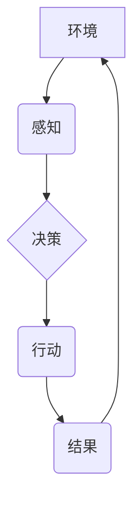

## 1. 背景介绍

在当今数据爆炸和智能化浪潮席卷的时代，数字代理的概念逐渐从理论走向实践，并展现出巨大的潜力。数字代理，也称为软件代理，是指能够自主执行任务、感知环境并做出决策的软件实体。它们可以代表人类在网络空间中进行交互，自动化执行重复性任务，甚至在某些领域做出超越人类的决策。

传统的软件系统通常是按照预先定义的规则和流程运行的，缺乏自主性和适应性。而数字代理则具有独立决策和行动的能力，能够根据环境变化和目标调整自己的行为策略。这使得数字代理在许多领域具有广泛的应用前景，例如：

* **自动化服务:** 数字代理可以自动处理客户服务请求、预约会议、订购商品等任务，提高效率并降低成本。
* **智能推荐:** 数字代理可以根据用户的行为数据和偏好，提供个性化的商品推荐、内容推荐和服务推荐。
* **网络安全:** 数字代理可以监控网络流量、识别恶意攻击并采取防御措施，增强网络安全防护能力。
* **机器人控制:** 数字代理可以作为机器人控制系统的一部分，帮助机器人感知环境、规划路径和执行任务。

## 2. 核心概念与联系

数字代理的核心概念包括：

* **代理:** 代理是一个能够代表其他实体（例如人类）执行任务的软件实体。
* **自主性:** 代理能够根据自身的目标和环境信息做出独立决策，而不依赖于外部控制。
* **感知:** 代理能够感知环境信息，例如网络数据、传感器数据等。
* **行动:** 代理能够执行动作，例如发送网络请求、控制设备、生成文本等。
* **学习:** 一些数字代理能够通过学习从经验中获取知识，并不断改进自己的决策策略。

**数字代理架构**



## 3. 核心算法原理 & 具体操作步骤

### 3.1  算法原理概述

数字代理的决策和行动通常基于一些算法，例如：

* **状态机:** 状态机是一种基于状态转换的模型，可以描述代理在不同状态下执行的动作。
* **规则引擎:** 规则引擎根据预先定义的规则来执行决策，适用于场景明确、规则相对简单的任务。
* **机器学习:** 机器学习算法可以从数据中学习决策策略，适用于场景复杂、规则难以定义的任务。

### 3.2  算法步骤详解

以机器学习算法为例，数字代理的决策步骤可以概括为以下几个阶段：

1. **数据收集:** 收集代理需要决策的环境信息和历史数据。
2. **数据预处理:** 对收集到的数据进行清洗、转换和特征提取，使其适合机器学习算法的训练。
3. **模型训练:** 使用机器学习算法对预处理后的数据进行训练，学习决策策略。
4. **模型评估:** 使用测试数据评估模型的性能，并进行调参优化。
5. **模型部署:** 将训练好的模型部署到代理系统中，用于实际决策。

### 3.3  算法优缺点

不同的算法具有不同的优缺点，需要根据具体应用场景选择合适的算法。

* **状态机:** 优点是简单易懂、易于实现；缺点是缺乏灵活性，难以应对复杂环境变化。
* **规则引擎:** 优点是规则明确、可解释性强；缺点是规则难以定义，难以应对复杂场景。
* **机器学习:** 优点是能够学习复杂决策策略，适应性强；缺点是训练数据量大，模型解释性弱。

### 3.4  算法应用领域

不同的算法在不同的领域具有不同的应用场景。

* **状态机:** 适用于场景明确、规则相对简单的任务，例如简单的聊天机器人、网络路由器等。
* **规则引擎:** 适用于规则明确、可解释性强的场景，例如金融风险控制、医疗诊断辅助等。
* **机器学习:** 适用于场景复杂、规则难以定义的任务，例如图像识别、自然语言处理、推荐系统等。

## 4. 数学模型和公式 & 详细讲解 & 举例说明

### 4.1  数学模型构建

数字代理的决策过程可以抽象为一个数学模型，其中代理的目标函数、环境状态、动作空间和奖励函数等因素都用数学公式来表示。

例如，一个简单的数字代理可以被建模为一个马尔可夫决策过程 (MDP)，其中：

* **状态空间:** 代理可以处于的不同状态集合。
* **动作空间:** 代理可以执行的不同动作集合。
* **转移概率:** 从一个状态执行一个动作后转移到另一个状态的概率。
* **奖励函数:** 代理在某个状态执行某个动作后获得的奖励值。

### 4.2  公式推导过程

在 MDP 模型中，代理的目标是找到一个最优策略，使得在长期运行过程中获得最大的总奖励。最优策略可以通过动态规划算法或强化学习算法来求解。

例如，动态规划算法可以利用 Bellman 方程来迭代地计算每个状态的最优价值函数和最优策略。

### 4.3  案例分析与讲解

例如，一个简单的数字代理可以用来玩一个简单的游戏，例如贪吃蛇。

* **状态空间:** 游戏中的蛇的位置和方向。
* **动作空间:** 蛇可以向四个方向移动。
* **转移概率:** 蛇移动到某个方向后，会根据游戏规则进入新的状态。
* **奖励函数:** 蛇吃到食物获得奖励，撞到墙壁或自身则获得惩罚。

通过使用动态规划算法或强化学习算法，可以训练出一个数字代理，能够在游戏中获得尽可能高的分数。

## 5. 项目实践：代码实例和详细解释说明

### 5.1  开发环境搭建

数字代理的开发环境通常包括：

* **编程语言:** Python、Java、C++ 等。
* **机器学习库:** TensorFlow、PyTorch、Scikit-learn 等。
* **仿真环境:** Gazebo、Unity 等。

### 5.2  源代码详细实现

以下是一个简单的数字代理的 Python 代码示例，使用 TensorFlow 库实现一个简单的强化学习算法：

```python
import tensorflow as tf

# 定义状态空间和动作空间
state_size = 10
action_size = 4

# 定义神经网络模型
model = tf.keras.models.Sequential([
    tf.keras.layers.Dense(64, activation='relu', input_shape=(state_size,)),
    tf.keras.layers.Dense(action_size)
])

# 定义损失函数和优化器
optimizer = tf.keras.optimizers.Adam()
loss_fn = tf.keras.losses.CategoricalCrossentropy()

# 训练模型
for epoch in range(100):
    # 训练数据
    states =...
    actions =...
    rewards =...

    with tf.GradientTape() as tape:
        predictions = model(states)
        loss = loss_fn(actions, predictions)

    gradients = tape.gradient(loss, model.trainable_variables)
    optimizer.apply_gradients(zip(gradients, model.trainable_variables))

# 使用训练好的模型进行决策
state =...
prediction = model(state)
action = tf.argmax(prediction).numpy()
```

### 5.3  代码解读与分析

这段代码定义了一个简单的数字代理模型，使用 TensorFlow 库实现了一个强化学习算法。

* **神经网络模型:** 使用一个简单的全连接神经网络来学习决策策略。
* **损失函数和优化器:** 使用交叉熵损失函数和 Adam 优化器来训练模型。
* **训练过程:** 使用训练数据迭代地训练模型，更新模型参数。
* **决策过程:** 使用训练好的模型对输入状态进行预测，选择最优动作。

### 5.4  运行结果展示

训练好的数字代理模型可以用于实际应用场景，例如玩游戏、控制机器人等。

## 6. 实际应用场景

数字代理已经开始在许多领域得到应用，例如：

* **智能客服:** 数字代理可以自动处理客户服务请求，例如回答常见问题、提供产品信息等。
* **个性化推荐:** 数字代理可以根据用户的行为数据和偏好，提供个性化的商品推荐、内容推荐和服务推荐。
* **网络安全:** 数字代理可以监控网络流量、识别恶意攻击并采取防御措施，增强网络安全防护能力。
* **医疗诊断辅助:** 数字代理可以辅助医生进行医疗诊断，例如分析病历、图像数据等。

### 6.4  未来应用展望

随着人工智能技术的不断发展，数字代理的应用场景将会更加广泛，例如：

* **自动驾驶:** 数字代理可以作为自动驾驶系统的核心部件，负责感知环境、规划路径和控制车辆。
* **工业自动化:** 数字代理可以自动化执行工业生产中的重复性任务，提高效率和降低成本。
* **教育辅助:** 数字代理可以作为教育辅助工具，例如提供个性化学习辅导、模拟真实场景的学习体验等。

## 7. 工具和资源推荐

### 7.1  学习资源推荐

* **书籍:**
    * 《Reinforcement Learning: An Introduction》 by Richard S. Sutton and Andrew G. Barto
    * 《Artificial Intelligence: A Modern Approach》 by Stuart Russell and Peter Norvig
* **在线课程:**
    * Coursera: Reinforcement Learning Specialization
    * Udacity: Artificial Intelligence Nanodegree
* **博客和论坛:**
    * OpenAI Blog
    * DeepMind Blog
    * Reddit: r/MachineLearning

### 7.2  开发工具推荐

* **编程语言:** Python, Java, C++
* **机器学习库:** TensorFlow, PyTorch, Scikit-learn
* **仿真环境:** Gazebo, Unity

### 7.3  相关论文推荐

* **Deep Reinforcement Learning with Double Q-learning** by Hasselt et al. (2015)
* **Proximal Policy Optimization Algorithms** by Schulman et al. (2017)
* **AlphaGo** by Silver et al. (2016)

## 8. 总结：未来发展趋势与挑战

### 8.1  研究成果总结

数字代理领域取得了显著的进展，例如：

* 强化学习算法取得了突破性进展，能够训练出能够解决复杂任务的数字代理。
* 深度学习技术使得数字代理能够处理更复杂的环境信息和任务。
* 仿真环境的发展使得数字代理能够在虚拟环境中进行训练和测试。

### 8.2  未来发展趋势

数字代理领域未来的发展趋势包括：

* **更智能的数字代理:** 能够更好地理解人类意图、进行更复杂的决策和行动。
* **更安全可靠的数字代理:** 能够更好地应对恶意攻击、避免不可预知的错误行为。
* **更广泛的应用场景:** 能够应用于更多领域，例如医疗、教育、金融等。

### 8.3  面临的挑战

数字代理领域也面临着一些挑战，例如：

* **数据获取和标注:** 训练高质量的数字代理模型需要大量的训练数据，而数据获取和标注成本较高。
* **模型解释性和可信度:** 深度学习模型的决策过程难以解释，这使得数字代理的可信度难以提高。
* **伦理和社会影响:** 数字代理的广泛应用可能会带来一些伦理和社会问题，例如就业问题、隐私问题等。

### 8.4  研究展望

未来，数字代理领域的研究将继续深入，探索更智能、更安全、更可靠的数字代理模型，并解决数字代理带来的伦理和社会问题。


## 9. 附录：常见问题与解答

### 9.1  常见问题

* **什么是数字代理？**

数字代理是指能够自主执行任务、感知环境并做出决策的软件实体。

* **数字代理有哪些应用场景？**

数字代理的应用场景非常广泛，例如智能客服、个性化推荐、网络安全、医疗诊断辅助等。

* **如何训练数字代理？**

数字代理的训练通常使用强化学习算法，通过与环境交互，学习最优决策策略。

* **数字代理有哪些挑战？**

数字代理领域面临着数据获取、模型解释性和伦理等挑战。

### 9.2  解答

* **什么是数字代理？**

数字代理是指能够