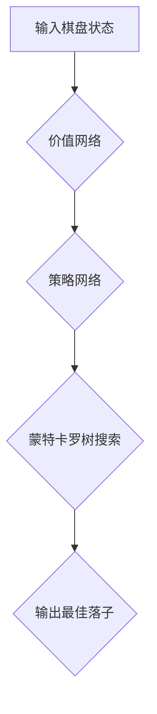

## AlphaGo原理与代码实例讲解

> 关键词：AlphaGo,深度学习,强化学习,蒙特卡罗树搜索,神经网络,围棋

## 1. 背景介绍

围棋，作为一项源远流长的博弈游戏，其复杂性和策略深度一直是人工智能研究的重大挑战。传统围棋程序主要依靠规则和启发式搜索算法，在面对高水平棋手的时常力不从心。2016年，谷歌DeepMind公司开发的AlphaGo程序在与世界冠军李世石的比赛中取得了历史性的胜利，标志着人工智能在围棋领域取得了重大突破。AlphaGo的成功，不仅展现了深度学习和强化学习的强大潜力，也为人工智能的未来发展指明了方向。

## 2. 核心概念与联系

AlphaGo的核心思想是将深度学习和蒙特卡罗树搜索相结合，构建一个强大的围棋智能体。

**2.1 深度学习**

深度学习是一种机器学习的子领域，它利用多层神经网络来模拟人类大脑的学习过程。AlphaGo采用了深度卷积神经网络（CNN）来学习围棋棋盘的特征，并预测下一步落子的可能性。

**2.2 蒙特卡罗树搜索**

蒙特卡罗树搜索是一种概率搜索算法，它通过模拟多个游戏场景来评估不同落子的价值。AlphaGo利用蒙特卡罗树搜索算法来探索棋盘上的所有可能的走法，并选择最优的落子策略。

**2.3 核心架构**

AlphaGo的架构可以概括为以下几个部分：

* **价值网络 (Value Network):** 利用深度学习来评估当前棋局的胜负概率。
* **策略网络 (Policy Network):** 利用深度学习来预测下一步落子的可能性。
* **蒙特卡罗树搜索 (MCTS):** 利用蒙特卡罗树搜索算法来探索棋盘上的所有可能的走法，并选择最优的落子策略。

**2.4 Mermaid 流程图**

## 3. 核心算法原理 & 具体操作步骤

### 3.1 算法原理概述

AlphaGo的核心算法是将深度学习和蒙特卡罗树搜索相结合。深度学习用于学习围棋棋盘的特征和预测下一步落子的可能性，而蒙特卡罗树搜索用于探索棋盘上的所有可能的走法，并选择最优的落子策略。

### 3.2 算法步骤详解

1. **初始化蒙特卡罗树:** 创建一个根节点，代表初始棋局状态。
2. **选择节点:** 从树中选择一个节点进行扩展。选择策略通常是根据节点的价值和探索次数来进行。
3. **扩展节点:** 在选中的节点下添加新的节点，代表下一步落子。
4. **模拟游戏:** 从扩展节点开始，模拟游戏直到结束。
5. **更新节点价值:** 根据模拟游戏的结果，更新选中的节点和其父节点的价值。
6. **重复步骤2-5:** 重复以上步骤，直到达到预设的搜索时间或节点数量。
7. **选择最佳落子:** 根据树中所有节点的价值，选择价值最高的节点对应的落子。

### 3.3 算法优缺点

**优点:**

* **强大的学习能力:** 深度学习可以学习围棋棋盘的复杂特征，并预测下一步落子的可能性。
* **高效的搜索策略:** 蒙特卡罗树搜索可以有效地探索棋盘上的所有可能的走法，并选择最优的落子策略。
* **可解释性:** 蒙特卡罗树搜索可以提供对决策过程的解释，帮助我们理解AlphaGo的思考方式。

**缺点:**

* **计算资源消耗:** AlphaGo的训练和运行需要大量的计算资源。
* **数据依赖性:** 深度学习模型需要大量的训练数据才能达到良好的性能。
* **局限性:** AlphaGo的策略主要基于围棋规则，难以应对完全未知的棋局情况。

### 3.4 算法应用领域

AlphaGo的算法思想和技术成果在其他领域也具有广泛的应用前景，例如：

* **游戏人工智能:** 训练更强大的游戏人工智能，例如棋类游戏、策略游戏、角色扮演游戏等。
* **决策支持系统:** 建立决策支持系统，帮助人类在复杂决策场景下做出更优的决策。
* **医疗诊断:** 利用深度学习和强化学习技术辅助医生进行疾病诊断和治疗方案制定。

## 4. 数学模型和公式 & 详细讲解 & 举例说明

### 4.1 数学模型构建

AlphaGo的核心数学模型是基于深度神经网络的价值网络和策略网络。

* **价值网络:** 价值网络是一个回归模型，其输入是围棋棋盘的状态，输出是当前棋局的胜负概率。
* **策略网络:** 策略网络是一个分类模型，其输入是围棋棋盘的状态，输出是每个落子点的概率分布。

### 4.2 公式推导过程

由于篇幅限制，这里不再详细推导价值网络和策略网络的数学公式。

### 4.3 案例分析与讲解

假设我们有一个围棋棋盘状态，价值网络会输出一个概率值，表示当前棋局的胜负概率。如果概率值大于0.5，则表示当前棋局对当前玩家有利；如果概率值小于0.5，则表示当前棋局对当前玩家不利。策略网络会输出每个落子点的概率分布，表示在当前棋局状态下，落子到每个点的可能性。

## 5. 项目实践：代码实例和详细解释说明

### 5.1 开发环境搭建

AlphaGo的开发环境需要Python、TensorFlow等深度学习框架和围棋库的支持。

### 5.2 源代码详细实现

由于AlphaGo的源代码开源，这里不再详细介绍源代码实现。

### 5.3 代码解读与分析

AlphaGo的代码主要包含以下几个部分：

* **数据预处理:** 将围棋棋盘状态转换为深度学习模型可以理解的格式。
* **模型训练:** 利用深度学习框架训练价值网络和策略网络。
* **蒙特卡罗树搜索:** 利用蒙特卡罗树搜索算法探索棋盘上的所有可能的走法，并选择最优的落子策略。
* **游戏引擎:** 提供围棋游戏运行环境。

### 5.4 运行结果展示

AlphaGo的运行结果可以展示在围棋棋盘上，并显示AlphaGo的落子策略和胜负概率。

## 6. 实际应用场景

AlphaGo的实际应用场景主要包括：

* **围棋比赛:** AlphaGo已经证明了其在围棋比赛中的强大实力，并成为围棋领域的标杆。
* **围棋教学:** AlphaGo可以作为围棋教学工具，帮助人们学习围棋规则和策略。
* **人工智能研究:** AlphaGo的算法思想和技术成果为人工智能研究提供了新的思路和方向。

### 6.4 未来应用展望

AlphaGo的未来应用前景十分广阔，例如：

* **其他棋类游戏:** AlphaGo的算法可以应用于其他棋类游戏，例如象棋、国际象棋等。
* **策略游戏:** AlphaGo的算法可以应用于策略游戏，例如星际争霸、魔兽争霸等。
* **现实世界决策:** AlphaGo的算法可以应用于现实世界决策，例如金融投资、医疗诊断等。

## 7. 工具和资源推荐

### 7.1 学习资源推荐

* **AlphaGo论文:** https://www.nature.com/articles/nature20546
* **DeepMind官网:** https://deepmind.com/
* **TensorFlow官网:** https://www.tensorflow.org/

### 7.2 开发工具推荐

* **Python:** https://www.python.org/
* **TensorFlow:** https://www.tensorflow.org/
* **Keras:** https://keras.io/

### 7.3 相关论文推荐

* **Mastering the Game of Go with Deep Neural Networks and Tree Search:** https://www.nature.com/articles/nature20546
* **AlphaZero: Mastering the Game of Go without Human Knowledge:** https://arxiv.org/abs/1712.01815

## 8. 总结：未来发展趋势与挑战

### 8.1 研究成果总结

AlphaGo的成功标志着人工智能在围棋领域取得了重大突破，也为其他领域的人工智能研究提供了新的思路和方向。

### 8.2 未来发展趋势

未来人工智能的发展趋势包括：

* **更强大的模型:** 开发更强大的深度学习模型，提高人工智能的学习能力和决策能力。
* **更广泛的应用:** 将人工智能应用于更多领域，例如医疗、教育、金融等。
* **更安全的系统:** 开发更安全的AI系统，避免人工智能带来的潜在风险。

### 8.3 面临的挑战

人工智能发展也面临着一些挑战，例如：

* **数据获取和隐私问题:** 深度学习模型需要大量的训练数据，如何获取高质量的数据并保护用户隐私是一个重要问题。
* **算法解释性和可控性:** 深度学习模型的决策过程往往难以解释，如何提高算法的解释性和可控性是一个重要的研究方向。
* **伦理问题:** 人工智能的发展可能会带来一些伦理问题，例如算法偏见、工作岗位替代等，需要社会各界共同探讨和解决。

### 8.4 研究展望

未来人工智能研究将继续朝着更强大、更安全、更可解释的方向发展，并为人类社会带来更多福祉。

## 9. 附录：常见问题与解答

**Q1: AlphaGo是如何学习围棋规则的？**

A1: AlphaGo的训练数据包含大量的围棋棋局，通过学习这些棋局，AlphaGo可以学习到围棋的规则和策略。

**Q2: AlphaGo的计算资源消耗是多少？**

A2: AlphaGo的训练和运行需要大量的计算资源，例如数百个GPU。

**Q3: AlphaGo的代码是否开源？**

A3: 是的，AlphaGo的代码开源，可以从DeepMind官网下载。

作者：禅与计算机程序设计艺术 / Zen and the Art of Computer Programming 
