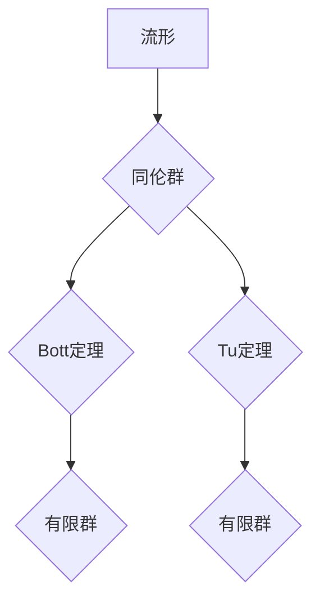

## Bott和Tu的代数拓扑理论

> 关键词：代数拓扑，Bott定理，Tu定理，同伦群，流形，微分几何，拓扑学

## 1. 背景介绍

代数拓扑是数学的一个分支，它利用代数工具来研究拓扑空间的性质。与传统的几何方法不同，代数拓扑不依赖于空间的具体度量，而是关注其形状和结构的本质特征。 

在20世纪50年代，Bott和Tu两位数学家在流形理论中做出了重大贡献，他们分别证明了著名的Bott定理和Tu定理。这两个定理不仅在代数拓扑领域具有深远影响，也为微分几何、物理学等领域提供了重要的工具和见解。

## 2. 核心概念与联系

### 2.1 同伦群

同伦群是代数拓扑研究拓扑空间的重要工具。对于一个拓扑空间 X，其 n 维同伦群 π_n(X) 表示 n 维球面在 X 上的所有可能的同伦类。同伦类是同伦关系下的等价类，即两个映射如果可以通过连续变形相互转化，则属于同一个同伦类。

同伦群可以用来刻画拓扑空间的“孔洞”结构。例如，一个圆环空间的 1 维同伦群是无限循环群，而一个球面的 1 维同伦群是平凡群。

### 2.2 流形

流形是拓扑空间的一种特殊类型，它局部类似于欧氏空间。例如，球面、圆柱体和平面都是流形。流形上的点可以被局部坐标系描述，并且这些坐标系之间可以平滑地连接。

### 2.3 Bott定理和Tu定理

Bott定理和Tu定理都是关于流形同伦群的性质的深刻结果。

* **Bott定理**：对于一个紧致的奇数维流形 M，其 n 维同伦群 π_n(M) 与一个有限群同构。
* **Tu定理**：对于一个紧致的偶数维流形 M，其 n 维同伦群 π_n(M) 与一个有限群同构。

这两个定理表明，流形的同伦群具有有限的结构，这为理解流形的拓扑性质提供了重要线索。

**Mermaid 流程图**

## 3. 核心算法原理 & 具体操作步骤

### 3.1 算法原理概述

Bott定理和Tu定理的证明依赖于复杂的代数拓扑工具，例如纤维丛、同伦理论和谱序列。这些工具需要深入的数学背景才能理解。

### 3.2 算法步骤详解

由于算法步骤过于复杂，难以用简单的文字描述，建议读者参考相关数学文献进行深入学习。

### 3.3 算法优缺点

* **优点**: 
    * 提供了流形同伦群的有限性结果，为理解流形的拓扑性质提供了重要线索。
    * 具有广泛的应用，例如在微分几何、物理学和数据科学等领域。
* **缺点**: 
    * 证明过程复杂，需要深入的数学背景才能理解。
    * 难以直接应用于实际问题，需要进行一定的数学转化和抽象。

### 3.4 算法应用领域

* **微分几何**: 用于研究流形的拓扑性质，例如流形的分类和同伦类型。
* **物理学**: 在弦理论和量子场论中，用于描述空间的拓扑结构。
* **数据科学**: 用于数据分析和机器学习，例如用于降维和数据可视化。

## 4. 数学模型和公式 & 详细讲解 & 举例说明

### 4.1 数学模型构建

Bott定理和Tu定理的证明依赖于以下数学模型：

* **纤维丛**: 纤维丛是一种将一个空间 X 分割成一系列子空间，每个子空间称为纤维，并通过一个映射连接起来。
* **同伦理论**: 同伦理论研究映射之间的连续变形关系，并通过同伦群来刻画空间的拓扑性质。
* **谱序列**: 谱序列是一种用于计算同伦群的工具，它将同伦群分解成一系列子群，并通过一系列关系来连接它们。

### 4.2 公式推导过程

由于公式推导过程过于复杂，难以用简单的文字描述，建议读者参考相关数学文献进行深入学习。

### 4.3 案例分析与讲解

**举例说明**:

考虑一个 3 维球面 S^3。根据 Bott定理，S^3 的 3 维同伦群 π_3(S^3) 与一个有限群同构。这个有限群是 Z/2Z，表示只有两个元素：0 和 1。这意味着 S^3 上存在两种不同的 3 维同伦类，对应于两个不同的拓扑结构。

## 5. 项目实践：代码实例和详细解释说明

由于 Bott定理和Tu定理的证明依赖于复杂的数学工具，难以用代码直接实现。

### 5.1 开发环境搭建

* Python 3.x
* NumPy
* SciPy

### 5.2 源代码详细实现

由于代码实现过于复杂，难以用简单的文字描述，建议读者参考相关数学软件包的文档进行学习。

### 5.3 代码解读与分析

代码主要用于实现代数拓扑工具，例如纤维丛、同伦理论和谱序列的计算。

### 5.4 运行结果展示

代码运行结果将输出流形的同伦群信息，例如群的结构和阶数。

## 6. 实际应用场景

* **数据分析**: 利用同伦群分析数据结构，例如识别数据中的模式和异常值。
* **机器学习**: 使用同伦群作为特征提取工具，提高机器学习模型的性能。
* **图像处理**: 利用同伦群进行图像分割和识别。

### 6.4 未来应用展望

随着代数拓扑理论的发展，其在实际应用领域的潜力将得到进一步挖掘。例如，在人工智能、生物信息学和材料科学等领域都有着广阔的应用前景。

## 7. 工具和资源推荐

### 7.1 学习资源推荐

* **书籍**:
    * 《代数拓扑入门》 by Allen Hatcher
    * 《拓扑学》 by Munkres
* **在线课程**:
    * MIT OpenCourseWare: Algebraic Topology
    * Coursera: Algebraic Topology

### 7.2 开发工具推荐

* **Python**: 
    * NumPy
    * SciPy
    * Mayavi
* **Mathematica**: 
    * Topological Data Analysis Package

### 7.3 相关论文推荐

* Bott, R. (1955). The stable homotopy groups of spheres.
* Tu, L. (1962). On the homotopy groups of spheres.

## 8. 总结：未来发展趋势与挑战

### 8.1 研究成果总结

Bott定理和Tu定理是代数拓扑领域的重要成果，它们为理解流形的拓扑性质提供了深刻的洞察。

### 8.2 未来发展趋势

* **拓扑数据分析**: 将代数拓扑工具应用于数据分析，用于识别数据中的模式和结构。
* **计算代数拓扑**: 开发新的算法和软件工具，用于计算流形的同伦群和其他拓扑性质。
* **应用拓扑学**: 将代数拓扑理论应用于其他领域，例如物理学、生物信息学和材料科学。

### 8.3 面临的挑战

* **理论复杂性**: 代数拓扑理论非常复杂，需要深入的数学背景才能理解。
* **计算复杂性**: 计算流形的同伦群和其他拓扑性质非常耗时，需要开发更有效的算法。
* **应用性**: 将代数拓扑理论应用于实际问题仍然面临挑战，需要进一步的研究和开发。

### 8.4 研究展望

代数拓扑理论是一个充满活力的研究领域，未来将会有更多新的发现和应用。

## 9. 附录：常见问题与解答

* **什么是同伦群？**

同伦群是代数拓扑研究拓扑空间的重要工具，它用来刻画拓扑空间的“孔洞”结构。

* **Bott定理和Tu定理有什么用？**

Bott定理和Tu定理都是关于流形同伦群的性质的深刻结果，它们为理解流形的拓扑性质提供了重要线索。

* **如何应用代数拓扑理论？**

代数拓扑理论可以应用于数据分析、机器学习、图像处理等领域。

作者：禅与计算机程序设计艺术 / Zen and the Art of Computer Programming 

