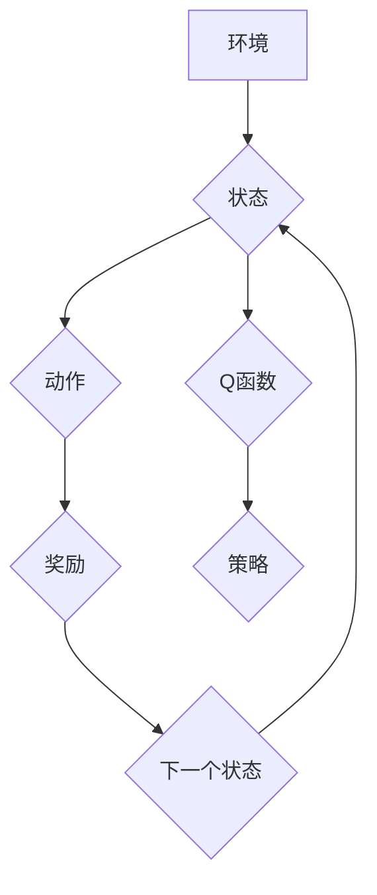

## DQN(Deep Q-Network) - 原理与代码实例讲解

> 关键词：深度强化学习，DQN，Q-learning，神经网络，目标网络，经验回放，强化学习

## 1. 背景介绍

深度强化学习 (Deep Reinforcement Learning，DRL) 近年来取得了令人瞩目的进展，在游戏、机器人控制、自动驾驶等领域展现出强大的应用潜力。其中，Deep Q-Network (DQN) 作为一种经典的深度强化学习算法，在解决复杂决策问题方面取得了突破性的成果。

DQN 结合了 Q-learning 算法和深度神经网络，能够学习复杂环境下的策略。传统的 Q-learning 算法依赖于离散状态空间和动作空间，难以处理连续状态和动作的情况。而 DQN 通过使用神经网络来逼近 Q 函数，能够有效地处理高维连续状态和动作空间。

## 2. 核心概念与联系

DQN 的核心概念包括 Q-learning 算法、深度神经网络和目标网络。

**2.1 Q-learning 算法**

Q-learning 是一种基于价值函数的强化学习算法，其目标是学习一个 Q 函数，该函数能够估计在给定状态下采取特定动作的期望回报。

**2.2 深度神经网络**

深度神经网络 (Deep Neural Network，DNN) 是一种能够学习复杂非线性关系的机器学习模型。DQN 使用 DNN 来逼近 Q 函数，能够处理高维连续状态和动作空间。

**2.3 目标网络**

目标网络 (Target Network) 是 DQN 中的一个重要组件，用于稳定训练过程。目标网络是一个与主网络结构相同的网络，但其权重是主网络权重的固定拷贝。在训练过程中，目标网络用于计算目标 Q 值，而主网络用于计算预测 Q 值。

**2.4 Mermaid 流程图**



## 3. 核心算法原理 & 具体操作步骤

### 3.1 算法原理概述

DQN 的核心思想是利用深度神经网络来逼近 Q 函数，并结合 Q-learning 算法进行训练。

**3.1.1 Q 函数逼近**

DQN 使用深度神经网络来逼近 Q 函数，即 Q(s, a) = f(s, a; θ)，其中 s 是状态，a 是动作，θ 是神经网络的参数。

**3.1.2 Q-learning 算法**

DQN 使用 Q-learning 算法进行训练，其更新规则为：

```
Q(s, a) = Q(s, a) + α[r + γ max_a' Q(s', a') - Q(s, a)]
```

其中：

* α 是学习率
* r 是奖励
* γ 是折扣因子
* s' 是下一个状态
* max_a' Q(s', a') 是下一个状态下所有动作的 Q 值最大值

### 3.2 算法步骤详解

DQN 的训练过程可以总结为以下步骤：

1. 初始化深度神经网络的参数 θ。
2. 从环境中获取初始状态 s。
3. 根据策略选择动作 a。
4. 执行动作 a，获得奖励 r 和下一个状态 s'。
5. 计算目标 Q 值：

```
target = r + γ max_a' Q(s', a'; θ-)
```

其中 θ- 是目标网络的参数。

6. 使用梯度下降算法更新主网络的参数 θ：

```
dθ = -∇[Q(s, a; θ) - target]^2
```

7. 定期更新目标网络的参数 θ- 为主网络的参数 θ 的拷贝。
8. 重复步骤 2-7，直到达到训练目标。

### 3.3 算法优缺点

**优点:**

* 能够处理高维连续状态和动作空间。
* 训练过程相对稳定。
* 在许多强化学习任务中取得了优异的性能。

**缺点:**

* 训练过程可能比较慢。
* 需要大量的训练数据。
* 容易陷入局部最优解。

### 3.4 算法应用领域

DQN 在以下领域具有广泛的应用前景：

* 游戏 AI
* 机器人控制
* 自动驾驶
* 金融交易
* 医疗诊断

## 4. 数学模型和公式 & 详细讲解 & 举例说明

### 4.1 数学模型构建

DQN 的数学模型主要包括 Q 函数和目标 Q 值的计算公式。

**4.1.1 Q 函数**

Q 函数表示在给定状态 s 和动作 a 下的期望回报。DQN 使用深度神经网络来逼近 Q 函数，其形式为：

```
Q(s, a; θ) = f(s, a; θ)
```

其中：

* s 是状态
* a 是动作
* θ 是神经网络的参数
* f(s, a; θ) 是深度神经网络的输出

**4.1.2 目标 Q 值**

目标 Q 值用于更新 Q 函数，其计算公式为：

```
target = r + γ max_a' Q(s', a'; θ-)
```

其中：

* r 是奖励
* γ 是折扣因子
* s' 是下一个状态
* θ- 是目标网络的参数
* max_a' Q(s', a'; θ-) 是下一个状态下所有动作的 Q 值最大值

### 4.2 公式推导过程

DQN 的目标是最大化长期回报，即最大化以下期望值：

```
E[∑_{t=0}^{∞} γ^t r_t]
```

其中：

* E 表示期望值
* r_t 是时间 t 的奖励
* γ 是折扣因子

Q-learning 算法的目标是学习一个 Q 函数，使得在每个状态下采取最优动作能够最大化长期回报。

DQN 使用深度神经网络来逼近 Q 函数，并使用梯度下降算法进行训练。目标 Q 值用于更新 Q 函数，其计算公式基于 Bellman 方程。

### 4.3 案例分析与讲解

假设我们有一个简单的游戏环境，其中玩家可以选择向上、向下、向左、向右四个动作。每个动作都会获得一定的奖励，例如，到达终点获得最大奖励，撞到障碍物获得负奖励。

DQN 可以学习一个 Q 函数，该函数能够估计在每个状态下采取每个动作的期望回报。通过训练，DQN 可以学习到最优策略，即在每个状态下采取能够获得最大长期回报的动作。

## 5. 项目实践：代码实例和详细解释说明

### 5.1 开发环境搭建

为了实现 DQN 算法，我们需要搭建一个开发环境。以下列出一些常用的开发环境：

* Python 3.x
* TensorFlow 或 PyTorch
* NumPy
* Matplotlib

### 5.2 源代码详细实现

以下是一个使用 TensorFlow 实现 DQN 算法的简单代码示例：

```python
import tensorflow as tf

# 定义 Q 网络
class QNetwork(tf.keras.Model):
    def __init__(self, state_size, action_size):
        super(QNetwork, self).__init__()
        self.dense1 = tf.keras.layers.Dense(64, activation='relu')
        self.dense2 = tf.keras.layers.Dense(action_size)

    def call(self, state):
        x = self.dense1(state)
        return self.dense2(x)

# 定义 DQN 算法
class DQNAgent:
    def __init__(self, state_size, action_size, learning_rate=0.001, gamma=0.99, epsilon=1.0, epsilon_decay=0.995, epsilon_min=0.01):
        self.state_size = state_size
        self.action_size = action_size
        self.learning_rate = learning_rate
        self.gamma = gamma
        self.epsilon = epsilon
        self.epsilon_decay = epsilon_decay
        self.epsilon_min = epsilon_min
        self.q_network = QNetwork(state_size, action_size)
        self.target_network = QNetwork(state_size, action_size)
        self.optimizer = tf.keras.optimizers.Adam(learning_rate=self.learning_rate)

    def choose_action(self, state):
        if tf.random.uniform(()) < self.epsilon:
            return tf.random.uniform(shape=(1,), minval=0, maxval=self.action_size, dtype=tf.int32)
        else:
            q_values = self.q_network(state)
            return tf.argmax(q_values, axis=1)

    def update_q_network(self, state, action, reward, next_state, done):
        with tf.GradientTape() as tape:
            target_q_values = self.target_network(next_state)
            max_next_q = tf.reduce_max(target_q_values, axis=1)
            target = reward + self.gamma * max_next_q * (1 - done)
            q_values = self.q_network(state)
            loss = tf.keras.losses.MeanSquaredError()(target, q_values[0, action])
        gradients = tape.gradient(loss, self.q_network.trainable_variables)
        self.optimizer.apply_gradients(zip(gradients, self.q_network.trainable_variables))

    def update_target_network(self):
        self.target_network.set_weights(self.q_network.get_weights())

#... (其他代码)
```

### 5.3 代码解读与分析

以上代码示例展示了 DQN 算法的基本实现过程。

* `QNetwork` 类定义了深度神经网络的结构，用于逼近 Q 函数。
* `DQNAgent` 类定义了 DQN 算法的整体流程，包括选择动作、更新 Q 网络和更新目标网络。
* `choose_action` 方法根据 epsilon-greedy 策略选择动作。
* `update_q_network` 方法使用梯度下降算法更新 Q 网络的参数。
* `update_target_network` 方法定期更新目标网络的参数。

### 5.4 运行结果展示

运行以上代码示例可以训练一个 DQN 算法，并使其在指定的游戏环境中学习最优策略。

## 6. 实际应用场景

DQN 在许多实际应用场景中取得了成功，例如：

* **游戏 AI:** DQN 能够学习玩各种游戏，包括 Atari 游戏、Go 和 Dota 2。
* **机器人控制:** DQN 可以用于训练机器人控制策略，例如控制机器人手臂进行抓取任务。
* **自动驾驶:** DQN 可以用于训练自动驾驶汽车的决策策略。
* **金融交易:** DQN 可以用于训练金融交易策略，例如股票交易和期货交易。
* **医疗诊断:** DQN 可以用于辅助医生进行医疗诊断，例如识别病理图像。

### 6.4 未来应用展望

随着深度学习技术的不断发展，DQN 的应用场景将会更加广泛。未来，DQN 可能在以下领域得到应用：

* **个性化推荐:** DQN 可以用于学习用户的个性化偏好，并推荐个性化内容。
* **自然语言处理:** DQN 可以用于训练机器翻译、文本摘要和对话系统等自然语言处理模型。
* **药物研发:** DQN 可以用于加速药物研发过程，例如预测药物的活性。

## 7. 工具和资源推荐

### 7.1 学习资源推荐

* **书籍:**
    * Deep Reinforcement Learning Hands-On by Maxim Lapan
    * Reinforcement Learning: An Introduction by Richard S. Sutton and Andrew G. Barto
* **在线课程:**
    * Deep Reinforcement Learning Specialization by DeepLearning.AI
    * Reinforcement Learning by David Silver (University of DeepMind)
* **博客和网站:**
    * Open