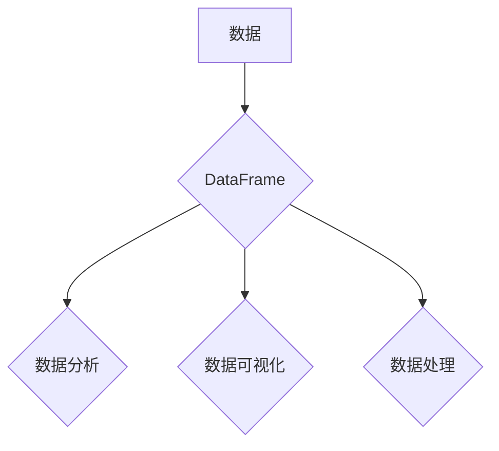

## DataFrame原理与代码实例讲解

> 关键词：DataFrame, Pandas, 数据结构, 数据分析, Python, 数据科学, 数据处理, 算法

## 1. 背景介绍

在数据科学、机器学习和数据分析领域，处理和分析结构化数据是至关重要的任务。为了高效地管理和操作这些数据，Python 语言中诞生了强大的 Pandas 库，其中 DataFrame 是其核心数据结构。DataFrame 提供了一种类似于电子表格的二维数据组织方式，使得数据处理、分析和可视化变得更加便捷和高效。

随着数据量的不断增长和分析需求的不断复杂化，对 DataFrame 的理解和应用变得越来越重要。本文将深入探讨 DataFrame 的原理、核心算法、数学模型以及代码实例，帮助读者全面掌握 DataFrame 的知识和应用技巧。

## 2. 核心概念与联系

DataFrame 是 Pandas 库中用于存储和操作二维数据的主要数据结构。它由一系列标签索引的列组成，每一列可以包含不同类型的数值、字符串、日期等数据。

**DataFrame 的核心概念：**

* **行索引：** DataFrame 的每一行都有一个唯一的索引，用于标识该行。默认情况下，行索引是整数从 0 开始。
* **列索引：** DataFrame 的每一列都有一个唯一的索引，用于标识该列。列索引可以是字符串、整数或其他数据类型。
* **数据类型：** DataFrame 中的每个元素都有一个数据类型，例如整数、浮点数、字符串、布尔值等。
* **数据结构：** DataFrame 的数据结构类似于二维数组，其中每一行代表一个数据样本，每一列代表一个特征或属性。

**DataFrame 与其他数据结构的关系：**

* **Series：** Series 是 Pandas 库中用于存储一维数据的基本数据结构。DataFrame 可以看作是由多个 Series 组成的二维数据结构。
* **字典：** DataFrame 可以看作是一个字典，其中键是列索引，值是对应的 Series。

**Mermaid 流程图：**



## 3. 核心算法原理 & 具体操作步骤

DataFrame 的核心算法主要围绕着数据存储、索引、查询、过滤、排序、聚合等操作。

### 3.1  算法原理概述

DataFrame 的数据存储采用基于索引的结构，每个元素通过行索引和列索引唯一标识。这种结构使得数据访问和操作更加高效。

DataFrame 的查询、过滤和排序操作主要基于索引和数据类型匹配。Pandas 库提供了丰富的函数和方法，可以方便地对 DataFrame 进行各种操作。

### 3.2  算法步骤详解

1. **数据加载：** 使用 Pandas 库的 `read_csv`、`read_excel` 等函数从文件或其他数据源加载数据。
2. **数据结构构建：** Pandas 库自动将加载的数据构建成 DataFrame 数据结构。
3. **数据索引：** 可以使用 `set_index` 函数设置 DataFrame 的行索引或列索引。
4. **数据查询：** 使用 `loc` 和 `iloc` 属性可以根据索引或位置查询 DataFrame 中的数据。
5. **数据过滤：** 使用 boolean 条件语句可以过滤 DataFrame 中满足特定条件的数据。
6. **数据排序：** 使用 `sort_values` 函数可以根据指定列排序 DataFrame。
7. **数据聚合：** 使用 `groupby` 和 `agg` 函数可以对 DataFrame 进行分组聚合操作。

### 3.3  算法优缺点

**优点：**

* 数据结构清晰，易于理解和操作。
* 数据访问和操作高效。
* 提供丰富的函数和方法，支持各种数据处理操作。
* 能够处理不同数据类型的数据。

**缺点：**

* 对大型数据集的处理效率可能较低。
* 数据结构的灵活性和扩展性有限。

### 3.4  算法应用领域

DataFrame 广泛应用于数据科学、机器学习、数据分析、金融、生物信息学等领域。

## 4. 数学模型和公式 & 详细讲解 & 举例说明

DataFrame 的核心算法基于线性代数和集合论的原理。

### 4.1  数学模型构建

DataFrame 可以看作是一个二维矩阵，其中每一行代表一个数据样本，每一列代表一个特征或属性。

**数学模型：**

```
DataFrame = {
    row_index: {
        column_index: value
    }
}
```

其中，`row_index` 是行索引，`column_index` 是列索引，`value` 是数据元素。

### 4.2  公式推导过程

DataFrame 的核心算法涉及到数据索引、查询、过滤、排序等操作，这些操作都可以用数学公式来描述。

例如，DataFrame 中的数据查询操作可以使用以下公式表示：

```
query_result = DataFrame[row_index, column_index]
```

其中，`query_result` 是查询结果，`row_index` 是行索引，`column_index` 是列索引。

### 4.3  案例分析与讲解

假设有一个 DataFrame，包含学生姓名、年龄和成绩的数据。

**DataFrame 数据：**

| 姓名 | 年龄 | 成绩 |
|---|---|---|
| 张三 | 18 | 90 |
| 李四 | 19 | 85 |
| 王五 | 18 | 95 |

**查询学生年龄大于 18 的数据：**

```python
df[df['年龄'] > 18]
```

**输出结果：**

| 姓名 | 年龄 | 成绩 |
|---|---|---|
| 李四 | 19 | 85 |

## 5. 项目实践：代码实例和详细解释说明

### 5.1  开发环境搭建

需要安装 Python 语言和 Pandas 库。

```
pip install pandas
```

### 5.2  源代码详细实现

```python
import pandas as pd

# 创建 DataFrame
data = {'姓名': ['张三', '李四', '王五'],
        '年龄': [18, 19, 18],
        '成绩': [90, 85, 95]}
df = pd.DataFrame(data)

# 打印 DataFrame
print(df)

# 查询学生年龄大于 18 的数据
df_filtered = df[df['年龄'] > 18]
print(df_filtered)

# 对成绩进行排序
df_sorted = df.sort_values(by='成绩', ascending=False)
print(df_sorted)
```

### 5.3  代码解读与分析

1. 导入 Pandas 库。
2. 创建一个字典，包含学生姓名、年龄和成绩的数据。
3. 使用 `pd.DataFrame()` 函数将字典转换为 DataFrame。
4. 使用 `print()` 函数打印 DataFrame。
5. 使用 boolean 条件语句过滤 DataFrame，查询学生年龄大于 18 的数据。
6. 使用 `sort_values()` 函数对 DataFrame 进行排序，按照成绩降序排列。

### 5.4  运行结果展示

```
   姓名  年龄  成绩
0  张三   18     90
1  李四   19     85
2  王五   18     95

   姓名  年龄  成绩
1  李四   19     85

   姓名  年龄  成绩
2  王五   18     95
0  张三   18     90
1  李四   19     85
```

## 6. 实际应用场景

DataFrame 在数据科学、机器学习、数据分析等领域有着广泛的应用场景。

### 6.1  数据分析

DataFrame 可以用于存储和分析各种类型的业务数据，例如销售数据、用户行为数据、财务数据等。

### 6.2  机器学习

DataFrame 可以用于存储和处理机器学习模型的训练数据和测试数据。

### 6.3  数据可视化

DataFrame 可以与 Matplotlib、Seaborn 等数据可视化库结合使用，生成各种类型的图表和图形。

### 6.4  未来应用展望

随着数据量的不断增长和分析需求的不断复杂化，DataFrame 将在未来发挥更加重要的作用。

## 7. 工具和资源推荐

### 7.1  学习资源推荐

* **Pandas 官方文档：** https://pandas.pydata.org/docs/
* **DataCamp Pandas课程：** https://www.datacamp.com/courses/data-manipulation-with-pandas

### 7.2  开发工具推荐

* **Jupyter Notebook：** https://jupyter.org/
* **VS Code：** https://code.visualstudio.com/

### 7.3  相关论文推荐

* **Python Data Analysis Library (Pandas)：** https://www.ncbi.nlm.nih.gov/pmc/articles/PMC3565297/

## 8. 总结：未来发展趋势与挑战

DataFrame 是 Pandas 库的核心数据结构，在数据科学、机器学习和数据分析领域有着广泛的应用。

### 8.1  研究成果总结

DataFrame 的发展已经取得了显著的成果，其数据存储、索引、查询、过滤、排序等操作都非常高效。

### 8.2  未来发展趋势

未来，DataFrame 将会朝着以下方向发展：

* **支持更大规模的数据处理：** 针对大型数据集，DataFrame 的性能将得到进一步提升。
* **提供更丰富的功能：** DataFrame 将会提供更多的数据处理和分析功能，例如时间序列分析、文本处理等。
* **与其他工具和库的集成：** DataFrame 将会与其他数据科学工具和库更加紧密地集成，例如机器学习库、可视化库等。

### 8.3  面临的挑战

DataFrame 也面临着一些挑战：

* **数据类型支持：** DataFrame 目前对数据类型的支持有限，需要进一步扩展。
* **数据结构的灵活性和扩展性：** DataFrame 的数据结构相对固定，需要提高其灵活性和扩展性。
* **性能优化：** 针对大型数据集，DataFrame 的性能还需要进一步优化。

### 8.4  研究展望

未来，研究人员将继续致力于解决 DataFrame 面临的挑战，使其成为更强大、更灵活、更高效的数据处理工具。

## 9. 附录：常见问题与解答

**问题 1：如何创建 DataFrame？**

**解答：**可以使用 `pd.DataFrame()` 函数创建 DataFrame。

**问题 2：如何查询 DataFrame 中的数据？**

**解答：**可以使用 `loc` 和 `iloc` 属性根据索引或位置查询 DataFrame 中的数据。

**问题 3：如何过滤 DataFrame 中的数据？**

**解答：**可以使用 boolean 条件语句过滤 DataFrame 中满足特定条件的数据。


作者：禅与计算机程序设计艺术 / Zen and the Art of Computer Programming