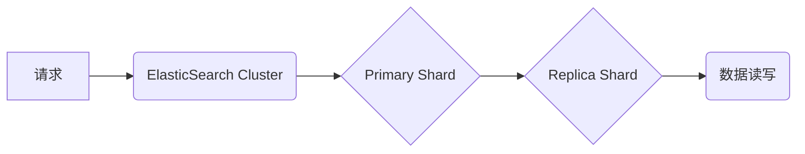

## ElasticSearch Replica原理与代码实例讲解

> 关键词：ElasticSearch, Replica, 分布式存储, 高可用性, 数据复制, 故障恢复, 代码实例

## 1. 背景介绍

ElasticSearch作为一款开源的分布式搜索和分析引擎，以其强大的搜索能力、丰富的分析功能和高可扩展性而闻名。在实际应用中，为了保证数据的高可用性和容错性，ElasticSearch引入了Replica机制。Replica机制的核心思想是将数据副本复制到多个节点上，即使部分节点发生故障，也能保证数据的完整性和可用性。

## 2. 核心概念与联系

### 2.1  核心概念

* **Primary Shard:**  每个索引被分割成多个碎片（shard），每个shard都由一个主节点（Primary Shard）负责管理。主节点负责接收数据写入请求，并负责数据同步到Replica节点。
* **Replica Shard:**  每个Primary Shard都会有一个或多个副本（Replica Shard），副本节点负责存储数据副本，并参与数据读请求。

* **Cluster:**  ElasticSearch集群由多个节点组成，每个节点可以运行多个shard。

### 2.2  架构关系



## 3. 核心算法原理 & 具体操作步骤

### 3.1  算法原理概述

ElasticSearch Replica机制的核心算法是**数据复制和同步**。当数据写入到Primary Shard时，ElasticSearch会将数据同步到所有Replica Shard。同步过程使用**日志复制**机制，将数据写入操作记录到日志中，然后将日志发送到Replica节点。Replica节点收到日志后，会根据日志内容将数据应用到本地存储中。

### 3.2  算法步骤详解

1. **数据写入:** 用户向ElasticSearch发送数据写入请求，请求首先到达Primary Shard。
2. **数据持久化:** Primary Shard将数据写入本地存储，并生成数据写入日志。
3. **日志复制:** Primary Shard将数据写入日志发送到所有Replica Shard。
4. **日志应用:** Replica Shard收到日志后，会解析日志内容，并根据日志内容将数据应用到本地存储中。
5. **数据一致性:** 通过日志复制机制，保证所有Replica Shard的数据一致性。

### 3.3  算法优缺点

**优点:**

* **高可用性:** 即使Primary Shard发生故障，Replica Shard也能提供数据读写服务，保证数据可用性。
* **数据容错性:** 数据副本复制到多个节点上，即使部分节点发生故障，也能保证数据的完整性。
* **数据备份:** Replica Shard可以作为数据备份，防止数据丢失。

**缺点:**

* **存储空间占用:** 数据需要复制到多个节点上，会增加存储空间占用。
* **网络带宽消耗:** 数据同步需要消耗网络带宽。
* **复杂性增加:** Replica机制增加了系统的复杂性。

### 3.4  算法应用领域

ElasticSearch Replica机制广泛应用于各种需要高可用性和数据容错性的场景，例如：

* **搜索引擎:**  保证搜索结果的可用性和数据完整性。
* **日志分析:**  收集和分析大量日志数据，即使部分节点发生故障，也能保证日志数据的完整性。
* **监控系统:**  监控系统运行状态，即使部分节点发生故障，也能保证监控数据的完整性。

## 4. 数学模型和公式 & 详细讲解 & 举例说明

### 4.1  数学模型构建

假设一个ElasticSearch集群包含N个节点，每个索引被分割成M个shard，每个shard都有R个Replica。

* **数据存储量:**  D
* **节点数量:**  N
* **shard数量:**  M
* **Replica数量:**  R

**数据存储空间:**  D * R / N

### 4.2  公式推导过程

数据存储空间 = 数据量 * 副本数量 / 节点数量

### 4.3  案例分析与讲解

假设一个ElasticSearch集群包含10个节点，每个索引被分割成100个shard，每个shard都有2个Replica，数据存储量为1TB。

数据存储空间 = 1TB * 2 / 10 = 0.2TB/节点

## 5. 项目实践：代码实例和详细解释说明

### 5.1  开发环境搭建

* 安装Java JDK
* 下载ElasticSearch安装包
* 启动ElasticSearch集群

### 5.2  源代码详细实现

```java
// 创建索引
CreateIndexRequest createIndexRequest = new CreateIndexRequest("my_index");
client.indices().create(createIndexRequest);

// 创建文档
IndexRequest indexRequest = new IndexRequest("my_index", "my_type", "1");
indexRequest.source("{\"name\":\"John Doe\",\"age\":30}");
client.index(indexRequest);

// 查询文档
SearchRequest searchRequest = new SearchRequest("my_index");
SearchResponse searchResponse = client.search(searchRequest);
```

### 5.3  代码解读与分析

* `CreateIndexRequest`用于创建索引。
* `IndexRequest`用于创建文档。
* `SearchRequest`用于查询文档。
* `client`是ElasticSearch客户端对象。

### 5.4  运行结果展示

运行以上代码后，会在ElasticSearch集群中创建一个名为"my_index"的索引，并创建一个名为"1"的文档。查询文档后，可以获取到文档的内容。

## 6. 实际应用场景

ElasticSearch Replica机制广泛应用于各种需要高可用性和数据容错性的场景，例如：

* **电商平台:**  存储商品信息、用户数据等，保证数据可用性和容错性。
* **金融系统:**  存储交易记录、用户账户信息等，保证数据安全和可靠性。
* **医疗系统:**  存储患者信息、医疗记录等，保证数据完整性和隐私性。

### 6.4  未来应用展望

随着云计算、大数据等技术的不断发展，ElasticSearch Replica机制将在未来得到更广泛的应用，例如：

* **边缘计算:**  将Replica机制部署到边缘节点，实现数据本地化处理和低延迟访问。
* **区块链:**  将Replica机制应用于区块链数据存储，提高数据安全性、可靠性和可扩展性。

## 7. 工具和资源推荐

### 7.1  学习资源推荐

* ElasticSearch官方文档: https://www.elastic.co/guide/en/elasticsearch/reference/current/index.html
* ElasticSearch中文社区: https://www.elastic.co/cn/community

### 7.2  开发工具推荐

* ElasticSearch客户端库: https://www.elastic.co/guide/en/elasticsearch/client/java-rest/current/java-rest-client.html

### 7.3  相关论文推荐

* Elasticsearch: A Distributed, Scalable Search and Analytics Engine
* Replica Management in Distributed Systems

## 8. 总结：未来发展趋势与挑战

### 8.1  研究成果总结

ElasticSearch Replica机制是一个成熟且有效的分布式数据存储方案，能够有效地提高数据的高可用性和容错性。

### 8.2  未来发展趋势

未来，ElasticSearch Replica机制将朝着以下方向发展:

* **更智能的Replica管理:**  利用机器学习等技术，智能地分配Replica节点，提高资源利用率和数据一致性。
* **更强大的数据恢复能力:**  开发更快的故障恢复机制，缩短数据恢复时间。
* **更完善的跨数据中心复制:**  支持跨数据中心的数据复制，提高数据可用性和灾难恢复能力。

### 8.3  面临的挑战

ElasticSearch Replica机制也面临一些挑战:

* **数据一致性:**  在分布式环境下，保证数据一致性是一个复杂的问题。
* **网络延迟:**  数据同步需要消耗网络带宽，网络延迟会影响数据一致性和性能。
* **资源管理:**  Replica机制会增加存储空间和计算资源的占用，需要高效地管理资源。

### 8.4  研究展望

未来，研究人员将继续探索新的Replica机制，以解决上述挑战，提高数据存储的可靠性和性能。

## 9. 附录：常见问题与解答

* **如何配置Replica数量?**

Replica数量可以根据业务需求和数据重要性进行配置。一般来说，数据重要性越高，Replica数量应该越多。

* **如何监控Replica状态?**

ElasticSearch提供了丰富的监控工具，可以监控Replica的健康状态、数据同步进度等信息。

* **如何解决Replica数据不一致问题?**

ElasticSearch提供了数据一致性机制，例如主从复制、数据分片等，可以有效地解决Replica数据不一致问题。


作者：禅与计算机程序设计艺术 / Zen and the Art of Computer Programming 
