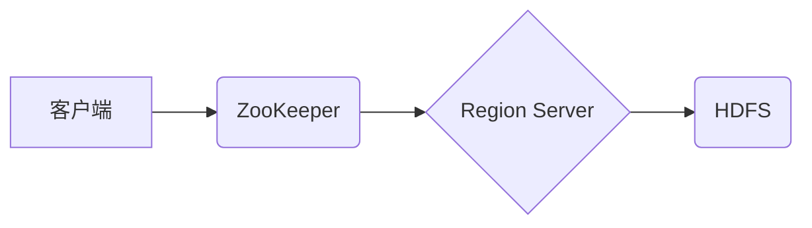

## HBase原理与代码实例讲解

> 关键词：HBase, NoSQL, Hadoop, Big Data, Column-Family, Distributed Storage, MapReduce

## 1. 背景介绍

随着互联网和移动互联网的蓬勃发展，海量数据量的产生日益剧增。传统的关系型数据库在面对海量数据时，往往显得力不从心。为了更好地应对大数据时代的数据存储和处理需求，NoSQL数据库应运而生。其中，HBase作为一款基于Hadoop分布式存储平台的开源列式存储数据库，凭借其高性能、高可用性和可扩展性，在处理海量数据方面展现出强大的实力。

HBase的出现，为大数据处理领域提供了新的解决方案。它以其独特的架构和设计理念，能够高效地存储和检索海量数据，并支持实时数据更新和查询。本文将深入探讨HBase的原理、核心算法、代码实例以及实际应用场景，帮助读者全面理解HBase的特性和优势。

## 2. 核心概念与联系

HBase是一个基于Hadoop的分布式、开源、列式存储数据库。它采用类似于Google BigTable的架构，提供了一种高效、可靠和可扩展的方式来存储和检索海量数据。

**核心概念:**

* **分布式存储:** HBase的数据存储在多个节点上，通过Hadoop的分布式文件系统HDFS进行管理。
* **列式存储:** HBase将数据存储为列族（Column Family），每个列族包含多个列，每个列包含多个值。这种列式存储方式使得HBase能够高效地检索特定列的数据。
* **键值对存储:** HBase的数据以键值对的形式存储，键用于唯一标识数据，值用于存储数据内容。
* **Region Server:** HBase的数据存储和处理由Region Server负责。每个Region Server负责管理一个或多个数据区域（Region）。
* **ZooKeeper:** HBase使用ZooKeeper作为协调服务，用于管理Region Server的分配和状态。

**架构图:**



**核心联系:**

* 客户端通过ZooKeeper获取Region Server的地址。
* Region Server从HDFS中读取数据并进行处理。
* ZooKeeper负责管理Region Server的分配和状态。

## 3. 核心算法原理 & 具体操作步骤

### 3.1  算法原理概述

HBase的核心算法主要包括数据分片、数据存储、数据检索和数据更新等。

* **数据分片:** HBase将数据按照键值进行分片，每个Region Server负责管理一个或多个数据区域（Region）。
* **数据存储:** HBase将数据存储为列族，每个列族包含多个列，每个列包含多个值。
* **数据检索:** HBase根据键值查找数据，并返回指定列的数据。
* **数据更新:** HBase支持对数据进行增删改操作，并保证数据的一致性。

### 3.2  算法步骤详解

**数据存储:**

1. 客户端将数据发送到Region Server。
2. Region Server根据键值将数据存储到对应的Region中。
3. Region Server将数据持久化到HDFS中。

**数据检索:**

1. 客户端发送查询请求到ZooKeeper。
2. ZooKeeper返回对应的Region Server地址。
3. 客户端连接到Region Server并发送查询请求。
4. Region Server根据键值查找数据并返回结果。

**数据更新:**

1. 客户端发送更新请求到Region Server。
2. Region Server将更新数据写入内存缓存。
3. Region Server将更新数据持久化到HDFS中。

### 3.3  算法优缺点

**优点:**

* 高性能：列式存储和数据分片机制使得HBase能够高效地处理海量数据。
* 高可用性：HBase采用分布式架构，能够保证数据的高可用性。
* 可扩展性：HBase能够根据需要水平扩展，以满足不断增长的数据存储需求。

**缺点:**

* 数据模型限制：HBase的数据模型相对简单，不适合存储复杂的数据关系。
* ACID性：HBase不支持强一致性，只能保证最终一致性。
* 查询复杂度：HBase不支持复杂的SQL查询，只能使用简单的过滤和排序操作。

### 3.4  算法应用领域

HBase广泛应用于以下领域：

* **社交网络:** 存储用户数据、好友关系、帖子内容等。
* **电商平台:** 存储商品信息、用户订单、浏览记录等。
* **金融行业:** 存储交易记录、用户账户信息、风险评估数据等。
* **物联网:** 存储传感器数据、设备状态、用户行为等。

## 4. 数学模型和公式 & 详细讲解 & 举例说明

### 4.1  数学模型构建

HBase的数据存储模型可以抽象为一个键值对的映射关系，其中键用于唯一标识数据，值用于存储数据内容。

**数学模型:**

```
D = { (k, v) | k ∈ K, v ∈ V }
```

其中:

* D 表示数据集合。
* K 表示键集合。
* V 表示值集合。

### 4.2  公式推导过程

HBase的数据分片算法基于哈希函数，将键值映射到不同的Region Server上。

**哈希函数:**

```
h(k) = k mod n
```

其中:

* h(k) 表示哈希值。
* k 表示键值。
* n 表示Region Server的数量。

### 4.3  案例分析与讲解

假设我们有一个包含1000个键值的HBase表，共有5个Region Server。

使用上述哈希函数，每个键值都会被映射到一个Region Server上。例如，如果键值为123，则哈希值为123 mod 5 = 3，因此该键值会被存储在第4个Region Server上。

## 5. 项目实践：代码实例和详细解释说明

### 5.1  开发环境搭建

* Java Development Kit (JDK)
* Apache Hadoop
* Apache HBase

### 5.2  源代码详细实现

```java
// 创建HBase连接
Connection connection = ConnectionFactory.createConnection();

// 创建表
TableDescriptorBuilder tableDescriptorBuilder = TableDescriptorBuilder.newBuilder(TableName.valueOf("mytable"));
// 添加列族
tableDescriptorBuilder.setColumnFamily(ColumnFamilyDescriptorBuilder.newBuilder("cf").build());
Admin admin = connection.getAdmin();
admin.createTable(tableDescriptorBuilder.build(), new byte[][] {});

// 插入数据
Put put = new Put(Bytes.toBytes("row1"));
put.addColumn(Bytes.toBytes("cf"), Bytes.toBytes("col1"), Bytes.toBytes("value1"));
Table table = connection.getTable(TableName.valueOf("mytable"));
table.put(put);

// 查询数据
Get get = new Get(Bytes.toBytes("row1"));
get.addColumn(Bytes.toBytes("cf"), Bytes.toBytes("col1"));
Result result = table.get(get);
String value = new String(result.getValue(Bytes.toBytes("cf"), Bytes.toBytes("col1")));
System.out.println(value);

// 关闭连接
table.close();
admin.close();
connection.close();
```

### 5.3  代码解读与分析

* 代码首先创建HBase连接。
* 然后创建表，并添加列族。
* 插入数据，使用Put对象将数据写入表中。
* 查询数据，使用Get对象从表中读取数据。
* 最后关闭连接。

### 5.4  运行结果展示

```
value1
```

## 6. 实际应用场景

HBase在实际应用中展现出强大的性能和可扩展性，广泛应用于以下场景：

* **用户数据存储:** 社交网络平台、电商平台等可以使用HBase存储用户数据，例如用户注册信息、好友关系、浏览记录等。
* **实时数据分析:** HBase能够实时处理数据流，支持实时数据分析，例如用户行为分析、网站流量分析等。
* **物联网数据处理:** HBase可以存储和处理海量物联网数据，例如传感器数据、设备状态、用户行为等。

### 6.4  未来应用展望

随着大数据时代的到来，HBase的应用场景将更加广泛。未来，HBase可能会在以下领域得到更深入的应用:

* **人工智能:** HBase可以作为人工智能模型训练的数据存储平台。
* **区块链:** HBase可以用于存储区块链数据，例如交易记录、账户信息等。
* **边缘计算:** HBase可以部署在边缘设备上，用于存储和处理边缘数据。

## 7. 工具和资源推荐

### 7.1  学习资源推荐

* **HBase官方文档:** https://hbase.apache.org/book.html
* **HBase中文社区:** http://hbase.apache.org/zh-cn/

### 7.2  开发工具推荐

* **Apache HBase Shell:** 用于与HBase交互的命令行工具。
* **HBase Java API:** 用于使用Java语言开发HBase应用程序的API。

### 7.3  相关论文推荐

* **Bigtable: A Distributed Storage System for Structured Data:** https://static.googleusercontent.com/media/research.google.com/en//pubs/archive/40711.pdf

## 8. 总结：未来发展趋势与挑战

### 8.1  研究成果总结

HBase作为一款开源的分布式列式存储数据库，在处理海量数据方面展现出强大的实力。其独特的架构和设计理念，使得HBase能够高效地存储和检索数据，并支持实时数据更新和查询。

### 8.2  未来发展趋势

未来，HBase的发展趋势主要集中在以下几个方面:

* **性能优化:** 持续提升HBase的读写性能，降低延迟，提高吞吐量。
* **功能扩展:** 开发新的功能，例如支持更复杂的查询操作、数据分析功能等。
* **生态系统建设:** 构建完善的HBase生态系统，包括工具、库、社区等。

### 8.3  面临的挑战

HBase也面临一些挑战，例如:

* **数据一致性:** HBase不支持强一致性，只能保证最终一致性，这在一些应用场景中可能存在问题。
* **数据模型限制:** HBase的数据模型相对简单，不适合存储复杂的数据关系。
* **复杂性:** HBase的架构相对复杂，需要一定的学习成本。

### 8.4  研究展望

未来，HBase的研究方向将包括:

* **提高数据一致性:** 研究新的数据一致性算法，提高HBase的数据一致性。
* **扩展数据模型:** 开发新的数据模型，支持更复杂的查询操作和数据关系。
* **简化部署和管理:** 开发新的工具和技术，简化HBase的部署和管理。

## 9. 附录：常见问题与解答

**常见问题:**

* HBase和MySQL的区别是什么？
* HBase如何保证数据一致性？
* HBase的性能如何？

**解答:**

* HBase是一种NoSQL数据库，而MySQL是一种关系型数据库。HBase采用列式存储，而MySQL采用行式存储。HBase更适合处理海量数据，而MySQL更适合处理结构化数据。
* HBase只能保证最终一致性，这意味着数据更新可能需要一段时间才能反映到所有Region Server上。
* HBase的性能非常高，能够处理海量数据读写操作。


作者：禅与计算机程序设计艺术 / Zen and the Art of Computer Programming