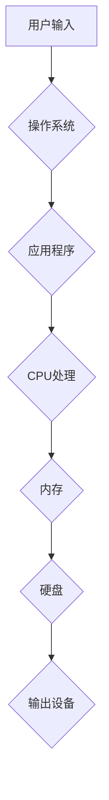

## IT基础资源（硬软件）运行流程

> 关键词：硬件、软件、操作系统、应用程序、数据流、执行流程、资源管理、系统架构、计算机网络

## 1. 背景介绍

在当今数字化时代，信息技术 (IT) 已经渗透到生活的方方面面。从智能手机到大型数据中心，各种各样的IT系统无时无刻不在为我们提供服务。这些系统背后，隐藏着复杂的硬件和软件相互协作的运行流程。理解这个流程对于IT从业者来说至关重要，因为它能够帮助我们更好地设计、开发和维护高效可靠的IT系统。

本文将深入探讨IT基础资源（硬件和软件）的运行流程，从核心概念到具体操作步骤，从数学模型到项目实践，全面解析IT系统运作的奥秘。

## 2. 核心概念与联系

IT系统运行的核心是硬件和软件的协同工作。硬件提供物理基础，软件则赋予硬件以功能和智能。两者之间通过数据流和执行流程相互连接，形成一个完整的运行体系。

**2.1 硬件**

硬件是指计算机系统中可以物理触摸到的设备，例如：

* **中央处理器 (CPU):** 负责执行计算机指令的核心部件。
* **内存 (RAM):** 用于临时存储正在运行程序和数据的快速存储器。
* **硬盘 (HDD/SSD):** 用于长期存储程序和数据的持久存储器。
* **输入设备 (键盘、鼠标等):** 用于向计算机输入数据的设备。
* **输出设备 (显示器、打印机等):** 用于从计算机接收数据的设备。

**2.2 软件**

软件是指计算机系统中运行的指令和数据集合，它控制硬件的运作并实现各种功能。软件可以分为以下几类：

* **操作系统 (OS):** 管理硬件资源，提供应用程序运行环境的核心软件。
* **应用程序 (App):** 用于完成特定任务的软件，例如办公软件、游戏软件等。
* **驱动程序:** 控制硬件设备的软件。

**2.3 数据流**

数据流是指信息在硬件和软件之间传输的过程。数据从输入设备进入系统，经过CPU处理，存储在内存或硬盘中，最终输出到输出设备。

**2.4 执行流程**

执行流程是指计算机系统执行指令的顺序和过程。

**2.5 资源管理**

资源管理是指操作系统分配和调度硬件资源，例如CPU时间、内存空间和硬盘空间，以保证不同程序能够高效运行。

**2.6 系统架构**

系统架构是指IT系统的整体设计和组织结构，包括硬件、软件、网络和数据等各个方面的配置和连接。

**Mermaid 流程图**



## 3. 核心算法原理 & 具体操作步骤

### 3.1 算法原理概述

算法是解决特定问题的指令序列，是软件运行的核心逻辑。IT系统运行过程中，各种算法共同作用，实现数据处理、资源管理、网络通信等功能。

### 3.2 算法步骤详解

* **排序算法:** 用于对数据进行有序排列，例如冒泡排序、快速排序等。
* **搜索算法:** 用于在数据集合中查找特定元素，例如线性搜索、二分搜索等。
* **路径算法:** 用于寻找数据之间最优路径，例如 Dijkstra 算法、A* 算法等。
* **加密算法:** 用于保护数据安全，例如 AES、RSA 等。

### 3.3 算法优缺点

不同的算法具有不同的优缺点，选择合适的算法取决于具体应用场景。例如，冒泡排序简单易实现，但效率较低；快速排序效率较高，但实现复杂度较高。

### 3.4 算法应用领域

算法广泛应用于各个IT领域，例如：

* **数据库管理:** 用于数据存储、检索和更新。
* **网络通信:** 用于数据传输和路由。
* **人工智能:** 用于机器学习、自然语言处理等。
* **安全防护:** 用于病毒检测、入侵防御等。

## 4. 数学模型和公式 & 详细讲解 & 举例说明

数学模型和公式是描述算法和系统行为的抽象工具，可以帮助我们分析和优化IT系统性能。

### 4.1 数学模型构建

数学模型可以将现实世界的问题抽象成数学表达式，例如：

* **时间复杂度:** 用大O符号表示算法运行时间随输入数据规模变化的趋势，例如 O(n) 表示时间复杂度线性增长。
* **空间复杂度:** 用大O符号表示算法运行所需内存空间随输入数据规模变化的趋势，例如 O(n) 表示空间复杂度线性增长。

### 4.2 公式推导过程

例如，计算时间复杂度公式的推导过程：

* 首先，分析算法执行的步骤和循环次数。
* 然后，根据步骤执行时间和循环次数，推导出时间复杂度表达式。
* 最后，简化表达式，得到最终的时间复杂度。

### 4.3 案例分析与讲解

例如，分析冒泡排序算法的时间复杂度：

* 冒泡排序算法需要进行 n-1 次循环，每次循环比较 n-i 个元素，其中 i 为循环次数。
* 因此，总共比较次数为 (n-1)+(n-2)+...+1 = n(n-1)/2。
* 每个比较操作的时间复杂度为常数，因此冒泡排序算法的时间复杂度为 O(n^2)。

## 5. 项目实践：代码实例和详细解释说明

### 5.1 开发环境搭建

* 选择合适的编程语言，例如 Python、Java 等。
* 安装必要的软件开发工具，例如 IDE、编译器等。
* 设置开发环境变量，例如 PATH、PYTHONPATH 等。

### 5.2 源代码详细实现

```python
# 冒泡排序算法示例代码
def bubble_sort(arr):
    n = len(arr)
    for i in range(n):
        for j in range(0, n-i-1):
            if arr[j] > arr[j+1]:
                arr[j], arr[j+1] = arr[j+1], arr[j]
    return arr

# 测试代码
arr = [64, 34, 25, 12, 22, 11, 90]
sorted_arr = bubble_sort(arr)
print("排序后的数组:", sorted_arr)
```

### 5.3 代码解读与分析

* `bubble_sort(arr)` 函数接收一个数组 `arr` 作为输入。
* 外层循环 `for i in range(n)` 控制排序的轮数，每次循环将最大元素“冒泡”到数组末尾。
* 内层循环 `for j in range(0, n-i-1)` 比较相邻元素，如果顺序错误则交换位置。
* 最后返回排序后的数组 `sorted_arr`。

### 5.4 运行结果展示

```
排序后的数组: [11, 12, 22, 25, 34, 64, 90]
```

## 6. 实际应用场景

IT基础资源的运行流程在各种实际应用场景中发挥着重要作用。

### 6.1 Web 服务器

Web 服务器接收用户请求，从硬盘读取网页文件，并将其发送到用户浏览器。

### 6.2 数据库系统

数据库系统管理大量数据，提供数据存储、检索和更新服务。

### 6.3 云计算平台

云计算平台提供虚拟化资源，用户可以按需租用计算、存储和网络资源。

### 6.4 人工智能应用

人工智能应用利用算法分析数据，实现机器学习、自然语言处理等功能。

### 6.5 未来应用展望

随着技术的不断发展，IT基础资源的运行流程将更加智能化、自动化和高效化。例如：

* **量子计算:** 利用量子力学原理实现更强大的计算能力。
* **边缘计算:** 将计算能力部署到靠近数据源的边缘设备，降低延迟和提高效率。
* **物联网:** 连接各种设备，形成庞大的数据网络，实现智能化管理和控制。

## 7. 工具和资源推荐

### 7.1 学习资源推荐

* **书籍:** 《计算机系统：架构与实现》、《深入理解计算机系统》
* **在线课程:** Coursera、edX、Udemy 等平台提供丰富的IT相关课程。
* **技术博客:** Hacker News、Medium 等平台汇聚了众多IT技术博主和专家。

### 7.2 开发工具推荐

* **IDE:** Eclipse、IntelliJ IDEA、Visual Studio Code 等。
* **编译器:** GCC、Clang、Java JDK 等。
* **版本控制系统:** Git、SVN 等。

### 7.3 相关论文推荐

* **操作系统:** 《Operating System Concepts》
* **计算机网络:** 《Computer Networking: A Top-Down Approach》
* **数据库系统:** 《Database System Concepts》

## 8. 总结：未来发展趋势与挑战

### 8.1 研究成果总结

本文深入探讨了IT基础资源的运行流程，从核心概念到具体操作步骤，从数学模型到项目实践，全面解析了IT系统运作的奥秘。

### 8.2 未来发展趋势

未来，IT基础资源的运行流程将更加智能化、自动化和高效化，例如量子计算、边缘计算和物联网等技术将推动IT系统发展。

### 8.3 面临的挑战

* **安全保障:** 随着IT系统越来越复杂，安全漏洞也越来越多，需要不断加强安全防护措施。
* **资源管理:** 如何高效地管理和分配有限的资源，是IT系统面临的重大挑战。
* **可持续发展:** 如何构建节能环保的IT系统，是未来发展的重要方向。

### 8.4 研究展望

未来研究将重点关注以下几个方面：

* **新型计算模型:** 研究量子计算、神经网络等新型计算模型，提升计算能力和效率。
* **智能化资源管理:** 利用人工智能技术实现智能化资源调度和分配，提高资源利用率。
* **安全可靠性:** 研究更先进的安全防护技术，保障IT系统的安全可靠运行。

## 9. 附录：常见问题与解答

* **问题:** 为什么需要操作系统？
* **答案:** 操作系统是计算机系统运行的基石，它管理硬件资源，提供应用程序运行环境，并提供用户界面等功能。
* **问题:** 什么是算法？
* **答案:** 算法是解决特定问题的指令序列，是软件运行的核心逻辑。
* **问题:** 如何选择合适的算法？
* **答案:** 选择合适的算法取决于具体应用场景，需要考虑算法的效率、复杂度和适用范围等因素。


作者：禅与计算机程序设计艺术 / Zen and the Art of Computer Programming 
