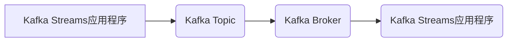

## Kafka Streams原理与代码实例讲解

> 关键词：Kafka Streams, Apache Kafka, 流式处理, 微服务, 数据处理, Java, Scala

## 1. 背景介绍

在当今数据爆炸的时代，实时数据处理能力已成为企业竞争力的关键因素。Apache Kafka作为高吞吐量、低延迟的分布式流式数据平台，为实时数据处理提供了强大的基础。然而，仅仅使用Kafka存储数据并不能满足实时数据分析和处理的需求。

Kafka Streams是一个基于Java和Scala构建的流式处理框架，它运行在Kafka集群之上，允许开发者以声明式方式构建和运行实时数据处理应用程序。Kafka Streams提供了丰富的API和功能，例如数据窗口、状态管理、数据聚合等，使得开发者能够轻松地构建复杂的数据处理逻辑。

## 2. 核心概念与联系

Kafka Streams的核心概念包括：

* **Kafka Topic:** Kafka Streams处理的数据存储在Kafka Topic中。Topic是一个主题，可以理解为一个数据流。
* **Streams:** Kafka Streams应用程序由多个Streams组成，每个Streams代表一个数据处理管道。
* **Processor:** Processor是Streams中的处理单元，负责对数据进行处理，例如过滤、转换、聚合等。
* **State Store:** State Store用于存储Streams应用程序的状态信息，例如计数器、累加器等。

Kafka Streams与Kafka集群的交互方式如下：



**Kafka Streams与Kafka的关系:**

Kafka Streams应用程序运行在Kafka集群之上，它可以读取Kafka Topic中的数据，并将其写入其他Kafka Topic。Kafka Streams应用程序可以利用Kafka的分布式特性和高吞吐量特性，实现高性能的实时数据处理。

## 3. 核心算法原理 & 具体操作步骤

### 3.1  算法原理概述

Kafka Streams的核心算法是基于**微批处理**的。它将流式数据划分为小的批次，并对每个批次进行处理。这种微批处理的方式可以有效地利用Kafka的批处理特性，提高处理效率。

### 3.2  算法步骤详解

1. **数据读取:** Kafka Streams应用程序从Kafka Topic中读取数据。
2. **数据分区:** Kafka Streams将数据按照分区进行处理，每个Processor负责处理一个分区的数据。
3. **数据处理:** Processor对数据进行处理，例如过滤、转换、聚合等。
4. **状态更新:** Processor可以更新State Store中的状态信息。
5. **数据写入:** 处理后的数据可以写入其他Kafka Topic。

### 3.3  算法优缺点

**优点:**

* **高性能:** 微批处理的方式可以有效地利用Kafka的批处理特性，提高处理效率。
* **易于开发:** Kafka Streams提供了丰富的API和功能，使得开发者能够轻松地构建复杂的数据处理逻辑。
* **容错性强:** Kafka Streams应用程序可以自动处理数据丢失和故障。

**缺点:**

* **延迟:** 微批处理的方式会引入一定的延迟，因为数据需要等待足够多的数据才能进行处理。
* **状态管理:** State Store的管理需要开发者进行额外的考虑。

### 3.4  算法应用领域

Kafka Streams的应用领域非常广泛，例如：

* **实时数据分析:** 对实时数据进行分析，例如用户行为分析、网站流量分析等。
* **事件驱动应用程序:** 处理事件驱动应用程序中的事件，例如订单处理、用户注册等。
* **数据集成:** 将数据从不同的数据源集成到一起。

## 4. 数学模型和公式 & 详细讲解 & 举例说明

### 4.1  数学模型构建

Kafka Streams的处理逻辑可以抽象为一个流式数据处理图，其中每个节点代表一个Processor，每个边代表数据流。

我们可以用以下数学模型来描述Kafka Streams的处理过程：

* **数据流:**  D(t) = {d1(t), d2(t),..., dn(t)}，其中d(t)表示在时间t时刻的数据元素。
* **Processor:** P(i) = {f(i, d(t))}，其中f(i, d(t))表示Processor i对数据元素d(t)的处理函数。
* **状态更新:** S(t+1) = g(S(t), D(t))，其中S(t)表示在时间t时刻的状态信息，g(S(t), D(t))表示状态更新函数。

### 4.2  公式推导过程

Kafka Streams的处理过程可以表示为以下公式：

* **输出数据:** O(t) = {f(1, d1(t)), f(2, d2(t)),..., f(n, dn(t))}
* **状态更新:** S(t+1) = g(S(t), {f(1, d1(t)), f(2, d2(t)),..., f(n, dn(t))})

### 4.3  案例分析与讲解

例如，我们有一个简单的Kafka Streams应用程序，它从一个Kafka Topic中读取数据，并计算每个单词的出现次数。

* **数据流:** D(t) = {"hello", "world", "hello", "kafka"}
* **Processor:** P(1) = {count(word)}，其中count(word)表示计算单词word的出现次数。
* **状态更新:** S(t+1) = {word: count}，其中word是单词，count是单词的出现次数。

**处理过程:**

1. Kafka Streams应用程序从Kafka Topic中读取数据D(t)。
2. Processor P(1)对每个单词进行计数，并将结果存储在State Store中。
3. 状态更新函数g()更新State Store中的状态信息。
4. 处理后的结果可以写入另一个Kafka Topic。

## 5. 项目实践：代码实例和详细解释说明

### 5.1  开发环境搭建

* **Java Development Kit (JDK):** 至少需要Java 8版本。
* **Apache Kafka:** 至少需要Kafka 0.10版本。
* **Apache ZooKeeper:** 用于Kafka集群的协调和管理。
* **Maven:** 用于项目构建和依赖管理。

### 5.2  源代码详细实现

```java
import org.apache.kafka.common.serialization.Serdes;
import org.apache.kafka.streams.KafkaStreams;
import org.apache.kafka.streams.StreamsBuilder;
import org.apache.kafka.streams.StreamsConfig;
import org.apache.kafka.streams.kstream.KStream;
import org.apache.kafka.streams.kstream.KTable;
import org.apache.kafka.streams.kstream.Produced;

import java.util.Properties;

public class WordCountExample {

    public static void main(String[] args) {
        Properties props = new Properties();
        props.put(StreamsConfig.APPLICATION_ID_CONFIG, "word-count-example");
        props.put(StreamsConfig.BOOTSTRAP_SERVERS_CONFIG, "localhost:9092");
        props.put(StreamsConfig.DEFAULT_KEY_SERDE_CLASS_CONFIG, Serdes.String().getClass());
        props.put(StreamsConfig.DEFAULT_VALUE_SERDE_CLASS_CONFIG, Serdes.String().getClass());

        StreamsBuilder builder = new StreamsBuilder();
        KStream<String, String> textLines = builder.stream("input-topic");
        KTable<String, Long> wordCounts = textLines
               .flatMapValues(value -> Arrays.asList(value.toLowerCase().split("\\W+")))
               .groupBy((key, value) -> value)
               .count();

        wordCounts.toStream().to("output-topic", Produced.with(Serdes.String(), Serdes.Long()));

        KafkaStreams streams = new KafkaStreams(builder.build(), props);
        streams.start();

        // Add shutdown hook to close streams on application exit
        Runtime.getRuntime().addShutdownHook(new Thread(streams::close));
    }
}
```

### 5.3  代码解读与分析

* **配置Kafka Streams:** 代码首先配置了Kafka Streams应用程序的属性，包括应用程序ID、Kafka集群地址、key和value的序列化器等。
* **读取数据:** 使用`builder.stream("input-topic")`方法从名为"input-topic"的Kafka Topic中读取数据。
* **数据处理:** 使用`flatMapValues()`方法将每个数据元素拆分成单词，然后使用`groupBy()`方法将单词分组。
* **状态更新:** 使用`count()`方法计算每个单词的出现次数，并将结果存储在名为"word-counts"的KTable中。
* **写入数据:** 使用`to()`方法将处理后的结果写入名为"output-topic"的Kafka Topic。
* **启动应用程序:** 使用`streams.start()`方法启动Kafka Streams应用程序。

### 5.4  运行结果展示

运行代码后，Kafka Streams应用程序会从"input-topic"中读取数据，并计算每个单词的出现次数。处理后的结果将写入"output-topic"中。

## 6. 实际应用场景

Kafka Streams在各种实际应用场景中都有广泛的应用，例如：

* **实时用户行为分析:** 分析用户在网站或应用程序上的行为，例如点击率、停留时间、转化率等。
* **实时订单处理:** 处理订单信息，例如订单创建、订单支付、订单发货等。
* **实时风险检测:** 检测欺诈行为、异常交易等风险。
* **实时数据监控:** 监控系统指标，例如CPU使用率、内存使用率、网络流量等。

### 6.4  未来应用展望

随着数据量的不断增长和实时数据处理需求的不断增加，Kafka Streams的应用场景将会更加广泛。未来，Kafka Streams可能会在以下方面得到发展：

* **更强大的功能:** Kafka Streams可能会提供更强大的功能，例如更复杂的窗口操作、更灵活的状态管理等。
* **更易于使用:** Kafka Streams可能会变得更加易于使用，例如提供更友好的API、更完善的文档等。
* **更广泛的应用:** Kafka Streams可能会应用于更多领域，例如物联网、金融、医疗等。

## 7. 工具和资源推荐

### 7.1  学习资源推荐

* **Kafka Streams官方文档:** https://kafka.apache.org/documentation/#streams_intro
* **Kafka Streams教程:** https://www.baeldung.com/apache-kafka-streams
* **Kafka Streams书籍:** "Kafka Streams in Action" by Neha Narkhede

### 7.2  开发工具推荐

* **IntelliJ IDEA:** https://www.jetbrains.com/idea/
* **Eclipse:** https://www.eclipse.org/

### 7.3  相关论文推荐

* **Kafka Streams: A Stream Processing Engine for Apache Kafka:** https://arxiv.org/abs/1606.04917

## 8. 总结：未来发展趋势与挑战

### 8.1  研究成果总结

Kafka Streams是一个强大的流式处理框架，它为开发者提供了构建实时数据处理应用程序的便捷工具。Kafka Streams的微批处理算法、丰富的API和功能、以及与Kafka集群的紧密集成，使其成为实时数据处理的理想选择。

### 8.2  未来发展趋势

Kafka Streams的未来发展趋势包括：

* **更强大的功能:** Kafka Streams可能会提供更强大的功能，例如更复杂的窗口操作、更灵活的状态管理等。
* **更易于使用:** Kafka Streams可能会变得更加易于使用，例如提供更友好的API、更完善的文档等。
* **更广泛的应用:** Kafka Streams可能会应用于更多领域，例如物联网、金融、医疗等。

### 8.3  面临的挑战

Kafka Streams也面临一些挑战，例如：

* **延迟问题:** 微批处理的方式会引入一定的延迟，需要开发者进行权衡和优化。
* **状态管理复杂性:** State Store的管理需要开发者进行额外的考虑，例如状态持久化、状态一致性等。
* **生态系统发展:** Kafka Streams的生态系统相对较小，需要更多的开发者和贡献者参与。

### 8.4  研究展望

未来，Kafka Streams的研究方向包括：

* **降低延迟:** 研究更低延迟的流式处理算法。
* **简