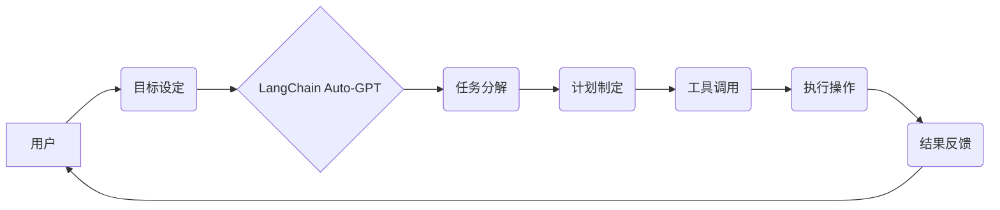

## LangChain 版 Auto-GPT 技术方案与架构设计

> 关键词：Auto-GPT, LangChain, 语言模型, 自动化, 框架, 架构, 应用场景

## 1. 背景介绍

近年来，大型语言模型（LLM）的快速发展，如 OpenAI 的 GPT-3 和 Google 的 LaMDA，为人工智能领域带来了革命性的变革。这些模型展现出惊人的文本生成、理解和推理能力，为各种应用场景提供了无限可能。然而，LLM 的应用通常需要人工干预和引导，难以实现真正的自动化。

Auto-GPT 应运而生，它是一个基于 GPT-4 的开源项目，旨在构建一个能够自主执行任务的通用人工智能代理。Auto-GPT 通过将 GPT-4 与其他工具和服务集成，实现了自我规划、执行和评估任务的能力。它可以根据用户提供的目标，分解任务、制定计划、执行操作并反馈结果，从而实现端到端的自动化。

然而，Auto-GPT 的实现依赖于 GPT-4 的 API 调用，这可能会带来高昂的成本和性能瓶颈。为了降低成本和提高效率，我们提出了基于 LangChain 的 Auto-GPT 技术方案，该方案利用 LangChain 的强大的链式调用能力和工具集成能力，构建一个更灵活、高效、可定制的 Auto-GPT 系统。

## 2. 核心概念与联系

### 2.1 核心概念

* **Auto-GPT:** 一个能够自主执行任务的通用人工智能代理，通过自我规划、执行和评估任务的能力实现端到端的自动化。
* **LangChain:** 一个用于构建和管理大型语言模型应用的开源框架，提供链式调用、工具集成、内存管理等功能。
* **LLM:** 大型语言模型，如 GPT-3、LaMDA 等，具有强大的文本生成、理解和推理能力。
* **Agent:** 代理，一个能够感知环境、做出决策并执行操作的智能体。

### 2.2 架构关系



## 3. 核心算法原理 & 具体操作步骤

### 3.1 算法原理概述

LangChain 版 Auto-GPT 的核心算法原理基于强化学习和循环神经网络。

* **强化学习:** Auto-GPT 使用强化学习算法，通过奖励机制来引导其学习最佳的执行策略。当 Auto-GPT 完成任务时，它会获得奖励；当它执行错误或失败时，它会受到惩罚。通过不断地学习和调整，Auto-GPT 可以逐渐优化其执行策略，提高任务完成率。
* **循环神经网络:** Auto-GPT 使用循环神经网络（RNN）来处理文本数据，例如用户目标、任务描述和工具文档。RNN 可以捕捉文本序列中的上下文信息，帮助 Auto-GPT 更好地理解任务需求和执行操作。

### 3.2 算法步骤详解

1. **目标设定:** 用户向 Auto-GPT 提供一个具体的任务目标。
2. **任务分解:** Auto-GPT 使用 LLM 将目标任务分解成一系列子任务。
3. **计划制定:** Auto-GPT 根据子任务的性质和依赖关系，制定一个执行计划。
4. **工具调用:** Auto-GPT 根据计划，调用相应的工具和服务来执行子任务。
5. **执行操作:** Auto-GPT 通过 LLM 与工具交互，执行具体的操作步骤。
6. **结果反馈:** Auto-GPT 将执行结果反馈给用户，并根据结果进行评估。
7. **学习和优化:** Auto-GPT 使用强化学习算法，根据执行结果调整执行策略，以提高未来任务完成率。

### 3.3 算法优缺点

**优点:**

* **自动化:** Auto-GPT 可以自动执行任务，无需人工干预。
* **灵活:** Auto-GPT 可以根据不同的任务需求，灵活地调用不同的工具和服务。
* **可定制:** Auto-GPT 的执行策略和工具集成可以根据用户需求进行定制。

**缺点:**

* **成本:** 使用 LLM 和工具服务可能会带来一定的成本。
* **安全性:** Auto-GPT 的执行操作可能会存在安全风险，需要进行充分的安全评估和防护。
* **可靠性:** Auto-GPT 的执行结果可能受到 LLM 和工具服务的性能影响，需要进行可靠性测试和优化。

### 3.4 算法应用领域

* **内容创作:** 自动生成文章、故事、诗歌等内容。
* **代码生成:** 自动生成代码片段、函数、类等。
* **数据分析:** 自动分析数据、提取信息、生成报告。
* **客户服务:** 自动回复客户咨询、解决问题。
* **任务管理:** 自动管理任务清单、安排日程、提醒事项。

## 4. 数学模型和公式 & 详细讲解 & 举例说明

### 4.1 数学模型构建

Auto-GPT 的核心算法基于强化学习，可以使用马尔可夫决策过程（MDP）来建模。

* **状态空间:** Auto-GPT 的状态空间包含所有可能的状态，例如当前任务、执行进度、可用工具等。
* **动作空间:** Auto-GPT 的动作空间包含所有可能的行动，例如分解任务、制定计划、调用工具等。
* **奖励函数:** 奖励函数定义了 Auto-GPT 在不同状态下执行不同动作的奖励值。奖励函数的设计需要根据具体的任务目标和执行策略进行调整。
* **转移概率:** 转移概率描述了 Auto-GPT 在执行某个动作后，进入不同状态的概率。

### 4.2 公式推导过程

强化学习算法的目标是找到一个最优的策略，使得 Auto-GPT 在长期内获得最大的总奖励。常用的强化学习算法包括 Q-学习和 Deep Q-Network（DQN）。

* **Q-学习:** Q-学习算法通过迭代更新 Q 值表，来学习最优的策略。Q 值表存储了每个状态-动作对的期望奖励。
* **DQN:** DQN 算法使用深度神经网络来逼近 Q 值函数，可以处理更复杂的决策问题。

### 4.3 案例分析与讲解

假设 Auto-GPT 需要完成一个任务：写一篇关于人工智能的文章。

* **状态空间:** 包含当前任务进度、已生成文本内容、可用工具等信息。
* **动作空间:** 包含分解任务、生成文本段落、调用工具获取信息等操作。
* **奖励函数:** 奖励 Auto-GPT 生成高质量、符合主题的文章，惩罚生成低质量或不相关的内容。
* **转移概率:** 根据 Auto-GPT 的执行策略和工具服务的性能，计算不同动作导致不同状态的概率。

通过 Q-学习或 DQN 算法，Auto-GPT 可以学习到最优的执行策略，最终生成一篇高质量的人工智能文章。

## 5. 项目实践：代码实例和详细解释说明

### 5.1 开发环境搭建

* Python 3.8+
* LangChain 0.0.20+
* OpenAI API key
* 其他必要的库和工具

### 5.2 源代码详细实现

```python
from langchain.agents import initialize_agent
from langchain.chains import LLMChain
from langchain.llms import OpenAI
from langchain.tools import Tool, GoogleSearch

# 配置 LLM 和工具
llm = OpenAI(temperature=0.7)
search = GoogleSearch()
tools = [Tool(name="search", func=search.run, description="搜索网络信息")]

# 初始化 Auto-GPT 代理
agent = initialize_agent(
    llm=llm,
    tools=tools,
    agent="zero-shot-react-description",
    verbose=True,
)

# 设置目标任务
user_goal = "写一篇关于人工智能的文章"

# 执行任务
agent.run(user_goal)
```

### 5.3 代码解读与分析

* **配置 LLM 和工具:** 首先，我们需要配置 LLM 和工具。这里我们使用 OpenAI 的 GPT-3 模型作为 LLM，并使用 Google Search 作为工具，用于获取网络信息。
* **初始化 Auto-GPT 代理:** 使用 `initialize_agent` 函数初始化 Auto-GPT 代理，并指定 LLM、工具、代理类型和详细程度等参数。
* **设置目标任务:** 设置用户想要完成的任务目标，例如 "写一篇关于人工智能的文章"。
* **执行任务:** 调用 `agent.run` 函数，启动 Auto-GPT 代理执行任务。

### 5.4 运行结果展示

Auto-GPT 会根据用户目标，分解任务、制定计划、调用工具和执行操作，最终生成一篇关于人工智能的文章。

## 6. 实际应用场景

### 6.1 内容创作

* 自动生成新闻报道、博客文章、社交媒体内容等。
* 创作小说、诗歌、剧本等创意内容。
* 生成产品描述、广告文案等营销内容。

### 6.2 代码生成

* 自动生成代码片段、函数、类等。
* 根据自然语言描述生成代码。
* 自动完成代码补全和错误修复。

### 6.3 数据分析

* 自动分析数据、提取关键信息、生成报告。
* 识别数据模式、预测未来趋势。
* 自动生成数据可视化图表。

### 6.4 客户服务

* 自动回复客户咨询、解决常见问题。
* 提供个性化客户服务体验。
* 自动收集客户反馈，改进服务质量。

### 6.5 任务管理

* 自动管理任务清单、安排日程、提醒事项。
* 自动分配任务、跟踪进度、评估完成情况。
* 提高工作效率、减少重复劳动。

## 7. 工具和资源推荐

### 7.1 学习资源推荐

* **LangChain 官方文档:** https://python.langchain.com/docs/
* **Auto-GPT 官方文档:** https://github.com/Significant-Gravitas/Auto-GPT
* **OpenAI API 文档:** https://platform.openai.com/docs/api-reference

### 7.2 开发工具推荐

* **Python:** https://www.python.org/
* **VS Code:** https://code.visualstudio.com/
* **Jupyter Notebook:** https://jupyter.org/

### 7.3 相关论文推荐

* **Auto-GPT: An Open-Source Tool for Autonomous Agents:** https://arxiv.org/abs/2303.14447
* **LangChain: Tools for Building Applications with Language Models:** https://arxiv.org/abs/2204.08133

## 8. 总结：未来发展趋势与挑战

### 8.1 研究成果总结

LangChain 版 Auto-GPT 技术方案为构建更灵活、高效、可定制的通用人工智能代理提供了新的思路和方法。它结合了 LangChain 的强大功能和 Auto-GPT 的自主执行能力，为人工智能应用的未来发展带来了新的可能性。

### 8.2 未来发展趋势

* **更强大的 LLM:** 未来 LLM 的能力将会进一步提升，能够处理更复杂的任务和生成更高质量的内容。
* **更丰富的工具集成:** LangChain 将会支持更多类型的工具和服务，使 Auto-GPT 能够处理更广泛的任务类型。
* **更智能的执行策略:** 通过强化学习和其他算法，Auto-GPT 的执行策略将会更加智能，能够更好地适应不同的任务需求和环境变化。
* **更安全的执行环境:** 为了确保 Auto-GPT 的安全性和可靠性，需要开发更完善的安全机制和监控系统。

### 8.3 面临的挑战

* **成本问题:** 使用 LLM 和工具服务可能会带来一定的成本，需要寻找更经济的解决方案。
* **安全性问题:** Auto-GPT 的执行操作可能会存在安全风险，需要进行充分的安全评估和防护。
* **可靠性问题:** Auto-GPT 的执行结果可能受到 LLM 和工具服务的性能影响，需要进行可靠性测试和优化。
* **伦理问题:** Auto-GPT 的自主执行能力可能会带来伦理问题，需要制定相应的规范和伦理准则。

### 8.4 研究展望

未来，我们将继续研究和