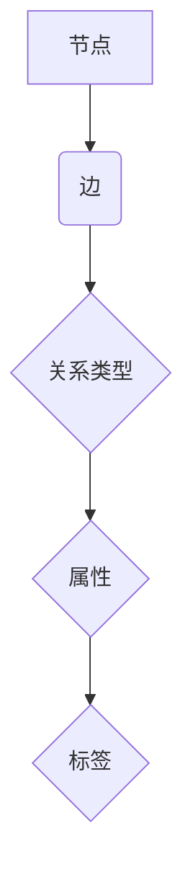

## Neo4j原理与代码实例讲解

> 关键词：Neo4j, 图数据库, 关系型数据库,  节点, 边,  Cypher,  Graph Traversal,  数据可视化

## 1. 背景介绍

随着数据量的爆炸式增长和复杂关系网络的日益普遍，传统的关系型数据库在处理海量复杂数据时逐渐显露出局限性。为了更好地应对这些挑战，图数据库应运而生。Neo4j 是目前最流行的图数据库之一，它以其灵活的数据模型、强大的查询能力和高效的性能而闻名。

Neo4j 基于基于关系的存储模型，将数据表示为节点和边。节点代表实体，边代表实体之间的关系。这种数据模型能够自然地表达复杂的关系网络，并提供高效的查询和分析能力。

## 2. 核心概念与联系

Neo4j 的核心概念包括节点、边、关系类型、属性和标签。

* **节点 (Node):**  图数据库中的基本单元，代表一个实体。例如，在社交网络中，每个用户都是一个节点。
* **边 (Edge):**  连接两个节点的线，代表两个实体之间的关系。例如，在社交网络中，"朋友关系" 是一种边，连接两个用户节点。
* **关系类型 (Relationship Type):**  描述边类型，例如 "朋友关系"、"关注关系" 等。
* **属性 (Property):**  节点或边的附加信息，例如用户姓名、年龄、性别等。
* **标签 (Label):**  用于分类节点，例如 "用户"、"商品"、"文章" 等。

Neo4j 的数据模型可以表示为一个图，其中节点和边构成图的结构。



## 3. 核心算法原理 & 具体操作步骤

### 3.1  算法原理概述

Neo4j 使用基于索引的查询算法，通过构建索引来加速查询过程。Neo4j 的索引分为两种类型：

* **节点索引:**  用于快速查找特定节点。
* **边索引:**  用于快速查找特定边的连接关系。

Neo4j 的查询引擎使用这些索引来优化查询路径，并减少查询时间。

### 3.2  算法步骤详解

1. **解析查询语句:** Neo4j 的查询语言是 Cypher，它使用类似于 SQL 的语法。查询引擎首先解析 Cypher 语句，将其转换为内部表示形式。
2. **构建查询计划:**  查询引擎根据解析后的语句，构建一个查询计划，该计划描述了查询执行的步骤。
3. **使用索引加速查询:** 查询引擎根据查询计划，使用节点索引和边索引来加速查询过程。
4. **遍历图结构:**  如果需要遍历图结构，查询引擎会使用深度优先搜索 (DFS) 或广度优先搜索 (BFS) 算法来遍历图。
5. **返回查询结果:**  查询引擎最终返回查询结果，这些结果可能是节点、边或节点和边的组合。

### 3.3  算法优缺点

**优点:**

* **高效的查询性能:**  Neo4j 的索引机制和查询优化算法能够显著提高查询性能。
* **灵活的数据模型:**  Neo4j 的图数据模型能够自然地表达复杂的关系网络。
* **强大的扩展性:**  Neo4j 可以轻松扩展到处理海量数据。

**缺点:**

* **学习曲线:**  Cypher 语法和 Neo4j 的数据模型需要一定的学习时间。
* **事务处理:**  Neo4j 的事务处理机制相对复杂，需要谨慎设计。

### 3.4  算法应用领域

Neo4j 的图数据库技术在许多领域都有广泛的应用，例如：

* **社交网络分析:**  分析用户关系、传播路径等。
* **推荐系统:**  根据用户行为和兴趣推荐相关内容。
* **知识图谱构建:**  构建知识图谱，用于知识发现和推理。
* **欺诈检测:**  识别异常行为和欺诈模式。
* **生物信息学:**  分析蛋白质相互作用、基因调控网络等。

## 4. 数学模型和公式 & 详细讲解 & 举例说明

### 4.1  数学模型构建

Neo4j 的数据模型可以抽象为一个图 G = (V, E)，其中：

* V 是节点集合，表示实体。
* E 是边集合，表示实体之间的关系。

每个节点 v ∈ V 都有一个属性集 P(v)，表示节点的特征信息。每个边 e ∈ E 都有一个关系类型 R(e) 和一个属性集 P(e)，表示边的类型和特征信息。

### 4.2  公式推导过程

Neo4j 的查询语言 Cypher 使用图遍历算法来查询数据。例如，查询语句 `MATCH (n:Person)-[:KNOWS]->(m:Person) RETURN n, m` 可以表示找到所有 "KNOWS" 关系连接的两个 Person 节点。

这个查询语句可以转化为图遍历算法的步骤：

1. 从所有 Person 节点开始遍历。
2. 寻找每个节点的 "KNOWS" 关系连接的节点。
3. 返回所有找到的节点对。

### 4.3  案例分析与讲解

例如，假设我们有一个社交网络图，其中节点代表用户，边代表朋友关系。

```
MATCH (u:User)-[:FRIEND]->(v:User)
RETURN u, v
```

这个 Cypher 语句可以查询出所有朋友关系连接的用户对。

## 5. 项目实践：代码实例和详细解释说明

### 5.1  开发环境搭建

1. 下载并安装 Neo4j 社区版：https://neo4j.com/download/
2. 安装 Neo4j 的驱动程序：https://neo4j.com/docs/drivers/current/

### 5.2  源代码详细实现

```python
from neo4j import GraphDatabase

# 连接 Neo4j 数据库
driver = GraphDatabase.driver("bolt://localhost:7687", auth=("neo4j", "password"))

# 定义 Cypher 语句
query = "MATCH (n:Person)-[:KNOWS]->(m:Person) RETURN n, m"

# 执行查询
with driver.session() as session:
    result = session.run(query)

    # 打印查询结果
    for record in result:
        print(record["n"], record["m"])

# 关闭连接
driver.close()
```

### 5.3  代码解读与分析

* `GraphDatabase.driver()` 函数用于连接 Neo4j 数据库。
* `session.run()` 函数用于执行 Cypher 语句。
* `result` 变量存储查询结果。
* `for` 循环遍历查询结果，打印每个节点对。

### 5.4  运行结果展示

运行代码后，将输出所有朋友关系连接的用户对。

## 6. 实际应用场景

Neo4j 在许多实际应用场景中发挥着重要作用，例如：

* **社交网络分析:**  分析用户关系、传播路径等，帮助社交媒体平台了解用户行为和趋势。
* **推荐系统:**  根据用户行为和兴趣推荐相关内容，提高用户体验。
* **知识图谱构建:**  构建知识图谱，用于知识发现和推理，例如在搜索引擎和问答系统中应用。
* **欺诈检测:**  识别异常行为和欺诈模式，例如在金融交易和网络安全领域应用。
* **生物信息学:**  分析蛋白质相互作用、基因调控网络等，帮助研究人员理解生物系统。

### 6.4  未来应用展望

随着数据量的继续增长和人工智能技术的进步，Neo4j 的应用场景将更加广泛。例如：

* **个性化推荐:**  利用 Neo4j 的图数据模型和机器学习算法，提供更加个性化的推荐服务。
* **智能城市:**  构建智能城市知识图谱，用于城市管理、交通规划、公共安全等领域。
* **医疗保健:**  分析患者数据和医疗知识，帮助医生做出更准确的诊断和治疗方案。

## 7. 工具和资源推荐

### 7.1  学习资源推荐

* Neo4j 官方文档：https://neo4j.com/docs/
* Neo4j 博客：https://neo4j.com/blog/
* Neo4j 社区论坛：https://community.neo4j.com/

### 7.2  开发工具推荐

* Neo4j Desktop：https://neo4j.com/download/desktop/
* Neo4j Browser：https://neo4j.com/docs/browser/current/

### 7.3  相关论文推荐

* Neo4j: A Graph Database Management System
* Graph Traversal Algorithms for Neo4j

## 8. 总结：未来发展趋势与挑战

### 8.1  研究成果总结

Neo4j 的图数据库技术已经取得了显著的成果，在许多领域得到了广泛应用。Neo4j 的灵活的数据模型、强大的查询能力和高效的性能使其成为处理复杂关系网络的理想选择。

### 8.2  未来发展趋势

Neo4j 的未来发展趋势包括：

* **更强大的查询能力:**  Neo4j 将继续开发新的查询算法和功能，以提高查询性能和灵活性。
* **更完善的机器学习支持:**  Neo4j 将加强与机器学习算法的集成，以实现更智能的图数据分析。
* **更广泛的应用场景:**  Neo4j 的应用场景将不断扩展，覆盖更多领域，例如智能城市、医疗保健、金融科技等。

### 8.3  面临的挑战

Neo4j 也面临一些挑战，例如：

* **数据规模和复杂度:**  随着数据量的继续增长和复杂度增加，Neo4j 需要不断提升其处理能力和效率。
* **事务处理:**  Neo4j 的事务处理机制相对复杂，需要进一步优化和完善。
* **人才培养:**  Neo4j 的技术需要专业的知识和技能，人才培养是一个重要的挑战。

### 8.4  研究展望

未来，Neo4j 将继续致力于开发更强大、更灵活、更易用的图数据库技术，为用户提供更丰富的图数据分析和应用体验。


## 9. 附录：常见问题与解答

**Q1: Neo4j 和关系型数据库有什么区别？**

**A1:**  关系型数据库使用二维表结构存储数据，而 Neo4j 使用图结构存储数据。关系型数据库更适合处理结构化数据，而 Neo4j 更适合处理复杂关系网络。

**Q2: Cypher 语法是什么？**

**A2:**  Cypher 是 Neo4j 的查询语言，它使用类似于 SQL 的语法，但更适合于图数据查询。

**Q3: Neo4j 的性能如何？**

**A3:**  Neo4j 的性能非常出色，它能够高效地处理海量数据和复杂查询。

**Q4: Neo4j 的安全性如何？**

**A4:**  Neo4j 提供多种安全机制，例如用户认证、权限控制和数据加密，确保数据安全。


作者：禅与计算机程序设计艺术 / Zen and the Art of Computer Programming 
