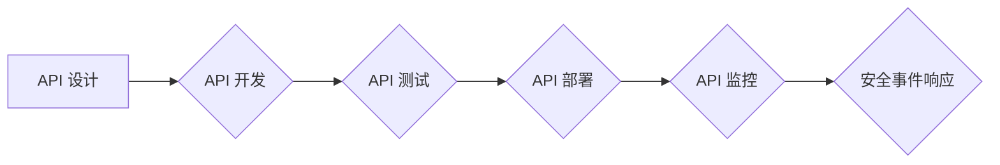

## OWASP API 安全风险清单解读

> 关键词：API 安全, OWASP, 安全风险, 漏洞, 防御, 威胁模型, 编码规范, 测试

### 1. 背景介绍

随着互联网和移动应用的蓬勃发展，API（应用程序接口）已成为构建现代软件系统不可或缺的组成部分。API 允许不同应用程序之间进行通信和数据交换，从而促进软件的互联互通和协同工作。然而，API 的开放性和便捷性也带来了新的安全风险。攻击者可以利用 API 的漏洞进行恶意攻击，窃取敏感数据、篡改数据、拒绝服务等。

OWASP（开放 Web 应用安全项目）是一个致力于提高软件安全性的非营利组织。OWASP 发布了《OWASP API 安全风险清单》，该清单列出了 API 常见的安全风险和漏洞，并提供了相应的缓解措施。该清单是 API 安全开发和维护的重要参考指南，帮助开发人员识别和解决 API 安全问题，构建更加安全的应用程序。

### 2. 核心概念与联系

#### 2.1 API 安全风险

API 安全风险是指通过利用 API 的漏洞或缺陷，攻击者可能造成的不利影响。这些风险包括：

* **数据泄露:** 攻击者可以窃取 API 返回的敏感数据，例如用户凭据、财务信息、个人信息等。
* **数据篡改:** 攻击者可以修改 API 返回的数据，导致应用程序逻辑错误或数据不完整。
* **拒绝服务:** 攻击者可以发送大量的请求，导致 API 服务器无法正常工作，从而拒绝合法用户访问。
* **代码执行:** 攻击者可以利用 API 的漏洞执行恶意代码，控制应用程序或服务器。

#### 2.2 OWASP API 安全风险清单

OWASP API 安全风险清单是一个基于威胁模型的风险清单，它将 API 安全风险分为多个类别，并对每个风险进行详细描述，包括风险描述、影响、缓解措施等。

**Mermaid 流程图**



### 3. 核心算法原理 & 具体操作步骤

#### 3.1 算法原理概述

OWASP API 安全风险清单并非一个算法，而是一个基于威胁模型的风险评估框架。它通过识别 API 的潜在攻击面，分析攻击者可能采取的攻击手段，评估攻击成功带来的影响，从而帮助开发人员识别和缓解 API 安全风险。

#### 3.2 算法步骤详解

OWASP API 安全风险清单的应用步骤如下：

1. **识别 API 的功能和接口:** 首先需要了解 API 的功能和接口，包括 API 的输入参数、输出结果、数据格式等。
2. **分析 API 的攻击面:** 针对 API 的功能和接口，分析可能存在的安全漏洞，例如输入验证不足、授权机制缺陷、数据泄露等。
3. **评估攻击风险:** 对于每个潜在的漏洞，评估攻击者可能采取的攻击手段，以及攻击成功带来的影响。
4. **制定缓解措施:** 根据风险评估结果，制定相应的缓解措施，例如加强输入验证、完善授权机制、加密敏感数据等。
5. **测试和验证:** 对缓解措施进行测试和验证，确保其有效性。

#### 3.3 算法优缺点

OWASP API 安全风险清单的优点：

* **基于威胁模型:** 该清单基于威胁模型，能够更全面地识别 API 的安全风险。
* **易于理解和使用:** 该清单的语言简洁易懂，易于理解和使用。
* **不断更新:** OWASP 组织会定期更新该清单，以应对新的安全威胁。

OWASP API 安全风险清单的缺点：

* **不能覆盖所有风险:** 该清单并非万能的，不能覆盖所有可能的 API 安全风险。
* **需要专业知识:** 为了有效地应用该清单，需要一定的安全知识和经验。

#### 3.4 算法应用领域

OWASP API 安全风险清单适用于所有使用 API 的应用程序开发人员，包括：

* Web 应用开发人员
* 移动应用开发人员
* 云计算平台开发人员
* IoT 设备开发人员

### 4. 数学模型和公式 & 详细讲解 & 举例说明

OWASP API 安全风险清单本身并不包含复杂的数学模型和公式。它主要基于威胁模型和风险评估原则，通过分析 API 的功能、接口和潜在攻击面，来识别和评估安全风险。

### 5. 项目实践：代码实例和详细解释说明

由于 OWASP API 安全风险清单是一个风险评估框架，而不是具体的代码实现，因此无法提供直接的代码实例。

但是，我们可以通过一些代码示例来展示如何应用 OWASP API 安全风险清单中的建议，例如：

* **输入验证:** 在处理用户输入时，需要进行严格的验证，确保输入数据符合预期格式和范围。

```python
def process_user_input(data):
  if not isinstance(data, str):
    raise ValueError("Input must be a string.")
  if len(data) > 100:
    raise ValueError("Input is too long.")
  #... other validation checks...
  return data
```

* **授权机制:** 在 API 接口中，需要使用授权机制来验证用户的身份和权限。

```python
def protected_api_endpoint(request):
  #... check user authentication and authorization...
  if not is_authenticated(request) or not has_permission(request, "read"):
    return unauthorized_response()
  #... process API request...
```

### 6. 实际应用场景

OWASP API 安全风险清单在实际应用场景中非常广泛，例如：

* **电商平台:** 电商平台的 API 用于处理订单、支付、库存等业务，需要确保 API 的安全性，防止数据泄露和篡改。
* **社交媒体平台:** 社交媒体平台的 API 用于处理用户数据、消息推送、好友关系等业务，需要确保 API 的安全性，防止用户隐私泄露。
* **金融机构:** 金融机构的 API 用于处理银行转账、贷款申请、投资理财等业务，需要确保 API 的安全性，防止资金损失。

### 7. 工具和资源推荐

#### 7.1 学习资源推荐

* OWASP API 安全风险清单官方网站: https://owasp.org/www-project-api-security-top-ten/
* OWASP API 安全测试指南: https://owasp.org/www-project-api-security-testing-guide/

#### 7.2 开发工具推荐

* Postman: 用于测试和调试 API 的工具。
* Burp Suite: 用于安全测试的工具，可以用于分析 API 的流量和漏洞。

#### 7.3 相关论文推荐

* OWASP API Security Top 10: 2019
* API Security: A Comprehensive Survey

### 8. 总结：未来发展趋势与挑战

#### 8.1 研究成果总结

OWASP API 安全风险清单已经成为 API 安全开发和维护的重要参考指南，帮助开发人员识别和解决 API 安全问题，构建更加安全的应用程序。

#### 8.2 未来发展趋势

随着 API 的日益普及，API 安全将成为越来越重要的议题。未来，OWASP API 安全风险清单可能会朝着以下方向发展：

* **更细粒度的风险评估:** 将风险评估细化到 API 的具体功能和接口，提供更精准的风险评估结果。
* **更智能化的风险检测:** 利用机器学习等人工智能技术，自动检测 API 的安全漏洞。
* **更全面的安全防护:** 提供更全面的 API 安全防护方案，包括身份验证、授权、数据加密、流量控制等。

#### 8.3 面临的挑战

API 安全面临着许多挑战，例如：

* **API 的复杂性:** API 的设计和实现越来越复杂，难以全面评估其安全风险。
* **攻击手段的不断演变:** 攻击者不断开发新的攻击手段，挑战 API 的安全性。
* **安全意识的不足:** 一些开发人员对 API 安全缺乏足够的重视。

#### 8.4 研究展望

未来，需要进一步研究 API 安全的理论和实践，开发更有效的 API 安全防护技术，提高 API 的安全性。

### 9. 附录：常见问题与解答

#### 9.1 如何应用 OWASP API 安全风险清单？

OWASP API 安全风险清单可以作为 API 安全开发和维护的参考指南。开发人员可以根据该清单的建议，进行 API 的风险评估、漏洞检测、安全防护等工作。

#### 9.2 OWASP API 安全风险清单是否涵盖所有 API 安全风险？

OWASP API 安全风险清单并非万能的，它不能覆盖所有可能的 API 安全风险。但是，它涵盖了 API 安全领域最常见的风险，可以作为 API 安全开发和维护的重要参考指南。

#### 9.3 如何应对新的 API 安全威胁？

OWASP 组织会定期更新 OWASP API 安全风险清单，以应对新的安全威胁。开发人员需要关注 OWASP 的最新发布，及时更新自己的 API 安全知识和技能。


作者：禅与计算机程序设计艺术 / Zen and the Art of Computer Programming 
