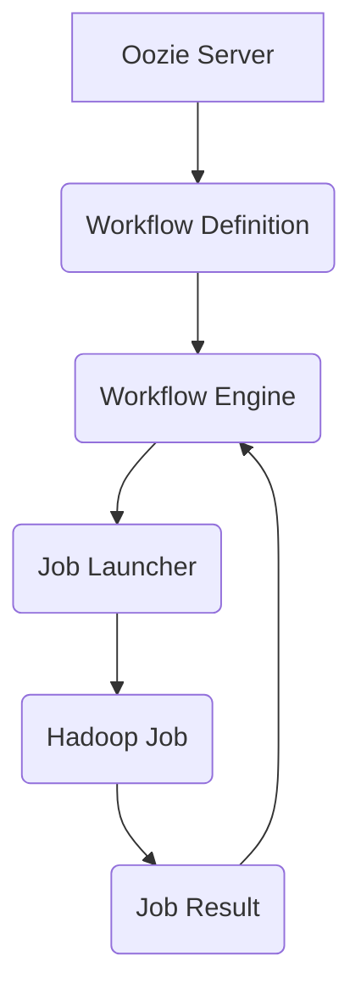

## Oozie工作流调度原理与代码实例讲解

> 关键词：Oozie, 工作流调度, Hadoop, YARN, Workflow, DAG, Java, Apache

## 1. 背景介绍

在如今数据爆炸的时代，海量数据的处理和分析成为企业发展的重要驱动力。Hadoop作为分布式存储和处理框架，为大数据处理提供了强大的支持。然而，Hadoop本身并不具备工作流调度能力，无法自动执行复杂的、跨多个任务的数据处理流程。为了解决这一问题，Apache Oozie应运而生。

Oozie是一个开源的Hadoop工作流调度系统，它基于Java语言开发，并与Hadoop生态系统紧密集成。Oozie能够定义、调度、监控和管理复杂的Hadoop工作流，帮助用户简化大数据处理流程，提高效率和可靠性。

## 2. 核心概念与联系

Oozie工作流调度系统基于Directed Acyclic Graph (DAG)模型，将工作流分解成一系列独立的任务，并通过依赖关系连接起来。每个任务都对应一个具体的Hadoop作业，例如MapReduce、Pig、Hive等。Oozie调度引擎会根据DAG定义的依赖关系，自动执行任务，并确保任务的正确顺序和依赖关系满足。

**Oozie工作流调度架构**



**核心概念解释:**

* **Oozie Server:** Oozie调度系统的核心组件，负责管理工作流定义、调度引擎、用户交互等功能。
* **Workflow Definition:** 工作流的定义文件，使用XML格式描述工作流的结构、任务、依赖关系等信息。
* **Workflow Engine:** Oozie调度引擎，负责解析工作流定义文件，调度任务执行，监控任务状态等。
* **Job Launcher:** 任务启动器，负责将工作流任务提交到Hadoop集群执行。
* **Hadoop Job:**  实际执行的Hadoop作业，例如MapReduce、Pig、Hive等。
* **Job Result:** 任务执行结果，包括成功、失败、运行时间等信息。

## 3. 核心算法原理 & 具体操作步骤

### 3.1  算法原理概述

Oozie调度引擎的核心算法是基于DAG的拓扑排序算法。它首先解析工作流定义文件，构建DAG图，然后利用拓扑排序算法确定任务执行的顺序。拓扑排序算法保证了任务之间的依赖关系能够正确满足，避免了任务执行的混乱和错误。

### 3.2  算法步骤详解

1. **构建DAG图:** Oozie调度引擎首先解析工作流定义文件，将工作流分解成一系列任务，并根据任务之间的依赖关系构建DAG图。
2. **拓扑排序:** 对DAG图进行拓扑排序，确定任务执行的顺序。拓扑排序算法保证了任务之间的依赖关系能够正确满足。
3. **任务调度:** 根据拓扑排序结果，Oozie调度引擎将任务依次提交到Hadoop集群执行。
4. **任务监控:** Oozie调度引擎会持续监控任务执行状态，并根据任务结果更新DAG图的状态。
5. **工作流完成:** 当所有任务都成功执行完毕时，Oozie调度引擎将工作流标记为完成状态。

### 3.3  算法优缺点

**优点:**

* **保证任务执行顺序:** 拓扑排序算法保证了任务之间的依赖关系能够正确满足，避免了任务执行的混乱和错误。
* **灵活调度:** Oozie支持多种调度策略，例如时间触发、事件触发等，可以根据实际需求灵活调度任务。
* **监控和管理:** Oozie提供完善的监控和管理功能，可以实时查看任务执行状态、历史记录等信息。

**缺点:**

* **复杂性:** DAG模型和拓扑排序算法有一定的复杂性，需要一定的学习成本。
* **性能瓶颈:** 当工作流任务数量庞大时，Oozie调度引擎可能会出现性能瓶颈。

### 3.4  算法应用领域

Oozie工作流调度算法广泛应用于大数据处理领域，例如：

* **数据清洗和转换:** 将来自不同来源的数据进行清洗、转换和整合。
* **数据分析和挖掘:** 执行复杂的分析和挖掘任务，例如机器学习、数据可视化等。
* **实时数据处理:** 处理实时数据流，例如日志分析、异常检测等。

## 4. 数学模型和公式 & 详细讲解 & 举例说明

### 4.1  数学模型构建

Oozie工作流调度系统可以抽象为一个有向无环图 (DAG)，其中每个节点代表一个任务，每个边代表任务之间的依赖关系。

**数学模型:**

* **G = (V, E)**

    * **V:** 任务集合，V = {v1, v2,..., vn}
    * **E:** 依赖关系集合，E = {(u, v) | u ∈ V, v ∈ V, u依赖于v}

### 4.2  公式推导过程

拓扑排序算法的目标是找到一个任务执行的线性顺序，满足所有依赖关系。常用的拓扑排序算法包括Kahn算法和深度优先搜索算法。

**Kahn算法:**

1. 找到入度为0的任务，将其加入到执行队列中。
2. 从执行队列中取出一个任务，将其执行完成。
3. 更新所有依赖于该任务的任务的入度。
4. 重复步骤2和3，直到所有任务都被执行完成。

**深度优先搜索算法:**

1. 选择一个未访问的任务，将其标记为正在访问。
2. 对该任务的所有依赖任务进行深度优先搜索。
3. 当所有依赖任务都被访问完成时，将该任务标记为已访问。
4. 重复步骤1-3，直到所有任务都被访问完成。

### 4.3  案例分析与讲解

假设有一个工作流，包含以下任务：

* 任务1: 数据清洗
* 任务2: 数据转换
* 任务3: 数据分析

任务之间的依赖关系如下：

* 任务2依赖于任务1
* 任务3依赖于任务2

使用Kahn算法进行拓扑排序，得到以下执行顺序：

1. 任务1
2. 任务2
3. 任务3

## 5. 项目实践：代码实例和详细解释说明

### 5.1  开发环境搭建

* Java Development Kit (JDK)
* Apache Maven
* Hadoop集群

### 5.2  源代码详细实现

```xml
<?xml version="1.0" encoding="UTF-8"?>
<workflow-app xmlns="uri:oozie:workflow:0.4">
  <description>A simple Oozie workflow</description>
  <start to="node1"/>
  <action name="node1">
    <java>
      <main-class>com.example.MyJavaAction</main-class>
      <arg>-Dname=Task1</arg>
    </java>
  </action>
  <kill>
    <message>Workflow failed</message>
  </kill>
  <end/>
</workflow-app>
```

**代码解读:**

* `workflow-app`元素定义了工作流的根节点。
* `description`元素描述了工作流的用途。
* `start`元素定义了工作流的开始节点。
* `to`属性指定了开始节点指向的下一个节点。
* `action`元素定义了一个任务，可以使用Java、Shell等多种类型。
* `java`元素指定了Java任务的执行类和参数。
* `kill`元素定义了工作流的结束节点，可以指定失败消息。
* `end`元素定义了工作流的结束节点。

### 5.3  代码解读与分析

以上代码定义了一个简单的Oozie工作流，包含一个Java任务。当工作流启动时，Oozie调度引擎会执行该Java任务，并将任务结果存储在Oozie服务器中。

### 5.4  运行结果展示

Oozie调度引擎会将工作流提交到Hadoop集群执行，并返回执行结果。用户可以通过Oozie Web UI查看工作流执行状态、日志信息等。

## 6. 实际应用场景

Oozie工作流调度系统广泛应用于各种大数据处理场景，例如：

* **数据仓库建设:** 将数据从多个源系统提取、转换和加载到数据仓库中。
* **实时数据分析:** 处理实时数据流，例如日志分析、异常检测等。
* **机器学习模型训练:** 自动化机器学习模型的训练和评估过程。

### 6.4  未来应用展望

随着大数据处理技术的不断发展，Oozie工作流调度系统将在未来发挥更加重要的作用。例如：

* **支持更复杂的计算框架:** Oozie将支持更多新的计算框架，例如Spark、Flink等。
* **增强自动化能力:** Oozie将提供更强大的自动化能力，例如自动部署、自动监控等。
* **提高安全性:** Oozie将加强安全性，例如数据加密、身份认证等。

## 7. 工具和资源推荐

### 7.1  学习资源推荐

* **Oozie官方文档:** https://oozie.apache.org/docs/
* **Oozie教程:** https://www.tutorialspoint.com/oozie/index.htm
* **Hadoop官方文档:** https://hadoop.apache.org/docs/

### 7.2  开发工具推荐

* **Apache Maven:** https://maven.apache.org/
* **Eclipse IDE:** https://www.eclipse.org/
* **IntelliJ IDEA:** https://www.jetbrains.com/idea/

### 7.3  相关论文推荐

* **Oozie: A Workflow Scheduler for Hadoop:** https://www.usenix.org/system/files/conference/osdi10/osdi10-paper-zhou.pdf

## 8. 总结：未来发展趋势与挑战

### 8.1  研究成果总结

Oozie工作流调度系统已经成为Hadoop生态系统中不可或缺的一部分，为大数据处理提供了强大的调度和管理能力。

### 8.2  未来发展趋势

Oozie工作流调度系统将在未来朝着以下方向发展：

* **支持更复杂的计算框架:** Oozie将支持更多新的计算框架，例如Spark、Flink等。
* **增强自动化能力:** Oozie将提供更强大的自动化能力，例如自动部署、自动监控等。
* **提高安全性:** Oozie将加强安全性，例如数据加密、身份认证等。

### 8.3  面临的挑战

Oozie工作流调度系统也面临着一些挑战：

* **性能优化:** 当工作流任务数量庞大时，Oozie调度引擎可能会出现性能瓶颈。
* **可扩展性:** Oozie需要能够支持更大的数据规模和更复杂的计算任务。
* **用户体验:** Oozie的用户界面需要更加友好和直观。

### 8.4  研究展望

未来，我们将继续研究Oozie工作流调度系统的优化和改进，使其能够更好地满足大数据处理的需求。

## 9. 附录：常见问题与解答

* **Oozie工作流的执行顺序如何确定？**

Oozie工作流的执行顺序由DAG图和拓扑排序算法决定。

* **Oozie支持哪些类型的任务？**

Oozie支持Java、Shell、Pig、Hive等多种类型的任务。

* **如何监控Oozie工作流的执行状态？**

Oozie提供Web UI，可以实时查看工作流执行状态、日志信息等。


作者：禅与计算机程序设计艺术 / Zen and the Art of Computer Programming 
