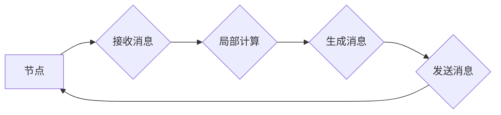

## Pregel原理与代码实例讲解

> 关键词：Pregel, 分布式图计算, 迭代算法, 数据并行,  图算法,  Hadoop

## 1. 背景介绍

随着大数据时代的到来，海量图数据的处理和分析成为越来越重要的研究方向。传统的图算法难以应对海量图数据的挑战，因此，分布式图计算框架应运而生。Pregel是Google提出的一个分布式图计算框架，它以其简洁的编程模型和高效的并行执行能力，在图计算领域获得了广泛的应用。

Pregel框架基于迭代算法，通过在每个节点上进行局部计算，并通过消息传递的方式进行数据交换，最终达到全局计算的目的。其核心思想是将图数据分布式存储在集群中的节点上，并通过迭代的方式，在每个节点上进行局部计算，并将计算结果通过消息传递的方式发送给其他节点，直到达到收敛为止。

## 2. 核心概念与联系

Pregel框架的核心概念包括：

* **图数据:** Pregel处理的图数据由节点和边组成，节点代表图中的实体，边代表实体之间的关系。
* **迭代:** Pregel算法是迭代式的，每个迭代周期，每个节点都会接收来自其他节点的消息，并根据这些消息进行局部计算，生成新的消息发送给其他节点。
* **消息传递:** Pregel通过消息传递的方式进行数据交换，每个节点可以向其相邻节点发送消息，并接收来自相邻节点的消息。
* **超级步:** Pregel算法的执行过程可以被划分为多个超级步，每个超级步包含多个迭代周期。

**Mermaid 流程图:**



## 3. 核心算法原理 & 具体操作步骤

### 3.1  算法原理概述

Pregel算法的核心思想是通过迭代的方式，在每个节点上进行局部计算，并通过消息传递的方式进行数据交换，最终达到全局计算的目的。

算法的基本步骤如下：

1. 将图数据分布式存储在集群中的节点上。
2. 每个节点初始化自己的状态。
3. 每个超级步包含多个迭代周期。
4. 在每个迭代周期中，每个节点接收来自其他节点的消息，并根据这些消息进行局部计算，生成新的消息发送给其他节点。
5. 所有节点完成消息传递后，进入下一个迭代周期。
6. 重复步骤4和5，直到算法收敛。

### 3.2  算法步骤详解

1. **初始化:** 将图数据分布式存储在集群中的节点上，每个节点初始化自己的状态。
2. **消息传递:** 每个节点向其相邻节点发送消息，消息内容包含节点的状态信息。
3. **局部计算:** 每个节点接收来自其他节点的消息，并根据这些消息进行局部计算，更新自己的状态。
4. **状态更新:** 每个节点将更新后的状态信息发送给其他节点。
5. **迭代:** 重复步骤2-4，直到算法收敛。

### 3.3  算法优缺点

**优点:**

* **简洁的编程模型:** Pregel提供了一个简单的编程模型，开发者可以专注于图算法的逻辑，而无需关心底层的分布式执行细节。
* **高效的并行执行能力:** Pregel利用了Hadoop的分布式计算框架，可以高效地并行执行图算法。
* **支持多种图算法:** Pregel可以支持多种图算法，例如PageRank、Shortest Path、Connected Components等。

**缺点:**

* **内存限制:** Pregel的内存限制相对较低，对于大型图数据，可能需要进行数据分片或其他优化策略。
* **通信开销:** Pregel的算法依赖于消息传递，对于大型图数据，消息传递的开销可能会比较高。

### 3.4  算法应用领域

Pregel算法在以下领域具有广泛的应用:

* **社交网络分析:** 分析社交网络结构，发现社区结构、推荐好友等。
* **推荐系统:** 基于用户行为数据，推荐用户感兴趣的内容。
* **搜索引擎:** 计算网页重要性，提高搜索结果的准确性。
* **生物信息学:** 分析蛋白质相互作用网络、基因调控网络等。

## 4. 数学模型和公式 & 详细讲解 & 举例说明

### 4.1  数学模型构建

Pregel算法可以抽象为一个状态转移模型，其中每个节点的状态是一个向量，每个迭代周期，节点的状态会根据其邻居节点的状态进行更新。

设图G = (V, E) 为一个有向图，V 为节点集合，E 为边集合。每个节点v ∈ V 都有一个状态向量 s(v) ∈ R^d，其中d 为状态向量的维度。

Pregel算法的迭代过程可以表示为：

s'(v) = f(s(v), {s(u) | (u, v) ∈ E})

其中：

* s'(v) 为节点v在下一个迭代周期后的状态向量。
* s(v) 为节点v在当前迭代周期中的状态向量。
* {s(u) | (u, v) ∈ E} 为节点v的所有邻居节点的状态向量集合。
* f 为状态更新函数，它接受节点v当前状态和邻居节点状态的集合作为输入，并返回节点v下一个迭代周期后的状态向量。

### 4.2  公式推导过程

状态更新函数f的具体形式取决于具体的图算法。例如，PageRank算法的状态更新函数为：

s'(v) = (1 - d) + d * Σ_{u ∈ N(v)} (s(u) / |N(u)|)

其中：

* d 为阻尼因子，通常取值为0.85。
* N(v) 为节点v的所有邻居节点集合。
* |N(v)| 为节点v的邻居节点数量。

### 4.3  案例分析与讲解

以PageRank算法为例，解释Pregel算法的数学模型和公式。

PageRank算法用于计算网页的重要性，其核心思想是，一个网页的重要性与其被其他网页链接的次数成正比。

在Pregel框架中，每个网页是一个节点，每个链接是一个边。PageRank算法的状态更新函数将每个网页的PageRank值更新为：

* (1 - d) + d * Σ_{u ∈ N(v)} (s(u) / |N(u)|)

其中：

* s(v) 为网页v的PageRank值。
* N(v) 为指向网页v的链接集合。
* |N(v)| 为指向网页v的链接数量。
* d 为阻尼因子，通常取值为0.85。

这个公式表示，网页v的PageRank值由两个部分组成：

* (1 - d)：表示网页v自身的重要性。
* d * Σ_{u ∈ N(v)} (s(u) / |N(u)|)：表示网页v被其他网页链接的次数，每个链接的权重为其来源网页的PageRank值除以其来源网页的链接数量。

通过迭代地更新每个网页的PageRank值，最终可以得到每个网页的重要性排序。

## 5. 项目实践：代码实例和详细解释说明

### 5.1  开发环境搭建

为了使用Pregel框架进行图计算，需要搭建一个Hadoop集群环境。Hadoop集群环境的搭建步骤可以参考Hadoop官方文档。

### 5.2  源代码详细实现

以下是一个简单的Pregel代码实例，用于计算图中每个节点的度数：

```java
import org.apache.hadoop.conf.Configuration;
import org.apache.hadoop.io.IntWritable;
import org.apache.hadoop.io.Text;
import org.apache.hadoop.mapreduce.Mapper;
import org.apache.hadoop.mapreduce.Reducer;
import org.apache.hadoop.mapreduce.lib.input.FileInputFormat;
import org.apache.hadoop.mapreduce.lib.output.FileOutputFormat;
import org.apache.hadoop.mapreduce.Job;

public class DegreeCounter {

    public static class Map extends Mapper<Object, Text, Text, IntWritable> {
        @Override
        public void map(Object key, Text value, Context context) throws IOException, InterruptedException {
            String[] parts = value.toString().split(",");
            String node = parts[0];
            int degree = Integer.parseInt(parts[1]);
            context.write(new Text(node), new IntWritable(degree));
        }
    }

    public static class Reduce extends Reducer<Text, IntWritable, Text, IntWritable> {
        @Override
        public void reduce(Text key, Iterable<IntWritable> values, Context context) throws IOException, InterruptedException {
            int sum = 0;
            for (IntWritable value : values) {
                sum += value.get();
            }
            context.write(key, new IntWritable(sum));
        }
    }

    public static void main(String[] args) throws Exception {
        Configuration conf = new Configuration();
        Job job = Job.getInstance(conf, "DegreeCounter");
        job.setJarByClass(DegreeCounter.class);
        job.setMapperClass(Map.class);
        job.setReducerClass(Reduce.class);
        job.setOutputKeyClass(Text.class);
        job.setOutputValueClass(IntWritable.class);
        FileInputFormat.addInputPath(job, new Path(args[0]));
        FileOutputFormat.setOutputPath(job, new Path(args[1]));
        System.exit(job.waitForCompletion(true)? 0 : 1);
    }
}
```

### 5.3  代码解读与分析

* **Map类:** 负责将图数据从输入文件读取，并将其转换为键值对格式，其中键为节点名称，值为节点度数。
* **Reduce类:** 负责对每个节点的度数进行聚合，并将最终结果输出到文件。
* **main方法:** 负责配置Hadoop作业，并提交作业到集群执行。

### 5.4  运行结果展示

运行该代码后，会在输出目录下生成一个包含每个节点度数的文本文件。

## 6. 实际应用场景

Pregel算法在实际应用场景中具有广泛的应用，例如：

* **社交网络分析:** 分析社交网络结构，发现社区结构、推荐好友等。
* **推荐系统:** 基于用户行为数据，推荐用户感兴趣的内容。
* **搜索引擎:** 计算网页重要性，提高搜索结果的准确性。
* **生物信息学:** 分析蛋白质相互作用网络、基因调控网络等。

### 6.4  未来应用展望

随着大数据时代的到来，Pregel算法在未来将有更广泛的应用前景，例如：

* **物联网数据分析:** 分析物联网设备之间的连接关系，发现异常行为等。
* **金融风险管理:** 分析金融交易数据，识别潜在的风险。
* **城市交通管理:** 分析城市交通流量，优化交通路线等。

## 7. 工具和资源推荐

### 7.1  学习资源推荐

* **Pregel官方文档:** https://developers.google.com/graph/pregel
* **Hadoop官方文档:** https://hadoop.apache.org/docs/current/
* **图计算书籍:** 《图算法导论》、《图论及其应用》

### 7.2  开发工具推荐

* **Hadoop:** https://hadoop.apache.org/
* **Apache Spark:** https://spark.apache.org/

### 7.3  相关论文推荐

* **Pregel: A System for Large-Scale Graph Processing**
* **GraphX: A Graph Processing Framework on Spark**

## 8. 总结：未来发展趋势与挑战

### 8.1  研究成果总结

Pregel算法为分布式图计算提供了简洁的编程模型和高效的并行执行能力，在图算法的实现和应用方面取得了显著的成果。

### 8.2  未来发展趋势

未来，Pregel算法的发展趋势包括：

* **支持更复杂的图算法:** 扩展Pregel算法的应用范围，支持更复杂的图算法，例如图神经网络、图数据库等。
* **提高算法效率:** 