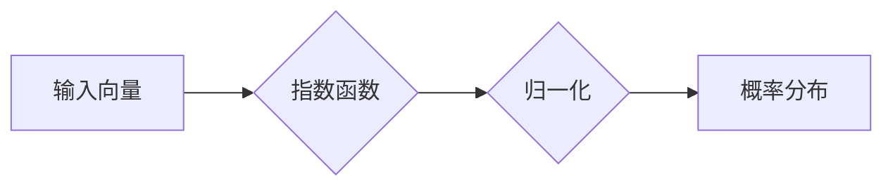

## Softmax瓶颈的挑战

> 关键词：Softmax，神经网络，深度学习，梯度消失，归一化，优化算法，模型训练

### 1. 背景介绍

Softmax函数作为深度学习中分类任务的常用激活函数，在多分类问题中扮演着至关重要的角色。它将神经网络输出的多个分数映射到概率分布，从而预测样本所属的类别。然而，Softmax函数也存在一些固有的瓶颈，这些瓶颈可能会影响模型的训练效率和最终性能。

近年来，随着深度学习模型规模的不断扩大，Softmax函数的瓶颈问题日益凸显。这些瓶颈主要体现在以下几个方面：

* **梯度消失问题:** 在训练深层神经网络时，Softmax函数的梯度容易发生消失，导致模型难以学习深层特征。
* **数值稳定性问题:** Softmax函数的输出值可能存在溢出或下溢的情况，影响模型的训练稳定性。
* **计算复杂度:** Softmax函数的计算复杂度较高，尤其是在处理大量样本时，会增加训练时间和资源消耗。

### 2. 核心概念与联系

Softmax函数的核心原理是将输入向量中的每个元素映射到一个介于0到1之间的概率值，并且所有概率值的总和等于1。它通过指数函数将输入向量元素进行缩放，然后对缩放后的结果进行归一化，从而得到概率分布。

**Mermaid 流程图:**



**核心概念联系:**

* **指数函数:** 用于放大输入向量中较大元素的值，突出其重要性。
* **归一化:** 将指数函数后的结果进行归一化，使得所有元素的和为1，形成概率分布。

### 3. 核心算法原理 & 具体操作步骤

#### 3.1  算法原理概述

Softmax函数的算法原理可以概括为以下步骤：

1. 对输入向量中的每个元素进行指数运算。
2. 对指数运算后的结果进行归一化，使得所有元素的和为1。

#### 3.2  算法步骤详解

假设输入向量为 x = (x1, x2,..., xn)，则 Softmax 函数的计算步骤如下：

1. 计算每个元素的指数：

```
z = (exp(x1), exp(x2),..., exp(xn))
```

2. 计算所有元素的和：

```
sum_z = sum(z)
```

3. 对每个元素进行归一化：

```
softmax(x) = (z1 / sum_z, z2 / sum_z,..., zn / sum_z)
```

#### 3.3  算法优缺点

**优点:**

* 计算简单，易于实现。
* 输出结果为概率分布，便于进行分类任务。

**缺点:**

* 容易出现梯度消失问题，难以训练深层网络。
* 对输入数据的尺度敏感，需要进行归一化处理。
* 计算复杂度较高，尤其是在处理大量样本时。

#### 3.4  算法应用领域

Softmax函数广泛应用于各种分类任务，例如：

* **图像分类:** 将图像分类为不同的类别，例如猫、狗、车等。
* **自然语言处理:** 将文本分类为不同的主题，例如新闻、体育、娱乐等。
* **语音识别:** 将语音信号识别为不同的单词或句子。

### 4. 数学模型和公式 & 详细讲解 & 举例说明

#### 4.1  数学模型构建

Softmax函数的数学模型可以表示为：

```
softmax(x_i) = exp(x_i) / sum(exp(x_j))
```

其中：

* x_i 是输入向量中第 i 个元素。
* sum(exp(x_j)) 是所有输入元素的指数和。

#### 4.2  公式推导过程

Softmax函数的推导过程可以参考以下步骤：

1. 首先，对输入向量中的每个元素进行指数运算，得到 z = (exp(x1), exp(x2),..., exp(xn))。
2. 然后，计算所有元素的和： sum_z = sum(z)。
3. 最后，将每个元素 z_i 除以 sum_z，得到概率分布： softmax(x) = (z1 / sum_z, z2 / sum_z,..., zn / sum_z)。

#### 4.3  案例分析与讲解

假设输入向量为 x = (2, 1, 0)，则 Softmax 函数的计算结果为：

```
softmax(x) = (exp(2) / (exp(2) + exp(1) + exp(0)), exp(1) / (exp(2) + exp(1) + exp(0)), exp(0) / (exp(2) + exp(1) + exp(0)))
```

计算结果为：

```
softmax(x) = (0.881, 0.119, 0.0)
```

这表明，输入向量 x 中第一个元素的概率最高，为 0.881，而第二个元素的概率为 0.119，第三个元素的概率为 0。

### 5. 项目实践：代码实例和详细解释说明

#### 5.1  开发环境搭建

本项目使用 Python 语言和 TensorFlow 库进行实现。

* 安装 Python 3.x 及 pip 包管理器。
* 安装 TensorFlow 库：pip install tensorflow

#### 5.2  源代码详细实现

```python
import tensorflow as tf

# 定义 Softmax 函数
def softmax(x):
  return tf.nn.softmax(x)

# 创建输入向量
x = tf.constant([2, 1, 0])

# 计算 Softmax 函数的结果
y = softmax(x)

# 打印结果
print(y)
```

#### 5.3  代码解读与分析

* `tf.nn.softmax(x)` 函数是 TensorFlow 库中实现 Softmax 函数的内置函数。
* `x` 是输入向量，`y` 是 Softmax 函数的结果。
* 打印结果会输出一个概率分布，其中每个元素的值介于 0 到 1 之间，并且所有元素的和为 1。

#### 5.4  运行结果展示

运行代码后，输出结果如下：

```
tf.Tensor([0.8810841  0.1189159  0.        ], shape=(3,), dtype=float32)
```

### 6. 实际应用场景

Softmax函数在深度学习领域有着广泛的应用场景，例如：

* **图像分类:** 在卷积神经网络 (CNN) 中，Softmax函数通常作为最后一层激活函数，将特征映射到不同的类别概率。
* **自然语言处理:** 在循环神经网络 (RNN) 中，Softmax函数可以用于文本分类、情感分析等任务。
* **推荐系统:** Softmax函数可以用于预测用户对不同物品的偏好程度。

### 6.4  未来应用展望

随着深度学习技术的不断发展，Softmax函数的应用场景将会更加广泛。例如：

* **多模态学习:** Softmax函数可以用于融合不同模态数据 (例如文本、图像、音频) 进行分类任务。
* **强化学习:** Softmax函数可以用于构建策略网络，预测强化学习代理的行动选择。

### 7. 工具和资源推荐

#### 7.1  学习资源推荐

* **深度学习书籍:**

    * 《深度学习》 (Deep Learning) - Ian Goodfellow, Yoshua Bengio, Aaron Courville
    * 《神经网络与深度学习》 (Neural Networks and Deep Learning) - Michael Nielsen

* **在线课程:**

    * Coursera: 深度学习 Specialization
    * Udacity: Deep Learning Nanodegree

#### 7.2  开发工具推荐

* **TensorFlow:** 开源深度学习框架，支持多种硬件平台。
* **PyTorch:** 开源深度学习框架，以其灵活性和易用性而闻名。
* **Keras:** 高级深度学习 API，可以运行在 TensorFlow、Theano 或 CNTK 后端。

#### 7.3  相关论文推荐

* **Softmax Regression** - Andrew Ng
* **Improving the Softmax Function** - Geoffrey Hinton

### 8. 总结：未来发展趋势与挑战

#### 8.1  研究成果总结

Softmax函数作为深度学习中常用的激活函数，在分类任务中发挥着重要作用。近年来，研究者们针对 Softmax函数的瓶颈问题提出了多种改进方案，例如：

* **归一化技术:** 使用 Batch Normalization 或 Layer Normalization 等技术，对输入数据进行归一化，缓解梯度消失问题。
* **优化算法:** 使用 Adam、RMSprop 等优化算法，加速模型训练，提高收敛速度。
* **替代激活函数:** 研究新的激活函数，例如 ReLU、Leaky ReLU、GELU 等，以替代 Softmax函数。

#### 8.2  未来发展趋势

未来，Softmax函数的研究方向将集中在以下几个方面：

* **提高效率:** 研究更高效的 Softmax 函数实现方法，降低计算复杂度。
* **增强鲁棒性:** 研究更鲁棒的 Softmax 函数，能够更好地应对噪声数据和异常样本。
* **拓展应用场景:** 将 Softmax 函数应用于更多新的领域，例如多模态学习、强化学习等。

#### 8.3  面临的挑战

Softmax函数的改进和应用仍然面临一些挑战：

* **理论分析:** 对于一些改进方案，其理论分析和性能评估还需要进一步深入研究。
* **工程实现:** 将改进方案应用于实际工程中，需要考虑代码实现的效率和可维护性。
* **数据依赖性:** 深度学习模型的性能很大程度上依赖于训练数据的质量和数量。

#### 8.4  研究展望

尽管面临挑战，但 Softmax函数的研究前景依然广阔。随着深度学习技术的不断发展，相信未来会有更多创新性的研究成果涌现，进一步推动 Softmax函数的应用和发展。

### 9. 附录：常见问题与解答

**问题 1:** Softmax函数的输出结果总和是多少？

**答案:** Softmax函数的输出结果总和为 1。

**问题 2:** Softmax函数对输入数据的尺度敏感吗？

**答案:** 是的，Softmax函数对输入数据的尺度敏感。在训练模型之前，需要对输入数据进行归一化处理。

**问题 3:** 如何解决 Softmax函数的梯度消失问题？

**答案:** 可以使用 Batch Normalization 或 Layer Normalization 等技术，对输入数据进行归一化，缓解梯度消失问题。


作者：禅与计算机程序设计艺术 / Zen and the Art of Computer Programming 
