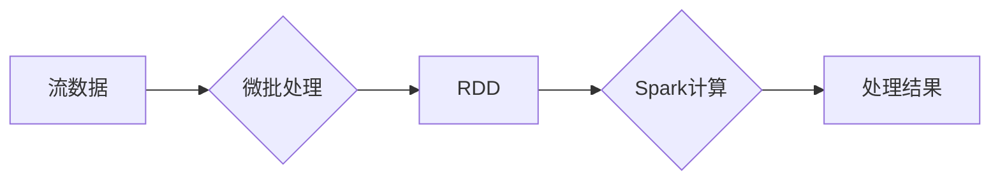

## Spark Streaming实时流处理原理与代码实例讲解

> 关键词：Spark Streaming, 实时流处理, 微批处理, DStream, RDD, Resilient Distributed Datasets, 流数据处理, 代码实例

## 1. 背景介绍

随着互联网和移动技术的飞速发展，海量数据以实时流的形式不断涌现。如何高效地处理这些实时数据，从中挖掘价值，成为了一个重要的技术挑战。传统的批处理系统难以满足实时数据处理的需求，因此，实时流处理技术应运而生。

Spark Streaming 是 Apache Spark 的一个扩展模块，专门用于处理实时流数据。它基于微批处理的思想，将流数据划分为小的批次，并使用 Spark 的强大的并行计算能力进行处理。Spark Streaming 的高性能、易用性和灵活性使其成为实时流处理的首选工具之一。

## 2. 核心概念与联系

### 2.1  核心概念

* **流数据:**  指以连续、有序的方式产生的数据流，例如传感器数据、社交媒体数据、网站访问日志等。
* **微批处理:** 将流数据划分为小的批次，每个批次包含一段时间内的数据，然后对每个批次进行离线式处理。
* **DStream:**  Spark Streaming 的核心数据结构，表示一个连续的数据流，它是一个无限的数据序列，可以进行各种操作，例如转换、聚合、过滤等。
* **RDD:**  Spark 的基本数据结构，表示一个分布式数据集，每个批次的数据都存储为一个 RDD。

### 2.2  架构图



## 3. 核心算法原理 & 具体操作步骤

### 3.1  算法原理概述

Spark Streaming 的核心算法是微批处理。它将流数据划分为小的批次，每个批次的大小和时间间隔可以根据实际需求进行配置。每个批次的数据都存储为一个 RDD，然后使用 Spark 的并行计算能力进行处理。

### 3.2  算法步骤详解

1. **数据接收:** Spark Streaming 从各种数据源接收流数据，例如 Kafka、Flume、TCP Socket 等。
2. **数据切片:**  接收到的数据流被切分为小的批次，每个批次包含一段时间内的数据。
3. **数据转换:**  每个批次的数据都存储为一个 RDD，然后可以使用 Spark 的各种操作进行转换，例如过滤、映射、聚合等。
4. **数据处理:**  转换后的数据被提交到 Spark 的计算引擎进行处理，并生成处理结果。
5. **结果输出:**  处理结果可以输出到各种目标系统，例如 HDFS、数据库、文件系统等。

### 3.3  算法优缺点

**优点:**

* **高性能:**  Spark 的并行计算能力可以有效提高实时数据处理速度。
* **易用性:**  Spark Streaming 提供了简洁的 API，方便开发者进行开发。
* **灵活性:**  Spark Streaming 支持多种数据源和输出目标，可以灵活地适应不同的应用场景。

**缺点:**

* **延迟:**  微批处理的本质会导致一定的延迟，无法满足一些对延迟要求极高的应用场景。
* **状态管理:**  Spark Streaming 的状态管理机制相对复杂，需要开发者进行 careful 设计。

### 3.4  算法应用领域

* **实时数据分析:**  例如社交媒体分析、网站流量分析、用户行为分析等。
* **实时监控:**  例如系统监控、网络监控、设备监控等。
* **实时推荐:**  例如商品推荐、内容推荐、个性化推荐等。
* **实时机器学习:**  例如实时预测、实时分类、实时异常检测等。

## 4. 数学模型和公式 & 详细讲解 & 举例说明

### 4.1  数学模型构建

Spark Streaming 的微批处理模型可以抽象为一个时间序列模型。假设流数据为一个无限序列 {x1, x2, x3,...}，其中 xi 表示时间 t i 处的样本数据。

微批处理将这个时间序列划分为若干个批次，每个批次包含时间区间 [ti, ti+1] 范围内的样本数据。

### 4.2  公式推导过程

假设每个批次的大小为 w，则每个批次包含 w 个样本数据。

* **批次时间间隔:** Δt = 1/f，其中 f 是批次频率。
* **批次数据:**  Bi = {xi, xi+1,..., xi+w-1}，其中 i = 0, 1, 2,...

### 4.3  案例分析与讲解

例如，假设我们想要对流数据进行滑动窗口聚合操作，计算每个时间窗口内的平均值。

* **滑动窗口大小:**  w = 5
* **批次频率:**  f = 10

则每个批次包含 5 个样本数据，时间间隔为 0.1 秒。

对于每个批次 Bi，我们可以计算其平均值：

```
avg(Bi) = (sum(Bi)) / w
```

然后，我们可以将每个批次内的平均值作为新的流数据，进行后续处理。

## 5. 项目实践：代码实例和详细解释说明

### 5.1  开发环境搭建

* **Java Development Kit (JDK):**  安装 Java 开发环境。
* **Apache Spark:**  下载并安装 Apache Spark。
* **IDE:**  选择一个适合的 IDE，例如 Eclipse、IntelliJ IDEA 等。

### 5.2  源代码详细实现

```java
import org.apache.spark.SparkConf;
import org.apache.spark.streaming.Durations;
import org.apache.spark.streaming.api.java.JavaDStream;
import org.apache.spark.streaming.api.java.JavaPairDStream;
import org.apache.spark.streaming.api.java.JavaStreamingContext;

import java.util.Arrays;

public class SparkStreamingWordCount {

    public static void main(String[] args) {

        // 配置 Spark 环境
        SparkConf conf = new SparkConf().setAppName("SparkStreamingWordCount");
        JavaStreamingContext jssc = new JavaStreamingContext(conf, Durations.seconds(2));

        // 从网络流数据源接收数据
        JavaDStream<String> lines = jssc.socketTextStream("localhost", 9999);

        // 将数据转换为单词
        JavaDStream<String> words = lines.flatMap(s -> Arrays.asList(s.split(" ")).iterator());

        // 对单词进行计数
        JavaPairDStream<String, Integer> wordCounts = words.mapToPair(s -> new Tuple2<>(s, 1)).reduceByKey((a, b) -> a + b);

        // 将结果输出到控制台
        wordCounts.print();

        // 启动 Spark Streaming 应用程序
        jssc.start();
        jssc.awaitTermination();
    }
}
```

### 5.3  代码解读与分析

* **配置 Spark 环境:**  使用 `SparkConf` 配置 Spark 环境，并创建 `JavaStreamingContext` 对象。
* **接收数据:**  使用 `socketTextStream` 方法从网络流数据源接收数据。
* **转换数据:**  使用 `flatMap` 方法将数据转换为单词。
* **计数:**  使用 `mapToPair` 和 `reduceByKey` 方法对单词进行计数。
* **输出结果:**  使用 `print` 方法将结果输出到控制台。

### 5.4  运行结果展示

当运行代码后，程序会监听端口 9999 上的网络流数据，并将接收到的数据进行单词计数，并将结果实时输出到控制台。

## 6. 实际应用场景

Spark Streaming 在各种实时数据处理场景中都有广泛的应用，例如：

* **社交媒体分析:**  实时监控社交媒体平台上的话题趋势、用户情绪等。
* **网站流量分析:**  实时分析网站访问流量、用户行为等，帮助优化网站性能。
* **金融交易监控:**  实时监控金融交易数据，检测异常交易行为。
* **工业设备监控:**  实时监控工业设备运行状态，预警设备故障。

### 6.4  未来应用展望

随着物联网、大数据、人工智能等技术的快速发展，Spark Streaming 的应用场景将会更加广泛。例如：

* **实时机器学习:**  使用 Spark Streaming 进行实时数据流的机器学习，例如实时预测、实时分类等。
* **实时推荐系统:**  根据用户实时行为，进行个性化推荐。
* **实时安全监控:**  使用 Spark Streaming 进行实时安全数据分析，检测网络攻击、恶意行为等。

## 7. 工具和资源推荐

### 7.1  学习资源推荐

* **Spark Streaming 官方文档:**  https://spark.apache.org/docs/latest/streaming-programming-guide.html
* **Spark Streaming 入门教程:**  https://spark.apache.org/docs/latest/streaming-programming-guide.html#quick-start
* **Spark Streaming 实战案例:**  https://github.com/apache/spark/tree/master/examples/src/main/java/org/apache/spark/examples/streaming

### 7.2  开发工具推荐

* **Eclipse:**  https://www.eclipse.org/
* **IntelliJ IDEA:**  https://www.jetbrains.com/idea/
* **Spark Shell:**  https://spark.apache.org/docs/latest/api/java/index.html

### 7.3  相关论文推荐

* **Spark Streaming: Leveraging the Power of Apache Spark for Real-Time Data Processing:**  https://dl.acm.org/doi/10.1145/2809206.2809219

## 8. 总结：未来发展趋势与挑战

### 8.1  研究成果总结

Spark Streaming 作为一种高效的实时流处理框架，在数据分析、监控、推荐等领域取得了显著的成果。

### 8.2  未来发展趋势

* **更低延迟:**  开发更低延迟的实时流处理算法和技术。
* **更强大的状态管理:**  提供更强大的状态管理机制，支持更复杂的实时应用场景。
* **更易于使用:**  提供更易于使用的 API 和工具，降低开发门槛。
* **更广泛的应用:**  将 Spark Streaming 应用到更多领域，例如实时机器学习、实时安全监控等。

### 8.3  面临的挑战

* **数据规模和速度:**  随着数据规模和速度的不断增长，实时流处理面临着更大的挑战。
* **数据复杂性:**  实时数据往往具有复杂性，例如结构化、半结构化、非结构化等，需要开发更灵活的数据处理机制。
* **系统可靠性:**  实时流处理系统需要保证高可靠性，避免数据丢失和系统故障。

### 8.4  研究展望

未来，实时流处理技术将会继续发展，并与其他新兴技术融合，例如人工智能、云计算等，为我们提供更强大的数据处理能力和应用场景。

## 9. 附录：常见问题与解答

* **Spark Streaming 和 Kafka 的关系:**  Spark Streaming 可以与 Kafka 等消息队列系统集成，接收实时数据流。
* **Spark Streaming 的延迟:**  Spark Streaming 的延迟取决于批次频率和数据处理时间。
* **Spark Streaming 的状态管理:**  Spark Streaming 提供了状态管理机制，可以保存应用程序的状态，以便在批次之间进行数据处理。


作者：禅与计算机程序设计艺术 / Zen and the Art of Computer Programming 
