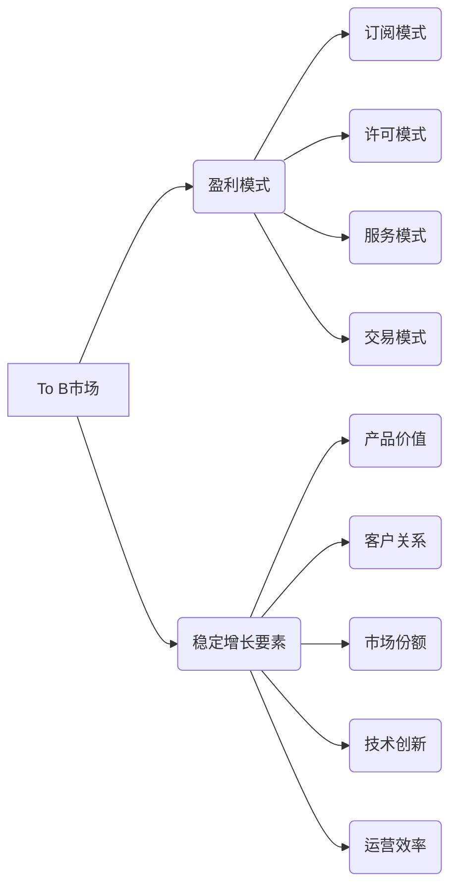

## to B市场的长期盈利与稳定

> 关键词：To B市场、长期盈利、稳定增长、商业模式、技术创新、客户关系管理、数据驱动、市场分析、风险管理

## 1. 背景介绍

To B市场，即面向企业的市场，与面向消费者的 To C 市场相比，具有其独特的特点和挑战。To B市场通常涉及更大规模的交易、更长的销售周期、更复杂的决策流程以及更强的客户关系依赖性。 

在激烈的市场竞争中，To B企业要想实现长期盈利和稳定增长，需要制定合理的商业模式、持续进行技术创新、建立良好的客户关系管理体系、充分利用数据驱动决策、进行深入的市场分析和有效的风险管理。

## 2. 核心概念与联系

**2.1  To B市场盈利模式**

To B市场的盈利模式主要包括以下几种：

* **订阅模式:**  用户按月或按年付费使用软件或服务，例如 SaaS（软件即服务）模式。
* **许可模式:**  用户购买软件的使用许可证，例如企业级办公软件。
* **服务模式:**  企业提供咨询、培训、技术支持等服务，例如IT服务公司。
* **交易模式:**  企业通过销售产品或服务获得利润，例如工业设备制造商。

**2.2  To B市场稳定增长要素**

To B市场实现稳定增长的关键要素包括：

* **产品价值:**  提供具有竞争力的产品或服务，能够解决客户的实际痛点，并带来显著的价值提升。
* **客户关系:**  建立长期稳定的客户关系，通过优质的服务和支持，提升客户满意度和忠诚度。
* **市场份额:**  不断拓展市场份额，增加用户数量和收入规模。
* **技术创新:**  持续进行技术创新，开发新产品和新功能，保持市场竞争力。
* **运营效率:**  优化运营流程，降低成本，提高效率。

**2.3  核心概念关系图**



## 3. 核心算法原理 & 具体操作步骤

**3.1  算法原理概述**

To B市场长期盈利和稳定增长的核心算法可以概括为一个循环模型：

1. **市场分析:**  深入了解目标市场需求、竞争格局和发展趋势。
2. **产品开发:**  根据市场分析结果，开发具有竞争力的产品或服务。
3. **客户获取:**  通过有效的营销和销售策略，获取目标客户。
4. **客户关系管理:**  建立和维护良好的客户关系，提升客户满意度和忠诚度。
5. **数据分析:**  收集和分析客户数据，洞察客户行为和需求，优化产品和服务。
6. **持续改进:**  根据数据分析结果和市场反馈，不断改进产品、服务和运营流程。

**3.2  算法步骤详解**

1. **市场分析:**  
    * **市场调研:**  通过问卷调查、访谈、市场数据分析等方式，了解目标市场的需求、痛点、竞争对手情况等。
    * **趋势分析:**  关注行业发展趋势、技术变革、政策变化等，预测未来市场变化。
    * **客户画像:**  构建目标客户画像，了解客户的特征、需求、行为模式等。

2. **产品开发:**  
    * **需求定义:**  根据市场分析结果，明确产品的功能需求和目标用户。
    * **产品设计:**  设计产品界面、功能模块、用户体验等。
    * **技术开发:**  开发产品核心技术、平台架构、数据处理等。
    * **产品测试:**  进行产品测试，确保产品质量和稳定性。

3. **客户获取:**  
    * **市场推广:**  通过线上线下渠道进行产品推广，提升品牌知名度和市场影响力。
    * **销售策略:**  制定有效的销售策略，精准定位目标客户，进行销售推介和谈判。
    * **渠道建设:**  建立销售渠道网络，拓展销售范围和市场覆盖率。

4. **客户关系管理:**  
    * **客户服务:**  提供优质的客户服务，及时解决客户问题，提升客户满意度。
    * **客户维护:**  定期与客户沟通，了解客户需求，提供个性化服务，提升客户忠诚度。
    * **客户关系平台:**  建设客户关系管理平台，整合客户数据，提升客户服务效率。

5. **数据分析:**  
    * **数据收集:**  收集客户行为数据、产品使用数据、市场数据等。
    * **数据分析:**  利用数据分析工具，分析客户行为、产品使用情况、市场趋势等。
    * **数据洞察:**  从数据中洞察客户需求、产品改进方向、市场机会等。

6. **持续改进:**  
    * **产品迭代:**  根据数据分析结果和市场反馈，不断迭代产品功能，提升产品价值。
    * **运营优化:**  优化运营流程，降低成本，提高效率。
    * **市场拓展:**  根据市场分析结果，拓展新的市场领域，增加收入来源。

**3.3  算法优缺点**

* **优点:**  
    * 循环模型能够保证持续的改进和发展。
    * 数据驱动决策能够提高决策的准确性和有效性。
    * 客户关系管理能够提升客户满意度和忠诚度。
* **缺点:**  
    * 需要投入大量的人力、物力和时间进行市场分析、产品开发、客户获取和数据分析。
    * 需要不断学习和适应市场变化，才能保持竞争力。

**3.4  算法应用领域**

该算法适用于所有To B市场企业，包括软件公司、IT服务公司、制造业企业、金融服务公司等。

## 4. 数学模型和公式 & 详细讲解 & 举例说明

**4.1  数学模型构建**

To B市场长期盈利和稳定增长的数学模型可以简化为以下公式：

```latex
Profit = Revenue - Cost
```

其中：

* **Profit** 代表企业利润
* **Revenue** 代表企业收入
* **Cost** 代表企业成本

**4.2  公式推导过程**

该公式的推导过程非常简单，是基本的会计原理。企业盈利等于收入减去成本。

**4.3  案例分析与讲解**

假设一家 SaaS 公司提供云计算服务，其月收入为 100 万美元，月成本为 60 万美元，则其月利润为 40 万美元。

```latex
Profit = 1,000,000 - 600,000 = 400,000
```

## 5. 项目实践：代码实例和详细解释说明

**5.1  开发环境搭建**

To B市场项目开发环境搭建需要根据具体项目需求进行配置，一般包括以下几个方面：

* **操作系统:**  Linux、Windows 等
* **编程语言:**  Python、Java、C++ 等
* **数据库:**  MySQL、PostgreSQL、MongoDB 等
* **云平台:**  AWS、Azure、GCP 等

**5.2  源代码详细实现**

由于 To B市场项目类型多样，代码实现方式也各不相同，这里只提供一个简单的 Python 代码示例，用于演示数据分析功能：

```python
import pandas as pd

# 读取数据
data = pd.read_csv("customer_data.csv")

# 计算客户平均消费金额
average_spending = data["purchase_amount"].mean()

# 打印结果
print("客户平均消费金额:", average_spending)
```

**5.3  代码解读与分析**

这段代码使用 Pandas 库读取客户数据，并计算客户平均消费金额。

* `pd.read_csv("customer_data.csv")`: 读取名为 "customer_data.csv" 的 CSV 文件，并将数据存储在 DataFrame 对象中。
* `data["purchase_amount"].mean()`: 计算 DataFrame 中 "purchase_amount" 列的平均值，即客户平均消费金额。
* `print("客户平均消费金额:", average_spending)`: 打印客户平均消费金额。

**5.4  运行结果展示**

运行这段代码后，会输出客户平均消费金额的值。

## 6. 实际应用场景

**6.1  客户关系管理**

To B市场企业可以通过 CRM 系统收集和分析客户数据，了解客户需求、行为模式和满意度，从而提供更精准、个性化的服务，提升客户忠诚度。

**6.2  市场营销**

To B市场企业可以通过数据分析了解目标客户特征和需求，制定更有效的营销策略，精准定位目标客户，提高营销效果。

**6.3  产品开发**

To B市场企业可以通过数据分析了解客户使用产品的情况，发现产品痛点和改进方向，从而开发更符合客户需求的产品。

**6.4  未来应用展望**

随着人工智能、大数据等技术的不断发展，To B市场将更加注重数据驱动决策、智能化运营和个性化服务。

## 7. 工具和资源推荐

**7.1  学习资源推荐**

* **书籍:**  《To B市场营销》、《企业级软件开发》、《数据驱动决策》
* **在线课程:**  Coursera、Udemy、edX 等平台提供 To B市场营销、数据分析、软件开发等方面的在线课程。
* **博客和论坛:**  关注 To B市场相关的博客和论坛，了解行业动态和最佳实践。

**7.2  开发工具推荐**

* **CRM 系统:**  Salesforce、Microsoft Dynamics 365、Zoho CRM 等
* **数据分析工具:**  Tableau、Power BI、Python 等
* **开发平台:**  AWS、Azure、GCP 等

**7.3  相关论文推荐**

* **To B市场营销:**  "The Impact of Digital Marketing on B2B Sales Performance"
* **数据驱动决策:**  "Data-Driven Decision Making in Business"
* **人工智能在 To B 市场中的应用:**  "Artificial Intelligence in Business: Applications and Opportunities"

## 8. 总结：未来发展趋势与挑战

**8.1  研究成果总结**

To B市场长期盈利和稳定增长需要企业不断进行市场分析、产品开发、客户获取、客户关系管理和数据分析，并根据市场变化和客户需求进行持续改进。

**8.2  未来发展趋势**

* **数据驱动决策:**  To B市场企业将更加注重数据分析，利用数据洞察客户需求、优化运营流程和制定战略决策。
* **智能化运营:**  人工智能、机器学习等技术将被广泛应用于 To B市场，实现自动化、智能化运营，提高效率和降低成本。
* **个性化服务:**  To B市场企业将更加注重客户体验，提供个性化服务，提升客户满意度和忠诚度。

**8.3  面临的挑战**

* **市场竞争激烈:**  To B市场竞争日益激烈，企业需要不断创新，才能保持竞争力。
* **技术变革快速:**  To B市场技术发展迅速，企业需要不断学习和适应新技术，才能跟上市场步伐。
* **数据安全和隐私保护:**  To B市场企业收集和使用大量客户数据，需要加强数据安全和隐私保护措施。

**8.4  研究展望**

未来研究方向包括：

* **更精准的数据分析方法:**  开发更精准的数据分析方法，能够更深入地洞察客户需求和市场趋势。
* **更智能化的运营模式:**  研究更智能化的运营模式，利用人工智能和机器学习技术，实现自动化、智能化运营。
* **更有效的客户关系管理策略:**  研究更有效的客户关系管理策略，提升客户满意度和忠诚度。


## 9. 附录：常见问题与解答

**9.1  如何制定 To B市场的盈利模式？**

To B市场的盈利模式需要根据企业的产品、服务和目标客户进行选择。常见的盈利模式包括订阅模式、许可模式、服务模式和交易