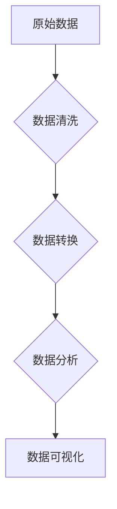

## 【AI大数据计算原理与代码实例讲解】DataFrame

> 关键词：DataFrame, Pandas, 大数据处理, 数据分析, Python, 数据结构, 数据科学

## 1. 背景介绍

在当今数据爆炸的时代，海量数据的处理和分析已成为各行各业的核心竞争力。Python作为一种功能强大、易于学习的编程语言，在数据科学领域占据着举足轻重的地位。其中，Pandas库作为Python数据分析领域的利器，提供了高效的数据结构和操作工具，帮助我们轻松应对数据处理的挑战。

DataFrame是Pandas库的核心数据结构之一，它类似于Excel表格或SQL数据库中的表，以行和列的形式组织数据，并提供丰富的操作方法，能够高效地处理、清洗、转换和分析数据。

## 2. 核心概念与联系

DataFrame的核心概念是**标签化数据**，它由**行索引**和**列索引**组成，每个元素都有唯一的标识。

**数据流向**



**DataFrame与其他数据结构的关系**

* **Series:** DataFrame的组成部分，类似于一维数组，具有标签索引。
* **NumPy数组:** DataFrame底层数据存储方式，提供高效的数值计算能力。
* **字典:** DataFrame可以从字典中创建，方便地将数据结构转换为DataFrame。

## 3. 核心算法原理 & 具体操作步骤

### 3.1  算法原理概述

DataFrame的算法原理主要基于**数据结构的组织和操作**，以及**高效的数值计算**。

* **数据结构组织:** DataFrame使用**字典**和**NumPy数组**来存储数据，行索引和列索引分别对应字典的键和值。
* **数据操作:** Pandas库提供了丰富的DataFrame操作方法，例如**筛选、排序、聚合、合并**等，这些方法基于**数据结构的特性**和**高效的算法实现**。
* **数值计算:** DataFrame底层数据使用**NumPy数组**存储，可以利用NumPy库的**高效数值计算能力**进行数据处理。

### 3.2  算法步骤详解

1. **创建DataFrame:** 使用字典、列表、NumPy数组等方式创建DataFrame。
2. **数据访问:** 使用行索引和列索引访问DataFrame中的数据。
3. **数据筛选:** 使用条件语句筛选DataFrame中的数据。
4. **数据排序:** 根据指定列排序DataFrame中的数据。
5. **数据聚合:** 对DataFrame中的数据进行聚合操作，例如求平均值、最大值、最小值等。
6. **数据合并:** 将多个DataFrame合并成一个新的DataFrame。
7. **数据转换:** 对DataFrame中的数据进行转换操作，例如类型转换、值替换等。
8. **数据可视化:** 使用Matplotlib、Seaborn等库将DataFrame中的数据可视化。

### 3.3  算法优缺点

**优点:**

* **数据组织高效:** 标签化数据结构方便数据访问和操作。
* **操作丰富:** Pandas库提供了丰富的DataFrame操作方法，满足各种数据处理需求。
* **性能优异:** 基于NumPy数组的底层存储和高效算法实现，数据处理速度快。
* **易于使用:** Python语法简洁易懂，Pandas库操作简单直观。

**缺点:**

* **内存占用:** 处理大型DataFrame时，内存占用可能会比较大。
* **数据类型限制:** DataFrame主要支持数值型和字符串型数据，处理其他类型数据可能需要额外转换。

### 3.4  算法应用领域

DataFrame广泛应用于数据科学、机器学习、金融分析、生物信息学等领域，例如：

* **数据清洗:** 识别和处理数据中的缺失值、异常值等问题。
* **数据转换:** 将数据格式转换为适合模型输入的格式。
* **特征工程:** 从原始数据中提取特征，用于机器学习模型训练。
* **数据分析:** 对数据进行统计分析、趋势分析等。
* **数据可视化:** 将数据可视化，帮助理解数据规律。

## 4. 数学模型和公式 & 详细讲解 & 举例说明

### 4.1  数学模型构建

DataFrame可以看作是一个**二维矩阵**，其中每一行代表一个数据样本，每一列代表一个特征。

**数学模型:**

```
DataFrame = {
    row_index: {
        column_index1: value1,
        column_index2: value2,
       ...
    },
    row_index2: {
        column_index1: value1,
        column_index2: value2,
       ...
    },
   ...
}
```

### 4.2  公式推导过程

DataFrame的许多操作都可以用数学公式来表示，例如：

* **数据筛选:** 使用条件语句筛选DataFrame中的数据，可以表示为逻辑运算符的应用。
* **数据排序:** 根据指定列排序DataFrame中的数据，可以表示为比较运算符和排序算法的应用。
* **数据聚合:** 对DataFrame中的数据进行聚合操作，例如求平均值、最大值、最小值等，可以表示为相应的统计函数的应用。

### 4.3  案例分析与讲解

**案例:**

假设有一个DataFrame包含学生成绩数据，其中包含姓名、语文成绩、数学成绩和英语成绩等列。

**问题:** 计算每个学生的平均成绩。

**解决方案:**

可以使用Pandas库的`mean()`方法对DataFrame中的成绩列进行平均计算。

```python
import pandas as pd

# 创建DataFrame
data = {'姓名': ['张三', '李四', '王五'],
        '语文': [80, 90, 75],
        '数学': [90, 85, 80],
        '英语': [75, 80, 90]}
df = pd.DataFrame(data)

# 计算平均成绩
df['平均成绩'] = df[['语文', '数学', '英语']].mean(axis=1)

# 打印结果
print(df)
```

**输出:**

```
   姓名  语文  数学  英语  平均成绩
0  张三    80    90    75        81.666667
1  李四    90    85    80        85.000000
2  王五    75    80    90        81.666667
```

## 5. 项目实践：代码实例和详细解释说明

### 5.1  开发环境搭建

* **Python:** 安装Python3.x版本。
* **Pandas:** 使用pip安装Pandas库：`pip install pandas`

### 5.2  源代码详细实现

```python
import pandas as pd

# 创建DataFrame
data = {'姓名': ['张三', '李四', '王五'],
        '语文': [80, 90, 75],
        '数学': [90, 85, 80],
        '英语': [75, 80, 90]}
df = pd.DataFrame(data)

# 数据筛选
# 选择语文成绩大于80的学生
high_chinese_df = df[df['语文'] > 80]

# 数据排序
# 根据数学成绩降序排序
sorted_df = df.sort_values(by='数学', ascending=False)

# 数据聚合
# 计算每个学生的平均成绩
average_df = df.groupby('姓名')['语文', '数学', '英语'].mean()

# 数据转换
# 将语文成绩转换为百分制
df['语文百分制'] = df['语文'] / 100

# 数据可视化
import matplotlib.pyplot as plt

# 绘制柱状图
plt.bar(df['姓名'], df['语文'])
plt.xlabel('姓名')
plt.ylabel('语文成绩')
plt.title('学生语文成绩')
plt.show()
```

### 5.3  代码解读与分析

* **创建DataFrame:** 使用字典创建DataFrame，并使用`pd.DataFrame()`函数将其转换为DataFrame对象。
* **数据筛选:** 使用条件语句`df['语文'] > 80`筛选DataFrame中的数据，并使用布尔索引`df[条件语句]`获取筛选后的数据。
* **数据排序:** 使用`df.sort_values()`方法根据指定列排序DataFrame，`by`参数指定排序列，`ascending`参数指定排序方向。
* **数据聚合:** 使用`df.groupby()`方法对DataFrame进行分组，`by`参数指定分组列，然后使用`mean()`方法计算每个组的平均值。
* **数据转换:** 使用`df['语文'] / 100`将语文成绩转换为百分制，并使用新的列名`'语文百分制'`存储转换后的数据。
* **数据可视化:** 使用Matplotlib库绘制柱状图，展示学生语文成绩。

### 5.4  运行结果展示

运行代码后，将生成以下结果：

* **数据筛选结果:** 显示语文成绩大于80的学生信息。
* **数据排序结果:** 显示数学成绩降序排列的学生信息。
* **数据聚合结果:** 显示每个学生的平均成绩。
* **数据转换结果:** DataFrame中添加了新的列`'语文百分制'`,存储了语文成绩的百分制值。
* **数据可视化结果:** 显示一个柱状图，横坐标为学生姓名，纵坐标为语文成绩。

## 6. 实际应用场景

DataFrame在数据科学、机器学习、金融分析、生物信息学等领域有着广泛的应用场景。

### 6.1  数据科学

* **数据清洗:** 使用DataFrame的筛选、替换、删除等操作，清理数据中的缺失值、异常值等问题。
* **数据转换:** 将数据格式转换为适合模型输入的格式，例如将文本数据转换为数值型数据。
* **特征工程:** 从原始数据中提取特征，例如计算年龄、收入等特征。
* **数据分析:** 对数据进行统计分析、趋势分析等，例如计算平均值、标准差、相关系数等。

### 6.2  机器学习

* **数据预处理:** 使用DataFrame对机器学习模型输入数据进行预处理，例如数据清洗、数据转换、特征工程等。
* **模型训练:** 使用DataFrame作为机器学习模型的训练数据。
* **模型评估:** 使用DataFrame评估机器学习模型的性能。

### 6.3  金融分析

* **股票数据分析:** 使用DataFrame分析股票价格、交易量等数据，预测股票价格走势。
* **风险管理:** 使用DataFrame分析金融风险，例如信用风险、市场风险等。

### 6.4  生物信息学

* **基因组数据分析:** 使用DataFrame分析基因组序列数据，例如基因表达量、突变频率等。
* **蛋白质结构预测:** 使用DataFrame分析蛋白质结构数据，预测蛋白质的结构和功能。

## 7. 工具和资源推荐

### 7.1  学习资源推荐

* **Pandas官方文档:** https://pandas.pydata.org/docs/
* **DataCamp Pandas课程:** https://www.datacamp.com/courses/data-manipulation-with-pandas
* **Kaggle学习资源:** https://www.kaggle.com/learn/pandas

### 7.2  开发工具推荐

* **Jupyter Notebook:** https://jupyter.org/
* **VS Code:** https://code.visualstudio.com/

### 7.3  相关论文推荐

* **Python Data Analysis with Pandas:** https://wesmckinney.com/book/
* **Pandas Cookbook:** https://www.oreilly.com/library/view/pandas-cookbook/9781491957662/

## 8. 总结：未来发展趋势与挑战

### 8.1  研究成果总结

DataFrame作为Pandas库的核心数据结构，在数据处理、分析和可视化方面取得了显著的成果，为数据科学领域的发展做出了重要贡献。

### 8.2  