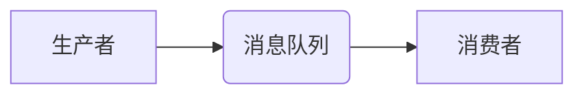

## 【AI大数据计算原理与代码实例讲解】消息队列

> 关键词：消息队列、异步通信、分布式系统、消息中间件、RabbitMQ、Kafka、性能优化、可靠性

## 1. 背景介绍

在当今以大数据和云计算为核心的技术时代，应用程序的规模和复杂度不断增长。传统的同步通信模式在处理海量数据和高并发请求时显得捉襟见肘，难以满足现代应用的需求。消息队列作为一种异步通信机制，逐渐成为分布式系统中不可或缺的组件。

消息队列是一种用于实现应用程序之间异步通信的软件系统。它提供了一种可靠、高效、可扩展的方式，使应用程序能够将消息发送到一个中间存储空间，而接收方可以从该空间中获取消息。这种异步通信模式能够有效地解耦应用程序，提高系统的容错性和可扩展性。

## 2. 核心概念与联系

### 2.1 消息队列的基本概念

消息队列的核心概念包括：

* **生产者 (Producer):** 向消息队列发送消息的应用程序。
* **消费者 (Consumer):** 从消息队列接收消息的应用程序。
* **消息 (Message):**  包含应用程序想要传递的信息的数据包。
* **消息队列 (Queue):**  用于存储消息的中间存储空间。

### 2.2 消息队列的架构

消息队列通常由以下几个主要组件组成：

* **消息生产者:**  负责将消息发送到消息队列。
* **消息消费者:**  负责从消息队列接收消息并进行处理。
* **消息代理:**  负责管理消息队列，包括消息的存储、路由和转发等功能。
* **消息持久化:**  负责将消息持久化到磁盘，确保消息不会丢失。

**消息队列架构流程图:**



### 2.3 消息队列的类型

常见的消息队列类型包括：

* **基于内存的消息队列:**  例如 Redis、ActiveMQ 的内存队列，速度快，但数据不持久化。
* **基于磁盘的消息队列:**  例如 RabbitMQ、Kafka，数据持久化，可靠性高。

## 3. 核心算法原理 & 具体操作步骤

### 3.1 算法原理概述

消息队列的核心算法原理主要包括：

* **消息存储:**  将消息存储到消息队列中，可以采用基于内存或磁盘的存储方式。
* **消息路由:**  根据消息的目的地，将消息路由到相应的消费者。
* **消息持久化:**  确保消息不会丢失，即使系统发生故障。
* **消息确认:**  消费者确认接收消息，防止消息重复消费。

### 3.2 算法步骤详解

1. **生产者发送消息:**  生产者将消息发送到消息队列的指定队列中。
2. **消息代理接收消息:**  消息代理接收消息并进行存储。
3. **消费者订阅队列:**  消费者订阅消息队列，并指定接收的消息类型。
4. **消息代理路由消息:**  消息代理根据消息的目的地，将消息路由到相应的消费者。
5. **消费者接收消息:**  消费者从消息队列中接收消息并进行处理。
6. **消费者确认消息:**  消费者确认接收消息，消息代理将消息标记为已消费。

### 3.3 算法优缺点

**优点:**

* **异步通信:**  解耦应用程序，提高系统的容错性和可扩展性。
* **可靠性:**  消息持久化机制确保消息不会丢失。
* **可扩展性:**  消息队列可以水平扩展，以满足海量数据和高并发请求的需求。

**缺点:**

* **复杂性:**  消息队列的架构和实现相对复杂。
* **延迟:**  异步通信可能会导致消息延迟。
* **维护成本:**  消息队列需要定期维护和监控。

### 3.4 算法应用领域

消息队列广泛应用于以下领域:

* **电商平台:**  处理订单、支付、库存等业务。
* **社交媒体:**  推送消息、通知用户等。
* **金融系统:**  处理交易、结算等业务。
* **物联网:**  设备数据采集、处理和转发。

## 4. 数学模型和公式 & 详细讲解 & 举例说明

### 4.1 数学模型构建

消息队列的性能可以从以下几个方面进行评估:

* **吞吐量:**  单位时间内处理的消息数量。
* **延迟:**  消息从生产者发送到消费者接收所花费的时间。
* **可靠性:**  消息丢失的概率。

我们可以用以下数学模型来描述消息队列的性能:

* **吞吐量:**  吞吐量 (Throughput) = 消息数量 / 时间
* **延迟:**  延迟 (Latency) = 接收时间 - 发送时间
* **可靠性:**  可靠性 (Reliability) = 1 - 消息丢失率

### 4.2 公式推导过程

吞吐量、延迟和可靠性之间的关系可以通过以下公式推导:

* 吞吐量与延迟呈反比关系:  吞吐量越高，延迟越低。
* 吞吐量与可靠性呈正比关系:  吞吐量越高，可靠性越高。

### 4.3 案例分析与讲解

假设一个消息队列系统，其吞吐量为 10000 条/秒，延迟为 10 毫秒，可靠性为 99.9%。

* 吞吐量表明该系统每秒可以处理 10000 条消息。
* 延迟表明消息从生产者发送到消费者接收需要 10 毫秒。
* 可靠性表明该系统消息丢失的概率为 0.1%。

## 5. 项目实践：代码实例和详细解释说明

### 5.1 开发环境搭建

* **操作系统:**  Linux (Ubuntu 或 CentOS)
* **编程语言:**  Python
* **消息队列软件:**  RabbitMQ

### 5.2 源代码详细实现

```python
import pika

# 连接 RabbitMQ
connection = pika.BlockingConnection(pika.ConnectionParameters('localhost'))
channel = connection.channel()

# 创建队列
channel.queue_declare(queue='my_queue')

# 发送消息
message = 'Hello World!'
channel.basic_publish(exchange='', routing_key='my_queue', body=message)
print(" [x] Sent %r" % message)

# 关闭连接
connection.close()
```

### 5.3 代码解读与分析

* **连接 RabbitMQ:**  使用 `pika` 库连接到本地 RabbitMQ 服务器。
* **创建队列:**  使用 `queue_declare` 方法创建名为 `my_queue` 的队列。
* **发送消息:**  使用 `basic_publish` 方法将消息发送到 `my_queue` 队列。
* **关闭连接:**  使用 `connection.close()` 方法关闭连接。

### 5.4 运行结果展示

运行上述代码后，消息将被发送到 `my_queue` 队列。

## 6. 实际应用场景

### 6.1 电商平台

* **订单处理:**  当用户提交订单时，生产者将订单信息发送到消息队列，消费者负责处理订单，更新库存、生成物流单等。
* **支付处理:**  当用户支付成功时，生产者将支付信息发送到消息队列，消费者负责处理支付，更新订单状态等。

### 6.2 社交媒体

* **消息推送:**  当用户发布新内容时，生产者将消息发送到消息队列，消费者负责将消息推送给用户的设备。
* **通知用户:**  当用户有新的消息或活动时，生产者将通知信息发送到消息队列，消费者负责将通知发送给用户。

### 6.3 金融系统

* **交易处理:**  当用户进行交易时，生产者将交易信息发送到消息队列，消费者负责处理交易，更新账户余额等。
* **结算处理:**  当交易完成时，生产者将结算信息发送到消息队列，消费者负责进行结算，生成账单等。

### 6.4 未来应用展望

随着人工智能、大数据和云计算技术的不断发展，消息队列将在以下领域得到更广泛的应用:

* **物联网:**  处理海量设备数据，实现智能感知和控制。
* **边缘计算:**  在边缘设备上实现实时数据处理和决策。
* **区块链:**  作为区块链网络中的数据传输机制。

## 7. 工具和资源推荐

### 7.1 学习资源推荐

* **RabbitMQ 官方文档:**  https://www.rabbitmq.com/documentation.html
* **Kafka 官方文档:**  https://kafka.apache.org/documentation/
* **消息队列技术博客:**  https://www.rabbitmq.com/blog/

### 7.2 开发工具推荐

* **pika (Python):**  https://pika.readthedocs.io/en/stable/
* **amqplib (Python):**  https://pypi.org/project/amqplib/
* **RabbitMQ Management UI:**  https://www.rabbitmq.com/management.html

### 7.3 相关论文推荐

* **Kafka: A Distributed Streaming Platform:**  https://static.googleusercontent.com/media/research.google.com/en//pubs/archive/43111.pdf
* **RabbitMQ: A Message Broker for High-Performance Distributed Systems:**  https://www.rabbitmq.com/whitepapers/rabbitmq-architecture.pdf

## 8. 总结：未来发展趋势与挑战

### 8.1 研究成果总结

消息队列技术已经取得了显著的成果，在分布式系统中发挥着越来越重要的作用。

### 8.2 未来发展趋势

* **更强大的性能和可靠性:**  消息队列系统将继续朝着更高的吞吐量、更低的延迟和更高的可靠性发展。
* **更智能的路由和过滤:**  消息队列将更加智能地路由和过滤消息，提高消息处理效率。
* **更广泛的应用场景:**  消息队列将应用于更多领域，例如物联网、边缘计算和区块链。

### 8.3 面临的挑战

* **复杂性:**  消息队列的架构和实现相对复杂，需要专业的技术人员进行维护和管理。
* **安全:**  消息队列系统需要保证消息的安全性和隐私性。
* **可扩展性:**  随着系统规模的增长，消息队列需要能够水平扩展，以满足海量数据和高并发请求的需求。

### 8.4 研究展望

未来，消息队列技术将继续朝着更智能、更可靠、更可扩展的方向发展。研究者将继续探索新的算法和架构，以解决消息队列面临的挑战，并将其应用于更多领域。

## 9. 附录：常见问题与解答

### 9.1 消息丢失怎么办？

消息队列通常采用持久化存储机制，可以防止消息丢失。如果消息丢失，可以检查消息队列的日志，并尝试恢复丢失的消息。

### 9.2 如何保证消息的可靠性？

消息队列通常采用确认机制，确保消息被消费者正确接收。消费者可以确认接收消息，消息代理将消息标记为已消费。

### 9.3 如何提高消息队列的性能？

可以采用以下方法提高消息队列的性能:

* 使用更快的硬件设备。
* 优化消息队列的配置参数。
* 使用更有效的消息序列化和反序列化算法。


作者：禅与计算机程序设计艺术 / Zen and the Art of Computer Programming 
