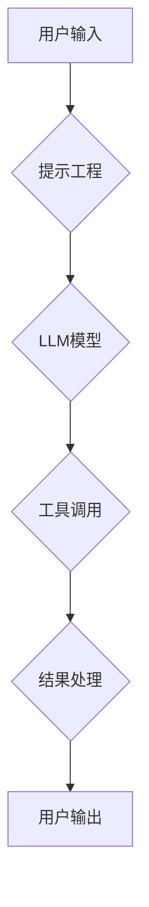

## 【LangChain编程：从入门到实践】专用Chain

> 关键词：LangChain, Chain, LLM, 应用场景, 编程实践,  工具推荐, 未来趋势

### 1. 背景介绍

近年来，大型语言模型（LLM）的快速发展，如GPT-3、LaMDA等，为自然语言处理（NLP）领域带来了革命性的变革。这些模型展现出惊人的文本生成、翻译、问答等能力，但也面临着一些挑战，例如缺乏上下文理解、难以处理复杂任务、部署成本高昂等。

为了更好地利用LLM的强大能力，并解决其存在的局限性，LangChain应运而生。LangChain是一个开源框架，旨在帮助开发者构建和部署基于LLM的应用程序。它提供了一套丰富的工具和组件，包括：

* **模型管理:**  方便地管理和调用不同的LLM模型。
* **提示工程:**  提供工具和技巧，帮助开发者设计更有效的提示，以引导模型生成更准确、更有针对性的结果。
* **数据处理:**  提供数据加载、清洗、转换等功能，方便开发者将数据与LLM模型进行交互。
* **链式调用:**  允许开发者将多个LLM模型和工具串联起来，构建更复杂的应用程序。

### 2. 核心概念与联系

LangChain的核心概念是“Chain”，它代表了一系列相互连接的工具和模型，共同完成一个特定任务。

**Chain的组成部分:**

* **LLM模型:**  Chain的核心，负责处理文本信息。
* **工具:**  辅助LLM完成任务的工具，例如搜索引擎、数据库、计算器等。
* **提示:**  引导LLM模型生成特定结果的文本输入。

**Chain的运作流程:**



**Chain的优势:**

* **模块化设计:**  Chain可以将复杂任务分解成多个小的、可管理的步骤。
* **可扩展性:**  开发者可以根据需要添加新的工具和模型，扩展Chain的功能。
* **复用性:**  同一个Chain可以用于处理多种类似的任务。

### 3. 核心算法原理 & 具体操作步骤

#### 3.1  算法原理概述

LangChain的核心算法原理是基于**提示工程**和**链式调用**。

* **提示工程:**  通过精心设计提示，引导LLM模型生成更准确、更有针对性的结果。
* **链式调用:**  将多个LLM模型和工具串联起来，构建更复杂的应用程序。

#### 3.2  算法步骤详解

1. **定义任务:**  明确需要完成的任务目标。
2. **选择模型:**  根据任务需求选择合适的LLM模型。
3. **设计提示:**  设计有效的提示，引导模型生成所需结果。
4. **选择工具:**  根据任务需求选择合适的工具，辅助模型完成任务。
5. **构建Chain:**  将模型、工具和提示串联起来，构建Chain。
6. **测试和优化:**  测试Chain的性能，并根据需要进行优化。

#### 3.3  算法优缺点

**优点:**

* **灵活性和可扩展性:**  可以根据任务需求灵活选择模型、工具和提示，并轻松扩展Chain的功能。
* **提高效率:**  通过链式调用，可以将多个步骤自动化，提高效率。
* **增强能力:**  通过结合不同的工具，可以增强LLM模型的能力，使其能够处理更复杂的任务。

**缺点:**

* **提示工程的难度:**  设计有效的提示需要一定的经验和技巧。
* **模型和工具的兼容性:**  需要确保模型和工具之间能够兼容。
* **部署成本:**  部署基于LLM的应用程序可能需要一定的成本。

#### 3.4  算法应用领域

LangChain的应用领域非常广泛，包括：

* **聊天机器人:**  构建更智能、更自然的聊天机器人。
* **文本生成:**  生成高质量的文本内容，例如文章、故事、诗歌等。
* **问答系统:**  构建能够回答用户问题的问答系统。
* **代码生成:**  根据自然语言描述生成代码。
* **数据分析:**  利用LLM模型分析文本数据，提取关键信息。

### 4. 数学模型和公式 & 详细讲解 & 举例说明

#### 4.1  数学模型构建

LangChain的核心算法原理并不依赖于复杂的数学模型。它主要基于统计语言模型和深度学习算法，这些算法本身就包含了大量的数学公式和推导过程。

#### 4.2  公式推导过程

由于LangChain的算法原理较为复杂，涉及到自然语言处理、深度学习等多个领域，其公式推导过程非常庞大，难以在本文中完整展示。

#### 4.3  案例分析与讲解

以文本生成为例，LangChain利用LLM模型生成文本，其工作原理可以概括为以下步骤：

1. **输入文本序列:**  用户输入一段文本作为提示。
2. **词嵌入:**  将输入文本序列中的每个词转换为向量表示。
3. **注意力机制:**  LLM模型利用注意力机制，对输入文本序列中的每个词进行加权，突出重要的信息。
4. **解码:**  LLM模型根据输入文本序列和注意力机制的结果，生成下一个词的概率分布。
5. **生成文本:**  根据概率分布，选择最可能的词，并将其添加到输出文本序列中。

重复步骤4和5，直到生成指定长度的文本。

### 5. 项目实践：代码实例和详细解释说明

#### 5.1  开发环境搭建

* Python 3.7+
* LangChain 库
* OpenAI API 

#### 5.2  源代码详细实现

```python
from langchain.llms import OpenAI
from langchain.chains import ConversationChain
from langchain.memory import ConversationBufferMemory

# 初始化 OpenAI 模型
llm = OpenAI(temperature=0.7)

# 初始化对话内存
memory = ConversationBufferMemory()

# 创建对话链
conversation = ConversationChain(
    llm=llm,
    memory=memory,
    prompt= "你好，我是你的助手。请问有什么可以帮你的吗？"
)

# 与模型进行对话
while True:
    user_input = input("你: ")
    if user_input.lower() == "exit":
        break
    response = conversation.run(user_input)
    print("助手:", response)
```

#### 5.3  代码解读与分析

*  **初始化模型和内存:**  代码首先初始化 OpenAI 模型和对话内存。对话内存用于存储对话历史，使模型能够理解上下文。
*  **创建对话链:**  代码创建了一个对话链，将模型和内存连接起来。对话链的 `prompt` 参数指定了初始提示。
*  **与模型进行对话:**  代码使用一个循环，不断获取用户输入，并通过对话链与模型进行交互。模型根据用户输入和对话历史生成响应，并将其打印出来。

#### 5.4  运行结果展示

```
你: 你好
助手: 你好，我是你的助手。请问有什么可以帮你的吗？
你: 你能写一首诗吗？
助手: 

秋风萧瑟叶飘零，
落日余晖染红城。
雁过长空声声远，
寒鸦栖枝暮色凝。

你: 谢谢
助手: 不客气，有什么其他需要帮助的吗？
你: exit
```

### 6. 实际应用场景

#### 6.1  聊天机器人

LangChain可以用于构建更智能、更自然的聊天机器人。通过结合不同的LLM模型和工具，可以实现各种功能，例如：

* **问答:**  回答用户的问题，提供信息。
* **对话:**  与用户进行自然流畅的对话。
* **任务完成:**  根据用户指令完成任务，例如设置提醒、预订酒店等。

#### 6.2  文本生成

LangChain可以用于生成高质量的文本内容，例如：

* **文章:**  根据主题和关键词生成文章。
* **故事:**  根据情节和人物生成故事。
* **诗歌:**  根据风格和主题生成诗歌。

#### 6.3  代码生成

LangChain可以根据自然语言描述生成代码，例如：

* **函数定义:**  根据功能描述生成函数代码。
* **类定义:**  根据类属性和方法描述生成类代码。
* **代码片段:**  根据特定任务生成代码片段。

#### 6.4  未来应用展望

LangChain的应用场景还在不断扩展，未来可能应用于：

* **教育:**  个性化学习辅导、自动生成学习材料。
* **医疗:**  辅助医生诊断疾病、生成医疗报告。
* **法律:**  分析法律文件、生成法律意见。
* **艺术创作:**  辅助艺术家创作音乐、绘画等艺术作品。

### 7. 工具和资源推荐

#### 7.1  学习资源推荐

* **LangChain官方文档:** https://python.langchain.com/docs/
* **LangChain GitHub仓库:** https://github.com/langchain-org/langchain
* **HuggingFace Transformers:** https://huggingface.co/docs/transformers/index

#### 7.2  开发工具推荐

* **Python:**  LangChain基于Python开发。
* **Jupyter Notebook:**  方便进行代码实验和调试。
* **VS Code:**  强大的代码编辑器，支持Python开发。

#### 7.3  相关论文推荐

* **Attention Is All You Need:** https://arxiv.org/abs/1706.03762
* **BERT: Pre-training of Deep Bidirectional Transformers for Language Understanding:** https://arxiv.org/abs/1810.04805

### 8. 总结：未来发展趋势与挑战

#### 8.1  研究成果总结

LangChain为构建基于LLM的应用程序提供了强大的工具和框架，促进了LLM技术的应用和发展。

#### 8.2  未来发展趋势

* **更强大的模型:**  未来LLM模型将会更加强大，能够处理更复杂的任务。
* **更丰富的工具:**  LangChain将会提供更多类型的工具，支持更广泛的应用场景。
* **更易于使用的界面:**  LangChain将会提供更易于使用的界面，降低开发门槛。

#### 8.3  面临的挑战

* **模型的安全性:**  LLM模型可能存在安全风险，例如生成虚假信息、进行攻击等。
* **模型的公平性:**  LLM模型可能存在偏见，导致不公平的结果。
* **模型的解释性:**  LLM模型的决策过程难以解释，这可能会导致信任问题。

#### 8.4  研究展望

未来研究方向包括：

* **提高模型安全性:**  开发更安全的LLM模型，并制定相应的安全规范。
* **解决模型偏见问题:**  通过数据预处理和模型训练，减少模型的偏见。
* **提高模型解释性:**  研究LLM模型的决策过程，并开发可解释的模型。


### 9. 附录：常见问题与解答

**Q1:  LangChain需要哪些技术基础？**

**A1:**  使用LangChain需要一定的Python编程基础，以及对自然语言处理和深度学习的基本了解。

**Q2:  LangChain支持哪些LLM模型？**

**A2:**  LangChain支持多种LLM模型，包括OpenAI、HuggingFace等。

**Q3:  如何部署基于LangChain的应用程序？**

**A3:**  可以将基于LangChain的应用程序部署到云平台、服务器或本地机器上。

**Q4:  LangChain有哪些开源社区资源？**

**A4:**  LangChain拥有活跃的开源社区，提供文档、示例代码、论坛等资源。


作者：禅与计算机程序设计艺术 / Zen and the Art of Computer Programming 
