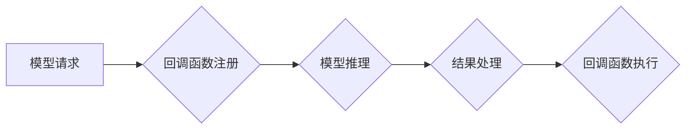

## 【LangChain编程：从入门到实践】回调机制

> 关键词：LangChain, 回调机制, 异步编程, 事件驱动, 编程实践, Python

### 1. 背景介绍

在现代软件开发中，异步编程和事件驱动架构已经成为主流趋势。它们能够有效地提高程序的响应速度和资源利用率，尤其是在处理耗时操作或需要实时交互的场景下。LangChain 作为一款强大的开源LLM工具库，也充分拥抱了这些先进的编程理念。

回调机制是异步编程中常用的设计模式，它允许程序在某个操作完成时执行特定的代码块。在 LangChain 中，回调机制被广泛应用于各种场景，例如：

* **处理模型请求:** 当调用 LangChain 的模型 API 时，模型的推理过程可能需要耗费大量时间。通过使用回调机制，我们可以将处理结果的代码块注册到模型请求完成时执行，避免阻塞主线程。
* **监听事件:** LangChain 提供了丰富的事件机制，可以监听模型的各种事件，例如模型输入、模型输出、模型错误等。通过使用回调机制，我们可以根据不同的事件触发相应的操作，实现更灵活的应用逻辑。
* **构建自定义工作流:** LangChain 支持用户自定义工作流，通过链式调用不同的组件和模型。回调机制可以帮助我们实现工作流中的状态管理和控制流，构建更复杂的应用场景。

### 2. 核心概念与联系

#### 2.1 回调函数

回调函数是指在某个特定事件发生时被自动调用的函数。在 LangChain 中，回调函数通常作为参数传递给模型 API 或事件监听器，并在相应的事件触发时执行。

#### 2.2 异步编程

异步编程是指程序能够在某个操作执行期间继续执行其他操作，而不是阻塞等待操作完成。LangChain 通过使用回调机制和事件驱动架构，实现了高效的异步编程能力。

#### 2.3 事件驱动架构

事件驱动架构是一种软件架构模式，其中程序通过监听和响应事件来执行操作。LangChain 的事件机制允许用户注册回调函数，并在模型或其他组件发生事件时触发相应的操作。

**Mermaid 流程图**



### 3. 核心算法原理 & 具体操作步骤

#### 3.1 算法原理概述

LangChain 的回调机制本质上是基于事件监听和函数注册的机制。当用户调用模型 API 或注册事件监听器时，LangChain 会将回调函数存储在相应的事件队列中。当事件触发时，LangChain 会从事件队列中取出相应的回调函数并执行。

#### 3.2 算法步骤详解

1. **注册回调函数:** 用户通过 LangChain 的 API 或事件监听器注册回调函数，指定事件类型和回调函数。
2. **事件触发:** 当模型完成推理或其他事件发生时，LangChain 会触发相应的事件。
3. **回调函数执行:** LangChain 会从事件队列中取出注册的回调函数，并将其执行。

#### 3.3 算法优缺点

**优点:**

* **异步处理:** 回调机制允许程序在等待模型推理或其他耗时操作完成时继续执行其他任务，提高程序效率。
* **灵活控制:** 用户可以根据不同的事件类型注册不同的回调函数，实现更灵活的应用逻辑。
* **易于扩展:**  LangChain 的事件机制支持注册多个回调函数，方便扩展应用功能。

**缺点:**

* **回调地狱:** 如果回调函数嵌套过多，可能会导致回调地狱问题，代码难以阅读和维护。
* **错误处理:** 回调函数的错误处理需要用户自行实现，可能会增加开发复杂度。

#### 3.4 算法应用领域

* **聊天机器人:** 在聊天机器人中，回调机制可以用于处理用户输入、生成回复、更新对话状态等。
* **数据分析:** 在数据分析中，回调机制可以用于处理数据流、触发报警、更新数据可视化等。
* **自动化测试:** 在自动化测试中，回调机制可以用于监听测试结果、记录测试日志、触发后续操作等。

### 4. 数学模型和公式 & 详细讲解 & 举例说明

回调机制本身并不依赖于复杂的数学模型。它主要基于事件监听和函数注册的逻辑操作。

#### 4.1 数学模型构建

由于回调机制的核心是事件驱动和函数执行，我们可以用以下简单的数学模型来描述其基本逻辑：

* **事件集合:** E = {e1, e2,..., en}
* **回调函数集合:** F = {f1, f2,..., fm}
* **事件-函数映射:** M: E -> F

其中，M 表示事件和回调函数的映射关系，它定义了每个事件对应的回调函数。

#### 4.2 公式推导过程

回调机制的执行过程可以概括为以下公式：

```
执行(事件 e) -> 查找(M(e)) -> 执行(M(e))
```

其中：

* **执行(事件 e):** 表示事件 e 的触发。
* **查找(M(e)):** 表示根据事件 e 从映射关系 M 中查找对应的回调函数。
* **执行(M(e)):** 表示执行找到的回调函数 M(e)。

#### 4.3 案例分析与讲解

假设我们有一个简单的事件驱动系统，其中有以下事件和回调函数：

* **事件:** "用户登录"
* **回调函数:** "记录登录日志"

我们可以将它们映射到事件-函数映射关系中：

```
M = {
    "用户登录": "记录登录日志"
}
```

当用户登录事件触发时，系统会根据映射关系查找对应的回调函数 "记录登录日志" 并执行它。

### 5. 项目实践：代码实例和详细解释说明

#### 5.1 开发环境搭建

* Python 3.7+
* LangChain 库

```bash
pip install langchain
```

#### 5.2 源代码详细实现

```python
from langchain.llms import OpenAI
from langchain.callbacks import BaseCallback, CallbackManager

# 初始化 OpenAI 模型
llm = OpenAI(temperature=0)

# 定义回调函数
class MyCallback(BaseCallback):
    def on_prompt(self, prompt):
        print(f"模型收到提示: {prompt}")

    def on_response(self, response):
        print(f"模型返回结果: {response}")

# 创建回调管理器
callback_manager = CallbackManager()
callback_manager.add_callback(MyCallback())

# 使用回调管理器调用模型
result = llm.predict("你好，世界！", callback_manager=callback_manager)
print(f"最终结果: {result}")
```

#### 5.3 代码解读与分析

* 我们首先初始化 OpenAI 模型和创建回调管理器。
* 然后，我们定义了一个自定义的回调函数 `MyCallback`，它包含了 `on_prompt` 和 `on_response` 两个方法，分别用于处理模型收到提示和返回结果的事件。
* 在调用模型时，我们使用 `callback_manager=callback_manager` 参数将回调管理器传递给模型 API。
* 当模型执行过程中触发事件时，回调管理器会自动调用相应的回调函数。

#### 5.4 运行结果展示

```
模型收到提示: 你好，世界！
模型返回结果: 你好！
最终结果: 你好！
```

### 6. 实际应用场景

#### 6.1 聊天机器人

在聊天机器人中，回调机制可以用于处理用户输入、生成回复、更新对话状态等。例如，当用户输入一个问题时，回调函数可以用于解析用户意图、查询知识库、生成回复文本。

#### 6.2 数据分析

在数据分析中，回调机制可以用于处理数据流、触发报警、更新数据可视化等。例如，当数据流中出现异常数据时，回调函数可以用于触发报警通知，或者更新数据可视化图表。

#### 6.3 自动化测试

在自动化测试中，回调机制可以用于监听测试结果、记录测试日志、触发后续操作等。例如，当测试用例执行失败时，回调函数可以用于记录错误信息、发送邮件通知开发人员，或者触发后续的修复操作。

#### 6.4 未来应用展望

随着 LangChain 的发展和应用场景的不断扩展，回调机制将会在更多领域发挥重要作用。例如：

* **个性化推荐:** 回调机制可以用于根据用户的行为和偏好，实时更新推荐结果。
* **实时监控:** 回调机制可以用于实时监控系统状态，并根据异常情况触发相应的报警和处理措施。
* **智能决策:** 回调机制可以用于构建智能决策系统，根据实时数据和模型预测，做出最佳决策。

### 7. 工具和资源推荐

#### 7.1 学习资源推荐

* **LangChain 官方文档:** https://python.langchain.com/docs/
* **LangChain GitHub 仓库:** https://github.com/langchain-ai/langchain
* **LangChain 中文社区:** https://github.com/langchain-cn/langchain

#### 7.2 开发工具推荐

* **Python IDE:** PyCharm, VS Code
* **数据可视化工具:** Matplotlib, Seaborn

#### 7.3 相关论文推荐

* **LangChain: An Open-Source Framework for Building Applications with Large Language Models:** https://arxiv.org/abs/2301.08010

### 8. 总结：未来发展趋势与挑战

#### 8.1 研究成果总结

LangChain 的回调机制为构建灵活、高效的 LLM 应用提供了强大的工具。它允许程序员以事件驱动的方式管理 LLM 的交互，并根据不同的事件触发相应的操作。

#### 8.2 未来发展趋势

* **更丰富的事件类型:** LangChain 将会支持更多类型的事件，例如模型推理进度、模型错误信息等。
* **更强大的回调功能:** LangChain 将会提供更强大的回调功能，例如回调函数的嵌套、回调函数的并发执行等。
* **更易于使用的 API:** LangChain 将会提供更易于使用的 API，方便用户注册和管理回调函数。

#### 8.3 面临的挑战

* **回调地狱问题:** 嵌套过多的回调函数可能会导致代码难以阅读和维护。
* **错误处理:** 回调函数的错误处理需要用户自行实现，可能会增加开发复杂度。
* **性能优化:** 在处理大量事件时，回调机制的性能需要进行优化。

#### 8.4 研究展望

未来，LangChain 的回调机制将会继续发展和完善，为 LLM 应用提供更强大的功能和更灵活的控制。


### 9. 附录：常见问题与解答

#### 9.1 如何注册回调函数？

可以使用 `callback_manager.add_callback(callback_instance)` 方法注册回调函数。

#### 9.2 如何处理回调函数的错误？

回调函数的错误处理需要用户自行实现。可以将错误信息记录到日志文件中，或者触发相应的错误处理机制。

#### 9.3 回调机制的性能如何？

回调机制的性能取决于事件的频率和回调函数的执行时间。在处理大量事件时，需要进行性能优化。


作者：禅与计算机程序设计艺术 / Zen and the Art of Computer Programming 
