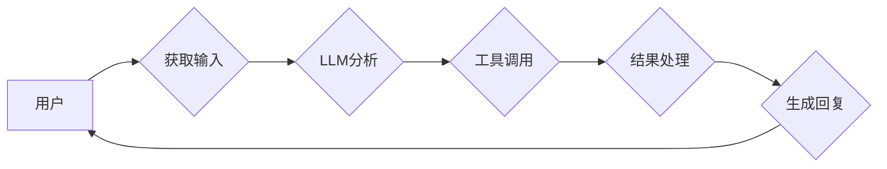

## 【LangChain编程：从入门到实践】方案说明

> 关键词：LangChain, 大语言模型, 应用开发, 编程框架,  LLM,  Chatbot,  文本生成,  数据处理

### 1. 背景介绍

近年来，大语言模型（LLM）的快速发展掀起了人工智能领域的热潮。这些强大的模型能够理解和生成人类语言，展现出令人惊叹的文本生成、翻译、摘要和问答能力。然而，直接与LLM交互往往需要复杂的代码编写和数据处理，阻碍了普通开发者充分利用其潜力。

为了解决这一问题，LangChain 应运而生。它是一个强大的开源框架，旨在简化与LLM的交互，并提供构建复杂应用程序的工具和组件。LangChain 提供了丰富的功能，包括：

* **代理:**  允许用户通过LLM控制外部工具和服务，实现更强大的功能。
* **记忆:**  帮助LLM记住之前的对话上下文，从而提供更自然、更连贯的交互体验。
* **链式调用:**  允许用户将多个LLM调用串联起来，构建复杂的逻辑流程。
* **数据连接:**  提供多种数据源连接方式，方便LLM访问和处理外部数据。

### 2. 核心概念与联系

LangChain 的核心概念围绕着“链”和“代理”展开。

* **链 (Chain):**  代表一系列LLM调用和数据处理步骤，用于完成特定任务。例如，一个链可以包含以下步骤：
    * 从用户获取输入文本
    * 将文本传递给LLM进行分析
    * 根据LLM的输出生成回复文本
    * 将回复文本返回给用户

* **代理 (Agent):**  是一个能够利用LLM和外部工具完成任务的智能实体。代理可以根据用户指令或自身判断，调用不同的LLM和工具，并根据结果进行决策。

**Mermaid 流程图:**



### 3. 核心算法原理 & 具体操作步骤

#### 3.1  算法原理概述

LangChain 的核心算法原理基于**图灵完备性**和**代理理论**。

* **图灵完备性:**  指一个系统能够模拟任何图灵机，从而具备解决任何计算问题的能力。LLM 的强大能力使其具备图灵完备性的潜力，能够处理各种复杂的任务。
* **代理理论:**  指通过代理来实现智能行为，代理可以感知环境、制定计划并执行行动。LangChain 通过代理机制，将LLM与外部工具和数据连接起来，实现更智能的应用。

#### 3.2  算法步骤详解

1. **定义任务:**  明确需要完成的任务，例如文本摘要、代码生成、问答等。
2. **选择LLM:**  根据任务需求选择合适的LLM模型，例如GPT-3、LaMDA等。
3. **构建链:**  设计一个链，包含一系列LLM调用和数据处理步骤，用于完成任务。
4. **连接工具:**  如果需要，将外部工具连接到链中，例如搜索引擎、数据库等。
5. **训练代理:**  如果需要，可以对代理进行训练，使其能够更好地理解用户指令和完成任务。
6. **部署应用:**  将构建好的应用部署到服务器或云平台，供用户使用。

#### 3.3  算法优缺点

**优点:**

* **易于使用:**  LangChain 提供了简洁的API和丰富的组件，简化了与LLM的交互。
* **灵活定制:**  用户可以根据需求自定义链和代理，构建各种复杂应用。
* **扩展性强:**  LangChain 支持多种数据源和工具连接，可以扩展到各种场景。

**缺点:**

* **依赖LLM:**  LangChain 的性能依赖于所选择的LLM模型，如果模型能力不足，应用效果也会受限。
* **资源消耗:**  LLM 调用和数据处理需要消耗大量的计算资源，可能会导致成本较高。

#### 3.4  算法应用领域

LangChain 的应用领域非常广泛，包括：

* **聊天机器人:**  构建更智能、更自然的聊天机器人，能够理解用户意图并提供更精准的回复。
* **文本生成:**  自动生成各种文本内容，例如文章、故事、代码等。
* **问答系统:**  构建能够回答用户问题的问答系统，例如知识问答、客户服务等。
* **数据分析:**  利用LLM对文本数据进行分析，提取关键信息和洞察。
* **代码生成:**  根据用户需求自动生成代码，提高开发效率。

### 4. 数学模型和公式 & 详细讲解 & 举例说明

#### 4.1  数学模型构建

LangChain 的核心算法基于**概率模型**和**图论**。

* **概率模型:**  LLM 的训练过程本质上是一个概率模型的学习过程，通过最大化似然函数来训练模型参数。
* **图论:**  LangChain 使用图论来表示链和代理的结构，例如节点代表LLM调用或工具，边代表数据流或控制流。

#### 4.2  公式推导过程

由于 LangChain 的核心算法涉及复杂的概率计算和图论分析，其公式推导过程较为复杂，需要结合具体的模型和应用场景进行分析。

#### 4.3  案例分析与讲解

例如，在构建一个文本摘要应用时，LangChain 可以使用**Transformer模型**作为LLM，并构建一个链，包含以下步骤：

1. 将输入文本分割成句子。
2. 使用Transformer模型对每个句子进行编码，生成句子向量。
3. 使用聚类算法将句子向量分组，提取关键句子。
4. 将关键句子拼接起来，生成摘要文本。

在这个例子中，Transformer模型的输出是一个句子向量的概率分布，聚类算法则根据这些概率分布将句子分组。

### 5. 项目实践：代码实例和详细解释说明

#### 5.1  开发环境搭建

1. 安装 Python 3.7 或更高版本。
2. 安装必要的库，例如 `langchain`, `transformers`, `openai` 等。

#### 5.2  源代码详细实现

```python
from langchain.llms import OpenAI
from langchain.chains import ConversationChain
from langchain.memory import ConversationBufferMemory

# 初始化 OpenAI LLM
llm = OpenAI(temperature=0.7)

# 初始化对话内存
memory = ConversationBufferMemory(memory_key="conversation_history")

# 创建对话链
conversation = ConversationChain(
    llm=llm,
    memory=memory,
    prompt=f"你好，我是你的助手。请问有什么可以帮您吗？",
)

# 与用户交互
while True:
    user_input = input("您:")
    response = conversation.run(user_input)
    print("助手:", response)
```

#### 5.3  代码解读与分析

这段代码演示了如何使用LangChain构建一个简单的聊天机器人。

1. 首先，我们初始化OpenAI LLM和对话内存。
2. 然后，我们创建了一个对话链，将LLM和内存连接起来。
3. 最后，我们进入一个循环，不断获取用户输入，并使用对话链生成回复。

#### 5.4  运行结果展示

当运行这段代码时，用户可以与聊天机器人进行对话。

### 6. 实际应用场景

LangChain 的应用场景非常广泛，例如：

* **客服机器人:**  自动回答用户常见问题，提高客服效率。
* **教育助手:**  提供个性化的学习辅导，帮助学生理解知识。
* **内容创作工具:**  辅助用户生成文章、故事、诗歌等内容。
* **代码辅助工具:**  帮助开发者编写代码，提高开发效率。

#### 6.4  未来应用展望

随着LLM技术的不断发展，LangChain 的应用场景将会更加丰富。未来，LangChain 可能被用于：

* **更复杂的对话系统:**  构建能够理解更复杂语义和情感的对话系统。
* **多模态应用:**  将文本与图像、音频等其他模态数据结合，构建更丰富的应用场景。
* **个性化推荐:**  根据用户的喜好和行为，提供个性化的内容推荐。

### 7. 工具和资源推荐

#### 7.1  学习资源推荐

* **LangChain 官方文档:**  https://python.langchain.com/docs/
* **LangChain GitHub仓库:**  https://github.com/langchain-ai/langchain
* **HuggingFace Transformers:**  https://huggingface.co/docs/transformers/index

#### 7.2  开发工具推荐

* **Python:**  https://www.python.org/
* **Jupyter Notebook:**  https://jupyter.org/

#### 7.3  相关论文推荐

* **Attention Is All You Need:**  https://arxiv.org/abs/1706.03762
* **BERT: Pre-training of Deep Bidirectional Transformers for Language Understanding:**  https://arxiv.org/abs/1810.04805

### 8. 总结：未来发展趋势与挑战

#### 8.1  研究成果总结

LangChain 作为一种强大的LLM应用框架，为开发者提供了便捷的工具和组件，降低了使用LLM的门槛，促进了LLM技术的普及和应用。

#### 8.2  未来发展趋势

未来，LangChain 将朝着以下方向发展：

* **更强大的LLM集成:**  支持更多类型的LLM模型，并提供更灵活的集成方式。
* **更丰富的组件库:**  提供更多功能的组件，例如数据处理、工具调用、用户界面等。
* **更完善的生态系统:**  构建更完善的社区和生态系统，促进LangChain的开源发展。

#### 8.3  面临的挑战

LangChain 也面临一些挑战：

* **模型性能瓶颈:**  LLM模型的性能仍然有限，需要不断提升模型能力。
* **数据安全和隐私问题:**  LLM模型的训练和应用需要处理大量数据，需要解决数据安全和隐私问题。
* **伦理和社会影响:**  LLM技术的应用可能带来一些伦理和社会问题，需要进行深入研究和探讨。

#### 8.4  研究展望

未来，我们需要继续研究和探索LLM技术的应用，并积极应对其带来的挑战，推动LLM技术朝着更加安全、可靠、可持续的方向发展。

### 9. 附录：常见问题与解答

**Q1:  LangChain 是否需要付费使用？**

A1:  LangChain 本身是一个开源框架，免费使用。但是，使用某些LLM模型可能需要付费。

**Q2:  如何选择合适的LLM模型？**

A2:  选择合适的LLM模型需要根据具体的应用场景和需求进行考虑。例如，如果需要生成高质量的文本，可以选择GPT-3等强大的模型；如果需要处理特定领域的知识，可以选择预训练在该领域的数据上的模型。

**Q3:  LangChain 是否支持多语言？**

A3:  LangChain 支持多种语言，具体取决于所使用的LLM模型。一些LLM模型支持多语言训练，可以处理多种语言的文本。


作者：禅与计算机程序设计艺术 / Zen and the Art of Computer Programming 
