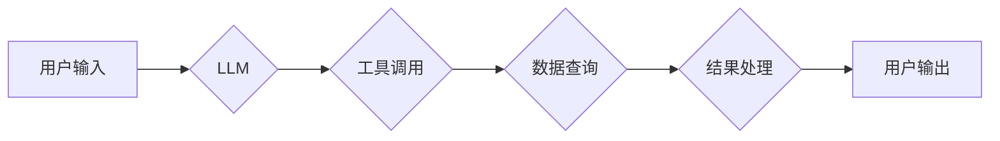

## 【LangChain编程：从入门到实践】链的基本概念

> 关键词：LangChain, 链式调用, 大语言模型, 应用场景, 编程框架, 知识库, 

## 1. 背景介绍

近年来，大语言模型（LLM）的快速发展，如GPT-3、LaMDA等，为自然语言处理领域带来了革命性的变革。这些模型展现出惊人的文本生成、翻译、问答等能力，但其本身也存在一些局限性，例如缺乏外部知识的访问能力、难以处理复杂的任务等。

为了克服这些局限性，LangChain 应运而生。LangChain 是一种开源的框架，旨在帮助开发者构建更强大、更灵活的应用，利用 LLM 的能力，并将其与其他工具和数据源集成。

## 2. 核心概念与联系

LangChain 的核心概念是“链”，即将多个组件串联起来，形成一个完整的应用流程。这些组件可以是 LLM、工具、数据源等，通过链式调用，实现更复杂的逻辑和功能。

**LangChain 架构图**



**核心概念解释:**

* **LLM:** 大语言模型，例如 OpenAI 的 GPT-3 或 Google 的 LaMDA。
* **工具:**  各种外部工具，例如搜索引擎、数据库、计算器等。
* **数据源:**  各种外部数据源，例如文本文件、API 接口、知识库等。
* **链:**  将 LLM、工具和数据源串联起来，形成一个完整的应用流程。
* **提示:**  向 LLM 提供的输入信息，引导其生成特定类型的输出。

## 3. 核心算法原理 & 具体操作步骤

LangChain 的核心算法原理是基于**链式调用**和**提示工程**。

### 3.1  算法原理概述

* **链式调用:**  将多个组件按照特定的顺序串联起来，每个组件根据前一个组件的输出进行处理，最终生成最终结果。
* **提示工程:**  通过精心设计提示，引导 LLM 生成更准确、更符合预期类型的输出。

### 3.2  算法步骤详解

1. **定义链:**  根据应用需求，确定需要使用的组件，并定义它们的顺序和交互方式。
2. **准备数据:**  收集和准备需要使用的外部数据，例如知识库、文本文件等。
3. **设计提示:**  根据应用场景，设计合适的提示，引导 LLM 生成所需的结果。
4. **执行链:**  将定义好的链执行，并根据 LLM 的输出，调用其他组件进行处理。
5. **处理结果:**  对最终结果进行处理和展示，例如格式化输出、生成图表等。

### 3.3  算法优缺点

**优点:**

* **灵活性和可扩展性:**  可以根据需求灵活组合不同的组件，构建各种类型的应用。
* **复用性:**  已经定义好的链可以被重复使用，提高开发效率。
* **可维护性:**  链式结构使得代码更易于理解和维护。

**缺点:**

* **复杂性:**  构建复杂的链可能需要较高的技术水平。
* **性能:**  链式调用可能会导致性能下降，需要进行优化。

### 3.4  算法应用领域

LangChain 的应用领域非常广泛，例如：

* **聊天机器人:**  构建更智能、更自然的聊天机器人。
* **问答系统:**  构建能够回答复杂问题的问答系统。
* **文本生成:**  生成各种类型的文本，例如文章、故事、代码等。
* **数据分析:**  利用 LLM 的能力进行文本数据分析。
* **代码生成:**  根据自然语言描述生成代码。

## 4. 数学模型和公式 & 详细讲解 & 举例说明

LangChain 的核心算法原理并不依赖于复杂的数学模型。其主要基于统计语言模型和深度学习算法，这些算法本身就包含了大量的数学公式和推导过程。

**4.1  数学模型构建**

LLM 的训练过程本质上是构建一个概率模型，该模型能够预测下一个词出现的概率。这个模型通常基于 Transformer 架构，并使用大量的文本数据进行训练。

**4.2  公式推导过程**

Transformer 架构的核心是**注意力机制**，它允许模型关注输入序列中不同位置的词，并根据其重要性赋予不同的权重。注意力机制的计算过程涉及到矩阵运算和 softmax 函数等数学操作。

**4.3  案例分析与讲解**

例如，在文本生成任务中，LLM 会根据输入的提示词，预测下一个词出现的概率。这个预测过程涉及到以下步骤：

1. 将输入提示词转换为向量表示。
2. 使用注意力机制计算每个词的权重。
3. 根据权重计算下一个词出现的概率分布。
4. 从概率分布中选择概率最高的词作为输出。

## 5. 项目实践：代码实例和详细解释说明

以下是一个简单的 LangChain 项目示例，演示如何使用 LLM 生成文本：

### 5.1  开发环境搭建

需要安装 Python 和必要的库，例如 LangChain、OpenAI 等。

### 5.2  源代码详细实现

```python
from langchain.llms import OpenAI
from langchain.prompts import PromptTemplate

# 初始化 LLM
llm = OpenAI(temperature=0.7)

# 定义提示模板
template = """
根据以下提示，生成一段相关的文本：{text}
"""

# 创建提示对象
prompt = PromptTemplate(template=template, input_variables=["text"])

# 生成文本
response = llm(prompt.format(text="今天天气真好"))

# 打印结果
print(response)
```

### 5.3  代码解读与分析

*  首先，我们初始化一个 OpenAI 的 LLM 对象。
*  然后，我们定义一个提示模板，该模板包含一个占位符 `text`，用于输入需要生成的文本主题。
*  接着，我们创建了一个 PromptTemplate 对象，并将其与模板关联起来。
*  最后，我们使用 `prompt.format()` 方法将文本主题填充到模板中，并将其作为输入传递给 LLM 进行文本生成。

### 5.4  运行结果展示

运行代码后，会输出一段与提示主题相关的文本。

## 6. 实际应用场景

LangChain 的应用场景非常广泛，以下是一些具体的例子：

* **智能客服:**  构建能够理解用户需求并提供解决方案的智能客服系统。
* **内容创作:**  利用 LLM 生成各种类型的文本内容，例如文章、故事、广告文案等。
* **代码辅助:**  帮助程序员编写代码，提供代码建议和错误提示。
* **数据分析:**  利用 LLM 对文本数据进行分析，提取关键信息和趋势。

### 6.4  未来应用展望

随着 LLM 技术的不断发展，LangChain 将有更广泛的应用场景。例如，可以用于构建更复杂的对话系统、个性化学习平台、自动写作工具等。

## 7. 工具和资源推荐

### 7.1  学习资源推荐

* **LangChain 官方文档:** https://python.langchain.com/docs/
* **LangChain GitHub 仓库:** https://github.com/langchain-org/langchain

### 7.2  开发工具推荐

* **Python:**  LangChain 是基于 Python 开发的框架。
* **Jupyter Notebook:**  可以用于快速原型开发和实验。

### 7.3  相关论文推荐

* **Attention Is All You Need:** https://arxiv.org/abs/1706.03762
* **BERT: Pre-training of Deep Bidirectional Transformers for Language Understanding:** https://arxiv.org/abs/1810.04805

## 8. 总结：未来发展趋势与挑战

LangChain 作为一种开源的 LLM 应用框架，为开发者提供了构建更强大、更灵活的应用的工具。未来，LangChain 将会朝着以下方向发展：

* **更强大的 LLM 集成:**  支持更多类型的 LLM，并提供更灵活的集成方式。
* **更丰富的组件库:**  提供更多类型的组件，例如数据库连接、API 调用等。
* **更易于使用的界面:**  提供更直观、更易于使用的界面，降低开发门槛。

然而，LangChain 也面临着一些挑战：

* **模型性能:**  LLM 的性能仍然存在局限性，需要不断改进。
* **数据安全:**  LLM 的训练数据可能包含敏感信息，需要采取措施保证数据安全。
* **伦理问题:**  LLM 的应用可能引发一些伦理问题，需要进行深入研究和讨论。

## 9. 附录：常见问题与解答

* **Q: 如何选择合适的 LLM？**
    * **A:**  选择 LLM 需要根据应用场景和性能需求进行考虑。例如，对于需要生成高质量文本的应用，可以选择性能更强的 LLM，而对于需要快速响应的应用，可以选择性能更快的 LLM。
* **Q: 如何设计有效的提示？**
    * **A:**  设计有效的提示需要根据 LLM 的特点和应用场景进行调整。一般来说，提示应该清晰、简洁、具体，并提供足够的上下文信息。
* **Q: 如何解决模型过拟合问题？**
    * **A:**  模型过拟合问题可以通过使用更丰富的训练数据、正则化技术等方法进行解决。


作者：禅与计算机程序设计艺术 / Zen and the Art of Computer Programming 
