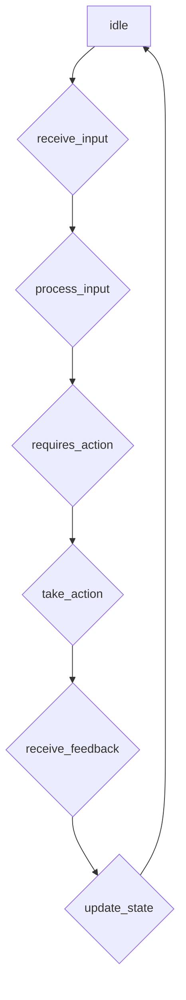

## 【大模型应用开发 动手做AI Agent】在Run进入requires_action状态之后跳出循环

> 关键词：大模型、AI Agent、requires_action、循环跳出、状态机、任务驱动、应用开发

## 1. 背景介绍

近年来，大模型在自然语言处理、计算机视觉等领域取得了突破性进展，为构建智能代理（AI Agent）提供了强大的工具。AI Agent 是一种能够感知环境、做出决策并与环境交互的智能体。在实际应用中，AI Agent 通常需要执行一系列任务，完成复杂的目标。

传统的AI Agent开发方式往往依赖于明确的规则和状态机，但大模型的引入为AI Agent开发带来了新的可能性。大模型可以学习复杂的模式和关系，并根据输入信息生成相应的输出，从而实现更灵活、更智能的代理行为。

然而，在使用大模型构建AI Agent时，如何有效地管理代理的状态和行为，使其能够正确地执行任务，仍然是一个重要的挑战。

## 2. 核心概念与联系

在使用大模型构建AI Agent时，一个关键的概念是“状态机”。状态机是一种用于描述系统状态和状态转换的模型，它可以帮助我们理解和控制AI Agent的行为。

当AI Agent执行任务时，它会经历不同的状态，例如“idle”（空闲）、“processing”（处理中）、“requires_action”（需要采取行动）等。每个状态对应着特定的行为和决策规则。

**状态机流程图**



在上述流程图中，AI Agent从“idle”状态开始，接收用户输入后进入“processing”状态，对输入进行处理，如果需要采取行动，则进入“requires_action”状态。在“requires_action”状态下，AI Agent会根据其训练知识和当前状态生成相应的行动，并执行该行动。执行行动后，AI Agent会接收反馈信息，并根据反馈更新其状态，最终返回“idle”状态，等待新的输入。

## 3. 核心算法原理 & 具体操作步骤

### 3.1  算法原理概述

在Run进入requires_action状态后跳出循环的关键在于如何判断AI Agent是否需要采取行动，以及如何执行该行动。

**3.1.1  判断需要采取行动的条件**

这取决于AI Agent的任务目标和当前环境状态。例如，如果AI Agent的任务是完成一个问答系统，那么当用户输入一个问题时，AI Agent需要判断是否需要生成一个答案。

**3.1.2  执行行动的步骤**

1. **生成行动方案:** AI Agent根据其训练知识和当前状态，生成多个可能的行动方案。
2. **评估行动方案:** AI Agent对每个行动方案进行评估，选择最优的方案。
3. **执行行动:** AI Agent执行选定的行动方案，并接收反馈信息。

### 3.2  算法步骤详解

1. **初始化:** AI Agent初始化其状态为“idle”，并等待用户输入。
2. **接收输入:** 当用户输入信息时，AI Agent接收该信息，并将其作为输入进行处理。
3. **处理输入:** AI Agent使用大模型对输入信息进行处理，例如理解用户意图、提取关键信息等。
4. **判断状态:** 根据处理结果，AI Agent判断其当前状态是否为“requires_action”。
    * 如果是“requires_action”，则跳至步骤5。
    * 如果不是“requires_action”，则返回步骤2，等待新的输入。
5. **生成行动方案:** AI Agent根据其训练知识和当前状态，生成多个可能的行动方案。
6. **评估行动方案:** AI Agent对每个行动方案进行评估，选择最优的方案。
7. **执行行动:** AI Agent执行选定的行动方案，并接收反馈信息。
8. **更新状态:** AI Agent根据反馈信息更新其状态，并返回步骤2，等待新的输入。

### 3.3  算法优缺点

**优点:**

* **灵活性和智能性:** 大模型可以学习复杂的模式和关系，从而实现更灵活、更智能的代理行为。
* **可扩展性:** 大模型可以根据需要进行微调和扩展，以适应不同的任务和环境。

**缺点:**

* **计算资源需求:** 大模型的训练和推理需要大量的计算资源。
* **可解释性:** 大模型的决策过程往往难以解释，这可能导致信任问题。

### 3.4  算法应用领域

* **聊天机器人:** 大模型可以构建更自然、更智能的聊天机器人，能够理解用户的意图并提供更准确的回复。
* **虚拟助理:** 大模型可以构建更强大的虚拟助理，能够帮助用户完成各种任务，例如日程安排、信息查询等。
* **游戏AI:** 大模型可以构建更智能的游戏AI，能够做出更复杂的决策，提供更具挑战性的游戏体验。

## 4. 数学模型和公式 & 详细讲解 & 举例说明

### 4.1  数学模型构建

在AI Agent中，我们可以使用状态机模型来描述其行为。状态机由状态集合、状态转换函数和初始状态组成。

* **状态集合:** 表示AI Agent可能处于的各种状态。例如，"idle"、"processing"、"requires_action"。
* **状态转换函数:** 描述AI Agent在不同状态下如何根据输入信息进行状态转换。
* **初始状态:** 表示AI Agent启动时的初始状态。

### 4.2  公式推导过程

状态转换函数可以表示为一个逻辑表达式，例如：

```
state_transition(current_state, input_info) = next_state
```

其中：

* `current_state` 表示AI Agent当前的状态。
* `input_info` 表示AI Agent接收到的输入信息。
* `next_state` 表示AI Agent转换后的状态。

例如，如果AI Agent处于"idle"状态，接收到的输入信息是用户问题，则状态转换函数可以定义为：

```
state_transition("idle", user_question) = "processing"
```

### 4.3  案例分析与讲解

假设AI Agent的任务是回答用户的问题。

* 当AI Agent处于"idle"状态时，接收用户问题后，状态转换函数将其状态转换为"processing"。
* 在"processing"状态下，AI Agent使用大模型对用户问题进行处理，并判断是否需要采取行动。
* 如果需要采取行动，则状态转换函数将其状态转换为"requires_action"。
* 在"requires_action"状态下，AI Agent根据其训练知识生成答案，并将其作为行动执行。
* 执行行动后，AI Agent接收用户反馈，并根据反馈更新其状态。

## 5. 项目实践：代码实例和详细解释说明

### 5.1  开发环境搭建

* Python 3.7+
* TensorFlow 2.x 或 PyTorch 1.x
* 其他必要的库，例如transformers、numpy、pandas等

### 5.2  源代码详细实现

```python
class AI_Agent:
    def __init__(self):
        self.state = "idle"
        # 加载预训练模型
        self.model = transformers.AutoModelForSequenceClassification.from_pretrained("bert-base-uncased")

    def receive_input(self, user_input):
        self.input_text = user_input
        if self.state == "idle":
            self.state = "processing"
            self.process_input()

    def process_input(self):
        # 使用大模型处理用户输入
        #...
        if self.requires_action():
            self.state = "requires_action"
            self.take_action()

    def requires_action(self):
        # 判断是否需要采取行动
        #...
        return True

    def take_action(self):
        # 生成行动方案并执行
        #...

    def update_state(self, feedback):
        # 根据反馈更新状态
        #...
        self.state = "idle"

# 实例化AI Agent
agent = AI_Agent()

# 用户输入
user_input = "你好，请问今天天气怎么样？"
agent.receive_input(user_input)
```

### 5.3  代码解读与分析

* `AI_Agent` 类定义了AI Agent的基本结构和行为。
* `state` 属性记录了AI Agent当前的状态。
* `receive_input()` 方法接收用户输入，并根据状态转换函数更新状态。
* `process_input()` 方法使用大模型处理用户输入，并判断是否需要采取行动。
* `requires_action()` 方法判断是否需要采取行动。
* `take_action()` 方法生成行动方案并执行。
* `update_state()` 方法根据反馈更新状态。

### 5.4  运行结果展示

当用户输入“你好，请问今天天气怎么样？”时，AI Agent会根据预训练模型的知识，生成一个关于天气状况的答案，并将其作为行动执行。

## 6. 实际应用场景

### 6.1  聊天机器人

大模型可以构建更自然、更智能的聊天机器人，能够理解用户的意图并提供更准确的回复。例如，可以构建一个可以回答用户问题、进行对话、提供娱乐等功能的聊天机器人。

### 6.2  虚拟助理

大模型可以构建更强大的虚拟助理，能够帮助用户完成各种任务，例如日程安排、信息查询、文件管理等。例如，可以构建一个可以根据用户的语音指令完成任务的虚拟助理。

### 6.3  游戏AI

大模型可以构建更智能的游戏AI，能够做出更复杂的决策，提供更具挑战性的游戏体验。例如，可以构建一个可以学习玩家策略并进行对抗的AI对手。

### 6.4  未来应用展望

随着大模型技术的不断发展，AI Agent的应用场景将会更加广泛。例如，可以构建能够自主学习和适应环境的AI Agent，用于自动驾驶、医疗诊断、金融分析等领域。

## 7. 工具和资源推荐

### 7.1  学习资源推荐

* **书籍:**
    * 《深度学习》
    * 《自然语言处理》
    * 《机器学习》
* **在线课程:**
    * Coursera
    * edX
    * Udacity

### 7.2  开发工具推荐

* **Python:** 
    * TensorFlow
    * PyTorch
    * Hugging Face Transformers
* **其他工具:**
    * Jupyter Notebook
    * Git

### 7.3  相关论文推荐

* **BERT:** Devlin et al. (2018)
* **GPT-3:** Brown et al. (2020)
* **T5:** Raffel et al. (2019)

## 8. 总结：未来发展趋势与挑战

### 8.1  研究成果总结

近年来，大模型在AI Agent开发领域取得了显著进展，例如BERT、GPT-3等模型的出现，为构建更智能、更灵活的AI Agent提供了强大的工具。

### 8.2  未来发展趋势

* **模型规模和能力的提升:** 未来，大模型的规模和能力将会进一步提升，能够处理更复杂的任务和环境。
* **多模态AI Agent:** 未来，AI Agent将能够处理多种模态信息，例如文本、图像、音频等，从而提供更丰富的交互体验。
* **可解释性研究:** 未来，研究人员将更加关注大模型的解释性，使其决策过程更加透明和可理解。

### 8.3  面临的挑战

* **计算资源需求:** 大模型的训练和推理需要大量的计算资源，这对于资源有限的机构和个人来说是一个挑战。
* **数据安全和隐私:** 大模型的训练需要大量数据，如何保证数据安全和隐私是一个重要的挑战。
* **伦理问题:** 大模型