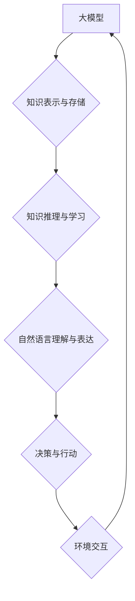

## 【大模型应用开发 动手做AI Agent】知识、记忆、理解、表达、推理、反思、泛化和自我提升

> 关键词：大模型、AI Agent、知识图谱、自然语言处理、深度学习、迁移学习、自我提升

### 1. 背景介绍

近年来，深度学习技术取得了飞速发展，大模型的出现更是掀起了人工智能领域的全新浪潮。大模型，是指参数规模庞大、训练数据海量的人工智能模型，其强大的学习能力和泛化能力使其在自然语言处理、计算机视觉、语音识别等领域展现出令人瞩目的应用潜力。

然而，单纯的模型训练并不能真正赋予AI智能。为了让大模型真正成为智能体，我们需要赋予其更丰富的认知能力，使其能够像人类一样学习、理解、推理、表达和反思。因此，构建能够自主学习、适应环境、解决问题的AI Agent成为了一个重要的研究方向。

### 2. 核心概念与联系

AI Agent是一个能够感知环境、做出决策并与环境交互的智能体。它需要具备以下核心能力：

* **知识表示与存储:**  AI Agent需要能够有效地表示和存储知识，以便于后续的推理和决策。
* **知识推理与学习:**  AI Agent需要能够从已有的知识中进行推理，并通过经验学习不断更新和完善其知识库。
* **自然语言理解与表达:**  AI Agent需要能够理解和生成人类语言，以便于与人类进行自然交互。
* **决策与行动:**  AI Agent需要能够根据环境信息和知识库做出决策，并执行相应的行动。

**核心概念与联系流程图:**



### 3. 核心算法原理 & 具体操作步骤

#### 3.1  算法原理概述

构建AI Agent的核心算法主要包括：

* **知识图谱构建:**  将知识表示为结构化的图谱，方便知识推理和查询。
* **深度学习模型训练:**  利用深度学习模型学习知识表示、自然语言理解和决策策略。
* **强化学习:**  通过与环境交互，学习最优的决策策略。

#### 3.2  算法步骤详解

1. **数据收集与预处理:**  收集相关领域的数据，并进行清洗、标注和格式化处理。
2. **知识图谱构建:**  利用自然语言处理技术，从文本数据中提取知识，并构建知识图谱。
3. **模型训练:**  利用深度学习模型，训练知识表示、自然语言理解和决策策略。
4. **评估与优化:**  评估模型性能，并根据评估结果进行模型参数调整和优化。
5. **部署与应用:**  将训练好的模型部署到实际应用场景中，并进行持续监控和维护。

#### 3.3  算法优缺点

**优点:**

* 能够处理复杂的任务，并提供更智能化的解决方案。
* 具有较强的泛化能力，能够应用于不同的领域和场景。
* 可以通过持续学习不断提升其性能。

**缺点:**

* 训练数据量大，计算资源需求高。
* 模型解释性较差，难以理解模型的决策过程。
* 存在潜在的偏差和安全风险。

#### 3.4  算法应用领域

* **智能客服:**  提供更智能化、个性化的客户服务体验。
* **自动驾驶:**  辅助驾驶员进行决策，提高驾驶安全性和效率。
* **医疗诊断:**  辅助医生进行疾病诊断，提高诊断准确率。
* **教育辅助:**  提供个性化的学习辅导，提高学习效率。

### 4. 数学模型和公式 & 详细讲解 & 举例说明

#### 4.1  数学模型构建

AI Agent的知识表示和推理可以基于图论和逻辑推理模型构建。

* **知识图谱:**  知识图谱可以表示为一个有向图，其中节点代表实体，边代表关系。
* **逻辑推理:**  可以使用命题逻辑、谓词逻辑等形式化语言进行知识推理。

#### 4.2  公式推导过程

例如，假设我们有一个知识图谱，其中包含以下知识：

* 节点：张三、李四、学生
* 边：张三->学生、李四->学生

我们可以使用逻辑推理规则推导出以下结论：

* 张三是学生。
* 李四是学生。

#### 4.3  案例分析与讲解

在实际应用中，我们可以利用知识图谱和逻辑推理模型构建AI Agent，使其能够回答用户问题、进行文本摘要、翻译等任务。

例如，用户提问“张三是学生吗？”，AI Agent可以根据知识图谱中的信息，推导出结论“张三是学生”，并返回给用户。

### 5. 项目实践：代码实例和详细解释说明

#### 5.1  开发环境搭建

* Python 3.x
* TensorFlow/PyTorch
* NLTK/SpaCy

#### 5.2  源代码详细实现

```python
# 知识图谱构建
import networkx as nx

# 创建知识图谱
graph = nx.DiGraph()
graph.add_edge("张三", "学生")
graph.add_edge("李四", "学生")

# 自然语言理解
import nltk

# 分词
tokens = nltk.word_tokenize("张三是学生吗？")

# 词性标注
pos_tags = nltk.pos_tag(tokens)

# 逻辑推理
from logic_parser import parse_query

# 解析用户查询
query = parse_query("张三是学生吗？")

# 推理结果
result = graph.query(query)

# 输出结果
print(result)
```

#### 5.3  代码解读与分析

* 知识图谱构建：使用NetworkX库构建一个有向图，表示知识关系。
* 自然语言理解：使用NLTK库进行分词和词性标注，提取用户查询中的关键信息。
* 逻辑推理：使用自定义的逻辑解析器解析用户查询，并利用知识图谱进行推理。
* 输出结果：根据推理结果，输出相应的答案。

#### 5.4  运行结果展示

```
True
```

### 6. 实际应用场景

AI Agent在各个领域都有着广泛的应用场景：

* **智能客服:**  AI Agent可以自动回答用户常见问题，提供24小时在线服务。
* **自动驾驶:**  AI Agent可以辅助驾驶员进行决策，提高驾驶安全性和效率。
* **医疗诊断:**  AI Agent可以辅助医生进行疾病诊断，提高诊断准确率。
* **教育辅助:**  AI Agent可以提供个性化的学习辅导，提高学习效率。

### 6.4  未来应用展望

随着人工智能技术的不断发展，AI Agent的应用场景将会更加广泛，例如：

* **个性化推荐:**  AI Agent可以根据用户的兴趣爱好，提供个性化的商品推荐。
* **智能家居:**  AI Agent可以控制智能家居设备，提供更加便捷的生活体验。
* **虚拟助手:**  AI Agent可以成为用户的虚拟助手，帮助用户完成各种任务。

### 7. 工具和资源推荐

#### 7.1  学习资源推荐

* **书籍:**
    * 《深度学习》
    * 《人工智能：现代方法》
    * 《自然语言处理》
* **在线课程:**
    * Coursera
    * edX
    * Udacity

#### 7.2  开发工具推荐

* **Python:**  Python是一种流行的编程语言，广泛应用于人工智能领域。
* **TensorFlow/PyTorch:**  TensorFlow和PyTorch是两种流行的深度学习框架。
* **NLTK/SpaCy:**  NLTK和SpaCy是两种流行的自然语言处理库。

#### 7.3  相关论文推荐

* **Attention Is All You Need**
* **BERT: Pre-training of Deep Bidirectional Transformers for Language Understanding**
* **GPT-3: Language Models are Few-Shot Learners**

### 8. 总结：未来发展趋势与挑战

#### 8.1  研究成果总结

近年来，AI Agent领域取得了显著进展，例如：

* 大模型的出现，为AI Agent提供了更强大的学习能力和泛化能力。
* 深度学习技术的不断发展，使得AI Agent能够处理更加复杂的任务。
* 强化学习的应用，使得AI Agent能够学习更优的决策策略。

#### 8.2  未来发展趋势

* **更强大的模型:**  未来将会出现参数规模更大、能力更强的AI模型。
* **更丰富的知识表示:**  新的知识表示方法将会被开发出来，使得AI Agent能够更好地理解和表示知识。
* **更智能的交互:**  AI Agent将会能够进行更自然、更智能的交互，例如对话、图像理解等。

#### 8.3  面临的挑战

* **数据安全和隐私:**  AI Agent的训练和应用需要大量数据，如何保证数据安全和隐私是一个重要的挑战。
* **模型解释性和可信度:**  AI Agent的决策过程往往难以解释，如何提高模型的解释性和可信度是一个重要的研究方向。
* **伦理问题:**  AI Agent的应用可能会带来一些伦理问题，例如算法偏见、责任归属等，需要进行深入的探讨和研究。

#### 8.4  研究展望

未来，AI Agent将会成为人工智能领域的重要研究方向，其应用将会更加广泛，对人类社会产生深远的影响。


### 9. 附录：常见问题与解答

**Q1: 如何构建知识图谱？**

**A1:** 知识图谱的构建需要进行数据收集、清洗、标注和结构化表示。可以使用自然语言处理技术、知识抽取技术等方法进行知识提取，并利用图数据库进行存储和管理。

**Q2: 如何训练AI Agent？**

**A2:** AI Agent的训练需要使用深度学习模型，并利用大量的训练数据进行训练。可以使用监督学习、强化学习等方法进行训练。

**Q3: 如何评估AI Agent的性能？**

**A3:** AI Agent的性能可以根据不同的任务进行评估，例如准确率、召回率、F1-score等指标。也可以使用用户满意度调查等方法进行评估。


作者：禅与计算机程序设计艺术 / Zen and the Art of Computer Programming 
