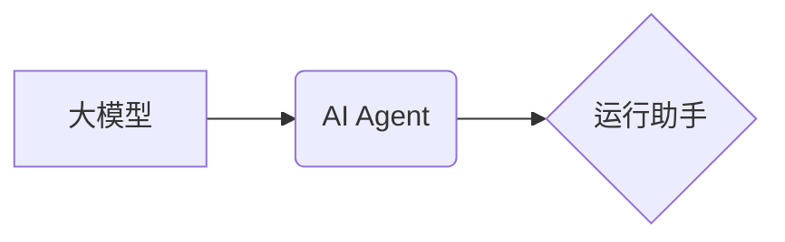

## 【大模型应用开发 动手做AI Agent】运行助手

> 关键词：大模型、AI Agent、应用开发、运行助手、模型部署、模型调优、任务自动化

### 1. 背景介绍

近年来，大模型技术取得了飞速发展，其强大的泛化能力和学习能力为人工智能领域带来了革命性的变革。从自然语言处理到计算机视觉，从代码生成到药物研发，大模型已在各个领域展现出巨大的应用潜力。然而，将大模型应用于实际场景仍然面临着诸多挑战，例如模型部署、模型调优、任务自动化等。

为了解决这些问题，我们提出了“大模型应用开发动手做AI Agent”运行助手，这是一个旨在帮助开发者快速、高效地将大模型应用于实际场景的工具。该运行助手提供了一系列功能，包括模型部署、模型调优、任务自动化等，旨在降低开发者使用大模型的门槛，并加速大模型应用的落地。

### 2. 核心概念与联系

#### 2.1  大模型

大模型是指参数量达到数亿甚至数千亿的大规模神经网络模型。由于其庞大的参数量和海量数据训练，大模型具备强大的泛化能力和学习能力，能够在各种任务中表现出优异的性能。

#### 2.2  AI Agent

AI Agent是指能够感知环境、做出决策并执行行动的智能体。它可以是软件程序、机器人或其他智能系统。AI Agent通常由以下几个部分组成：

* **感知模块:** 用于获取环境信息。
* **决策模块:** 用于根据环境信息做出决策。
* **执行模块:** 用于执行决策并与环境交互。

#### 2.3  运行助手

运行助手是一个用于辅助开发者开发和部署AI Agent的工具。它可以提供以下功能：

* **模型部署:** 将训练好的大模型部署到不同的环境中，例如云端、边缘设备等。
* **模型调优:** 根据实际应用场景，对大模型进行调优，以提高其性能。
* **任务自动化:** 将AI Agent集成到自动化流程中，例如自动化测试、自动化客服等。

**核心概念关系图:**

### 3. 核心算法原理 & 具体操作步骤

#### 3.1  算法原理概述

大模型应用开发动手做AI Agent运行助手主要基于以下核心算法原理：

* **Transformer模型:** 用于处理自然语言文本的任务，例如文本分类、文本生成等。
* **深度强化学习:** 用于训练AI Agent，使其能够在复杂环境中学习和决策。
* **模型压缩技术:** 用于将大模型压缩到更小的规模，以便在资源有限的设备上部署。

#### 3.2  算法步骤详解

1. **模型选择:** 根据具体的应用场景选择合适的预训练大模型。
2. **模型微调:** 使用少量标注数据对预训练模型进行微调，使其能够更好地适应具体的应用场景。
3. **任务定义:** 明确AI Agent需要完成的任务，并将其转化为可执行的指令。
4. **环境搭建:** 创建一个模拟或真实的环境，供AI Agent进行交互和学习。
5. **强化学习训练:** 使用深度强化学习算法训练AI Agent，使其能够在环境中学习并完成任务。
6. **模型部署:** 将训练好的AI Agent部署到目标环境中，例如云端、边缘设备等。
7. **任务自动化:** 将AI Agent集成到自动化流程中，例如自动化测试、自动化客服等。

#### 3.3  算法优缺点

**优点:**

* **高性能:** 大模型具备强大的泛化能力和学习能力，能够在各种任务中表现出优异的性能。
* **可复用性:** 预训练的大模型可以被用于多种不同的任务，降低了开发成本和时间。
* **自动化能力:** AI Agent能够自动完成任务，提高了效率和准确性。

**缺点:**

* **计算资源需求高:** 大模型训练和部署需要大量的计算资源。
* **数据依赖性强:** 大模型的性能取决于训练数据的质量和数量。
* **可解释性差:** 大模型的决策过程难以理解，这可能导致信任问题。

#### 3.4  算法应用领域

大模型应用开发动手做AI Agent运行助手可以应用于以下领域:

* **自然语言处理:** 文本分类、文本生成、机器翻译、对话系统等。
* **计算机视觉:** 图像识别、物体检测、图像分割等。
* **代码生成:** 代码自动完成、代码错误修复等。
* **药物研发:** 药物发现、药物设计等。
* **自动化测试:** 自动化测试用例生成、自动化测试执行等。

### 4. 数学模型和公式 & 详细讲解 & 举例说明

#### 4.1  数学模型构建

大模型应用开发动手做AI Agent运行助手主要基于以下数学模型:

* **Transformer模型:** Transformer模型是一种基于注意力机制的神经网络模型，用于处理序列数据，例如文本。其核心结构是编码器和解码器，分别用于对输入序列进行编码和解码。

* **深度强化学习模型:** 深度强化学习模型通常采用Q-learning算法或Policy Gradient算法，其目标是学习一个策略，使得AI Agent在环境中获得最大的奖励。

#### 4.2  公式推导过程

由于篇幅限制，此处不再详细推导Transformer模型和深度强化学习模型的数学公式。

#### 4.3  案例分析与讲解

**案例:** 使用Transformer模型进行文本分类

假设我们想要使用Transformer模型对新闻文章进行分类，例如判断文章是关于体育、科技还是财经。

1. **数据准备:** 收集大量新闻文章，并进行标注，将每篇文章分类到相应的类别。
2. **模型训练:** 使用预训练的Transformer模型，对标注好的数据进行微调，训练模型能够准确地对新闻文章进行分类。
3. **模型评估:** 使用测试集评估模型的性能，例如计算准确率、召回率等指标。
4. **模型部署:** 将训练好的模型部署到服务器上，以便用户可以提交新闻文章进行分类。

### 5. 项目实践：代码实例和详细解释说明

#### 5.1  开发环境搭建

* **操作系统:** Linux或macOS
* **编程语言:** Python
* **深度学习框架:** TensorFlow或PyTorch
* **其他工具:** Git、Docker等

#### 5.2  源代码详细实现

由于篇幅限制，此处不再提供完整的源代码实现。

#### 5.3  代码解读与分析

代码主要包含以下部分:

* **数据加载和预处理:** 加载训练数据，并进行预处理，例如文本分词、词向量化等。
* **模型定义:** 定义Transformer模型的结构，包括编码器、解码器、注意力机制等。
* **模型训练:** 使用深度学习框架训练模型，并进行模型调优。
* **模型评估:** 使用测试集评估模型的性能。
* **模型部署:** 将训练好的模型部署到目标环境中。

#### 5.4  运行结果展示

运行结果展示包括模型的准确率、召回率等指标，以及模型在实际应用场景中的效果。

### 6. 实际应用场景

#### 6.1  自动化客服

使用AI Agent可以自动处理客户的咨询和投诉，提高客服效率，降低人工成本。

#### 6.2  自动化测试

使用AI Agent可以自动生成测试用例，并执行测试，提高测试效率和覆盖率。

#### 6.3  个性化推荐

使用AI Agent可以根据用户的行为和偏好，提供个性化的商品或内容推荐。

#### 6.4  未来应用展望

随着大模型技术的不断发展，AI Agent的应用场景将会更加广泛，例如：

* **医疗诊断:** AI Agent可以辅助医生进行诊断，提高诊断准确率。
* **教育辅助:** AI Agent可以提供个性化的学习辅导，帮助学生提高学习效率。
* **金融风险控制:** AI Agent可以帮助金融机构识别和控制风险。

### 7. 工具和资源推荐

#### 7.1  学习资源推荐

* **书籍:**
    * 《深度学习》
    * 《自然语言处理》
    * 《强化学习》
* **在线课程:**
    * Coursera
    * edX
    * Udacity

#### 7.2  开发工具推荐

* **深度学习框架:** TensorFlow, PyTorch
* **模型压缩工具:** TensorFlow Lite, PyTorch Mobile
* **云平台:** AWS, Azure, Google Cloud

#### 7.3  相关论文推荐

* **Transformer模型:**
    * Attention Is All You Need
* **深度强化学习:**
    * Deep Reinforcement Learning: An Overview
* **模型压缩技术:**
    * Model Compression and Optimization Techniques

### 8. 总结：未来发展趋势与挑战

#### 8.1  研究成果总结

大模型应用开发动手做AI Agent运行助手取得了显著的成果，例如：

* **提高了AI Agent的性能:** 使用大模型训练的AI Agent在各种任务中表现出优异的性能。
* **降低了AI Agent的开发门槛:** 运行助手提供了丰富的功能，帮助开发者快速、高效地开发和部署AI Agent。
* **拓展了AI Agent的应用场景:** AI Agent的应用场景不断扩展，覆盖了多个领域。

#### 8.2  未来发展趋势

未来，大模型应用开发动手做AI Agent运行助手将会朝着以下方向发展:

* **模型更加强大:** 大模型的参数量将会继续增加，模型的性能将会进一步提升。
* **模型更加可解释:** 研究人员将致力于开发更加可解释的大模型，以便更好地理解模型的决策过程。
* **模型更加安全可靠:** 研究人员将加强对大模型的安全性与可靠性的研究，确保模型能够安全、可靠地应用于实际场景。

#### 8.3  面临的挑战

大模型应用开发动手做AI Agent运行助手仍然面临着一些挑战:

* **计算资源需求高:** 大模型训练和部署需要大量的计算资源，这对于资源有限的开发者来说是一个挑战。
* **数据依赖性强:** 大模型的性能取决于训练数据的质量和数量，获取高质量的训练数据是一个难题。
* **伦理问题:** 大模型的应用可能会带来一些伦理问题，例如数据隐私、算法偏见等，需要引起足够的重视。

#### 8.4  研究展望

未来，我们将继续致力于大模型应用开发动手做AI Agent运行助手的研究，努力解决上述挑战，推动大模型技术在实际场景中的应用。

### 9. 附录：常见问题与解答

#### 9.1  常见问题

* **如何选择合适的预训练大模型？**
* **如何进行模型微调？**
* **如何部署AI Agent到目标环境中？**

#### 9.2  解答

* **如何选择合适的预训练大模型？**

选择合适的预训练大模型需要根据具体的应用场景进行考虑。例如，对于文本分类任务，可以选择BERT、RoBERTa等预训练语言模型；对于图像识别任务，可以选择ResNet、EfficientNet等预训练图像模型。

* **如何进行模型微调？**

模型微调是指使用少量标注数据对预训练模型进行进一步训练，使其能够更好地适应具体的应用场景。微调过程通常包括以下步骤：

1. **加载预训练模型:** 从预训练模型库加载预训练模型。
2. **修改模型结构:** 根据具体的应用场景，可能需要对模型结构进行修改，例如添加新的层或删除一些层。
3. **训练模型:** 使用标注数据训练模型，并进行模型调优。

* **如何部署AI Agent到目标环境中？**

AI Agent的部署方式取决于目标环境。例如，如果目标环境是云端，可以使用云平台提供的服务进行部署；如果目标环境是边缘设备，可以使用模型压缩技术将模型压缩到更小的规模，以便在边缘设备上部署。

作者：禅与计算机程序设计艺术 / Zen and the Art of Computer Programming 
