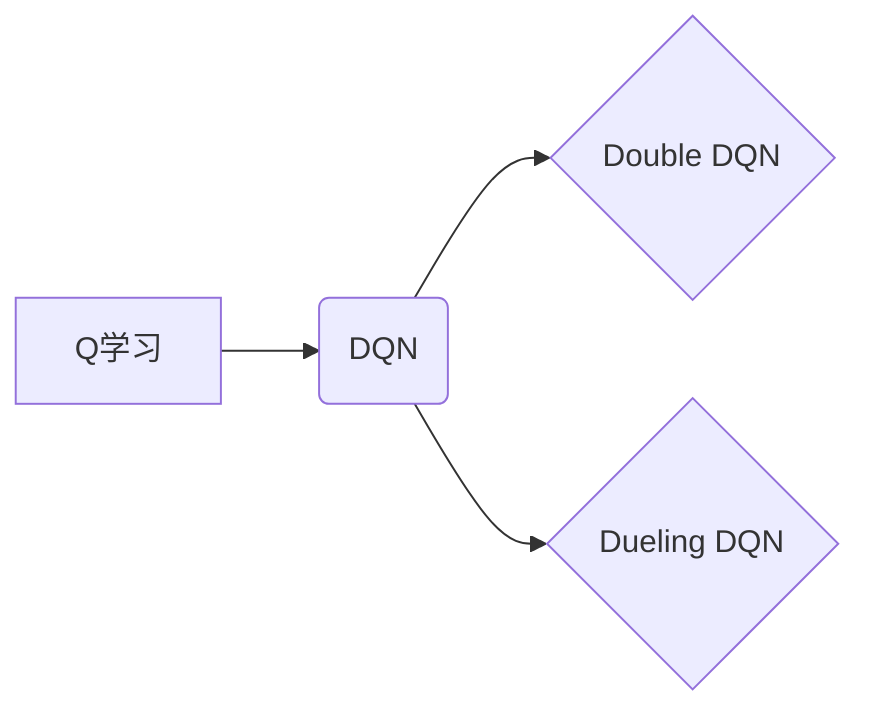

## 一切皆是映射：DQN的改进算法：从Double DQN到Dueling DQN

> 关键词：深度强化学习，DQN，Double DQN，Dueling DQN，Q学习，目标网络，经验回放，价值函数

### 1. 背景介绍

深度强化学习（Deep Reinforcement Learning，DRL）近年来取得了令人瞩目的进展，在游戏、机器人控制、自动驾驶等领域展现出强大的应用潜力。其中，深度Q网络（Deep Q-Network，DQN）作为DRL领域的重要里程碑，成功将深度神经网络与Q学习算法相结合，为解决复杂决策问题提供了新的思路。

DQN的核心思想是利用深度神经网络来逼近Q函数，即估计在给定状态下采取特定动作的期望回报。然而，原始DQN算法存在一些缺陷，例如：

* **高方差估计:** Q函数估计值波动较大，导致学习不稳定。
* **过估计问题:** 由于Q值更新依赖于最大Q值，容易导致Q值过高估计。

为了解决这些问题，研究者们提出了许多改进算法，其中Double DQN和Dueling DQN是比较经典的代表。

### 2. 核心概念与联系

**2.1  Q学习算法**

Q学习是一种经典的强化学习算法，其目标是学习一个状态-动作价值函数Q(s,a)，该函数估计在状态s下采取动作a的期望回报。Q学习通过迭代更新Q值，最终找到最优策略。

**2.2  DQN算法**

DQN将Q学习算法与深度神经网络相结合，利用神经网络来逼近Q函数。DQN算法的主要步骤包括：

1. **经验回放:** 将训练过程中收集到的状态、动作、奖励和下一个状态存储在经验回放池中。
2. **采样:** 从经验回放池中随机采样一批数据。
3. **网络预测:** 将状态输入到神经网络中，得到Q值估计。
4. **目标Q值计算:** 使用目标网络（与主网络结构相同，但参数固定）计算目标Q值。
5. **损失函数计算:** 使用平方误差损失函数计算主网络与目标网络之间的误差。
6. **参数更新:** 使用梯度下降算法更新主网络的参数。

**2.3  Double DQN算法**

Double DQN算法旨在解决DQN算法中的过估计问题。其核心思想是使用两个不同的神经网络来分别估计Q值和目标Q值。

* **主网络:** 用于预测Q值。
* **目标网络:** 用于计算目标Q值。

Double DQN算法在计算目标Q值时，使用主网络预测动作值，然后使用目标网络计算目标Q值，从而减少了Q值过高估计的可能性。

**2.4  Dueling DQN算法**

Dueling DQN算法进一步改进DQN算法，通过将Q函数分解为两个部分：

* **状态价值函数 (State Value Function):** 估计在给定状态下采取任意动作的期望回报。
* **优势函数 (Advantage Function):** 估计在给定状态下采取特定动作相对于平均回报的优势。

Dueling DQN算法将这两个部分分别使用神经网络来逼近，并通过加法的方式得到最终的Q值估计。

**2.5  算法关系图**



### 3. 核心算法原理 & 具体操作步骤

#### 3.1  算法原理概述

Double DQN和Dueling DQN都是基于DQN算法的改进算法，旨在解决DQN算法中的高方差估计和过估计问题。

* **Double DQN:** 通过使用两个不同的神经网络来分别估计Q值和目标Q值，减少了Q值过高估计的可能性。
* **Dueling DQN:** 通过将Q函数分解为状态价值函数和优势函数，使得Q值估计更加稳定和准确。

#### 3.2  算法步骤详解

**3.2.1  Double DQN算法步骤**

1. **初始化:** 初始化主网络和目标网络的参数。
2. **经验回放:** 将训练过程中收集到的状态、动作、奖励和下一个状态存储在经验回放池中。
3. **采样:** 从经验回放池中随机采样一批数据。
4. **网络预测:** 将状态输入到主网络中，得到Q值估计。
5. **目标Q值计算:** 使用主网络预测动作值，然后使用目标网络计算目标Q值。
6. **损失函数计算:** 使用平方误差损失函数计算主网络与目标网络之间的误差。
7. **参数更新:** 使用梯度下降算法更新主网络的参数。
8. **目标网络更新:** 定期更新目标网络的参数，使其与主网络参数保持一致。

**3.2.2  Dueling DQN算法步骤**

1. **初始化:** 初始化两个神经网络：状态价值网络和优势网络。
2. **经验回放:** 将训练过程中收集到的状态、动作、奖励和下一个状态存储在经验回放池中。
3. **采样:** 从经验回放池中随机采样一批数据。
4. **网络预测:** 将状态输入到状态价值网络和优势网络中，得到状态价值估计和优势估计。
5. **Q值计算:** 将状态价值估计和优势估计相加，得到最终的Q值估计。
6. **损失函数计算:** 使用平方误差损失函数计算Q值估计与目标Q值之间的误差。
7. **参数更新:** 使用梯度下降算法更新两个网络的参数。
8. **目标网络更新:** 定期更新目标网络的参数，使其与主网络参数保持一致。

#### 3.3  算法优缺点

**3.3.1  Double DQN**

* **优点:** 减少了Q值过高估计的可能性，提高了学习稳定性。
* **缺点:** 增加了模型复杂度，训练时间更长。

**3.3.2  Dueling DQN**

* **优点:** 进一步提高了Q值估计的准确性，学习效果更佳。
* **缺点:** 模型复杂度更高，训练时间更长。

#### 3.4  算法应用领域

Double DQN和Dueling DQN算法在许多强化学习应用领域中取得了成功，例如：

* **游戏:** 在 Atari 游戏、Go 游戏等游戏中取得了人类水平的表现。
* **机器人控制:** 用于控制机器人完成复杂的任务，例如导航、抓取等。
* **自动驾驶:** 用于训练自动驾驶汽车，提高其安全性、效率和可靠性。

### 4. 数学模型和公式 & 详细讲解 & 举例说明

#### 4.1  数学模型构建

**4.1.1  Q函数**

Q函数估计在状态s下采取动作a的期望回报，可以表示为：

$$Q(s, a) = E[\sum_{t=0}^{\infty} \gamma^t r_{t+1} | s_t = s, a_t = a]$$

其中：

* $r_{t+1}$ 是时间步t+1的奖励。
* $\gamma$ 是折扣因子，控制未来奖励的权重。

**4.1.2  目标Q值**

目标Q值是根据当前状态和动作的期望回报计算得到的，可以表示为：

$$Q^*(s, a) = r + \gamma \max_{a'} Q^*(s', a')$$

其中：

* $s'$ 是下一个状态。
* $a'$ 是下一个状态下采取的动作。

**4.1.3  损失函数**

DQN算法使用平方误差损失函数来计算主网络与目标网络之间的误差，可以表示为：

$$L = \frac{1}{N} \sum_{i=1}^{N} (y_i - \hat{Q}(s_i, a_i))^2$$

其中：

* $N$ 是样本数量。
* $y_i$ 是目标Q值。
* $\hat{Q}(s_i, a_i)$ 是主网络预测的Q值。

#### 4.2  公式推导过程

Double DQN算法在计算目标Q值时，使用主网络预测动作值，然后使用目标网络计算目标Q值，公式如下：

$$y_i = r_i + \gamma \hat{Q}^*(s_{i+1}, \arg\max_{a'} \hat{Q}(s_{i+1}, a'))$$

其中：

* $\hat{Q}^*$ 是目标网络。

Dueling DQN算法将Q函数分解为状态价值函数和优势函数，公式如下：

$$Q(s, a) = V(s) + A(s, a)$$

其中：

* $V(s)$ 是状态价值函数。
* $A(s, a)$ 是优势函数。

#### 4.3  案例分析与讲解

**4.3.1  Double DQN案例分析**

假设在玩游戏时，当前状态下采取动作A的Q值估计为10，而目标网络估计的下一个状态下采取所有动作的最大Q值为12。根据Double DQN算法，目标Q值计算公式为：

$$y_i = r_i + \gamma \hat{Q}^*(s_{i+1}, \arg\max_{a'} \hat{Q}(s_{i+1}, a')) = r_i + \gamma \cdot 12$$

其中，$r_i$ 是当前时间步的奖励。

**4.3.2  Dueling DQN案例分析**

假设在玩游戏时，状态价值函数估计为5，优势函数估计为7，则根据Dueling DQN算法，当前状态下采取动作A的Q值估计为：

$$Q(s, a) = V(s) + A(s, a) = 5 + 7 = 12$$

### 5. 项目实践：代码实例和详细解释说明

#### 5.1  开发环境搭建

* Python 3.6+
* TensorFlow/PyTorch
* OpenAI Gym

#### 5.2  源代码详细实现

```python
# Double DQN代码示例

import tensorflow as tf

class DoubleDQN:
    def __init__(self, state_size, action_size):
        self.state_size = state_size
        self.action_size = action_size
        self.gamma = 0.99
        self.epsilon = 1.0
        self.epsilon_decay = 0.995
        self.epsilon_min = 0.01

        self.build_model()

    def build_model(self):
        # 定义主网络和目标网络
        self.main_network = self.create_network()
        self.target_network = self.create_network()

    def create_network(self):
        # 定义神经网络结构
        model = tf.keras.Sequential([
            tf.keras.layers.Dense(64, activation='relu', input_shape=(self.state_size,)),
            tf.keras.layers.Dense(64, activation='relu'),
            tf.keras.layers.Dense(self.action_size)
        ])
        return model

    def choose_action(self, state):
        # 根据epsilon-greedy策略选择动作
        if tf.random.uniform(()) < self.epsilon:
            return tf.random.uniform(shape=(1,), minval=0, maxval=self.action_size, dtype=tf.int32)
        else:
            q_values = self.main_network(state)
            return tf.argmax(q_values, axis=1)

    def train(self, states, actions, rewards, next_states, done):
        # 计算目标Q值
        with tf.GradientTape() as tape:
            q_values = self.main_network(states)
            target_q