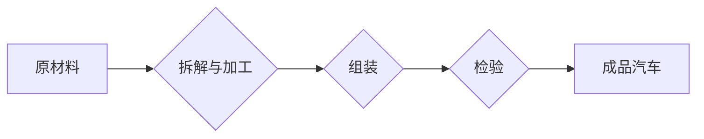

## 亨利·福特与工业革命的核心本质

> 关键词：工业革命、流水线、自动化、标准化、规模化生产、效率、质量、技术创新

## 1. 背景介绍

20世纪初，世界正处于一场深刻的变革之中。蒸汽机、电力和钢铁等技术的进步推动着工业生产的快速发展，标志着人类社会从农业社会向工业社会迈进的进程。在这个背景下，亨利·福特，这位美国汽车工业的先驱，凭借其开创性的流水线生产模式，彻底改变了汽车制造业，也为整个工业革命注入了新的活力。

福特的故事并非仅仅是关于汽车的，更重要的是关于效率、规模化生产和技术创新的本质。他的成功经验，如同工业革命的缩影，揭示了技术进步如何驱动社会变革，如何提升生产效率，降低产品成本，最终造福于大众。

## 2. 核心概念与联系

福特的流水线生产模式的核心概念在于将复杂的生产过程分解成一系列简单、重复性的操作，并通过机械化和标准化，将这些操作串联起来，形成一个高效、连续的生产流程。

**Mermaid 流程图:**



**核心概念原理和架构:**

* **分解与标准化:** 将复杂的产品生产过程分解成一系列简单、重复性的操作，并对每个操作进行标准化，确保操作的统一性和可重复性。
* **流水线化:** 将标准化的操作按照生产流程的顺序排列，形成一个连续的生产线，每个工位负责完成特定的操作，产品在流水线上不断流动。
* **机械化:** 使用机器和设备代替人工完成重复性的操作，提高生产效率和精度。
* **分工合作:** 将生产过程分解成不同的工序，由不同的人员负责完成，实现分工合作，提高生产效率。

## 3. 核心算法原理 & 具体操作步骤

福特的流水线生产模式并非一个严格的算法，而是基于一系列工程实践和管理理念的优化组合。

### 3.1  算法原理概述

福特的流水线生产模式的核心原理在于通过流程优化、标准化和自动化，实现生产过程的连续化、高效化和规模化。

### 3.2  算法步骤详解

1. **产品分解:** 将产品分解成一系列简单、重复性的操作单元。
2. **操作标准化:** 对每个操作单元进行标准化，制定操作规范和流程。
3. **工位设置:** 根据操作单元的特性，设置相应的工位，并配备必要的工具和设备。
4. **流水线布局:** 将工位按照生产流程的顺序排列，形成一个连续的流水线。
5. **人员分工:** 根据工位的职责，对人员进行分工，每个工位负责完成特定的操作。
6. **产品流动:** 产品在流水线上不断流动，每个工位完成相应的操作，最终形成成品。
7. **质量控制:** 在生产过程中进行多点质量控制，确保产品质量。

### 3.3  算法优缺点

**优点:**

* **提高生产效率:** 流水线生产模式可以显著提高生产效率，因为每个工位专注于完成特定的操作，可以更加熟练和快速地完成工作。
* **降低生产成本:** 通过提高生产效率和减少人工成本，可以有效降低生产成本。
* **提高产品质量:** 多点质量控制可以确保产品质量的稳定性和一致性。
* **实现规模化生产:** 流水线生产模式可以方便地进行规模化生产，满足大规模市场需求。

**缺点:**

* **缺乏灵活性:** 流水线生产模式的流程相对固定，难以应对产品变化和市场需求的快速变化。
* **单一化风险:** 如果某个工位出现问题，整个生产线都会受到影响，存在单一化风险。
* **工作重复性高:** 工人们的工作内容相对单一，容易导致工作重复性和枯燥感。

### 3.4  算法应用领域

流水线生产模式广泛应用于汽车制造、电子制造、食品加工、家具制造等各个领域，是现代工业生产的重要模式。

## 4. 数学模型和公式 & 详细讲解 & 举例说明

流水线生产模式可以利用数学模型和公式来进行分析和优化。

### 4.1  数学模型构建

假设一个流水线生产系统，包含n个工位，每个工位完成一个特定的操作，产品在每个工位停留的时间为t_i (i=1,2,...,n)。

* **生产率:**  P = 1 / (t_1 + t_2 +... + t_n)

* **平均生产时间:** T = t_1 + t_2 +... + t_n

### 4.2  公式推导过程

生产率P表示单位时间内生产的产品数量，平均生产时间T表示产品完成整个生产流程所需的时间。

### 4.3  案例分析与讲解

假设一个汽车生产线包含5个工位，每个工位完成一个特定的操作，产品在每个工位停留的时间分别为10分钟、5分钟、15分钟、8分钟和12分钟。

* **生产率:** P = 1 / (10 + 5 + 15 + 8 + 12) = 1 / 50 = 0.02辆/分钟
* **平均生产时间:** T = 10 + 5 + 15 + 8 + 12 = 50分钟

## 5. 项目实践：代码实例和详细解释说明

以下是一个简单的Python代码实例，模拟一个简单的流水线生产模式。

### 5.1  开发环境搭建

Python 3.x 环境

### 5.2  源代码详细实现

```python
class Product:
    def __init__(self, name):
        self.name = name
        self.status = "待加工"

    def process(self, operation):
        self.status = f"{operation}完成"

    def __str__(self):
        return f"产品名称: {self.name}, 状态: {self.status}"

class Workstation:
    def __init__(self, name, operation_time):
        self.name = name
        self.operation_time = operation_time

    def process_product(self, product):
        print(f"工作站 {self.name} 开始处理产品 {product.name}")
        time.sleep(self.operation_time)
        product.process(f"{self.name}操作")
        print(f"工作站 {self.name} 处理产品 {product.name} 完成")

# 创建产品
product = Product("汽车")

# 创建工作站
workstation1 = Workstation("拆解", 10)
workstation2 = Workstation("加工", 5)
workstation3 = Workstation("组装", 15)
workstation4 = Workstation("检验", 8)
workstation5 = Workstation("包装", 12)

# 产品在各个工作站进行加工
workstation1.process_product(product)
workstation2.process_product(product)
workstation3.process_product(product)
workstation4.process_product(product)
workstation5.process_product(product)

# 打印最终产品状态
print(product)
```

### 5.3  代码解读与分析

* **Product类:** 代表一个产品，包含产品名称和状态属性。
* **Workstation类:** 代表一个工作站，包含工作站名称和操作时间属性。
* **process_product方法:** 模拟工作站对产品的加工操作。
* **time.sleep方法:** 模拟工作站加工产品的实际时间。

### 5.4  运行结果展示

代码运行后，会输出产品在各个工作站进行加工的日志，最终打印出产品的最终状态。

## 6. 实际应用场景

福特的流水线生产模式在现代工业生产中得到了广泛应用，例如：

* **汽车制造:** 汽车生产线是流水线生产模式的典型应用场景，通过流水线生产模式，可以实现大规模、高效的汽车生产。
* **电子制造:** 电子产品生产线也广泛采用流水线生产模式，例如手机、电脑、平板电脑等电子产品的生产。
* **食品加工:** 食品加工行业也利用流水线生产模式，例如面包、饼干、方便面等食品的生产。

### 6.4  未来应用展望

随着人工智能、机器学习和自动化技术的不断发展，流水线生产模式将更加智能化、自动化和灵活化。

## 7. 工具和资源推荐

### 7.1  学习资源推荐

* **《亨利·福特与工业革命》:** 这本书详细介绍了亨利·福特的生平和他的流水线生产模式的创新。
* **《工业革命》:** 这本书介绍了工业革命的历史背景、主要特征和影响。
* **在线课程:** 许多在线平台提供关于工业革命和流水线生产模式的课程。

### 7.2  开发工具推荐

* **Python:** Python是一种流行的编程语言，可以用于模拟和分析流水线生产模式。
* **ROS (Robot Operating System):** ROS是一个开源机器人操作系统，可以用于开发自动化生产系统。

### 7.3  相关论文推荐

* **"The Impact of Automation on Manufacturing Productivity"**
* **"The Evolution of the Assembly Line"**
* **"Lean Manufacturing: Principles and Practices"**

## 8. 总结：未来发展趋势与挑战

### 8.1  研究成果总结

福特的流水线生产模式是工业革命的重要成果之一，它彻底改变了生产方式，提高了生产效率和降低了生产成本，造福于人类社会。

### 8.2  未来发展趋势

未来，流水线生产模式将更加智能化、自动化和灵活化，人工智能、机器学习和自动化技术将进一步推动生产效率的提升。

### 8.3  面临的挑战

* **技术挑战:** 如何实现更加智能化、自动化和灵活的流水线生产模式，需要不断突破技术瓶颈。
* **社会挑战:** 流水线生产模式可能会导致部分工作岗位的消失，需要社会进行相应的调整和应对。

### 8.4  研究展望

未来，需要继续研究和探索更加高效、智能和可持续的生产模式，以满足人类社会不断增长的需求。

## 9. 附录：常见问题与解答

* **Q: 流水线生产模式的缺点是什么？**

* **A:** 流水线生产模式的缺点包括缺乏灵活性、单一化风险和工作重复性高。

* **Q: 流水线生产模式的应用领域有哪些？**

* **A:** 流水线生产模式广泛应用于汽车制造、电子制造、食品加工、家具制造等各个领域。

* **Q: 未来流水线生产模式的发展趋势是什么？**

* **A:** 未来流水线生产模式将更加智能化、自动化和灵活化。


作者：禅与计算机程序设计艺术 / Zen and the Art of Computer Programming 
