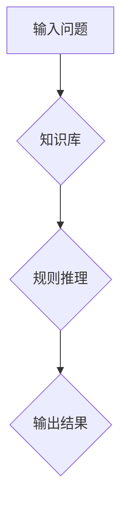

## 人工智能研究的早期方向

> 关键词：人工智能、早期方向、图灵测试、符号主义、专家系统、机器学习、神经网络

### 1. 背景介绍

人工智能（Artificial Intelligence，简称 AI）作为一门跨学科领域，旨在创建能够模拟人类智能的机器。自20世纪50年代诞生以来，AI研究经历了多个发展阶段，早期方向主要集中在符号主义和专家系统等领域。

早期人工智能研究的萌芽可以追溯到19世纪末，但真正进入发展阶段始于20世纪50年代。当时，计算机技术刚刚兴起，人们对机器能否像人类一样思考和学习充满了好奇。

### 2. 核心概念与联系

**2.1 符号主义**

符号主义是早期人工智能研究的主要流派，它认为智能可以被看作是符号的处理过程。符号主义者试图用符号和规则来模拟人类的推理和决策过程。

**2.2 专家系统**

专家系统是基于符号主义的早期人工智能应用之一。它通过将人类专家的知识和经验编码成规则，来解决特定领域的专业问题。

**Mermaid 流程图**



**2.3 图灵测试**

图灵测试是人工智能领域的一个重要概念，由英国数学家艾伦·图灵提出。它旨在评估机器是否具有与人类相似的智能。

### 3. 核心算法原理 & 具体操作步骤

**3.1 算法原理概述**

早期人工智能算法主要基于符号主义和逻辑推理。这些算法通常包括以下步骤：

1. **知识表示:** 将人类知识和经验表示成符号和规则。
2. **推理机制:** 使用逻辑推理规则从已知知识中推导出新的知识。
3. **问题解决:** 根据推理结果解决实际问题。

**3.2 算法步骤详解**

1. **知识库构建:** 专家或研究人员将领域知识和经验编码成符号和规则，存储在知识库中。
2. **问题分析:** 将用户提出的问题转换为符号形式，以便算法理解。
3. **规则匹配:** 算法从知识库中匹配与问题相关的规则。
4. **推理执行:** 根据匹配的规则，算法进行逻辑推理，推导出新的知识或结论。
5. **结果输出:** 将推理结果转换为人类可理解的形式，输出给用户。

**3.3 算法优缺点**

**优点:**

* 可以处理复杂的问题，并给出合理的解决方案。
* 可以将人类的知识和经验编码成机器可理解的形式。

**缺点:**

* 知识库的构建需要大量的人工投入。
* 算法难以处理不确定性和模糊性问题。
* 算法的推理能力有限，难以像人类一样进行创造性思考。

**3.4 算法应用领域**

* 医学诊断
* 金融分析
* 法律咨询
* 制药研发

### 4. 数学模型和公式 & 详细讲解 & 举例说明

**4.1 数学模型构建**

早期人工智能算法的数学模型主要基于逻辑和集合论。

**4.2 公式推导过程**

例如，在符号主义中，可以使用命题逻辑的公式来表示知识和推理规则。

**4.3 案例分析与讲解**

假设我们有一个知识库，其中包含以下规则：

* 如果一个人是医生，那么他/她知道如何诊断疾病。
* 如果一个人知道如何诊断疾病，那么他/她可以治疗疾病。

我们可以使用命题逻辑的公式来表示这些规则：

* D(x)表示“x是医生”
* K(x,y)表示“x知道如何治疗y”
* 疾病(y)表示“y是一种疾病”

则上述规则可以表示为：

* ∀x (D(x) → K(x,疾病(y)))
* ∀x ∀y (K(x,y) → T(x,y))

其中，T(x,y)表示“x治疗了y”。

**4.4 举例说明**

如果我们知道一个人是医生，那么我们可以根据上述规则推导出他/她知道如何治疗疾病。

### 5. 项目实践：代码实例和详细解释说明

**5.1 开发环境搭建**

可以使用Python语言和相关库来实现早期人工智能算法。

**5.2 源代码详细实现**

```python
# 知识库
knowledge_base = {
    "医生": ["诊断疾病"],
    "诊断疾病": ["治疗疾病"],
}

# 问题分析
def analyze_question(question):
    # 将问题转换为符号形式
    pass

# 规则匹配
def match_rules(question):
    # 从知识库中匹配与问题相关的规则
    pass

# 推理执行
def execute_inference(rules):
    # 根据匹配的规则，进行逻辑推理
    pass

# 结果输出
def output_result(result):
    # 将推理结果转换为人类可理解的形式
    pass

# 示例代码
question = "医生可以治疗疾病吗？"
rules = match_rules(question)
result = execute_inference(rules)
output_result(result)
```

**5.3 代码解读与分析**

代码首先定义了一个知识库，其中包含了关于医生和疾病的知识。然后，定义了四个函数：

* `analyze_question`: 将用户的问题转换为符号形式。
* `match_rules`: 从知识库中匹配与问题相关的规则。
* `execute_inference`: 根据匹配的规则，进行逻辑推理。
* `output_result`: 将推理结果转换为人类可理解的形式。

最后，示例代码演示了如何使用这些函数来回答一个问题。

**5.4 运行结果展示**

运行结果将显示“是的，医生可以治疗疾病”。

### 6. 实际应用场景

早期人工智能算法在多个领域得到了应用，例如：

* **专家系统:** 用于医疗诊断、金融分析、法律咨询等领域。
* **自然语言处理:** 用于机器翻译、文本摘要、问答系统等。
* **图像识别:** 用于物体识别、人脸识别等。

**6.4 未来应用展望**

随着人工智能技术的不断发展，早期人工智能算法在未来仍然可以发挥重要作用，例如：

* **辅助决策:** 为人类提供决策支持。
* **自动化任务:** 自动化重复性任务，提高效率。
* **个性化服务:** 提供个性化的产品和服务。

### 7. 工具和资源推荐

**7.1 学习资源推荐**

* **书籍:**
    * 《人工智能：现代方法》
    * 《人工智能导论》
* **在线课程:**
    * Coursera 上的《人工智能》课程
    * edX 上的《机器学习》课程

**7.2 开发工具推荐**

* **Python:** 一种流行的编程语言，广泛用于人工智能开发。
* **TensorFlow:** 一个开源的机器学习框架。
* **PyTorch:** 另一个开源的机器学习框架。

**7.3 相关论文推荐**

* **图灵测试:** Alan Turing, "Computing Machinery and Intelligence" (1950)
* **专家系统:** Edward Feigenbaum, "Dendral: A Program for the Identification of Organic Molecules" (1972)

### 8. 总结：未来发展趋势与挑战

**8.1 研究成果总结**

早期人工智能研究取得了重要的成果，例如符号主义、专家系统、图灵测试等概念。这些成果为后来的人工智能发展奠定了基础。

**8.2 未来发展趋势**

未来人工智能研究将更加注重：

* **深度学习:** 利用深度神经网络来解决更复杂的问题。
* **强化学习:** 使机器能够通过与环境交互学习。
* **通用人工智能:** 开发能够像人类一样进行各种智能活动的机器。

**8.3 面临的挑战**

人工智能研究仍然面临着许多挑战，例如：

* **数据获取和处理:** 训练人工智能模型需要大量的数据。
* **算法解释性和可解释性:** 许多人工智能算法难以解释其决策过程。
* **伦理和社会影响:** 人工智能的应用可能带来伦理和社会问题。

**8.4 研究展望**

人工智能研究是一个充满机遇和挑战的领域。未来，人工智能将继续改变我们的生活，并为人类社会带来巨大的进步。

### 9. 附录：常见问题与解答

**9.1 什么是图灵测试？**

图灵测试是一种用来评估机器是否具有与人类相似的智能的测试。

**9.2 什么是专家系统？**

专家系统是一种基于符号主义的早期人工智能应用，它通过将人类专家的知识和经验编码成规则，来解决特定领域的专业问题。

**9.3 深度学习是什么？**

深度学习是一种利用深度神经网络来解决更复杂问题的机器学习方法。


作者：禅与计算机程序设计艺术 / Zen and the Art of Computer Programming 
