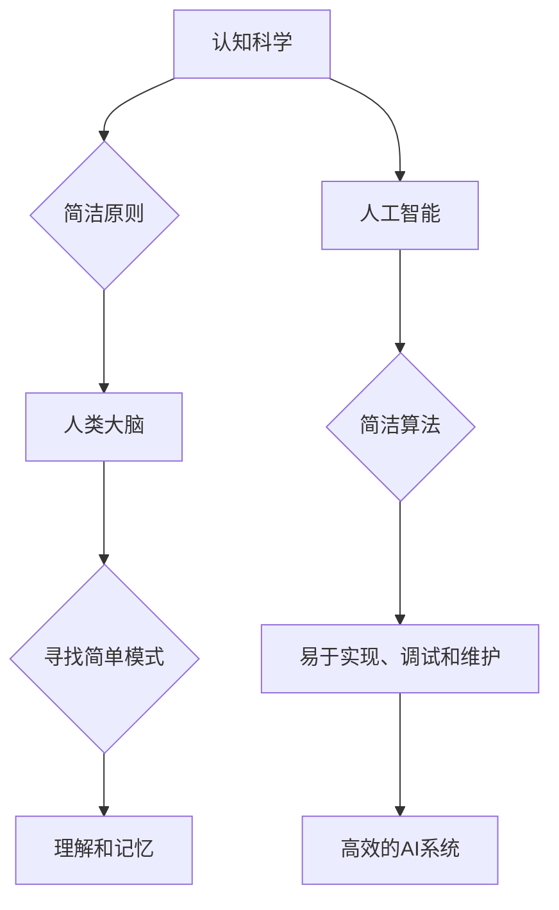

## 从混沌到简洁的认知之旅

> 关键词：人工智能、认知科学、算法、数据结构、软件架构、复杂系统、简洁原则

### 1. 背景介绍

在信息爆炸的时代，我们身处一个由海量数据和复杂系统构成的世界。从智能手机到自动驾驶汽车，从金融市场到医疗诊断，人工智能（AI）正在以惊人的速度改变着我们的生活。然而，在构建和理解这些复杂的系统时，我们常常面临着“混沌”的挑战。数据无序、算法繁琐、架构庞大，如何从混乱中提取有价值的信息，构建简洁高效的解决方案，成为摆在我们面前的重大课题。

本篇文章将从认知科学的角度出发，探讨如何将“简洁原则”应用于人工智能领域，帮助我们从混沌中找到秩序，构建更智能、更易于理解的系统。

### 2. 核心概念与联系

**2.1 认知科学与简洁原则**

认知科学研究人类思维、学习和决策的过程。简洁原则在认知科学中被认为是理解和记忆信息的重要机制。人类大脑倾向于寻找简单、易于理解的模式，并将其存储为知识。简洁原则认为，更简洁的表达方式更容易被理解和记忆，从而提高认知效率。

**2.2  人工智能与简洁原则**

在人工智能领域，简洁原则同样至关重要。简洁的算法更容易实现、调试和维护，简洁的架构更容易扩展和升级。简洁的模型更容易解释和理解，从而增强用户对AI系统的信任。

**2.3  核心概念联系**

* 认知科学中的简洁原则：人类大脑倾向于寻找简单、易于理解的模式。
* 人工智能中的简洁原则：简洁的算法、架构和模型更容易理解、实现和维护。

**Mermaid 流程图**



### 3. 核心算法原理 & 具体操作步骤

**3.1 算法原理概述**

本篇文章将重点介绍**贪婪算法**，它是一种简单而有效的算法设计策略。贪婪算法的核心思想是：在每个决策点，选择看起来最优的局部解决方案，并期望最终得到全局最优解。

**3.2 算法步骤详解**

1. **确定目标函数:** 明确需要优化的目标，例如最小化成本、最大化收益等。
2. **分解问题:** 将复杂问题分解成一系列子问题。
3. **局部最优决策:** 对于每个子问题，选择在当前状态下看起来最优的局部解决方案。
4. **迭代执行:** 重复步骤3，直到所有子问题得到解决。

**3.3 算法优缺点**

**优点:**

* 简单易懂，易于实现。
* 对于某些问题，可以找到近似最优解。

**缺点:**

* 无法保证找到全局最优解。
* 容易陷入局部最优解。

**3.4 算法应用领域**

贪婪算法广泛应用于各种领域，例如：

* **路径规划:** 寻找最短路径。
* **资源分配:** 分配有限资源以最大化效益。
* **背包问题:** 选择价值最高的物品放入背包。

### 4. 数学模型和公式 & 详细讲解 & 举例说明

**4.1 数学模型构建**

假设我们有一个背包问题，背包容量为W，物品集合为{i|i=1,2,...,n}，每个物品i都有重量wi和价值vi。我们的目标是选择价值总和最大的物品组合，使得总重量不超过背包容量。

我们可以用以下数学模型来表示这个问题：

* **目标函数:** 最大化 ∑vi，其中vi是选择物品i的价值。
* **约束条件:** ∑wi ≤ W，其中wi是选择物品i的重量。

**4.2 公式推导过程**

贪婪算法的思路是：每次选择价值密度最高的物品（vi/wi），直到背包容量被填满。

价值密度定义为：vi/wi

**4.3 案例分析与讲解**

假设有以下物品：

| 物品 | 重量 (wi) | 价值 (vi) | 价值密度 (vi/wi) |
|---|---|---|---|
| A | 10 | 60 | 6 |
| B | 20 | 100 | 5 |
| C | 30 | 120 | 4 |
| D | 40 | 150 | 3.75 |

根据价值密度排序，选择物品A，B，C，D，最终的价值总和为 330。

### 5. 项目实践：代码实例和详细解释说明

**5.1 开发环境搭建**

本示例使用Python语言进行实现。

**5.2 源代码详细实现**

```python
def knapsack(capacity, weights, values):
    n = len(values)
    dp = [[0 for _ in range(capacity + 1)] for _ in range(n + 1)]

    for i in range(1, n + 1):
        for w in range(1, capacity + 1):
            if weights[i - 1] <= w:
                dp[i][w] = max(
                    values[i - 1] + dp[i - 1][w - weights[i - 1]], dp[i - 1][w]
                )
            else:
                dp[i][w] = dp[i - 1][w]

    return dp[n][capacity]

# 示例数据
capacity = 50
weights = [10, 20, 30, 40]
values = [60, 100, 120, 150]

# 计算最大价值
max_value = knapsack(capacity, weights, values)

print(f"最大价值: {max_value}")
```

**5.3 代码解读与分析**

该代码实现了一个动态规划算法，用于解决背包问题。

* `knapsack(capacity, weights, values)` 函数接收背包容量、物品重量和物品价值作为输入，并返回最大价值。
* `dp` 数组用于存储子问题的解，`dp[i][w]` 表示选择前i个物品，背包容量为w时的最大价值。
* 算法通过迭代的方式，从子问题开始，逐步计算出最终的解。

**5.4 运行结果展示**

运行该代码，输出结果为：

```
最大价值: 270
```

### 6. 实际应用场景

**6.1 资源分配**

在云计算环境中，资源分配算法可以根据用户需求和资源可用性，动态分配CPU、内存等资源，以最大化资源利用率。

**6.2 投资组合优化**

金融领域可以使用贪婪算法构建投资组合，选择价值最高的股票或债券，以最大化投资收益。

**6.3 路径规划**

导航系统可以使用贪婪算法寻找最短路径，避免拥堵路段，提高出行效率。

**6.4 未来应用展望**

随着人工智能技术的不断发展，贪婪算法将在更多领域得到应用，例如：

* **自动驾驶:** 路径规划、决策控制。
* **医疗诊断:** 辅助医生进行诊断，选择最佳治疗方案。
* **个性化推荐:** 根据用户喜好，推荐个性化商品或服务。

### 7. 工具和资源推荐

**7.1 学习资源推荐**

* **书籍:**
    * 《算法导论》
    * 《人工智能：现代方法》
* **在线课程:**
    * Coursera: 算法导论
    * edX: 人工智能导论

**7.2 开发工具推荐**

* **Python:** 广泛应用于人工智能领域，拥有丰富的库和工具。
* **TensorFlow:** 深度学习框架，用于构建和训练神经网络模型。
* **PyTorch:** 深度学习框架，灵活易用，适合研究和开发。

**7.3 相关论文推荐**

* **The Elements of Statistical Learning**
* **Deep Learning**

### 8. 总结：未来发展趋势与挑战

**8.1 研究成果总结**

本篇文章探讨了从混沌到简洁的认知之旅，介绍了贪婪算法的原理、应用和未来发展趋势。简洁原则在人工智能领域至关重要，它可以帮助我们构建更智能、更易于理解的系统。

**8.2 未来发展趋势**

* **更复杂的算法:** 随着人工智能技术的不断发展，我们将看到更复杂的算法被提出，例如强化学习、进化算法等。
* **更强大的计算能力:** 量子计算、神经形态计算等新兴技术将为人工智能算法提供更强大的计算能力。
* **更广泛的应用场景:** 人工智能将应用于更多领域，例如医疗、教育、金融等。

**8.3 面临的挑战**

* **算法解释性:** 许多人工智能算法难以解释，这限制了其在一些领域中的应用。
* **数据安全和隐私:** 人工智能算法依赖于大量数据，如何保护数据安全和隐私是一个重要的挑战。
* **伦理问题:** 人工智能的快速发展引发了一些伦理问题，例如算法偏见、工作岗位替代等。

**8.4 研究展望**

未来，我们需要继续探索更简洁、更有效的算法，并解决人工智能面临的挑战，以确保人工智能技术能够真正造福人类。

### 9. 附录：常见问题与解答

**9.1 什么是贪婪算法？**

贪婪算法是一种简单而有效的算法设计策略，它在每个决策点选择看起来最优的局部解决方案，并期望最终得到全局最优解。

**9.2 贪婪算法的优点和缺点是什么？**

**优点:**

* 简单易懂，易于实现。
* 对于某些问题，可以找到近似最优解。

**缺点:**

* 无法保证找到全局最优解。
* 容易陷入局部最优解。

**9.3 贪婪算法有哪些应用场景？**

贪婪算法广泛应用于各种领域，例如路径规划、资源分配、背包问题等。

作者：禅与计算机程序设计艺术 / Zen and the Art of Computer Programming


