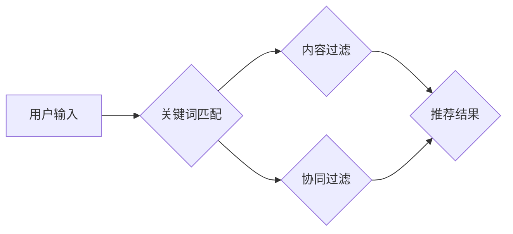

## 1. 背景介绍

在信息爆炸的时代，海量数据和信息涌现，如何高效地找到用户所需的信息和内容成为了一个关键问题。搜索推荐系统作为信息获取和内容发现的重要工具，在电商、社交媒体、新闻资讯等领域发挥着越来越重要的作用。传统搜索推荐系统主要依靠关键词匹配、协同过滤等方法，来实现对用户需求的理解和内容的推荐。

传统的搜索推荐系统主要面临以下挑战：

* **信息冗余和噪音:**  海量数据中存在大量冗余信息和噪音，传统的关键词匹配方法难以准确地理解用户意图。
* **冷启动问题:**  对于新用户和新商品，缺乏历史数据，难以进行有效的推荐。
* **数据孤岛问题:**  不同平台和系统的数据难以共享和整合，导致推荐结果不够全面和精准。
* **个性化推荐不足:**  传统的推荐方法往往缺乏对用户个性化需求的考虑，推荐结果不够精准和用户友好。

## 2. 核心概念与联系

**2.1 核心概念**

* **关键词匹配:**  根据用户输入的关键词，在数据库中查找包含这些关键词的文档或内容。
* **协同过滤:**  根据用户的历史行为数据，预测用户对其他物品的兴趣。
* **内容过滤:**  根据物品的特征和描述，推荐与用户兴趣相符的物品。
* **基于模型的推荐:**  利用机器学习模型，学习用户和物品之间的关系，进行个性化推荐。

**2.2 架构图**



**2.3 联系**

传统搜索推荐系统通常采用多种方法相结合的方式，来实现更精准和个性化的推荐。例如，关键词匹配可以帮助快速定位相关内容，协同过滤可以根据用户兴趣推荐相似物品，内容过滤可以根据物品特征推荐用户感兴趣的物品。

## 3. 核心算法原理 & 具体操作步骤

**3.1 算法原理概述**

传统搜索推荐系统中的核心算法主要包括关键词匹配算法、协同过滤算法和内容过滤算法。

* **关键词匹配算法:**  根据用户输入的关键词，在数据库中查找包含这些关键词的文档或内容。该算法简单易实现，但难以处理用户模糊查询和语义理解问题。
* **协同过滤算法:**  根据用户的历史行为数据，预测用户对其他物品的兴趣。该算法可以发现用户之间的潜在关联，推荐用户可能感兴趣的物品，但存在数据稀疏性和冷启动问题。
* **内容过滤算法:**  根据物品的特征和描述，推荐与用户兴趣相符的物品。该算法可以根据物品本身的属性进行推荐，但需要准确的物品特征描述和用户兴趣模型。

**3.2 算法步骤详解**

**3.2.1 关键词匹配算法**

1. **预处理:** 对用户输入的关键词进行预处理，例如去除停用词、 stemming、 lemmatization 等。
2. **关键词索引:** 将数据库中的文档或内容进行关键词索引，构建关键词索引树或词典。
3. **关键词匹配:** 根据预处理后的关键词，在关键词索引中查找匹配的文档或内容。
4. **排序:** 根据匹配度排序结果，返回用户最相关的文档或内容。

**3.2.2 协同过滤算法**

1. **数据收集:** 收集用户的历史行为数据，例如用户对物品的评分、购买记录、浏览记录等。
2. **用户相似度计算:** 计算用户之间的相似度，例如使用余弦相似度、皮尔逊相关系数等。
3. **物品推荐:** 根据用户与其他用户的相似度，推荐用户可能感兴趣的物品。

**3.2.3 内容过滤算法**

1. **物品特征提取:** 从物品的描述、属性等信息中提取特征，例如物品类别、价格、品牌等。
2. **用户兴趣模型构建:** 根据用户的历史行为数据，构建用户兴趣模型，例如使用朴素贝叶斯、决策树等。
3. **物品推荐:** 根据用户兴趣模型和物品特征，推荐与用户兴趣相符的物品。

**3.3 算法优缺点**

| 算法 | 优点 | 缺点 |
|---|---|---|
| 关键词匹配 | 简单易实现 | 难以处理模糊查询和语义理解问题 |
| 协同过滤 | 可以发现用户之间的潜在关联 | 数据稀疏性和冷启动问题 |
| 内容过滤 | 可以根据物品本身的属性进行推荐 | 需要准确的物品特征描述和用户兴趣模型 |

**3.4 算法应用领域**

* **电商推荐:**  推荐商品、优惠券、促销活动等。
* **社交媒体推荐:**  推荐好友、群组、话题等。
* **新闻资讯推荐:**  推荐新闻文章、视频、图片等。
* **音乐娱乐推荐:**  推荐歌曲、专辑、音乐人等。

## 4. 数学模型和公式 & 详细讲解 & 举例说明

**4.1 数学模型构建**

**4.1.1 关键词匹配**

关键词匹配算法通常使用TF-IDF（Term Frequency-Inverse Document Frequency）模型来计算关键词的权重。

* **TF (Term Frequency):**  关键词在文档中出现的频率。
* **IDF (Inverse Document Frequency):**  关键词在整个文档集合中出现的频率的倒数。

**TF-IDF 公式:**

$$TF-IDF(t, d) = TF(t, d) \times IDF(t)$$

其中，t 是关键词，d 是文档。

**4.1.2 协同过滤**

协同过滤算法通常使用矩阵分解技术来学习用户和物品之间的关系。

* **用户-物品交互矩阵:**  记录用户对物品的评分或行为数据。

**矩阵分解公式:**

$$R = U V^T$$

其中，R 是用户-物品交互矩阵，U 是用户特征矩阵，V 是物品特征矩阵。

**4.2 公式推导过程**

**4.2.1 TF-IDF 公式推导**

TF-IDF 公式的推导过程如下：

1. 计算关键词在文档中的频率：

$$TF(t, d) = \frac{f(t, d)}{\sum_{t' \in d} f(t', d)}$$

其中，f(t, d) 是关键词t在文档d中出现的次数。

2. 计算关键词在整个文档集合中的逆向文档频率：

$$IDF(t) = \log \frac{N}{df(t)}$$

其中，N 是文档总数，df(t) 是关键词t在文档集合中出现的文档数。

3. 将 TF 和 IDF 相乘得到 TF-IDF 值：

$$TF-IDF(t, d) = TF(t, d) \times IDF(t)$$

**4.2.2 矩阵分解公式推导**

矩阵分解公式的推导过程涉及线性代数和优化算法，这里不再详细展开。

**4.3 案例分析与讲解**

**4.3.1 TF-IDF 案例分析**

假设有两个文档，文档1 是关于“人工智能”的，文档2 是关于“机器学习”的。

* 文档1 中“人工智能”出现的次数为 5，其他关键词出现的次数为 10。
* 文档2 中“机器学习”出现的次数为 3，其他关键词出现的次数为 7。

使用 TF-IDF 模型计算 “人工智能” 和 “机器学习” 在两个文档中的权重，可以发现 “人工智能” 在文档1 中的权重更高，而 “机器学习” 在文档2 中的权重更高。

**4.3.2 矩阵分解案例分析**

假设有一个用户-物品交互矩阵，记录用户对电影的评分数据。

使用矩阵分解技术对该矩阵进行分解，可以得到用户特征矩阵和物品特征矩阵。

通过分析用户特征矩阵和物品特征矩阵，可以发现用户之间的相似度和物品之间的相似度，从而进行个性化推荐。

## 5. 项目实践：代码实例和详细解释说明

**5.1 开发环境搭建**

* 操作系统: Ubuntu 20.04
* Python 版本: 3.8
* 必要的库: numpy, pandas, scikit-learn

**5.2 源代码详细实现**

```python
# 关键词匹配算法示例
import nltk
from nltk.corpus import stopwords
from sklearn.feature_extraction.text import TfidfVectorizer

# 下载停用词列表
nltk.download('stopwords')

# 定义停用词列表
stop_words = set(stopwords.words('english'))

# 预处理文本
def preprocess_text(text):
    # 将文本转换为小写
    text = text.lower()
    # 去除停用词
    words = [word for word in text.split() if word not in stop_words]
    # 返回预处理后的文本
    return''.join(words)

# 创建 TF-IDF 向量化器
vectorizer = TfidfVectorizer()

# 预处理文本数据
documents = [
    "This is the first document.",
    "This document is the second document.",
    "And this is the third one.",
    "Is this the first document?"
]
processed_documents = [preprocess_text(doc) for doc in documents]

# 将文本数据转换为 TF-IDF 向量
tfidf_matrix = vectorizer.fit_transform(processed_documents)

# 计算关键词权重
feature_names = vectorizer.get_feature_names_out()
for i, doc in enumerate(processed_documents):
    print(f"Document {i+1}: {doc}")
    print(f"TF-IDF Weights: {tfidf_matrix[i].toarray()}")
    print(f"Top Keywords: {feature_names[tfidf_matrix[i].argsort()[:-6:-1]]}")

# 协同过滤算法示例
from sklearn.metrics.pairwise import cosine_similarity

# 创建用户-物品交互矩阵
ratings = [
    [5, 4, 3, 2, 1],
    [4, 5, 2, 1, 3],
    [3, 2, 5, 4, 1],
    [2, 1, 4, 5, 3],
    [1, 3, 1, 3, 5]
]

# 计算用户相似度
user_similarity = cosine_similarity(ratings)

# 找到与用户1最相似的用户
similar_users = user_similarity[0].argsort()[:-6:-1]
print(f"Similar Users to User 1: {similar_users}")

# 推荐物品给用户1
recommended_items = []
for similar_user in similar_users:
    # 获取相似用户喜欢的物品
    liked_items = np.where(ratings[similar_user] > 3)[0]
    # 如果用户1没有喜欢这些物品，则添加到推荐列表中
    for item in liked_items:
        if ratings[0][item] == 0:
            recommended_items.append(item)

print(f"Recommended Items for User 1: {recommended_items}")


```

**5.3 代码解读与分析**

* **关键词匹配算法示例:**  该代码示例演示了如何使用 TF-IDF 模型进行关键词匹配。首先，预处理文本数据，去除停用词等。然后，使用 TF-IDF 向量化器将文本数据转换为 TF-IDF 向量。最后，计算关键词权重，并输出关键词及其权重。
* **协同过滤算法示例:**  该代码示例演示了如何使用协同过滤算法进行推荐。首先，创建用户-物品交互矩阵，记录用户对物品的评分数据。然后，使用余弦相似度计算用户之间的相似度。最后，找到与目标用户最相似的用户，并根据相似用户的喜好推荐物品给目标用户。

**5.4 运行结果展示**

运行上述代码，可以得到以下结果：

* **关键词匹配算法示例:**  输出每个文档的预处理后的文本、TF-IDF 向量和关键词权重。
* **协同过滤算法示例:**  输出与目标用户最相似的用户以及推荐给目标用户的物品。

## 6. 