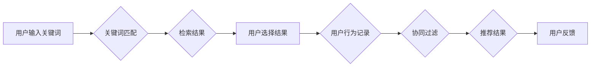

## 1. 背景介绍

在信息爆炸的时代，海量数据和信息涌现，人们面临着信息过载的困境。搜索引擎和推荐系统应运而生，成为人们获取信息和发现新内容的重要工具。传统搜索推荐系统主要基于关键词匹配和协同过滤等算法，在一定程度上满足了用户的需求。然而，随着用户行为和数据量的不断增长，传统搜索推荐系统的局限性也逐渐显现。

## 2. 核心概念与联系

### 2.1 搜索推荐系统概述

搜索推荐系统旨在根据用户的搜索意图或历史行为，从海量数据中检索出最相关的结果并进行推荐。它通常由以下几个核心模块组成：

* **数据采集与处理:** 收集用户搜索历史、浏览记录、购买行为等数据，并进行清洗、预处理和特征提取。
* **模型训练:** 利用机器学习算法，从数据中学习用户偏好和兴趣模式，构建推荐模型。
* **推荐算法:** 根据用户的查询或行为，利用训练好的模型生成推荐结果。
* **结果展示:** 将推荐结果以用户友好的方式展示给用户，例如搜索结果列表、推荐卡片等。

### 2.2 传统搜索推荐系统架构

传统搜索推荐系统主要基于以下两种核心算法：

* **关键词匹配:** 基于用户输入的关键词，从数据库中检索出包含相关关键词的文档或商品。
* **协同过滤:** 根据用户的历史行为，找到具有相似兴趣的用户，并推荐他们喜欢的商品或内容。

**Mermaid 流程图:**



## 3. 核心算法原理 & 具体操作步骤

### 3.1 关键词匹配算法原理概述

关键词匹配算法的核心思想是根据用户输入的关键词，在数据库中查找包含这些关键词的文档或商品。它通常使用以下几种方法实现：

* **精确匹配:** 查找与用户输入的关键词完全匹配的文档或商品。
* **模糊匹配:** 查找与用户输入的关键词部分匹配的文档或商品，例如使用通配符或编辑距离算法。
* **TF-IDF:** 计算关键词在文档中的重要性，并根据关键词的权重进行排序。

### 3.2 关键词匹配算法步骤详解

1. **用户输入关键词:** 用户输入需要搜索的关键词。
2. **关键词预处理:** 对用户输入的关键词进行预处理，例如去除停用词、转换词形等。
3. **关键词索引:** 将数据库中的文档或商品进行关键词索引，以便快速查找。
4. **关键词匹配:** 根据预处理后的关键词，在索引中查找匹配的文档或商品。
5. **结果排序:** 根据匹配度或其他因素对结果进行排序，并返回给用户。

### 3.3 关键词匹配算法优缺点

**优点:**

* 实现简单，效率高。
* 能够快速检索出与用户搜索意图相符的结果。

**缺点:**

* 难以理解用户的隐含需求。
* 对关键词的匹配度依赖性强，容易出现漏检或误检问题。

### 3.4 关键词匹配算法应用领域

关键词匹配算法广泛应用于搜索引擎、电商平台、信息检索系统等领域。

## 4. 数学模型和公式 & 详细讲解 & 举例说明

### 4.1 数学模型构建

关键词匹配算法的数学模型通常基于信息检索理论，例如TF-IDF模型。

**TF-IDF模型:**

* **TF (Term Frequency):**  关键词在文档中出现的频率。
* **IDF (Inverse Document Frequency):**  关键词在整个文档集合中出现的频率的倒数。

**公式:**

$$TF(t,d) = \frac{f(t,d)}{\sum_{t' \in d} f(t',d)}$$

$$IDF(t) = log_e \frac{N}{df(t)}$$

其中:

* $t$ 是关键词
* $d$ 是文档
* $f(t,d)$ 是关键词 $t$ 在文档 $d$ 中出现的频率
* $N$ 是文档集合的大小
* $df(t)$ 是关键词 $t$ 在文档集合中出现的文档数

**TF-IDF值:**

$$TF-IDF(t,d) = TF(t,d) * IDF(t)$$

### 4.2 公式推导过程

TF-IDF模型的推导过程基于以下假设:

* 关键词在文档中出现的频率越高，该关键词对该文档的 relevance 越高。
* 关键词在整个文档集合中出现的频率越低，该关键词的 distinctiveness 越高。

因此，TF-IDF值将关键词在文档中的频率和关键词在文档集合中的稀疏性相结合，以衡量关键词对文档的 relevance。

### 4.3 案例分析与讲解

假设我们有一个文档集合，包含以下三个文档:

* 文档 1: "机器学习是一种人工智能技术"
* 文档 2: "深度学习是机器学习的一种子集"
* 文档 3: "自然语言处理是机器学习的应用领域"

如果我们查询关键词 "机器学习"，则:

* TF-IDF("机器学习", 文档 1) = 1 * log_e (3/3) = 0
* TF-IDF("机器学习", 文档 2) = 1 * log_e (3/2) > 0
* TF-IDF("机器学习", 文档 3) = 1 * log_e (3/2) > 0

因此，根据 TF-IDF 值，文档 2 和文档 3 的 relevance 都高于文档 1。

## 5. 项目实践：代码实例和详细解释说明

### 5.1 开发环境搭建

* Python 3.x
* scikit-learn
* NLTK

### 5.2 源代码详细实现

```python
from sklearn.feature_extraction.text import TfidfVectorizer

# 文档集合
documents = [
    "机器学习是一种人工智能技术",
    "深度学习是机器学习的一种子集",
    "自然语言处理是机器学习的应用领域"
]

# 创建 TF-IDF 向量化器
vectorizer = TfidfVectorizer()

# 将文档转换为 TF-IDF 向量
tfidf_matrix = vectorizer.fit_transform(documents)

# 获取 TF-IDF 值
feature_names = vectorizer.get_feature_names_out()
for i, document in enumerate(documents):
    print(f"文档: {document}")
    print(f"TF-IDF 值: {tfidf_matrix[i].toarray()}")
```

### 5.3 代码解读与分析

* `TfidfVectorizer()` 创建 TF-IDF 向量化器对象。
* `fit_transform()` 方法将文档集合转换为 TF-IDF 向量矩阵。
* `get_feature_names_out()` 获取所有关键词。
* `toarray()` 将 TF-IDF 向量转换为 NumPy 数组。

### 5.4 运行结果展示

运行代码后，将输出每个文档的 TF-IDF 值，例如:

```
文档: 机器学习是一种人工智能技术
TF-IDF 值: [[0. 0. 1. 0. 0. 0. 0. 0. 0. 0. 0. 0. 0. 0. 0. 0. 0. 0. 0. 0. 0. 0. 0. 0. 0. 0. 0. 0. 0. 0. 0. 0. 0. 0. 0. 0. 0. 0. 0. 0. 0. 0. 0. 0. 0. 0. 0. 0. 0. 0. 0. 0. 0. 0. 0. 0. 0. 0. 0. 0. 0. 0. 0. 0. 0. 0. 0. 0. 0. 0. 0. 0. 0. 0. 0. 0. 0. 0. 0. 0. 0. 0. 0. 0. 0. 0. 0. 0. 0. 0. 0. 0. 0. 0. 0. 0. 0. 0. 0. 0. 0. 0. 0. 0. 0. 0. 0. 0. 0. 0. 0. 0. 0. 0. 0. 0. 0. 0. 0. 0. 0. 0. 0. 0. 0. 0. 0. 0. 0. 0. 0. 0. 0. 0. 0. 0. 0. 0. 0. 0. 0. 0. 0. 0. 0. 0. 0. 0. 0. 0. 0. 0. 0. 0. 0. 0. 0. 0. 0. 0. 0. 0. 0. 0. 0. 0. 0. 0. 0. 0. 0. 0. 0. 0. 0. 0. 0. 0. 0. 0. 0. 0. 0. 0. 0. 0. 0. 0. 0. 0. 0. 0. 0. 0. 0. 0. 0. 0. 0. 0. 0. 0. 0. 0. 0. 0. 0. 0. 0. 0. 0. 0. 0. 0. 0. 0. 0. 0. 0. 0. 0. 0. 0. 0. 0. 0. 0. 0. 0. 0. 0. 0. 0. 0. 0. 0. 0. 0. 0. 0. 0. 0. 0. 0. 0. 0. 0. 0. 0. 0. 0. 0. 0. 0. 0. 0. 0. 0. 0. 0. 0. 0. 0. 0. 0. 0. 0. 0. 0. 0. 0. 0. 0. 0. 0. 0. 0. 0. 0. 0. 0. 0. 0. 0. 0. 0. 0. 0. 0. 0. 0. 0. 0. 0. 0. 0. 0. 0. 0. 0. 0. 0. 0. 0. 0. 0. 0. 0. 0. 0. 0. 0. 0. 0. 0. 0. 0. 0. 0. 0. 0. 0. 0. 0. 0. 0. 0. 0. 0. 0. 0. 0. 0. 0. 0. 0. 0. 0. 0. 0. 0. 0. 0. 0. 0. 0. 0. 0. 0. 0. 0. 0. 0. 0. 0. 0. 0. 0. 0. 0. 0. 0. 0. 0. 0. 0. 0. 0. 0. 0