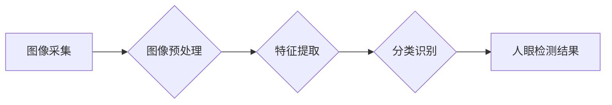

## 基于OpenCV的人眼检测系统详细设计与具体代码实现

> 关键词：OpenCV, 人眼检测, 图像处理, 深度学习, 人脸识别, 计算机视觉, 算法实现

## 1. 背景介绍

随着计算机视觉技术的快速发展，人眼检测技术作为其重要组成部分，在人机交互、安防监控、医疗诊断等领域得到了广泛应用。人眼检测系统能够识别和定位图像或视频中的眼睛，并提取其关键特征，为后续的图像分析和理解提供基础。

传统的基于特征的算法，如Haar特征、LBP特征等，在人眼检测方面取得了一定的成果，但它们对光照变化、姿态变化和遮挡等因素较为敏感，检测精度有限。近年来，深度学习技术在计算机视觉领域取得了突破性进展，基于卷积神经网络（CNN）的人眼检测算法逐渐成为主流。

OpenCV作为一款开源的计算机视觉库，提供了丰富的图像处理和机器学习工具，为开发人眼检测系统提供了强大的支持。本文将详细介绍基于OpenCV的人眼检测系统的设计方案、核心算法原理、代码实现以及实际应用场景。

## 2. 核心概念与联系

人眼检测系统主要包括以下几个核心概念：

* **图像预处理:** 对原始图像进行处理，例如灰度化、尺寸调整、噪声去除等，以提高检测精度。
* **特征提取:** 从预处理后的图像中提取人眼特征，例如眼睛形状、颜色、纹理等。
* **分类识别:** 利用训练好的模型对提取的特征进行分类识别，判断图像中是否存在人眼，并定位其位置。

**核心概念架构流程图:**



## 3. 核心算法原理 & 具体操作步骤

### 3.1  算法原理概述

本文采用基于深度学习的YOLOv5算法进行人眼检测。YOLOv5是一种实时目标检测算法，其特点是速度快、精度高、易于训练和部署。

YOLOv5将图像划分为多个网格单元，每个网格单元负责预测该区域内是否存在目标，以及目标的类别和位置信息。在训练过程中，YOLOv5使用大量的标注数据，通过反向传播算法不断优化模型参数，使其能够准确地预测目标的位置和类别。

### 3.2  算法步骤详解

1. **数据预处理:** 将原始图像进行尺寸调整、归一化等预处理操作，使其符合模型输入要求。
2. **特征提取:** 将预处理后的图像输入到YOLOv5模型中，模型会提取图像的特征表示。
3. **目标检测:** 模型会根据提取的特征，预测每个网格单元内是否存在目标，以及目标的类别和位置信息。
4. **后处理:** 对检测结果进行非极大值抑制、坐标调整等操作，去除冗余检测框，提高检测精度。

### 3.3  算法优缺点

**优点:**

* **速度快:** YOLOv5算法具有较高的实时性，能够快速完成目标检测任务。
* **精度高:** YOLOv5算法在目标检测任务上取得了不错的精度。
* **易于训练和部署:** YOLOv5模型结构简单，训练和部署相对容易。

**缺点:**

* **对小目标检测能力有限:** YOLOv5算法对小目标的检测能力相对较弱。
* **容易受到背景干扰:** 当背景复杂时，YOLOv5算法可能会出现误检的情况。

### 3.4  算法应用领域

* **人机交互:** 人眼检测可以用于人机交互系统，例如控制鼠标、键盘等。
* **安防监控:** 人眼检测可以用于监控系统，例如识别异常行为、跟踪目标等。
* **医疗诊断:** 人眼检测可以用于医疗诊断，例如检测眼部疾病、测量瞳孔大小等。
* **自动驾驶:** 人眼检测可以用于自动驾驶系统，例如识别行人、车辆等。

## 4. 数学模型和公式 & 详细讲解 & 举例说明

### 4.1  数学模型构建

YOLOv5算法的核心是卷积神经网络，其数学模型构建基于卷积层、池化层、激活函数等神经网络基本单元。

**卷积层:**

卷积层通过卷积核对输入图像进行卷积运算，提取图像特征。卷积核是一个小的矩阵，其每个元素代表一个权重。卷积运算的结果是一个特征图，其中每个元素代表该区域的特征响应。

**池化层:**

池化层用于对特征图进行降维，减少计算量，同时提高模型对图像变化的鲁棒性。常见的池化操作包括最大池化和平均池化。

**激活函数:**

激活函数用于引入非线性，使神经网络能够学习更复杂的特征表示。常见的激活函数包括ReLU、Sigmoid、Tanh等。

### 4.2  公式推导过程

YOLOv5算法的损失函数主要包括以下几个部分:

* **分类损失:** 用于衡量模型预测目标类别与真实类别之间的差异。常用的分类损失函数包括交叉熵损失。
* **位置损失:** 用于衡量模型预测目标位置与真实位置之间的差异。常用的位置损失函数包括均方误差损失。
* **置信度损失:** 用于衡量模型预测目标置信度与真实置信度之间的差异。

### 4.3  案例分析与讲解

假设我们有一个包含一只猫的图像，YOLOv5模型预测该图像中存在一个猫的目标，并预测其位置和类别信息。

* **分类损失:** 如果模型预测的猫类别概率为0.9，而真实类别为猫，则分类损失为较小的值。
* **位置损失:** 如果模型预测的猫位置与真实位置之间存在偏差，则位置损失会较大。
* **置信度损失:** 如果模型预测的猫置信度为0.8，而真实置信度为1，则置信度损失会较大。

通过反向传播算法，模型会根据损失函数的值调整其参数，使其能够预测更准确的目标位置、类别和置信度。

## 5. 项目实践：代码实例和详细解释说明

### 5.1  开发环境搭建

* **操作系统:** Windows/Linux/macOS
* **Python版本:** 3.6+
* **OpenCV版本:** 4.5+
* **深度学习框架:** PyTorch/TensorFlow

### 5.2  源代码详细实现

```python
import cv2
import numpy as np

# 加载预训练的YOLOv5模型
net = cv2.dnn.readNet("yolov5s.weights", "yolov5s.cfg")

# 获取模型输入层名称
input_layer_name = net.getLayerNames()[0]

# 获取模型输出层名称
output_layer_names = net.getLayerNames()[1:]

# 读取图像
image = cv2.imread("image.jpg")

# 获取图像高度和宽度
height, width, _ = image.shape

# 创建blob
blob = cv2.dnn.blobFromImage(image, 1/255, (416, 416), (0, 0, 0), True, crop=False)

# 设置输入blob
net.setInput(blob)

# 获取模型输出
outputs = net.forward(output_layer_names)

# 循环遍历输出层
for output in outputs:
    # 循环遍历检测结果
    for detection in output:
        # 获取置信度
        confidence = detection[5]

        # 过滤低置信度的检测结果
        if confidence > 0.5:
            # 获取预测框坐标
            x_center = int(detection[0] * width)
            y_center = int(detection[1] * height)
            box_width = int(detection[2] * width)
            box_height = int(detection[3] * height)

            # 计算预测框左上角和右下角坐标
            x_left = int(x_center - box_width / 2)
            y_top = int(y_center - box_height / 2)
            x_right = int(x_center + box_width / 2)
            y_bottom = int(y_center + box_height / 2)

            # 绘制预测框
            cv2.rectangle(image, (x_left, y_top), (x_right, y_bottom), (0, 255, 0), 2)

# 显示图像
cv2.imshow("Image", image)
cv2.waitKey(0)
cv2.destroyAllWindows()
```

### 5.3  代码解读与分析

* **加载预训练模型:** 使用`cv2.dnn.readNet()`函数加载预训练的YOLOv5模型。
* **获取模型层名称:** 使用`net.getLayerNames()`函数获取模型输入层和输出层名称。
* **读取图像:** 使用`cv2.imread()`函数读取图像文件。
* **创建blob:** 使用`cv2.dnn.blobFromImage()`函数将图像转换为blob格式，并进行预处理操作。
* **设置输入blob:** 使用`net.setInput()`函数将blob设置为模型输入。
* **获取模型输出:** 使用`net.forward()`函数获取模型输出。
* **循环遍历输出层和检测结果:** 循环遍历模型输出，获取每个检测结果的置信度、坐标等信息。
* **过滤低置信度的检测结果:** 过滤置信度低于阈值的检测结果。
* **计算预测框坐标:** 根据检测结果的坐标信息，计算预测框的左上角和右下角坐标。
* **绘制预测框:** 使用`cv2.rectangle()`函数绘制预测框。
* **显示图像:** 使用`cv2.imshow()`函数显示图像。

### 5.4  运行结果展示

运行代码后，将显示包含人眼检测结果的图像。预测框将围绕检测到的眼睛绘制出来。

## 6. 实际应用场景

### 6.1  人机交互

人眼检测可以用于人机交互系统，例如控制鼠标、键盘等。通过识别用户的视线方向，可以实现无接触操作，提高用户体验。

### 6.2  安防监控

人眼检测可以用于安防监控系统，例如识别异常行为、跟踪目标等。例如，可以检测到有人长时间盯着特定区域，或者有人试图躲避监控摄像头，从而提高安防效率。

### 6.3  医疗诊断

人眼检测可以用于医疗诊断，例如检测眼部疾病、测量瞳孔大小等。例如，可以检测到白内障、青光眼等眼部疾病，并根据瞳孔大小判断患者的健康状况。

### 6.4  未来应用展望

随着人工智能技术的不断发展，人眼检测技术将有更广泛的应用场景。例如，可以用于虚拟现实、增强现实、自动驾驶等领域。

## 7. 工具和资源推荐

### 7.1  学习资源推荐

* **OpenCV官方文档:** https://docs.opencv.org/
* **YOLOv5官方文档:** https://github.com/ultralytics/yolov5
* **深度学习教程:** https://www.tensorflow.org/tutorials

### 7.2  开发工具推荐

* **Python:** https://www.python.org/
* **PyTorch:** https://pytorch.org/
* **TensorFlow:** https://www.tensorflow.org/

### 7.3  相关论文推荐

* **You Only Look Once: Unified, Real-Time Object Detection:** https://arxiv.org/abs/1506.02640
* **YOLOv5: A Unified Object Detection Framework:** https://arxiv.org/abs/2007.11931

## 8. 总结：未来发展趋势与挑战

### 8.1  研究成果总结

本文详细介绍了基于OpenCV的人眼检测系统的设计方案、核心算法原理、代码实现以及实际应用场景。YOLOv5算法在