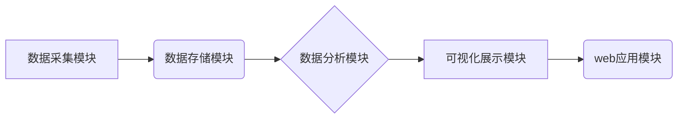

## 基于web的大数据系统监控平合的设计与实现

> 关键词：大数据系统、监控平台、web应用、数据采集、数据分析、可视化展示、分布式架构、实时监控

## 1. 背景介绍

随着互联网技术的飞速发展，海量数据呈爆炸式增长，大数据系统作为处理和分析海量数据的关键基础设施，在各个领域发挥着越来越重要的作用。然而，大数据系统的复杂性和规模也带来了新的挑战，如何有效地监控大数据系统的运行状态，及时发现和解决潜在问题，成为了保障大数据系统稳定运行和高效工作的关键。

传统的监控系统往往局限于单一节点或组件的监控，难以满足大数据系统分布式、异构、高并发等特点的需求。因此，设计和实现一个基于web的大数据系统监控平台，能够实现对整个大数据系统的全方位、实时监控，并提供可视化展示、数据分析等功能，显得尤为重要。

## 2. 核心概念与联系

### 2.1 核心概念

* **大数据系统:** 指处理海量数据、具有高吞吐量、高并行度、高可用性等特点的分布式数据处理系统。
* **监控平台:** 用于收集、分析和展示系统运行状态信息的软件系统。
* **web应用:** 基于web技术的应用程序，用户可以通过浏览器访问和使用。
* **数据采集:** 从大数据系统中收集运行状态信息，例如CPU使用率、内存使用率、网络流量等。
* **数据分析:** 对收集到的运行状态信息进行分析，发现异常情况和潜在问题。
* **可视化展示:** 将分析结果以图表、图形等形式展示，方便用户理解和决策。

### 2.2 架构设计

基于web的大数据系统监控平台通常采用分布式架构，以满足大数据系统的规模和性能需求。平台主要由以下几个模块组成：

* **数据采集模块:** 负责从各个大数据系统节点收集运行状态信息。
* **数据存储模块:** 负责存储收集到的运行状态信息，可以使用数据库、消息队列等技术。
* **数据分析模块:** 负责对存储的运行状态信息进行分析，发现异常情况和潜在问题。
* **可视化展示模块:** 负责将分析结果以图表、图形等形式展示，方便用户理解和决策。
* **web应用模块:** 提供用户界面，用户可以通过浏览器访问和使用平台。

**Mermaid 流程图**



## 3. 核心算法原理 & 具体操作步骤

### 3.1 算法原理概述

大数据系统监控平台的核心算法主要包括数据采集、数据存储、数据分析和可视化展示等方面的算法。

* **数据采集算法:** 采用多种方式收集大数据系统运行状态信息，例如使用SNMP协议、JMX接口、日志分析等。
* **数据存储算法:** 选择合适的数据库或消息队列技术存储收集到的运行状态信息，例如使用MongoDB、Kafka等。
* **数据分析算法:** 使用统计分析、机器学习等算法对存储的运行状态信息进行分析，发现异常情况和潜在问题。
* **可视化展示算法:** 使用图表、图形等形式将分析结果展示给用户，例如使用D3.js、ECharts等。

### 3.2 算法步骤详解

**数据采集算法步骤:**

1. 确定需要采集的数据指标。
2. 选择合适的采集方式，例如使用SNMP协议、JMX接口、日志分析等。
3. 开发采集程序，实现数据采集功能。
4. 将采集到的数据发送到数据存储模块。

**数据存储算法步骤:**

1. 选择合适的数据库或消息队列技术。
2. 设计数据模型，定义数据结构和存储方式。
3. 开发数据存储程序，实现数据存储功能。
4. 确保数据存储的可靠性和安全性。

**数据分析算法步骤:**

1. 对存储的数据进行清洗和预处理。
2. 选择合适的分析算法，例如使用统计分析、机器学习等。
3. 开发数据分析程序，实现数据分析功能。
4. 将分析结果存储到数据库或消息队列中。

**可视化展示算法步骤:**

1. 设计可视化图表和图形。
2. 开发可视化展示程序，实现数据可视化功能。
3. 将分析结果展示给用户。

### 3.3 算法优缺点

**数据采集算法:**

* **优点:** 可以收集到丰富的系统运行状态信息。
* **缺点:** 采集过程可能存在延迟，并且需要对各个系统进行定制化开发。

**数据存储算法:**

* **优点:** 可以保证数据的可靠性和安全性。
* **缺点:** 需要考虑数据存储的成本和性能。

**数据分析算法:**

* **优点:** 可以发现异常情况和潜在问题。
* **缺点:** 需要专业的算法工程师进行开发和维护。

**可视化展示算法:**

* **优点:** 可以方便用户理解和决策。
* **缺点:** 需要考虑图表和图形的设计和美观度。

### 3.4 算法应用领域

大数据系统监控平台的核心算法广泛应用于各个领域，例如：

* **金融行业:** 监控交易系统、风险管理系统等。
* **电商行业:** 监控商品推荐系统、支付系统等。
* **互联网行业:** 监控网站访问系统、用户行为分析系统等。
* **医疗行业:** 监控电子病历系统、医疗影像分析系统等。

## 4. 数学模型和公式 & 详细讲解 & 举例说明

### 4.1 数学模型构建

大数据系统监控平台的数学模型主要用于数据分析和可视化展示。例如，可以使用时间序列分析模型预测系统资源的未来需求，可以使用聚类算法将用户行为进行分类，可以使用回归模型预测系统性能指标的变化趋势。

### 4.2 公式推导过程

以下是一个简单的例子，使用线性回归模型预测系统CPU使用率的变化趋势。

假设系统CPU使用率的历史数据为：

```
时间: 1, 2, 3, 4, 5
CPU使用率: 70%, 75%, 80%, 85%, 90%
```

我们可以使用线性回归模型来拟合这些数据，得到一个预测公式：

```
CPU使用率 = a * 时间 + b
```

其中，a和b是需要求解的回归系数。

可以使用最小二乘法来求解a和b的值。

### 4.3 案例分析与讲解

假设我们使用线性回归模型预测系统CPU使用率在未来时间段的变化趋势。

根据历史数据，我们可以得到一个预测公式：

```
CPU使用率 = 5 * 时间 + 65
```

这意味着，系统CPU使用率每增加一个时间单位，就会增加5%。

我们可以使用这个公式来预测未来时间段的CPU使用率，例如，在时间为6时，系统CPU使用率的预测值为：

```
CPU使用率 = 5 * 6 + 65 = 95%
```

## 5. 项目实践：代码实例和详细解释说明

### 5.1 开发环境搭建

* 操作系统: Ubuntu 18.04
* 编程语言: Python 3.6
* 框架: Flask
* 数据库: MongoDB

### 5.2 源代码详细实现

```python
from flask import Flask, render_template
from pymongo import MongoClient

app = Flask(__name__)

# 连接到MongoDB数据库
client = MongoClient('mongodb://localhost:27017/')
db = client['big_data_monitor']
collection = db['system_metrics']

@app.route('/')
def index():
    # 从数据库中获取系统指标数据
    metrics = collection.find()
    return render_template('index.html', metrics=metrics)

if __name__ == '__main__':
    app.run(debug=True)
```

### 5.3 代码解读与分析

* **代码结构:** 代码使用Flask框架构建了一个简单的web应用。
* **数据库连接:** 使用PyMongo库连接到MongoDB数据库，并获取系统指标数据。
* **路由定义:** 定义了一个根路由 `/`，用于显示系统指标数据。
* **模板渲染:** 使用Jinja2模板引擎渲染 `index.html` 模板，并将系统指标数据传递给模板。

### 5.4 运行结果展示

运行代码后，访问 `http://localhost:5000/`，可以查看系统指标数据。

## 6. 实际应用场景

基于web的大数据系统监控平台可以应用于各种场景，例如：

* **实时监控大数据系统运行状态:** 可以实时监控大数据系统的CPU使用率、内存使用率、网络流量等指标，及时发现和解决潜在问题。
* **数据分析和告警:** 可以对收集到的运行状态信息进行分析，发现异常情况和潜在问题，并设置告警机制，及时通知相关人员。
* **性能优化:** 可以通过分析系统运行状态信息，找出性能瓶颈，并进行优化。
* **容量规划:** 可以根据系统运行状态信息，预测未来系统资源需求，进行容量规划。

### 6.4 未来应用展望

未来，基于web的大数据系统监控平台将更加智能化、自动化和可扩展。例如：

* **人工智能驱动的异常检测:** 使用机器学习算法，对系统运行状态信息进行分析，自动识别异常情况。
* **自动化运维:** 自动执行一些运维任务，例如重启服务、扩容资源等。
* **云原生监控:** 支持云原生环境下的监控和管理。

## 7. 工具和资源推荐

### 7.1 学习资源推荐

* **书籍:**
    * 《大数据系统设计与实现》
    * 《分布式系统设计与实现》
* **在线课程:**
    * Coursera: 大数据系统
    * Udemy: 大数据监控

### 7.2 开发工具推荐

* **监控平台:** Prometheus, Grafana, Zabbix
* **数据存储:** MongoDB, Cassandra, Redis
* **编程语言:** Python, Java, Go
* **框架:** Flask, Django, Spring Boot

### 7.3 相关论文推荐

* **论文:**
    * 《大数据系统监控与管理》
    * 《基于云计算的分布式大数据系统监控平台设计与实现》

## 8. 总结：未来发展趋势与挑战

### 8.1 研究成果总结

基于web的大数据系统监控平台已经取得了显著的成果，能够有效地监控大数据系统的运行状态，并提供数据分析、可视化展示等功能。

### 8.2 未来发展趋势

未来，基于web的大数据系统监控平台将更加智能化、自动化和可扩展，并朝着以下几个方向发展：

* **人工智能驱动的异常检测:** 使用机器学习算法，对系统运行状态信息进行分析，自动识别异常情况。
* **自动化运维:** 自动执行一些运维任务，例如重启服务、扩容资源等。
* **云原生监控:** 支持云原生环境下的监控和管理。

### 8.3 面临的挑战

* **数据量爆炸:** 大数据系统的规模不断增长，监控平台需要能够处理海量数据。
* **异构环境:** 大数据系统通常由多种不同的组件组成，监控平台需要能够支持异构环境下的监控。
* **实时性要求:** 大数据系统需要实时监控，监控平台需要能够提供低延迟的监控数据。

### 8.4 研究展望

未来，我们将继续研究和开发基于web的大数据系统监控平台，致力于打造一个更加智能化、自动化和可扩展的监控平台，为大数据系统的稳定运行和高效工作提供保障。

## 9. 附录：常见问题与解答

* **问题:** 如何选择合适的监控平台？
* **解答:** 选择监控平台时需要考虑以下因素：
    * 数据量
    * 监控目标
    * 性能要求
    * 成本预算

* **问题:** 如何实现大数据系统监控平台的自动化运维？
* **解答:** 可以使用自动化运维工具，例如Ansible、Puppet等，实现一些运维任务的自动化执行。

* **问题:** 如何保障大