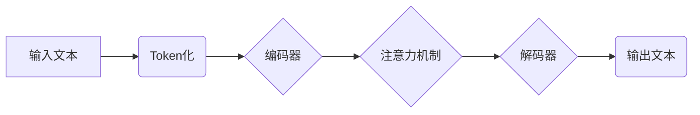

## 大语言模型原理与工程实践：局限和发展

> 关键词：大语言模型、Transformer、自然语言处理、深度学习、文本生成、机器翻译、局限性、发展趋势

### 1. 背景介绍

近年来，深度学习技术取得了飞速发展，特别是Transformer模型的出现，为自然语言处理（NLP）领域带来了革命性的变革。大语言模型（LLM）作为Transformer模型的升级版，拥有海量参数和强大的文本理解和生成能力，在机器翻译、文本摘要、对话系统等领域展现出令人瞩目的应用潜力。

然而，LLM也面临着一些挑战和局限性，例如训练成本高、数据偏见、缺乏可解释性等。本文将深入探讨LLM的原理、工程实践、局限性以及未来的发展趋势，为读者提供一个全面的理解。

### 2. 核心概念与联系

**2.1  自然语言处理（NLP）**

NLP是人工智能的一个分支，旨在使计算机能够理解、处理和生成人类语言。NLP的任务包括文本分类、情感分析、机器翻译、文本摘要等。

**2.2  深度学习（Deep Learning）**

深度学习是一种机器学习的子领域，利用多层神经网络来学习数据中的复杂模式。深度学习模型能够自动提取特征，无需人工特征工程，在图像识别、语音识别、自然语言处理等领域取得了突破性进展。

**2.3  Transformer模型**

Transformer模型是一种基于注意力机制的深度学习模型，能够有效处理序列数据，例如文本。Transformer模型的核心结构是编码器-解码器架构，其中编码器用于提取文本的语义信息，解码器用于生成目标文本。

**2.4  大语言模型（LLM）**

LLM是基于Transformer模型训练的大规模语言模型，拥有海量参数和强大的文本理解和生成能力。LLM能够完成各种自然语言处理任务，例如文本生成、机器翻译、问答系统等。

**2.5  LLM的架构**

### 3. 核心算法原理 & 具体操作步骤

**3.1  算法原理概述**

LLM的核心算法是基于Transformer模型的深度学习算法。该算法利用大量的文本数据进行训练，学习语言的语法规则、语义关系和上下文信息。训练过程中，模型会不断调整参数，以最小化预测文本与真实文本之间的差异。

**3.2  算法步骤详解**

1. **数据预处理:** 将原始文本数据进行清洗、分词、标记等预处理操作，使其能够被模型理解。
2. **模型训练:** 使用深度学习框架（例如TensorFlow、PyTorch）训练Transformer模型。训练过程包括前向传播、反向传播和参数更新等步骤。
3. **模型评估:** 使用测试数据集评估模型的性能，例如准确率、困惑度等指标。
4. **模型部署:** 将训练好的模型部署到实际应用场景中，例如聊天机器人、文本生成工具等。

**3.3  算法优缺点**

**优点:**

* 强大的文本理解和生成能力
* 可以处理长文本序列
* 能够学习复杂的语言模式

**缺点:**

* 训练成本高
* 数据偏见问题
* 缺乏可解释性

**3.4  算法应用领域**

* 机器翻译
* 文本摘要
* 问答系统
* 对话机器人
* 代码生成
* 内容创作

### 4. 数学模型和公式 & 详细讲解 & 举例说明

**4.1  数学模型构建**

LLM的数学模型主要基于神经网络，其中每个神经元都代表一个特征或概念。神经元之间通过连接权重进行信息传递，权重通过训练过程不断调整。

**4.2  公式推导过程**

LLM的训练过程基于反向传播算法，其核心公式包括损失函数、梯度下降算法等。

* **损失函数:** 用于衡量模型预测结果与真实结果之间的差异。常见的损失函数包括交叉熵损失函数、均方误差损失函数等。

* **梯度下降算法:** 用于更新模型参数，使其能够最小化损失函数。梯度下降算法通过计算损失函数的梯度，并沿着梯度相反的方向更新参数。

**4.3  案例分析与讲解**

例如，在机器翻译任务中，LLM会将源语言文本编码成一个向量表示，然后通过解码器生成目标语言文本。损失函数会衡量源语言文本和目标语言文本之间的差异，梯度下降算法会根据损失函数的梯度更新模型参数，使其能够更好地翻译文本。

### 5. 项目实践：代码实例和详细解释说明

**5.1  开发环境搭建**

LLM的开发环境通常需要安装深度学习框架（例如TensorFlow、PyTorch）、自然语言处理库（例如NLTK、spaCy）以及其他必要的软件包。

**5.2  源代码详细实现**

LLM的源代码通常由多个文件组成，包括模型架构定义文件、训练脚本文件、评估脚本文件等。

**5.3  代码解读与分析**

代码解读需要理解模型架构、训练过程、评估指标等关键概念。

**5.4  运行结果展示**

运行LLM的代码可以生成文本、翻译文本、回答问题等结果，并通过评估指标衡量模型的性能。

### 6. 实际应用场景

**6.1  机器翻译**

LLM可以用于将一种语言翻译成另一种语言，例如将英文翻译成中文。

**6.2  文本摘要**

LLM可以用于生成文本的简短摘要，例如将一篇长篇文章总结成几句话。

**6.3  问答系统**

LLM可以用于构建问答系统，例如回答用户提出的问题。

**6.4  对话机器人**

LLM可以用于构建对话机器人，例如聊天机器人。

**6.5  未来应用展望**

LLM在未来将有更广泛的应用场景，例如：

* 个性化教育
* 自动写作
* 代码生成
* 医疗诊断

### 7. 工具和资源推荐

**7.1  学习资源推荐**

* **书籍:**《深度学习》、《自然语言处理》
* **在线课程:** Coursera、edX、Udacity
* **博客:** The Gradient、Towards Data Science

**7.2  开发工具推荐**

* **深度学习框架:** TensorFlow、PyTorch
* **自然语言处理库:** NLTK、spaCy
* **代码托管平台:** GitHub

**7.3  相关论文推荐**

* 《Attention Is All You Need》
* 《BERT: Pre-training of Deep Bidirectional Transformers for Language Understanding》
* 《GPT-3: Language Models are Few-Shot Learners》

### 8. 总结：未来发展趋势与挑战

**8.1  研究成果总结**

近年来，LLM取得了显著的进展，在文本理解和生成方面展现出强大的能力。

**8.2  未来发展趋势**

* 模型规模进一步扩大
* 训练效率提升
* 跨模态理解和生成
* 可解释性和安全性增强

**8.3  面临的挑战**

* 训练成本高
* 数据偏见问题
* 缺乏可解释性
* 潜在的滥用风险

**8.4  研究展望**

未来研究将重点关注降低训练成本、解决数据偏见问题、提高模型可解释性和安全性，以及探索LLM在更多领域的应用。

### 9. 附录：常见问题与解答

**9.1  什么是LLM？**

LLM是指基于Transformer模型训练的大规模语言模型，拥有海量参数和强大的文本理解和生成能力。

**9.2  LLM的训练数据是什么？**

LLM的训练数据通常是大量的文本数据，例如书籍、文章、网站内容等。

**9.3  LLM的应用场景有哪些？**

LLM的应用场景包括机器翻译、文本摘要、问答系统、对话机器人等。

**9.4  LLM的局限性是什么？**

LLM的局限性包括训练成本高、数据偏见问题、缺乏可解释性等。

**9.5  LLM的未来发展趋势是什么？**

LLM的未来发展趋势包括模型规模进一步扩大、训练效率提升、跨模态理解和生成、可解释性和安全性增强等。

作者：禅与计算机程序设计艺术 / Zen and the Art of Computer Programming 
