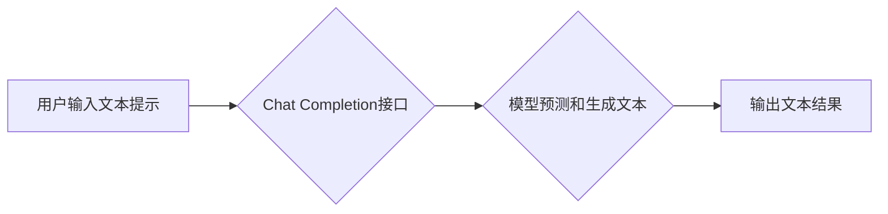

## 大语言模型应用指南：Chat Completion接口参数详解

> 关键词：大语言模型、Chat Completion、接口参数、应用指南、文本生成、对话系统、自然语言处理

## 1. 背景介绍

近年来，大语言模型（LLM）在自然语言处理领域取得了令人瞩目的进展。这些模型能够理解和生成人类语言，展现出强大的文本生成、翻译、摘要和问答能力。其中，Chat Completion接口作为一种重要的应用接口，为开发者提供了便捷的方式与LLM交互，构建各种基于对话的应用。

Chat Completion接口的核心功能是根据用户输入的文本提示，预测并生成后续文本内容。它可以用于构建聊天机器人、智能客服、文本创作工具等多种应用场景。然而，为了充分发挥Chat Completion接口的潜力，开发者需要深入了解其参数设置，并根据具体应用场景进行调整。

本指南将深入探讨Chat Completion接口的参数设置，帮助开发者更好地理解和利用这些参数，构建更智能、更精准的对话系统。

## 2. 核心概念与联系

### 2.1  Chat Completion接口

Chat Completion接口是一种专门用于文本生成任务的API接口。它接受用户输入的文本提示作为输入，并根据模型训练的知识和语言规律，预测并生成后续文本内容。

### 2.2  大语言模型

大语言模型（LLM）是一种基于深度学习的强大神经网络模型，能够处理和理解大量的文本数据。通过训练海量的文本数据，LLM能够学习语言的语法、语义和上下文关系，从而实现文本生成、翻译、摘要等多种自然语言处理任务。

### 2.3  参数设置

Chat Completion接口的参数设置直接影响模型生成的文本质量和准确性。这些参数可以控制模型的生成策略、文本风格、长度等方面。

**Mermaid 流程图**



## 3. 核心算法原理 & 具体操作步骤

### 3.1  算法原理概述

Chat Completion接口的核心算法原理是基于Transformer架构的解码器网络。解码器网络通过自注意力机制和多头注意力机制，捕捉文本序列中的上下文信息，并根据输入提示预测后续文本内容。

### 3.2  算法步骤详解

1. **输入处理:** 将用户输入的文本提示进行预处理，例如分词、词嵌入等。
2. **编码:** 将预处理后的文本提示编码成一个固定长度的向量表示。
3. **解码:** 使用解码器网络，根据编码后的文本提示和之前生成的文本片段，预测下一个词的概率分布。
4. **采样:** 从预测的概率分布中采样一个词作为下一个生成词。
5. **重复步骤3和4:** 直到生成指定长度的文本或达到终止条件。
6. **输出处理:** 将生成的文本片段进行后处理，例如去除非法字符、合并词等。

### 3.3  算法优缺点

**优点:**

* 能够生成流畅、自然的文本内容。
* 能够捕捉文本序列中的上下文信息。
* 能够根据不同的参数设置，控制文本的风格、长度等方面。

**缺点:**

* 训练成本高，需要大量的计算资源和数据。
* 可能会生成不准确或不合理的文本内容。
* 难以解释模型的生成机制。

### 3.4  算法应用领域

Chat Completion接口的应用领域非常广泛，包括：

* **聊天机器人:** 构建能够进行自然对话的聊天机器人。
* **智能客服:** 自动回复用户咨询，提高客户服务效率。
* **文本创作工具:** 辅助用户撰写文章、故事、诗歌等文本内容。
* **代码生成:** 根据用户需求生成代码片段。
* **机器翻译:** 将文本从一种语言翻译成另一种语言。

## 4. 数学模型和公式 & 详细讲解 & 举例说明

### 4.1  数学模型构建

Chat Completion接口的数学模型主要基于Transformer架构的解码器网络。解码器网络由多个编码层和解码层组成，每个层包含多头注意力机制、前馈神经网络等模块。

### 4.2  公式推导过程

由于篇幅限制，此处不再详细推导Transformer模型的数学公式。感兴趣的读者可以参考相关论文和书籍进行深入学习。

### 4.3  案例分析与讲解

假设我们使用Chat Completion接口生成一段关于“人工智能”的文本。

**用户输入提示:** 人工智能

**模型输出文本:** 人工智能是利用计算机模拟人类智能的一种技术。它涵盖了多个领域，例如机器学习、自然语言处理、计算机视觉等。

在该例子中，Chat Completion接口根据用户输入的提示“人工智能”，利用其训练的知识和语言规律，预测并生成了一段关于人工智能的文本内容。

## 5. 项目实践：代码实例和详细解释说明

### 5.1  开发环境搭建

为了使用Chat Completion接口，需要搭建相应的开发环境。具体步骤如下：

1. 安装Python语言环境。
2. 安装必要的库，例如transformers、torch等。
3. 创建一个API密钥，用于访问Chat Completion接口。

### 5.2  源代码详细实现

```python
from transformers import pipeline

# 初始化Chat Completion模型
generator = pipeline("text-generation", model="gpt2")

# 用户输入提示
prompt = "人工智能"

# 生成文本
output = generator(prompt, max_length=50, num_return_sequences=3)

# 打印结果
for text in output:
    print(text["generated_text"])
```

### 5.3  代码解读与分析

* `pipeline("text-generation", model="gpt2")`: 使用transformers库初始化Chat Completion模型，这里使用的是gpt2模型。
* `prompt = "人工智能"`: 设置用户输入的文本提示。
* `max_length=50`: 设置生成的文本最大长度为50个词。
* `num_return_sequences=3`: 设置生成3个不同的文本结果。
* `output`: 存储模型生成的文本结果。
* `for text in output:`: 循环遍历生成的文本结果，并打印出来。

### 5.4  运行结果展示

```
人工智能是利用计算机模拟人类智能的一种技术。它涵盖了多个领域，例如机器学习、自然语言处理、计算机视觉等。
人工智能是一种新兴的科技领域，它正在改变着我们的生活方式。人工智能技术在各个领域都有着广泛的应用，例如医疗、金融、教育等。
人工智能的发展前景广阔，它将为人类社会带来巨大的变革。
```

## 6. 实际应用场景

### 6.1  聊天机器人

Chat Completion接口可以用于构建能够进行自然对话的聊天机器人。例如，可以构建一个可以回答用户关于天气、新闻、交通等问题的聊天机器人。

### 6.2  智能客服

Chat Completion接口可以用于构建智能客服系统，自动回复用户咨询，提高客户服务效率。例如，可以构建一个可以回答用户关于产品、订单、退换货等问题的智能客服系统。

### 6.3  文本创作工具

Chat Completion接口可以用于构建文本创作工具，辅助用户撰写文章、故事、诗歌等文本内容。例如，可以构建一个可以根据用户输入的主题和关键词，自动生成文章大纲和文本内容的工具。

### 6.4  未来应用展望

随着大语言模型技术的不断发展，Chat Completion接口的应用场景将会更加广泛。例如，可以用于个性化教育、自动代码生成、创意写作等领域。

## 7. 工具和资源推荐

### 7.1  学习资源推荐

* **论文:**
    * Attention Is All You Need (Vaswani et al., 2017)
    * BERT: Pre-training of Deep Bidirectional Transformers for Language Understanding (Devlin et al., 2018)
* **书籍:**
    * Deep Learning (Goodfellow et al., 2016)
    * Natural Language Processing with Python (Bird et al., 2009)

### 7.2  开发工具推荐

* **transformers:** 一个用于自然语言处理任务的Python库，提供了许多预训练的模型和工具。
* **Hugging Face:** 一个开源平台，提供大量的预训练模型和数据集。

### 7.3  相关论文推荐

* **GPT-3: Language Models are Few-Shot Learners (Brown et al., 2020)**
* **T5: Text-to-Text Transfer Transformer (Raffel et al., 2019)**
* **LaMDA: Language Model for Dialogue Applications (Google AI Blog, 2021)**

## 8. 总结：未来发展趋势与挑战

### 8.1  研究成果总结

Chat Completion接口的应用已经取得了显著的成果，在聊天机器人、智能客服、文本创作等领域展现出巨大的潜力。

### 8.2  未来发展趋势

未来，Chat Completion接口的发展趋势包括：

* **模型规模的进一步扩大:** 更大的模型规模能够带来更强的文本生成能力和理解能力。
* **多模态交互:** 将文本与图像、音频等其他模态信息结合，实现更丰富的交互体验。
* **个性化定制:** 根据用户的需求和偏好，定制个性化的Chat Completion模型。

### 8.3  面临的挑战

Chat Completion接口也面临着一些挑战，例如：

* **数据安全和隐私:** 大语言模型需要大量的文本数据进行训练，如何保证数据安全和隐私是一个重要问题。
* **模型可解释性:** 大语言模型的生成机制难以解释，如何提高模型的可解释性是一个重要的研究方向。
* **伦理问题:** 大语言模型可能会被用于生成虚假信息、进行恶意攻击等，如何解决这些伦理问题是一个需要认真思考的问题。

### 8.4  研究展望

未来，我们需要继续深入研究Chat Completion接口的原理和应用，解决其面临的挑战，并将其应用于更多领域，为人类社会带来更多价值。

## 9. 附录：常见问题与解答

### 9.1  如何选择合适的Chat Completion模型？

选择合适的Chat Completion模型取决于具体的应用场景和需求。例如，对于需要生成流畅、自然的对话文本，可以选择GPT-3等生成式模型；对于需要进行文本分类、问答等任务，可以选择BERT等预训练模型。

### 9.2  如何调整Chat Completion接口的参数？

Chat Completion接口的参数设置可以控制模型的生成策略、文本风格、长度等方面。可以通过调整参数来优化模型的性能。例如，可以增加`max_length`参数的值来生成更长的文本，或者降低`temperature`参数的值来生成更保守的文本。

### 9.3  如何解决Chat Completion模型生成的文本质量问题？

Chat Completion模型生成的文本质量受到多种因素的影响，例如模型训练数据、模型参数设置、用户输入提示等。可以通过以下方法来提高文本质量：

* 使用高质量的训练数据。
* 调整模型参数，例如增加训练 epochs、降低学习率等。
* 提供更清晰、更具体的用户输入提示。
* 使用后处理方法，例如语法检查、拼写检查等。


作者：禅与计算机程序设计艺术 / Zen and the Art of Computer Programming 
