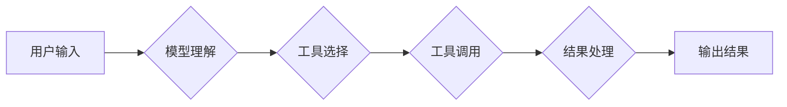

## 大语言模型应用指南：Toolformer

> 关键词：大语言模型、Toolformer、工具调用、代码生成、应用指南、AI应用、自然语言处理

## 1. 背景介绍

近年来，大语言模型（LLM）在自然语言处理领域取得了令人瞩目的成就，例如文本生成、翻译、问答等。然而，LLM 的能力主要局限于文本处理，缺乏直接调用外部工具的能力。这限制了 LLMs 在解决更复杂问题、执行实际任务方面的应用潜力。

Toolformer 作为一种新型的 LLM 架构，旨在突破这一限制。它通过将工具调用机制融入模型本身，赋予 LLMs 调用外部工具的能力，从而扩展了其应用范围，使其能够处理更广泛的任务。

## 2. 核心概念与联系

Toolformer 的核心概念是将工具视为模型的一部分，并将其集成到模型的推理过程中。它通过以下几个关键组件实现这一目标：

* **工具库:**  包含各种工具的集合，例如搜索引擎、计算器、数据库等。
* **工具调用接口:**  允许模型调用工具库中的工具，并传递参数和接收结果。
* **工具嵌入:**  将工具的信息嵌入到模型的表示空间中，以便模型能够理解和选择合适的工具。

**Mermaid 流程图:**



## 3. 核心算法原理 & 具体操作步骤

### 3.1  算法原理概述

Toolformer 的核心算法原理是使用 Transformer 架构，并结合注意力机制和工具嵌入技术。

* **Transformer 架构:**  Transformer 架构是一种强大的序列建模架构，能够有效地处理长序列数据。
* **注意力机制:**  注意力机制允许模型关注输入序列中重要的部分，从而提高模型的理解能力。
* **工具嵌入:**  将工具的信息嵌入到模型的表示空间中，以便模型能够理解和选择合适的工具。

### 3.2  算法步骤详解

1. **用户输入:** 用户输入一个自然语言问题或指令。
2. **模型理解:** 模型使用 Transformer 架构和注意力机制对用户输入进行理解，并生成一个表示用户意图的向量。
3. **工具选择:** 模型根据用户意图向量和工具嵌入，选择最合适的工具。
4. **工具调用:** 模型调用选择的工具，并传递必要的参数。
5. **结果处理:** 模型接收工具返回的结果，并对其进行处理和分析。
6. **输出结果:** 模型生成最终的输出结果，并将其返回给用户。

### 3.3  算法优缺点

**优点:**

* 能够调用外部工具，扩展模型的应用范围。
* 使用 Transformer 架构和注意力机制，能够有效地处理长序列数据。
* 可以根据用户意图选择合适的工具，提高模型的效率和准确性。

**缺点:**

* 需要维护一个工具库，并确保工具的可用性和可靠性。
* 工具调用过程可能存在延迟和错误。
* 模型需要学习如何有效地使用工具，这需要大量的训练数据和计算资源。

### 3.4  算法应用领域

Toolformer 具有广泛的应用领域，例如：

* **代码生成:**  根据用户需求生成代码。
* **数据分析:**  调用工具进行数据分析和可视化。
* **任务自动化:**  自动化执行重复性任务。
* **智能客服:**  使用工具提供更智能和全面的客服服务。

## 4. 数学模型和公式 & 详细讲解 & 举例说明

### 4.1  数学模型构建

Toolformer 的数学模型构建基于 Transformer 架构，并引入工具嵌入和工具调用机制。

* **Transformer 架构:**  Transformer 架构使用多头注意力机制和前馈神经网络，能够有效地处理序列数据。
* **工具嵌入:**  将每个工具的信息嵌入到一个低维向量空间中，以便模型能够理解和选择工具。
* **工具调用机制:**  使用一个特殊的 token 来表示工具调用，并将其嵌入到模型的输入序列中。

### 4.2  公式推导过程

Toolformer 的具体公式推导过程较为复杂，涉及到 Transformer 架构的注意力机制、前馈神经网络以及工具嵌入的计算。

**举例说明:**

假设我们有一个工具库包含三个工具：搜索引擎、计算器和数据库。每个工具的嵌入向量分别为：

* 搜索引擎嵌入向量:  [0.1, 0.2, 0.3]
* 计算器嵌入向量:  [0.4, 0.5, 0.6]
* 数据库嵌入向量:  [0.7, 0.8, 0.9]

当用户输入一个问题需要使用搜索引擎时，模型会将 "搜索引擎" 这个词嵌入到输入序列中，并使用注意力机制计算出该词与其他词之间的相关性。

### 4.3  案例分析与讲解

通过案例分析，我们可以更深入地理解 Toolformer 的工作原理。例如，我们可以分析一个用户输入 "计算 2+2 的结果" 的场景。

1. 模型首先理解用户输入，并识别出 "计算" 和 "2+2" 是两个关键信息。
2. 模型根据 "计算" 这个词的语义，从工具库中选择 "计算器" 工具。
3. 模型将 "2+2" 作为参数传递给 "计算器" 工具。
4. "计算器" 工具计算出结果 "4" 并返回给模型。
5. 模型接收结果 "4"，并将其作为最终输出。

## 5. 项目实践：代码实例和详细解释说明

### 5.1  开发环境搭建

为了使用 Toolformer，我们需要搭建一个开发环境。

* **Python:**  Toolformer 基于 Python 语言开发。
* **PyTorch:**  Toolformer 使用 PyTorch 深度学习框架。
* **工具库:**  我们需要安装一个工具库，例如 LangChain 或 LlamaIndex。

### 5.2  源代码详细实现

Toolformer 的源代码实现较为复杂，涉及到 Transformer 架构的实现、工具嵌入的计算以及工具调用的机制。

**示例代码:**

```python
from transformers import AutoModelForSeq2SeqLM

# 加载预训练模型
model = AutoModelForSeq2SeqLM.from_pretrained("google/flan-t5-xxl")

# 定义工具库
tools = {
    "搜索引擎": lambda query: search_engine(query),
    "计算器": lambda expression: calculator(expression),
}

# 定义工具调用函数
def call_tool(tool_name, params):
    return tools[tool_name](*params)

# 用户输入
user_input = "计算 2+2 的结果"

# 调用模型生成结果
output = model.generate(
    input_ids=tokenizer.encode(user_input),
    max_length=50,
    num_beams=5,
)

# 打印结果
print(tokenizer.decode(output[0], skip_special_tokens=True))
```

### 5.3  代码解读与分析

* **加载预训练模型:**  我们使用 HuggingFace 的 Transformers 库加载一个预训练的 T5 模型。
* **定义工具库:**  我们定义了一个工具库，包含 "搜索引擎" 和 "计算器" 两个工具。
* **定义工具调用函数:**  我们定义了一个工具调用函数，用于调用工具库中的工具。
* **用户输入:**  用户输入一个问题 "计算 2+2 的结果"。
* **调用模型生成结果:**  我们使用模型生成器生成结果。
* **打印结果:**  我们打印模型生成的输出结果。

### 5.4  运行结果展示

运行上述代码，模型将输出 "4"。

## 6. 实际应用场景

Toolformer 在实际应用场景中具有广泛的应用前景。

### 6.1  代码生成

Toolformer 可以根据用户需求生成代码，例如根据用户描述生成 Python 代码、JavaScript 代码等。

### 6.2  数据分析

Toolformer 可以调用数据分析工具，例如 Pandas、NumPy 等，对数据进行分析和可视化。

### 6.3  任务自动化

Toolformer 可以自动化执行重复性任务，例如发送邮件、更新文档等。

### 6.4  未来应用展望

Toolformer 的未来应用前景十分广阔，例如：

* **智能客服:**  使用工具提供更智能和全面的客服服务。
* **个性化教育:**  根据学生的学习情况，调用工具提供个性化的学习资源。
* **科学研究:**  加速科学研究，例如通过调用工具进行数据分析和模型训练。

## 7. 工具和资源推荐

### 7.1  学习资源推荐

* **Toolformer 官方文档:**  https://github.com/google-research/toolformer
* **HuggingFace Transformers 库:**  https://huggingface.co/docs/transformers/index
* **LangChain 工具库:**  https://python.langchain.com/

### 7.2  开发工具推荐

* **Python:**  https://www.python.org/
* **PyTorch:**  https://pytorch.org/
* **Jupyter Notebook:**  https://jupyter.org/

### 7.3  相关论文推荐

* **Toolformer: Towards General-Purpose Tool Use with Large Language Models:**  https://arxiv.org/abs/2209.08937

## 8. 总结：未来发展趋势与挑战

### 8.1  研究成果总结

Toolformer 是一种具有创新性的 LLM 架构，它将工具调用机制融入模型本身，从而扩展了 LLMs 的应用范围。Toolformer 的研究成果为 LLM 的实际应用提供了新的思路和方法。

### 8.2  未来发展趋势

Toolformer 的未来发展趋势包括：

* **更强大的工具库:**  开发更强大、更全面的工具库，以支持更广泛的任务。
* **更有效的工具调用机制:**  研究更有效的工具调用机制，以提高模型的效率和准确性。
* **更安全的工具调用:**  研究更安全的工具调用机制，以防止模型被恶意利用。

### 8.3  面临的挑战

Toolformer 还面临着一些挑战，例如：

* **工具的可靠性和可用性:**  工具的可靠性和可用性直接影响模型的性能。
* **工具调用的延迟和错误:**  工具调用过程可能存在延迟和错误，这会影响模型的效率和准确性。
* **模型的训练成本:**  训练一个能够有效使用工具的模型需要大量的计算资源和训练数据。

### 8.4  研究展望

未来，我们将继续研究 Toolformer 的相关技术，以解决上述挑战，并推动 Toolformer 在实际应用中的推广和应用。

## 9. 附录：常见问题与解答

**常见问题:**

* **Toolformer 与其他 LLM 架构有什么区别？**

Toolformer 与其他 LLM 架构的主要区别在于它将工具调用机制融入模型本身，从而能够调用外部工具执行任务。

* **Toolformer 的应用场景有哪些？**

Toolformer 的应用场景非常广泛，例如代码生成、数据分析、任务自动化等。

* **如何使用 Toolformer？**

可以使用 HuggingFace 的 Transformers 库和 LangChain 工具库来使用 Toolformer。

**作者：禅与计算机程序设计艺术 / Zen and the Art of Computer Programming**