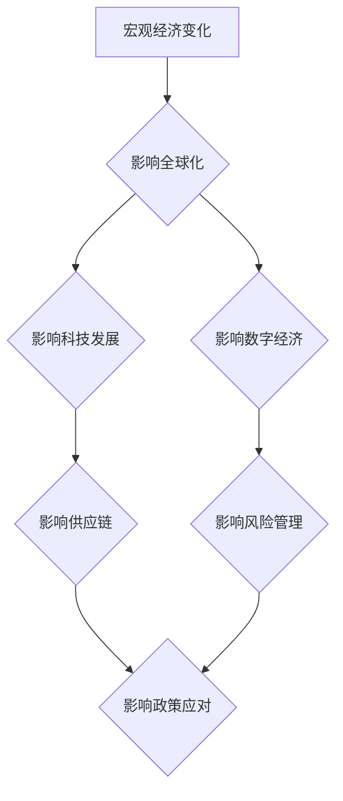

## 宏观经济变化的全球影响

> 关键词：宏观经济、全球化、科技发展、数字经济、人工智能、供应链、风险管理、政策应对

## 1. 背景介绍

全球化进程的加速和科技发展的不断突破，使得世界经济更加紧密相连，也更加脆弱。宏观经济变化，例如通货膨胀、利率调整、贸易战、地缘政治冲突等，会产生深远的影响，波及到全球各个角落。这些变化不仅会影响企业经营和市场发展，还会引发社会动荡和政治不稳定。

近年来，世界经济面临着前所未有的挑战。新冠疫情的爆发对全球经济造成了巨大冲击，供应链中断、需求萎缩、通货膨胀加剧等问题层出不穷。同时，地缘政治局势紧张，能源价格波动，气候变化加剧等因素也对经济稳定构成威胁。

在这样的背景下，理解宏观经济变化的全球影响，并制定有效的应对策略，显得尤为重要。

## 2. 核心概念与联系

**2.1 宏观经济**

宏观经济是指研究国民经济整体运行规律的经济学分支。其主要研究对象包括国民总收入、国民总支出、物价水平、就业率、经济增长率等宏观指标。

**2.2 全球化**

全球化是指国家之间经济、政治、文化等方面的相互联系和融合的趋势。它促进了国际贸易、投资、技术交流和人员流动，但也加剧了经济全球一体化和风险共振。

**2.3 科技发展**

科技发展是推动经济增长的重要动力。新技术、新产业、新模式的不断涌现，会带来新的经济增长点和就业机会，但也可能导致产业结构调整和失业问题。

**2.4 数字经济**

数字经济是指以数字技术为基础，以数据为核心要素，以网络为平台，以智能化和数字化为特征的新型经济形态。数字经济的快速发展，正在深刻改变着生产方式、消费模式和生活方式。

**2.5 供应链**

供应链是指从原材料采购到最终产品交付的整个生产和流通过程。全球化和数字经济的发展，使得供应链更加复杂和全球化。

**2.6 风险管理**

风险管理是指识别、评估、控制和应对各种可能发生的风险。宏观经济变化会带来新的风险，例如市场风险、信用风险、操作风险等。

**2.7 政策应对**

政府可以通过制定相应的政策来应对宏观经济变化的影响。例如，可以通过货币政策、财政政策、产业政策等手段来稳定经济、促进增长和维护社会稳定。

**2.8 Mermaid 流程图**



## 3. 核心算法原理 & 具体操作步骤

**3.1 算法原理概述**

在宏观经济分析中，常用的算法包括时间序列分析、计量经济学模型、机器学习等。这些算法可以帮助我们预测经济趋势、识别经济周期、分析经济变量之间的关系等。

**3.2 算法步骤详解**

* **时间序列分析:**

1. 收集历史经济数据。
2. 对数据进行清洗和处理。
3. 选择合适的模型进行拟合，例如ARIMA模型、SARIMA模型等。
4. 利用模型预测未来经济趋势。

* **计量经济学模型:**

1. 建立经济模型，描述经济变量之间的关系。
2. 使用计量经济学方法估计模型参数。
3. 利用模型分析经济现象，例如经济增长、通货膨胀等。

* **机器学习:**

1. 收集大量经济数据。
2. 选择合适的机器学习算法，例如回归算法、分类算法等。
3. 利用算法训练模型，使其能够预测经济变量。
4. 利用模型进行预测和分析。

**3.3 算法优缺点**

* **时间序列分析:**

优点：能够捕捉时间序列的趋势和季节性变化。
缺点：对数据质量要求较高，模型选择较为复杂。

* **计量经济学模型:**

优点：能够建立经济理论模型，分析经济现象的本质原因。
缺点：模型假设较为理想化，难以完全反映现实经济情况。

* **机器学习:**

优点：能够处理大规模数据，发现复杂的关系。
缺点：模型解释性较差，容易受到数据偏差的影响。

**3.4 算法应用领域**

* **宏观经济预测:** 预测经济增长率、通货膨胀率、失业率等宏观经济指标。
* **金融市场分析:** 分析股票价格、汇率、债券收益率等金融市场数据。
* **风险管理:** 识别和评估经济风险，制定风险应对策略。
* **政策评估:** 评估政府政策对经济的影响。

## 4. 数学模型和公式 & 详细讲解 & 举例说明

**4.1 数学模型构建**

宏观经济模型通常采用微观经济学原理，构建宏观经济变量之间的关系。例如，IS-LM模型描述了利率和国民收入之间的关系，AD-AS模型描述了总需求和总供给之间的关系。

**4.2 公式推导过程**

IS-LM模型的推导过程如下：

1. **IS曲线:**

   假设市场均衡，则投资支出等于储蓄支出，即：

   I = S

   其中，I表示投资支出，S表示储蓄支出。

   将投资支出和储蓄支出分别表示为利率和国民收入的函数，可以得到IS曲线方程。

2. **LM曲线:**

   假设货币市场均衡，则货币供应量等于货币需求量，即：

   M = L(r, Y)

   其中，M表示货币供应量，L表示货币需求量，r表示利率，Y表示国民收入。

   将货币供应量和货币需求量分别表示为利率和国民收入的函数，可以得到LM曲线方程。

**4.3 案例分析与讲解**

假设政府增加公共支出，导致IS曲线向右移动。同时，中央银行保持货币供应量不变，导致LM曲线保持不变。

在这种情况下，新的均衡点将位于IS曲线和LM曲线的交点，国民收入将增加，利率将上升。

**4.4 数学公式**

* IS曲线方程：Y = C(Y) + I(r) + G
* LM曲线方程：M/P = L(r, Y)

其中：

* Y表示国民收入
* r表示利率
* C(Y)表示消费支出函数
* I(r)表示投资支出函数
* G表示政府支出
* M表示货币供应量
* P表示物价水平

## 5. 项目实践：代码实例和详细解释说明

**5.1 开发环境搭建**

* 操作系统：Windows/macOS/Linux
* 编程语言：Python
* 库依赖：NumPy、Pandas、Scikit-learn

**5.2 源代码详细实现**

```python
import numpy as np
from sklearn.linear_model import LinearRegression

# 导入数据
data = pd.read_csv('macro_data.csv')

# 选择特征变量和目标变量
X = data[['GDP', 'CPI']]
y = data['InterestRate']

# 创建线性回归模型
model = LinearRegression()

# 训练模型
model.fit(X, y)

# 预测未来利率
future_gdp = np.array([100, 105])
future_cpi = np.array([102, 103])
future_interest_rate = model.predict(np.column_stack((future_gdp, future_cpi)))

# 打印预测结果
print(future_interest_rate)
```

**5.3 代码解读与分析**

* 首先，导入必要的库依赖。
* 然后，导入宏观经济数据，并选择特征变量和目标变量。
* 接下来，创建线性回归模型，并使用训练数据训练模型。
* 最后，利用训练好的模型预测未来利率。

**5.4 运行结果展示**

运行代码后，将输出未来利率的预测值。

## 6. 实际应用场景

宏观经济变化的全球影响在各个领域都有着广泛的应用场景，例如：

* **金融市场:** 预测利率、汇率、股票价格等金融市场变量，帮助投资者做出决策。
* **企业经营:** 分析宏观经济趋势，制定企业发展战略，应对经济风险。
* **政府政策:** 评估政府政策对经济的影响，制定有效的经济政策。
* **国际贸易:** 分析国际贸易格局，预测贸易流量，帮助企业拓展海外市场。

**6.4 未来应用展望**

随着人工智能、大数据等技术的不断发展，宏观经济分析将更加精准、高效。未来，我们可以期待以下应用场景：

* **个性化宏观经济预测:** 根据用户的具体需求，提供个性化的宏观经济预测。
* **实时宏观经济监测:** 利用大数据技术，实时监测宏观经济指标，及时发现经济风险。
* **智能宏观经济政策建议:** 利用人工智能技术，为政府提供智能化的宏观经济政策建议。

## 7. 工具和资源推荐

**7.1 学习资源推荐**

* **书籍:**

    * 《宏观经济学》 - 诺贝尔经济学奖获得者 Paul Krugman
    * 《经济学原理》 - 诺贝尔经济学奖获得者 Gregory Mankiw

* **在线课程:**

    * Coursera: 宏观经济学
    * edX: 经济学原理

**7.2 开发工具推荐**

* **Python:** 强大的数据分析和机器学习工具
* **R:** 专注于统计分析和数据可视化
* **Stata:** 专业统计软件，广泛应用于经济学研究

**7.3 相关论文推荐**

* **"The Global Impact of Macroeconomic Shocks"** - International Monetary Fund
* **"Macroeconomic Forecasting and Policy Analysis"** - Journal of Economic Perspectives

## 8. 总结：未来发展趋势与挑战

**8.1 研究成果总结**

宏观经济变化的全球影响是一个复杂而重要的研究领域。通过时间序列分析、计量经济学模型和机器学习等方法，我们可以更好地理解宏观经济变化的规律，并预测其未来发展趋势。

**8.2 未来发展趋势**

未来，宏观经济分析将更加注重以下几个方面：

* **数据驱动:** 利用大数据技术，收集和分析更丰富、更全面的宏观经济数据。
* **模型创新:** 开发更加精准、高效的宏观经济模型，例如深度学习模型、贝叶斯模型等。
* **跨学科融合:** 将宏观经济分析与其他学科，例如金融学、政治学、社会学等进行融合，形成更加全面的研究视角。

**8.3 面临的挑战**

宏观经济分析也面临着一些挑战：

* **数据质量:** 宏观经济数据往往存在缺失、错误和偏差等问题，需要进行有效的数据清洗和处理。
* **模型复杂性:** 宏观经济模型往往非常复杂，需要强大的计算能力和专业知识才能进行建模和分析。
* **解释性:** 一些机器学习模型的解释性较差，难以理解模型的决策过程。

**8.4 研究展望**

未来，我们需要继续加强宏观经济分析的研究，开发更加精准、高效、可解释的分析方法，为政府、企业和个人提供更加有价值的决策支持。

## 9. 附录：常见问题与解答

**9.1 如何选择合适的宏观经济模型？**

选择合适的宏观经济模型需要根据具体的研究问题和数据特点进行选择。例如，如果研究的是短期经济波动，可以选择ARIMA模型；如果研究的是长期经济增长，可以选择Solow模型。

**9.2 如何处理宏观经济数据中的缺失值？**

处理宏观经济数据中的缺失值可以使用多种方法，例如插值法、删除法、均值法等。选择合适的处理方法需要根据数据的特点和研究目的进行选择。

**9.3 如何评估宏