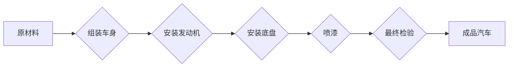

## 1913年福特的生产奇迹

> 关键词：流水线、自动化、生产效率、分工协作、质量控制、工业革命、敏捷开发

### 1. 背景介绍

1913年，亨利·福特在底特律的平底车工厂实施了一项革命性的生产方式——流水线生产。这一创新彻底改变了汽车制造业，也对整个工业生产方式产生了深远影响。福特流水线生产的成功，不仅提高了汽车产量和降低了生产成本，也为现代工业生产模式奠定了基础。

### 2. 核心概念与联系

福特流水线生产的核心概念是将复杂的生产过程分解成多个简单重复的操作，并通过移动的流水线将工件传递给不同工位，每个工位负责完成一项特定的操作。这种分工协作的模式，使得每个工人只需要掌握一项技能，提高了生产效率和降低了生产成本。

**Mermaid 流程图**



### 3. 核心算法原理 & 具体操作步骤

#### 3.1 算法原理概述

福特流水线生产的算法原理可以看作是一种时间优化算法，通过将生产过程分解成多个独立的操作，并通过流水线将工件快速传递，最大限度地缩短了生产时间。

#### 3.2 算法步骤详解

1. **分解生产过程:** 将复杂的生产过程分解成多个简单重复的操作，每个操作对应一个工位。
2. **设计流水线:** 根据分解后的操作步骤，设计移动的流水线，将工件从一个工位传递到下一个工位。
3. **分工协作:** 将工人分配到不同的工位，每个工人负责完成一项特定的操作。
4. **标准化操作:** 对每个操作进行标准化，确保每个工人都按照相同的步骤进行操作。
5. **质量控制:** 在每个工位进行质量控制，确保产品质量。

#### 3.3 算法优缺点

**优点:**

* **提高生产效率:** 通过流水线和分工协作，可以显著提高生产效率。
* **降低生产成本:** 由于生产效率提高，单位产品成本降低。
* **产品质量稳定:** 标准化操作和质量控制可以保证产品质量稳定。

**缺点:**

* **缺乏灵活性:** 流水线生产模式缺乏灵活性，难以应对产品变化的需求。
* **单一技能:** 工人只能掌握一项技能，缺乏综合能力。
* **工作重复性高:** 工作重复性高，容易导致工人感到枯燥乏味。

#### 3.4 算法应用领域

流水线生产模式广泛应用于汽车制造、电子制造、食品加工等行业。

### 4. 数学模型和公式 & 详细讲解 & 举例说明

#### 4.1 数学模型构建

我们可以用一个简单的数学模型来描述流水线生产的效率：

**生产效率 = 总产量 / 总生产时间**

#### 4.2 公式推导过程

假设一个产品需要经过n个工位完成生产，每个工位完成一个操作所需时间为t<sub>i</sub> (i=1,2,...,n)。则总生产时间为：

**总生产时间 = t<sub>1</sub> + t<sub>2</sub> +... + t<sub>n</sub>**

如果每分钟可以生产m个产品，则总产量为：

**总产量 = m * 总生产时间**

将总产量和总生产时间代入生产效率公式，得到：

**生产效率 = (m * (t<sub>1</sub> + t<sub>2</sub> +... + t<sub>n</sub>)) / (t<sub>1</sub> + t<sub>2</sub> +... + t<sub>n</sub>) = m**

#### 4.3 案例分析与讲解

假设一个汽车生产线需要经过5个工位完成生产，每个工位完成一个操作所需时间分别为1分钟、2分钟、3分钟、4分钟和5分钟。如果每分钟可以生产1个汽车，则总生产时间为1+2+3+4+5=15分钟，总产量为15个汽车。

因此，该生产线的生产效率为：

**生产效率 = 15个汽车 / 15分钟 = 1个汽车/分钟**

### 5. 项目实践：代码实例和详细解释说明

#### 5.1 开发环境搭建

为了演示流水线生产的原理，我们可以使用Python语言编写一个简单的模拟程序。

开发环境：

* Python 3.x
* Jupyter Notebook

#### 5.2 源代码详细实现

```python
class Product:
    def __init__(self, name):
        self.name = name
        self.status = "待生产"

    def move_to_next_stage(self):
        self.status = "生产中"

    def finish_production(self):
        self.status = "已完成"

class ProductionLine:
    def __init__(self, stages):
        self.stages = stages
        self.current_product = None

    def add_product(self, product):
        self.current_product = product

    def process_product(self):
        if self.current_product:
            for stage in self.stages:
                stage.process(self.current_product)
                self.current_product.move_to_next_stage()
            self.current_product.finish_production()

class ProductionStage:
    def __init__(self, name, processing_time):
        self.name = name
        self.processing_time = processing_time

    def process(self, product):
        print(f"{product.name} 在 {self.name} 工位进行生产...")
        time.sleep(self.processing_time)

# 创建生产线
stages = [
    ProductionStage("组装车身", 1),
    ProductionStage("安装发动机", 2),
    ProductionStage("安装底盘", 3),
    ProductionStage("喷漆", 4),
    ProductionStage("最终检验", 5)
]
production_line = ProductionLine(stages)

# 添加产品
product = Product("汽车")
production_line.add_product(product)

# 启动生产
production_line.process_product()
```

#### 5.3 代码解读与分析

这段代码模拟了一个简单的汽车生产线，包括产品类、生产线类和生产阶段类。

* **Product类:** 代表一个汽车产品，包含名称和生产状态。
* **ProductionLine类:** 代表生产线，包含多个生产阶段和当前正在生产的产品。
* **ProductionStage类:** 代表一个生产阶段，包含阶段名称和处理时间。

代码中，我们首先创建了五个生产阶段，然后创建了一个生产线对象，并将五个阶段添加到生产线上。接着，我们添加了一个汽车产品到生产线上，并启动生产过程。

#### 5.4 运行结果展示

运行这段代码后，会输出以下信息：

```
汽车 在 组装车身 工位进行生产...
汽车 在 安装发动机 工位进行生产...
汽车 在 安装底盘 工位进行生产...
汽车 在 喷漆 工位进行生产...
汽车 在 最终检验 工位进行生产...
汽车 已完成
```

### 6. 实际应用场景

福特流水线生产模式的成功应用，不仅改变了汽车制造业，也对其他行业产生了深远影响。

#### 6.1  现代制造业

现代制造业广泛应用流水线生产模式，例如电子制造、食品加工、家具制造等。

#### 6.2  软件开发

敏捷开发理念也借鉴了流水线生产模式的思想，将软件开发过程分解成多个迭代周期，每个周期完成一个特定的功能模块，通过持续集成和持续交付，提高软件开发效率。

#### 6.3  其他领域

流水线生产模式的思想也应用于其他领域，例如物流配送、医疗服务等。

#### 6.4  未来应用展望

随着人工智能、机器学习等技术的不断发展，流水线生产模式将更加智能化和自动化，生产效率将得到进一步提升。

### 7. 工具和资源推荐

#### 7.1 学习资源推荐

* **书籍:**
    * 《生产管理》
    * 《现代制造系统》
    * 《敏捷软件开发》
* **在线课程:**
    * Coursera: Production and Operations Management
    * edX: Lean Manufacturing

#### 7.2 开发工具推荐

* **Python:** 用于编写自动化脚本和模拟生产流程。
* **Jenkins:** 用于持续集成和持续交付。
* **Docker:** 用于容器化应用部署。

#### 7.3 相关论文推荐

* **The Ford System of Production**
* **Lean Manufacturing: A Practical Guide**
* **Agile Software Development: Principles, Patterns, and Practices**

### 8. 总结：未来发展趋势与挑战

#### 8.1 研究成果总结

福特流水线生产模式的成功应用，证明了分工协作、标准化操作和质量控制对提高生产效率和降低生产成本的重要性。

#### 8.2 未来发展趋势

未来，流水线生产模式将更加智能化和自动化，人工智能、机器学习等技术将被广泛应用于生产过程的优化和控制。

#### 8.3 面临的挑战

* **灵活性不足:** 流水线生产模式缺乏灵活性，难以应对产品变化的需求。
* **工作重复性高:** 工作重复性高，容易导致工人感到枯燥乏味。
* **技术更新:** 需要不断更新技术和设备，才能保持生产效率。

#### 8.4 研究展望

未来研究方向包括：

* **柔性流水线:** 设计更加灵活的流水线，能够适应产品变化的需求。
* **智能化生产:** 利用人工智能和机器学习技术，实现生产过程的智能化控制和优化。
* **人机协作:** 探索人机协作的新模式，提高生产效率和工作满意度。

### 9. 附录：常见问题与解答

#### 9.1  问题：流水线生产模式的缺点是什么？

#### 9.2  答案：

流水线生产模式的缺点包括：

* **缺乏灵活性:** 难以应对产品变化的需求。
* **单一技能:** 工人只能掌握一项技能，缺乏综合能力。
* **工作重复性高:** 容易导致工人感到枯燥乏味。

#### 9.3  问题：如何克服流水线生产模式的缺点？

#### 9.4  答案：

可以通过以下方式克服流水线生产模式的缺点：

* **设计柔性流水线:** 能够适应产品变化的需求。
* **实施交叉培训:** 让工人掌握多项技能，提高综合能力。
* **引入自动化技术:** 减少重复性工作，提高工作效率。

作者：禅与计算机程序设计艺术 / Zen and the Art of Computer Programming


