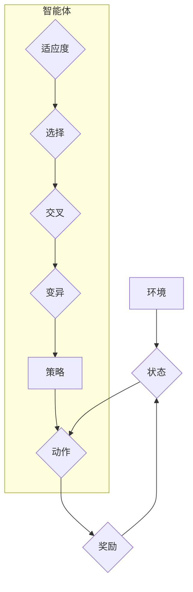

## 强化学习算法：遗传算法 原理与代码实例讲解

> 关键词：遗传算法、强化学习、进化算法、自然选择、变异、交叉操作、代码实例、Python

## 1. 背景介绍

在机器学习领域，强化学习 (Reinforcement Learning, RL) 作为一种学习方法，通过智能体与环境的交互，学习最优策略以最大化累积奖励。而遗传算法 (Genetic Algorithm, GA) 则是一种受生物进化机制启发的搜索优化算法，通过模拟自然选择、交叉和变异等过程，不断优化解空间中的个体，最终找到最优解。

近年来，将遗传算法与强化学习相结合，形成了新的研究方向，即强化学习中的遗传算法 (Genetic Reinforcement Learning, GRAL)。这种结合能够有效地解决传统强化学习算法面临的一些挑战，例如：

* **探索-利用困境:**  传统强化学习算法在探索未知状态和利用已知知识之间难以平衡。遗传算法可以引入多样性，促进探索，同时保留优秀策略，提高利用效率。
* **局部最优解:**  传统强化学习算法容易陷入局部最优解。遗传算法通过全局搜索，能够跳出局部最优解，寻找更优的全局解。
* **高维状态空间:**  对于高维状态空间，传统强化学习算法难以有效学习。遗传算法可以将状态空间离散化，降低算法复杂度，提高学习效率。

## 2. 核心概念与联系

### 2.1 遗传算法的核心概念

遗传算法的核心概念包括：

* **种群:**  算法初始状态，由多个个体组成，每个个体代表一个可能的解。
* **适应度函数:**  用于评估个体解的优劣，高适应度代表解更优。
* **选择操作:**  根据适应度函数，选择部分个体作为下一代的父代。
* **交叉操作:**  将两个父代个体进行基因交换，产生新的子代个体。
* **变异操作:**  对子代个体进行随机变异，增加种群的多样性。

### 2.2 强化学习的核心概念

强化学习的核心概念包括：

* **智能体:**  学习和决策的实体。
* **环境:**  智能体与之交互的外部世界。
* **状态:**  环境当前的状态。
* **动作:**  智能体可以采取的行动。
* **奖励:**  环境对智能体动作的反馈，可以是正向或负向。
* **策略:**  智能体根据状态选择动作的规则。

### 2.3 遗传算法与强化学习的联系

遗传算法与强化学习的结合，可以将遗传算法的全局搜索能力应用于强化学习的策略优化问题。具体来说，可以将智能体的策略编码为个体，适应度函数定义为智能体在环境中获得的累积奖励，通过遗传算法的进化过程，不断优化策略，最终找到最优策略。

**Mermaid 流程图**



## 3. 核心算法原理 & 具体操作步骤

### 3.1 算法原理概述

遗传算法强化学习 (GRAL) 算法的基本原理是将智能体的策略编码为染色体，通过遗传算法的进化过程，不断优化策略，最终找到最优策略。

具体来说，GRAL 算法的步骤如下：

1. **初始化种群:**  随机生成初始种群，每个个体代表一个策略。
2. **评估适应度:**  根据策略在环境中的表现，计算每个个体的适应度。
3. **选择操作:**  根据适应度函数，选择部分个体作为下一代的父代。
4. **交叉操作:**  将两个父代个体进行基因交换，产生新的子代个体。
5. **变异操作:**  对子代个体进行随机变异，增加种群的多样性。
6. **重复步骤 2-5:**  重复以上步骤，直到达到终止条件。

### 3.2 算法步骤详解

1. **初始化种群:**  

   * 策略编码: 将智能体的策略编码为染色体，每个基因代表策略的一个参数。
   * 种群大小:  设置种群的大小，决定算法的搜索范围。
   * 随机生成:  随机生成初始种群，每个个体代表一个策略。

2. **评估适应度:**

   * 环境交互:  让每个个体在环境中进行交互，收集奖励信息。
   * 适应度函数:  根据收集到的奖励信息，计算每个个体的适应度。

3. **选择操作:**

   * 选择策略:  根据适应度函数，选择部分个体作为下一代的父代。
   * 选择方法:  常用的选择方法包括轮盘赌选择、锦标赛选择等。

4. **交叉操作:**

   * 交叉点选择:  随机选择交叉点，将两个父代个体的基因进行交换。
   * 交叉方法:  常用的交叉方法包括单点交叉、双点交叉等。

5. **变异操作:**

   * 变异概率:  设置变异概率，控制变异操作的频率。
   * 变异方法:  常用的变异方法包括随机置换、随机插入等。

6. **重复步骤 2-5:**  重复以上步骤，直到达到终止条件。

### 3.3 算法优缺点

**优点:**

* **全局搜索能力:**  遗传算法能够进行全局搜索，跳出局部最优解，寻找更优的全局解。
* **适应性强:**  遗传算法可以适应各种复杂问题，无需明确的数学模型。
* **并行化能力:**  遗传算法可以并行化执行，提高算法效率。

**缺点:**

* **计算复杂度高:**  遗传算法的计算复杂度较高，对于大规模问题，计算时间可能较长。
* **参数设置敏感:**  遗传算法的性能受参数设置的影响较大，需要进行仔细的调优。
* **收敛速度慢:**  遗传算法的收敛速度可能较慢，需要多次迭代才能找到较好的解。

### 3.4 算法应用领域

遗传算法强化学习 (GRAL) 算法在以下领域具有广泛的应用前景:

* **机器人控制:**  优化机器人运动策略，提高控制精度和效率。
* **游戏人工智能:**  训练游戏中的智能体，使其能够更好地应对游戏挑战。
* **金融投资:**  优化投资组合，提高投资收益。
* **药物设计:**  筛选潜在的药物候选物，加速药物研发过程。

## 4. 数学模型和公式 & 详细讲解 & 举例说明

### 4.1 数学模型构建

在 GRAL 算法中，策略通常被表示为一个向量，每个元素代表策略的一个参数。适应度函数则用来评估策略在环境中的表现，通常定义为智能体在环境中获得的累积奖励。

**状态空间:**  S = {s1, s2,..., sn}

**动作空间:**  A = {a1, a2,..., am}

**策略:**  π(s) = a，表示在状态 s 下采取动作 a 的概率。

**奖励函数:**  R(s, a) ，表示在状态 s 下采取动作 a 得到的奖励。

**累积奖励:**  R(π) = Σ<sub>t=0</sub><sup>T</sup> R(s<sub>t</sub>, a<sub>t</sub>)，表示策略 π 在时间步长 T 内获得的累积奖励。

### 4.2 公式推导过程

适应度函数通常定义为累积奖励的期望值:

**适应度:**  f(π) = E[R(π)]

其中，E 表示期望值。

### 4.3 案例分析与讲解

假设一个简单的环境，智能体可以选择向上、向下、向左、向右四个动作，每个动作都有不同的奖励值。

**状态空间:**  S = {s1, s2, s3, s4}

**动作空间:**  A = {上, 下, 左, 右}

**奖励函数:**

* R(s1, 上) = 1
* R(s1, 下) = -1
* R(s1, 左) = 0
* R(s1, 右) = 0

其他状态和动作的奖励值类似。

**策略:**  π(s) = a，表示在状态 s 下采取动作 a 的概率。

**适应度函数:**  f(π) = E[R(π)]

可以通过模拟智能体在环境中执行策略 π 的过程，计算累积奖励的期望值，从而得到策略的适应度。

## 5. 项目实践：代码实例和详细解释说明

### 5.1 开发环境搭建

* Python 3.x
* NumPy
* Matplotlib

### 5.2 源代码详细实现

```python
import numpy as np

# 定义环境
class Environment:
    def __init__(self):
        self.state = 1

    def step(self, action):
        if action == 0:  # 上
            self.state = (self.state - 1) % 4
        elif action == 1:  # 下
            self.state = (self.state + 1) % 4
        elif action == 2:  # 左
            self.state = (self.state - 2) % 4
        elif action == 3:  # 右
            self.state = (self.state + 2) % 4
        reward = 1 if self.state == 0 else -1
        return self.state, reward

# 定义遗传算法
class GeneticAlgorithm:
    def __init__(self, population_size, mutation_rate):
        self.population_size = population_size
        self.mutation_rate = mutation_rate
        self.population = []

    def initialize_population(self):
        self.population = [np.random.randint(0, 4, size=4) for _ in range(self.population_size)]

    def evaluate_fitness(self):
        fitness_scores = []
        for individual in self.population:
            total_reward = 0
            env = Environment()
            for _ in range(100):
                state, reward = env.step(individual[0])
                total_reward += reward
            fitness_scores.append(total_reward)
        return fitness_scores

    def select_parents(self, fitness_scores):
        # 使用轮盘赌选择法选择父代
        pass

    def crossover(self, parent1, parent2):
        # 使用单点交叉操作生成子代
        pass

    def mutate(self, individual):
        # 使用随机置换操作进行变异
        pass

    def evolve(self):
        fitness_scores = self.evaluate_fitness()
        # 选择父代、交叉、变异、更新种群
        pass

# 实例化遗传算法
ga = GeneticAlgorithm(population_size=100, mutation_rate=0.1)
ga.initialize_population()
ga.evolve()
```

### 5.3 代码解读与分析

* **环境类:**  定义了环境的状态和动作，以及环境交互的规则。
* **遗传算法类:**  实现了遗传算法的基本步骤，包括初始化种群、评估适应度、选择父代、交叉、变异和更新种群。
* **代码实现:**  

   * 使用 NumPy 生成随机数，初始化种群。
   * 使用循环模拟智能体在环境中执行策略，计算累积奖励。
   * 使用轮盘赌选择法选择父代，单点交叉操作生成子代，随机置换操作进行变异。
   * 更新种群，重复进化过程。

### 5.4 运行结果展示

运行代码后，可以观察到种群的适应度随着迭代次数的增加