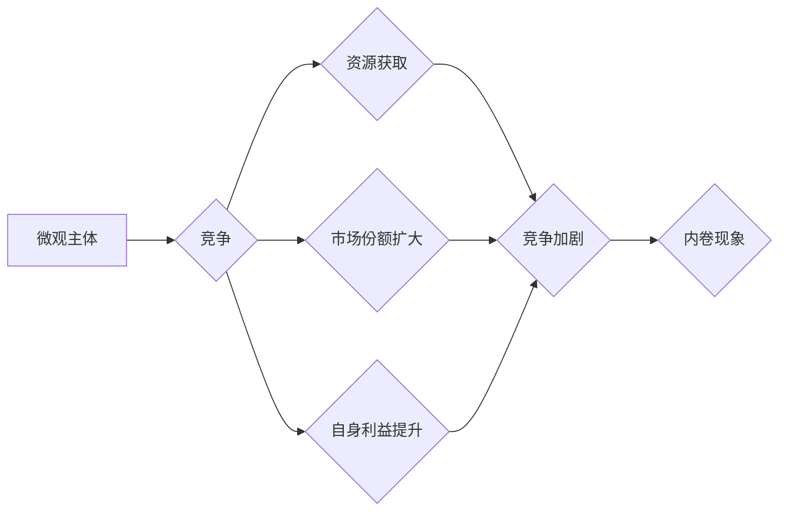

## 微观主体间竞争与内卷增多

> 关键词：微观主体、竞争、内卷、算法、效率、资源分配、系统优化、技术发展

### 1. 背景介绍

在当今科技飞速发展的时代，我们目睹了人工智能、大数据、云计算等技术的蓬勃发展。这些技术不仅深刻地改变了人们的生活方式，也对社会经济结构产生了深远影响。其中，微观主体间竞争与内卷现象日益突出，成为一个值得深入探讨的话题。

微观主体，指的是在经济、社会等领域中具有独立行为能力的个体或群体，例如企业、个人、组织等。在竞争激烈的市场环境下，微观主体为了获取资源、提升自身价值，往往会投入大量精力和资源进行竞争。然而，随着竞争的加剧，微观主体之间的竞争逐渐演变成一种“内卷”现象。

内卷是指在竞争环境下，微观主体为了追求微小的优势，不断提升自身标准，但最终导致整体效率下降，甚至陷入恶性循环。这种现象在互联网行业、教育领域、就业市场等领域尤为明显。

### 2. 核心概念与联系

#### 2.1 微观主体间竞争

微观主体间竞争是指在有限资源条件下，不同微观主体为了获取资源、扩大市场份额、提升自身利益而展开的竞争活动。

#### 2.2 内卷现象

内卷现象是指在竞争环境下，微观主体为了追求微小的优势，不断提升自身标准，但最终导致整体效率下降，甚至陷入恶性循环。

#### 2.3 竞争与内卷的联系

微观主体间竞争是社会发展和经济进步的动力，但过度竞争会导致内卷现象的产生。

**Mermaid 流程图**



### 3. 核心算法原理 & 具体操作步骤

#### 3.1 算法原理概述

为了分析和解决微观主体间竞争与内卷问题，我们可以借鉴一些算法原理，例如：

* **博弈论:** 博弈论可以用来分析微观主体之间的相互作用，预测他们的行为模式，并寻找最优策略。
* **进化算法:** 进化算法可以模拟自然选择的过程，通过迭代优化，找到最优解。
* **网络分析:** 网络分析可以用来研究微观主体之间的关系网络，识别关键节点和影响力。

#### 3.2 算法步骤详解

具体操作步骤可以根据实际情况进行调整，但一般包括以下几个阶段：

1. **建模:** 建立微观主体间竞争与内卷的数学模型，包括微观主体、资源、竞争规则等要素。
2. **数据收集:** 收集相关数据，例如微观主体数量、资源分配情况、竞争行为等。
3. **算法训练:** 使用选定的算法对数据进行训练，学习微观主体之间的竞争模式和内卷趋势。
4. **预测与分析:** 利用训练好的模型，预测未来微观主体间的竞争情况，分析内卷现象的成因和影响。
5. **策略制定:** 根据分析结果，制定相应的策略，例如调整资源分配机制、引导竞争方向、促进合作等。

#### 3.3 算法优缺点

* **优点:** 可以提供更科学、更精准的分析结果，帮助决策者制定更有效的策略。
* **缺点:** 需要大量的计算资源和数据支持，模型的准确性依赖于数据质量和算法选择。

#### 3.4 算法应用领域

* **市场营销:** 分析消费者行为，预测市场趋势，制定精准营销策略。
* **人力资源:** 分析人才市场竞争，预测人才需求，优化招聘策略。
* **教育领域:** 分析学生学习行为，预测学习效果，制定个性化学习方案。

### 4. 数学模型和公式 & 详细讲解 & 举例说明

#### 4.1 数学模型构建

我们可以构建一个微观主体间竞争与内卷的数学模型，其中：

* **N:** 微观主体数量
* **R:** 资源总量
* **x<sub>i</sub>:** 微观主体i获取的资源份额
* **c<sub>i</sub>:** 微观主体i投入的竞争成本
* **f(x<sub>i</sub>):** 微观主体i获取的收益函数

#### 4.2 公式推导过程

我们可以推导以下公式来描述微观主体间竞争与内卷的动态过程：

* **资源分配公式:**  ∑<sub>i=1</sub><sup>N</sup> x<sub>i</sub> = R
* **收益函数:** f(x<sub>i</sub>) = g(x<sub>i</sub>) - c<sub>i</sub>
* **竞争成本函数:** c<sub>i</sub> = h(x<sub>i</sub>)

其中，g(x<sub>i</sub>) 是微观主体i获取资源份额带来的收益，h(x<sub>i</sub>) 是微观主体i投入的竞争成本。

#### 4.3 案例分析与讲解

假设有两个微观主体A和B，资源总量为100，A和B的收益函数和竞争成本函数分别为：

* A: g<sub>A</sub>(x<sub>A</sub>) = 2x<sub>A</sub>, h<sub>A</sub>(x<sub>A</sub>) = x<sub>A</sub><sup>2</sup>
* B: g<sub>B</sub>(x<sub>B</sub>) = 2x<sub>B</sub>, h<sub>B</sub>(x<sub>B</sub>) = x<sub>B</sub><sup>2</sup>

我们可以通过求解上述公式，分析A和B的竞争策略和最终资源分配情况。

### 5. 项目实践：代码实例和详细解释说明

#### 5.1 开发环境搭建

可以使用Python语言和相关库进行项目实践，例如NumPy、SciPy、Matplotlib等。

#### 5.2 源代码详细实现

```python
import numpy as np

# 定义微观主体数量
N = 2

# 定义资源总量
R = 100

# 定义收益函数和竞争成本函数
def g_A(x_A):
  return 2 * x_A

def h_A(x_A):
  return x_A ** 2

def g_B(x_B):
  return 2 * x_B

def h_B(x_B):
  return x_B ** 2

# 计算微观主体获取的资源份额
x_A = np.random.rand()
x_B = 1 - x_A

# 计算微观主体获取的收益
profit_A = g_A(x_A) - h_A(x_A)
profit_B = g_B(x_B) - h_B(x_B)

# 打印结果
print(f"微观主体A获取的资源份额: {x_A}")
print(f"微观主体B获取的资源份额: {x_B}")
print(f"微观主体A的收益: {profit_A}")
print(f"微观主体B的收益: {profit_B}")
```

#### 5.3 代码解读与分析

这段代码模拟了两个微观主体A和B之间的竞争过程。

* 首先，定义了微观主体数量、资源总量、收益函数和竞争成本函数。
* 然后，随机分配了资源份额，并计算了每个微观主体获取的收益。
* 最后，打印了结果，展示了微观主体之间的竞争情况。

#### 5.4 运行结果展示

运行结果会显示出两个微观主体A和B获取的资源份额和收益，以及它们之间的竞争关系。

### 6. 实际应用场景

#### 6.1 市场竞争

微观主体间竞争与内卷现象在市场竞争中尤为明显。企业为了抢占市场份额，不断投入资源进行产品研发、营销推广、价格竞争等，最终导致行业内卷加剧，利润空间缩小。

#### 6.2 教育领域

在教育领域，学生为了获得更好的学习成绩，不断加重学习负担，参加各种辅导班、竞赛等，导致学生身心压力过大，学习效率下降。

#### 6.3 就业市场

在就业市场，求职者为了获得更好的工作机会，不断提升学历、技能，参加各种面试培训等，导致求职竞争加剧，人才流动性降低。

#### 6.4 未来应用展望

随着人工智能、大数据等技术的不断发展，微观主体间竞争与内卷现象将会更加复杂化。未来，我们可以利用这些技术，开发更智能、更有效的解决方案，例如：

* **个性化竞争策略:** 根据微观主体的特点和需求，制定个性化的竞争策略，避免盲目内卷。
* **合作共赢机制:** 鼓励微观主体之间进行合作，共同解决问题，实现资源共享和利益互补。
* **公平竞争环境:** 建立公平公正的竞争环境，避免垄断和不正当竞争，促进市场健康发展。

### 7. 工具和资源推荐

#### 7.1 学习资源推荐

* **书籍:**
    * 《博弈论导论》
    * 《进化算法》
    * 《网络分析》
* **在线课程:**
    * Coursera: 
    * edX: 
    * Udemy: 

#### 7.2 开发工具推荐

* **Python:** 
* **NumPy:** 
* **SciPy:** 
* **Matplotlib:** 

#### 7.3 相关论文推荐

* **The Tragedy of the Commons**
* **The Evolution of Cooperation**
* **Network Analysis for Social Science**

### 8. 总结：未来发展趋势与挑战

#### 8.1 研究成果总结

通过对微观主体间竞争与内卷现象的研究，我们发现：

* 竞争是社会发展和经济进步的动力，但过度竞争会导致内卷现象的产生。
* 微观主体间竞争与内卷是一个复杂系统，需要利用多学科知识进行分析和解决。
* 利用人工智能、大数据等技术，可以开发更智能、更有效的解决方案，促进微观主体间合作共赢。

#### 8.2 未来发展趋势

未来，微观主体间竞争与内卷现象将会更加复杂化，研究方向包括：

* **复杂网络分析:** 研究微观主体之间的关系网络，识别关键节点和影响力。
* **人工智能驱动的竞争策略:** 利用人工智能技术，为微观主体制定个性化的竞争策略。
* **合作共赢机制设计:** 设计更有效的合作共赢机制，促进微观主体之间的合作。

#### 8.3 面临的挑战

研究微观主体间竞争与内卷现象面临的挑战包括：

* **数据获取和处理:** 需要收集大量的微观主体数据，并进行有效处理和分析。
* **模型构建和验证:** 需要构建更准确、更有效的数学模型，并进行充分的验证。
* **政策制定和实施:** 需要将研究成果转化为实际政策，并进行有效实施。

#### 8.4 研究展望

未来，我们将继续深入研究微观主体间竞争与内卷现象，探索更有效的解决方案，促进社会经济的可持续发展。

### 9. 附录：常见问题与解答

* **什么是微观主体？**

微观主体是指在经济、社会等领域中具有独立行为能力的个体或群体，例如企业、个人、组织等。

* **什么是内卷现象？**

内卷现象是指在竞争环境下，微观主体为了追求微小的优势，不断提升自身标准，但最终导致整体效率下降，甚至陷入恶性循环。

* **如何解决微观主体间竞争与内卷问题？**

可以通过以下方式解决微观主体间竞争与内卷问题：

* 建立公平公正的竞争环境。
* 鼓励微观主体之间进行合作。
* 利用人工智能、大数据等技术，开发更智能、更有效的解决方案。


作者：禅与计算机程序设计艺术 / Zen and the Art of Computer Programming 
