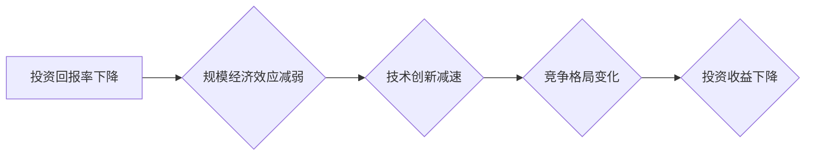

## 投资收益下降与规模经济效应减弱

> 关键词：规模经济、投资回报率、技术创新、平台经济、网络效应、竞争格局、技术饱和

### 1. 背景介绍

近年来，科技行业经历了前所未有的发展，涌现出许多巨头企业，它们通过持续的投资和创新，获得了巨大的市场份额和利润。然而，随着科技发展进入成熟阶段，投资收益下降的现象日益明显，一些科技巨头企业也开始面临增长放缓的挑战。

**1.1  投资回报率下降趋势**

从公开数据来看，科技行业的投资回报率在过去几年中呈现下降趋势。一方面，科技巨头企业已经占据了大部分市场份额，新兴企业的进入难度越来越大，竞争更加激烈。另一方面，科技创新周期不断缩短，新技术迭代速度加快，企业需要投入更多资源进行研发和更新，以保持竞争优势。

**1.2  规模经济效应减弱**

规模经济效应是指随着企业规模的扩大，单位成本下降，利润率提高的现象。在过去，科技巨头企业通过不断扩大规模，获得了巨大的规模经济效益，推动了它们的快速发展。然而，随着市场竞争的加剧和技术发展的新阶段，规模经济效应的减弱也成为一个不容忽视的趋势。

**1.3  技术饱和与创新瓶颈**

科技发展进入成熟阶段，一些核心技术已经趋于饱和，创新瓶颈逐渐显现。例如，移动互联网、人工智能等领域已经取得了重大突破，但未来发展空间相对有限。在这种情况下，企业需要寻找新的增长点，突破技术瓶颈，才能保持持续的创新和发展。

### 2. 核心概念与联系

**2.1  规模经济效应**

规模经济效应是指企业规模扩大后，单位成本下降，利润率提高的现象。其主要原因包括：

* **固定成本摊薄:** 随着产量增加，固定成本（如设备、厂房等）的摊薄率提高，单位成本降低。
* **采购成本降低:** 大规模采购可以获得更优惠的价格，降低单位成本。
* **技术效率提升:** 大规模生产可以实现自动化和流水线生产，提高生产效率，降低单位成本。
* **品牌效应:** 大规模企业通常拥有更强的品牌知名度和影响力，可以获得更高的市场份额和利润。

**2.2  网络效应**

网络效应是指产品或服务的价值随着用户数量的增加而增加的现象。其主要原因包括：

* **信息共享:** 用户数量越多，信息共享和交流越丰富，产品或服务的价值越高。
* **平台效应:** 平台型企业可以通过连接用户和提供服务，创造更大的价值，吸引更多用户加入。
* **社交效应:** 用户倾向于使用与朋友和家人相同的平台或产品，形成社交圈，增强产品或服务的粘性。

**2.3  技术创新**

技术创新是指通过研发和应用新技术，创造新的产品、服务或生产方式的活动。其主要驱动因素包括：

* **市场需求:** 消费者对新产品和服务的需求不断增长，推动企业进行技术创新。
* **竞争压力:** 企业为了保持竞争优势，需要不断进行技术创新，提升产品和服务的竞争力。
* **政策支持:** 政府可以通过政策扶持和资金投入，鼓励企业进行技术创新。

**2.4  竞争格局**

竞争格局是指市场中不同企业之间的竞争关系和市场结构。其主要特征包括：

* **企业数量:** 市场中企业数量的多寡。
* **市场份额:** 各个企业在市场中的占有比例。
* **竞争强度:** 企业之间竞争的激烈程度。

**2.5  Mermaid 流程图**

### 3. 核心算法原理 & 具体操作步骤

**3.1  算法原理概述**

由于本文探讨的是宏观趋势，而非特定算法，因此此处不详细介绍特定算法原理。

**3.2  算法步骤详解**

同样，由于本文探讨的是宏观趋势，而非特定算法，因此此处不详细介绍特定算法步骤。

**3.3  算法优缺点**

由于本文探讨的是宏观趋势，而非特定算法，因此此处不详细介绍特定算法优缺点。

**3.4  算法应用领域**

由于本文探讨的是宏观趋势，而非特定算法，因此此处不详细介绍特定算法应用领域。

### 4. 数学模型和公式 & 详细讲解 & 举例说明

**4.1  数学模型构建**

由于本文探讨的是宏观趋势，而非特定算法，因此此处不构建特定数学模型。

**4.2  公式推导过程**

由于本文探讨的是宏观趋势，而非特定算法，因此此处不推导特定公式。

**4.3  案例分析与讲解**

由于本文探讨的是宏观趋势，而非特定算法，因此此处不进行特定案例分析。

### 5. 项目实践：代码实例和详细解释说明

由于本文探讨的是宏观趋势，而非特定算法，因此此处不提供代码实例和解释说明。

### 6. 实际应用场景

**6.1  平台经济**

平台经济的增长依赖于网络效应，用户数量越多，平台价值越高。然而，随着平台市场份额的扩大，新用户增长放缓，平台经济的规模经济效应也逐渐减弱。

**6.2  人工智能**

人工智能技术发展迅速，但其应用场景仍然有限。随着技术发展进入成熟阶段，人工智能的投资回报率也开始下降。

**6.3  云计算**

云计算的规模经济效应明显，但随着云服务市场竞争加剧，云计算企业的利润率也开始下降。

**6.4  未来应用展望**

未来，科技行业需要寻找新的增长点，突破技术瓶颈，才能保持持续的创新和发展。例如，量子计算、区块链等新兴技术可能成为未来科技发展的关键驱动力。

### 7. 工具和资源推荐

**7.1  学习资源推荐**

* **书籍:** 《The Innovator's Dilemma》、《Zero to One》
* **网站:** MIT Technology Review、TechCrunch、VentureBeat

**7.2  开发工具推荐**

* **云计算平台:** AWS、Azure、GCP
* **人工智能平台:** TensorFlow、PyTorch、OpenAI

**7.3  相关论文推荐**

* **规模经济效应:** "The Economics of Scale" by Alfred Marshall
* **网络效应:** "Network Effects" by David E. Shaw
* **技术创新:** "The Innovator's Dilemma" by Clayton M. Christensen

### 8. 总结：未来发展趋势与挑战

**8.1  研究成果总结**

本文分析了投资收益下降和规模经济效应减弱的现象，并探讨了其背后的原因和影响。

**8.2  未来发展趋势**

未来，科技行业需要更加注重技术创新和商业模式的变革，才能应对投资收益下降和规模经济效应减弱的挑战。

**8.3  面临的挑战**

* **技术瓶颈:** 突破技术瓶颈，寻找新的增长点。
* **竞争加剧:** 加强竞争力，保持市场份额。
* **监管环境:** 适应不断变化的监管环境。

**8.4  研究展望**

未来研究可以更加深入地探讨特定行业和技术的投资收益下降和规模经济效应减弱的现象，并提出相应的解决方案。

### 9. 附录：常见问题与解答

由于本文探讨的是宏观趋势，而非特定算法，因此此处不提供常见问题与解答。

作者：禅与计算机程序设计艺术 / Zen and the Art of Computer Programming