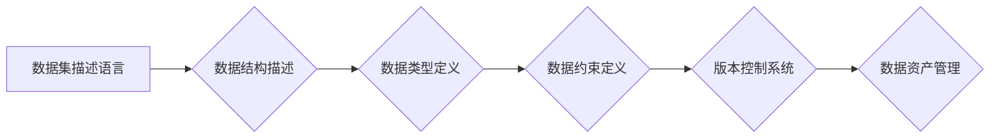

## 数据集描述语言:构建数据集版本控制系统

> 关键词：数据集描述语言，版本控制，数据资产管理，数据可追溯性，数据质量

### 1. 背景介绍

在数据驱动时代，高质量的数据集成为人工智能、机器学习等领域的基础。随着数据规模的不断增长和应用场景的不断拓展，如何有效管理和控制数据集的版本、质量和可追溯性成为一个越来越重要的挑战。传统的版本控制系统主要针对代码和文本文件，对于结构复杂、内容多样的数据集并不适用。因此，迫切需要一种专门针对数据集的描述语言和版本控制系统。

数据集描述语言 (Dataset Description Language, DDL) 旨在提供一种标准化的方式来描述数据集的结构、内容、元数据和版本信息。通过使用 DDL，我们可以实现以下目标：

* **提高数据集的可发现性和可理解性:** DDL 可以清晰地描述数据集的结构和内容，方便用户理解和使用。
* **增强数据集的可追溯性和可重复性:** DDL 可以记录数据集的版本历史和修改记录，确保数据集的完整性和可重复性。
* **简化数据集的共享和协作:** DDL 可以方便地将数据集打包和共享，并支持多用户协作。
* **提升数据集的质量和可靠性:** DDL 可以定义数据质量规则和验证机制，确保数据集的准确性和一致性。

### 2. 核心概念与联系

DDL 的核心概念包括：

* **数据集描述:** 包含数据集的元数据信息，例如名称、描述、作者、版本号、数据类型、数据结构等。
* **数据结构:** 描述数据集中的数据元素的组织方式，例如表格、树、图等。
* **数据类型:** 定义数据元素的类型，例如数字、文本、日期等。
* **数据约束:** 定义数据元素的有效性规则，例如唯一性、完整性、格式等。
* **版本控制:** 记录数据集的修改历史和版本信息，支持回滚和比较不同版本的数据集。

DDL 与其他相关技术密切相关，例如：

* **数据仓库:** DDL 可以用于描述数据仓库中的数据结构和元数据。
* **数据湖:** DDL 可以用于描述数据湖中的数据格式和元数据。
* **机器学习:** DDL 可以用于描述机器学习模型的输入数据和输出结果。

**Mermaid 流程图:**



### 3. 核心算法原理 & 具体操作步骤

#### 3.1  算法原理概述

DDL 的核心算法原理是基于一种基于元数据的描述和版本控制机制。

* **元数据描述:** DDL 使用元数据来描述数据集的结构、内容、属性和版本信息。元数据可以存储在独立的元数据文件或嵌入到数据文件中。
* **版本控制:** DDL 支持基于元数据的版本控制机制，可以记录数据集的修改历史、版本号和修改者信息。

#### 3.2  算法步骤详解

1. **数据集描述:** 使用 DDL 定义数据集的元数据信息，包括名称、描述、作者、版本号、数据类型、数据结构等。
2. **数据结构描述:** 使用 DDL 定义数据集中的数据元素的组织方式，例如表格、树、图等。
3. **数据类型定义:** 使用 DDL 定义数据元素的类型，例如数字、文本、日期等。
4. **数据约束定义:** 使用 DDL 定义数据元素的有效性规则，例如唯一性、完整性、格式等。
5. **版本控制:** 使用 DDL 的版本控制机制记录数据集的修改历史和版本信息。

#### 3.3  算法优缺点

**优点:**

* **标准化:** DDL 提供了一种标准化的方式来描述数据集，提高了数据集的可发现性和可理解性。
* **可追溯性:** DDL 可以记录数据集的版本历史和修改记录，确保数据集的完整性和可重复性。
* **可扩展性:** DDL 可以扩展到支持各种数据类型和数据结构。

**缺点:**

* **复杂性:** DDL 的语法和语义可能比较复杂，需要一定的学习成本。
* **实施成本:** 建立基于 DDL 的数据集版本控制系统需要一定的开发和维护成本。

#### 3.4  算法应用领域

DDL 的应用领域非常广泛，例如：

* **人工智能:** 用于描述训练机器学习模型的数据集。
* **数据科学:** 用于描述用于数据分析和挖掘的数据集。
* **生物信息学:** 用于描述基因组数据和蛋白质结构数据。
* **金融科技:** 用于描述金融交易数据和客户数据。

### 4. 数学模型和公式 & 详细讲解 & 举例说明

#### 4.1  数学模型构建

DDL 可以使用图论模型来表示数据集的结构。

* **节点:** 代表数据集中的数据元素。
* **边:** 代表数据元素之间的关系。

#### 4.2  公式推导过程

可以使用图论中的算法来分析和操作数据集的结构，例如：

* **深度优先搜索 (DFS):** 用于遍历数据集中的数据元素。
* **广度优先搜索 (BFS):** 用于查找数据集中的特定数据元素。
* **最小生成树算法:** 用于找到数据集中的最小依赖关系。

#### 4.3  案例分析与讲解

例如，我们可以使用图论模型来描述一个学生成绩数据集。

* **节点:** 学生和课程。
* **边:** 学生和课程之间的成绩关系。

可以使用 DFS 算法遍历数据集，找到所有学生的成绩信息。可以使用 BFS 算法查找特定课程的学生成绩信息。可以使用最小生成树算法找到学生成绩之间的最小依赖关系。

### 5. 项目实践：代码实例和详细解释说明

#### 5.1  开发环境搭建

* **编程语言:** Python
* **框架:** Flask 或 Django
* **数据库:** PostgreSQL 或 MySQL

#### 5.2  源代码详细实现

```python
# 数据集描述语言示例代码

class Dataset:
    def __init__(self, name, description, version):
        self.name = name
        self.description = description
        self.version = version
        self.schema = []

    def add_schema(self, field_name, field_type, field_constraints):
        self.schema.append({
            "field_name": field_name,
            "field_type": field_type,
            "field_constraints": field_constraints
        })

# 示例代码
dataset = Dataset("student_scores", "学生成绩数据集", "v1.0")
dataset.add_schema("student_id", "integer", ["unique"])
dataset.add_schema("course_id", "integer", [])
dataset.add_schema("score", "integer", [])

# 将数据集描述信息存储到数据库或文件
```

#### 5.3  代码解读与分析

* `Dataset` 类定义了一个数据集的结构，包括名称、描述、版本号和数据结构。
* `add_schema` 方法用于添加数据集的字段信息，包括字段名称、数据类型和约束条件。
* 示例代码演示了如何创建并添加字段信息到一个名为 "student_scores" 的数据集。

#### 5.4  运行结果展示

运行上述代码将创建一个名为 "student_scores" 的数据集描述，并将其存储到数据库或文件。

### 6. 实际应用场景

DDL 可以应用于各种实际场景，例如：

* **数据科学:** 用于描述用于数据分析和挖掘的数据集，确保数据质量和一致性。
* **机器学习:** 用于描述训练机器学习模型的数据集，提高模型的训练效率和准确性。
* **生物信息学:** 用于描述基因组数据和蛋白质结构数据，方便数据分析和研究。
* **金融科技:** 用于描述金融交易数据和客户数据，提高数据安全性和隐私保护。

### 6.4  未来应用展望

DDL 的未来应用前景非常广阔，例如：

* **数据联邦学习:** DDL 可以用于描述联邦学习中的数据分布，方便数据共享和模型训练。
* **数据可视化:** DDL 可以用于生成数据集的交互式可视化图表，方便数据探索和分析。
* **数据治理:** DDL 可以用于构建数据治理平台，管理和控制数据资产的生命周期。

### 7. 工具和资源推荐

#### 7.1  学习资源推荐

* **论文:**

    * [Towards a Standard for Describing Datasets](https://arxiv.org/abs/1903.07197)
    * [The Data Description Language (DDL)](https://www.w3.org/TR/data-description-language/)

* **书籍:**

    * [Data Science for Business](https://www.oreilly.com/library/view/data-science-for/9781491951185/)
    * [Python for Data Analysis](https://www.oreilly.com/library/view/python-for-data/9781491957651/)

#### 7.2  开发工具推荐

* **Python:** 广泛用于数据科学和机器学习开发。
* **Flask/Django:** Python Web 框架，用于构建数据管理平台。
* **PostgreSQL/MySQL:** 关系型数据库，用于存储数据集描述信息。

#### 7.3  相关论文推荐

* [Data Description Language (DDL)](https://www.w3.org/TR/data-description-language/)
* [Towards a Standard for Describing Datasets](https://arxiv.org/abs/1903.07197)

### 8. 总结：未来发展趋势与挑战

#### 8.1  研究成果总结

DDL 为数据资产管理提供了一种新的思路和方法，可以有效提高数据集的可发现性、可理解性和可追溯性。

#### 8.2  未来发展趋势

DDL 的未来发展趋势包括：

* **标准化:** 形成更完善的 DDL 标准，提高其可移植性和互操作性。
* **自动化:** 自动生成 DDL 描述，简化数据集管理流程。
* **集成:** 将 DDL 集成到现有数据管理平台和工具中，提高其应用范围。

#### 8.3  面临的挑战

DDL 的发展还面临一些挑战，例如：

* **复杂性:** DDL 的语法和语义可能比较复杂，需要进一步简化和优化。
* **实施成本:** 建立基于 DDL 的数据集版本控制系统需要一定的开发和维护成本。
* **生态系统建设:** 需要构建完善的 DDL 生态系统，包括工具、资源和社区支持。

#### 8.4  研究展望

未来，我们将继续研究和完善 DDL，使其成为数据资产管理的标准工具，推动数据驱动时代的到来。

### 9. 附录：常见问题与解答

* **Q1: DDL 与 JSON 或 YAML 等数据格式有什么区别？**

    A1: DDL 专注于描述数据集的结构和元数据，而 JSON 或 YAML 则更侧重于数据本身的表示。

* **Q2: 如何使用 DDL 来管理大型数据集？**

    A2: 可以使用分层结构或数据分片技术来管理大型数据集，并使用 DDL 来描述每个子数据集的结构和元数据。

* **Q3: DDL 是否支持不同类型的数据库？**

    A3: DDL 可以与多种数据库系统兼容，例如关系型数据库、NoSQL 数据库等。

* **Q4: 如何学习和使用 DDL？**

    A4: 可以参考相关论文、书籍和在线教程，并参与 DDL 社区讨论。


作者：禅与计算机程序设计艺术 / Zen and the Art of Computer Programming 
