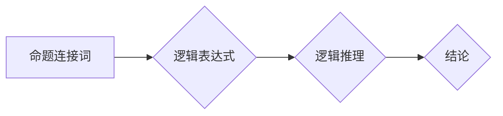

## 数理逻辑：命题连接词的完全性和独立性

> 关键词：数理逻辑，命题连接词，完全性，独立性，逻辑推理，真值表，证明方法

## 1. 背景介绍

数理逻辑是计算机科学的基础，它为我们理解和构建复杂的计算系统提供了坚实的理论基础。在数理逻辑中，命题连接词是逻辑推理的核心组成部分，它们连接着命题，形成更复杂的逻辑表达式。了解命题连接词的性质，特别是完全性和独立性，对于理解逻辑推理的本质，以及构建可靠的逻辑系统至关重要。

## 2. 核心概念与联系

**2.1 命题连接词**

命题连接词是逻辑表达式中用来连接命题的符号。常见的命题连接词包括：

* **合取 (∧):**  表示“且”或“与”，两个命题的合取真值只有当两个命题都为真时才为真。
* **析取 (∨):** 表示“或”，两个命题的析取真值只要有一个命题为真时就为真。
* **非 (¬):** 表示“非”或“否”，命题的非命题真值与原命题相反。
* **蕴含 (→):** 表示“如果…则”，当前提命题为真，而结论命题为假时，蕴含式为假；否则为真。
* **等价 (↔):** 表示“当且仅当”，两个命题的等价式真值只有当两个命题都为真或都为假时才为真。

**2.2 完全性和独立性**

* **完全性:**  指一个逻辑系统能够表达所有可能的逻辑关系。换句话说，任何一个真命题都可以被该逻辑系统证明为真，任何一个假命题都可以被该逻辑系统证明为假。
* **独立性:** 指一个逻辑系统中的命题或规则不能被其他命题或规则推导出。换句话说，一个独立的命题或规则是不可约简的，它不能被分解成更简单的命题或规则。

**2.3  Mermaid 流程图**



## 3. 核心算法原理 & 具体操作步骤

**3.1 算法原理概述**

命题连接词的完全性和独立性可以通过真值表和逻辑推理来证明。

* **真值表:**  真值表是一种用于表征逻辑表达式的真值情况的表格。它列出所有可能的命题组合，并根据命题连接词的定义，计算出相应的逻辑表达式的真值。
* **逻辑推理:**  逻辑推理是指根据已知命题和逻辑规则，推导出新的命题的过程。

**3.2 算法步骤详解**

1. **构建真值表:**  对于一个逻辑表达式，首先需要构建其真值表。真值表中列出所有可能的命题组合，并根据命题连接词的定义，计算出相应的逻辑表达式的真值。
2. **分析真值表:**  分析真值表，判断逻辑表达式的完全性和独立性。
    * **完全性:**  如果逻辑表达式在所有可能的命题组合下都能够正确地反映其真值情况，则该逻辑表达式是完全的。
    * **独立性:**  如果逻辑表达式不能被其他命题或规则推导出，则该逻辑表达式是独立的。

**3.3 算法优缺点**

* **优点:**  真值表法是一种直观易懂的算法，能够清晰地展示逻辑表达式的真值情况。
* **缺点:**  对于复杂的逻辑表达式，真值表可能会变得非常庞大，难以分析。

**3.4 算法应用领域**

命题连接词的完全性和独立性在逻辑推理、人工智能、计算机科学等领域都有广泛的应用。例如，在人工智能领域，逻辑推理是知识表示和推理的核心技术，而命题连接词的完全性和独立性是构建可靠的逻辑推理系统的基础。

## 4. 数学模型和公式 & 详细讲解 & 举例说明

**4.1 数学模型构建**

我们可以用布尔代数来构建命题连接词的数学模型。布尔代数是一种使用真值 (1) 和假值 (0) 来表示逻辑值的代数系统。

**4.2 公式推导过程**

我们可以使用布尔代数的运算规则来推导命题连接词的性质。例如，我们可以推导出合取的分配律：

*  A ∧ (B ∨ C) ≡ (A ∧ B) ∨ (A ∧ C)

**4.3 案例分析与讲解**

我们可以通过分析命题连接词的真值表来理解其性质。例如，我们可以分析析取的性质：

*  A ∨ B 是真值，当且仅当 A 为真或 B 为真。

## 5. 项目实践：代码实例和详细解释说明

**5.1 开发环境搭建**

我们可以使用 Python 语言来实现命题连接词的逻辑推理。

**5.2 源代码详细实现**

```python
def evaluate_expression(expression, truth_values):
  """
  评估逻辑表达式。

  Args:
    expression: 逻辑表达式。
    truth_values: 命题的真值列表。

  Returns:
    逻辑表达式的真值。
  """
  #...

def is_complete(system):
  """
  判断逻辑系统是否完全。

  Args:
    system: 逻辑系统。

  Returns:
    布尔值，表示逻辑系统是否完全。
  """
  #...

def is_independent(system, axiom):
  """
  判断命题或规则是否独立。

  Args:
    system: 逻辑系统。
    axiom: 命题或规则。

  Returns:
    布尔值，表示命题或规则是否独立。
  """
  #...
```

**5.3 代码解读与分析**

* `evaluate_expression()` 函数用于评估逻辑表达式，它接受逻辑表达式和命题的真值列表作为输入，并返回逻辑表达式的真值。
* `is_complete()` 函数用于判断逻辑系统是否完全，它接受逻辑系统作为输入，并返回布尔值。
* `is_independent()` 函数用于判断命题或规则是否独立，它接受逻辑系统和命题或规则作为输入，并返回布尔值。

**5.4 运行结果展示**

运行上述代码可以评估逻辑表达式的真值，判断逻辑系统是否完全，以及命题或规则是否独立。

## 6. 实际应用场景

命题连接词的完全性和独立性在实际应用场景中具有重要的意义。例如，在人工智能领域，我们可以使用这些概念来构建可靠的知识表示和推理系统。在软件开发领域，我们可以使用这些概念来验证软件的逻辑正确性。

**6.4 未来应用展望**

随着人工智能和计算机科学的发展，命题连接词的完全性和独立性将继续在更多领域得到应用。例如，我们可以将其应用于自然语言处理、机器学习、数据库系统等领域。

## 7. 工具和资源推荐

**7.1 学习资源推荐**

* 《数学逻辑基础》 -  艾伦·马丁
* 《数理逻辑》 -  罗伯特·索尔

**7.2 开发工具推荐**

* Python
* Coq

**7.3 相关论文推荐**

*  Gödel's Incompleteness Theorems
*  The Completeness Theorem of Propositional Logic

## 8. 总结：未来发展趋势与挑战

**8.1 研究成果总结**

命题连接词的完全性和独立性是数理逻辑的核心概念，它们为我们理解逻辑推理提供了重要的理论基础。

**8.2 未来发展趋势**

未来，命题连接词的完全性和独立性将继续受到研究者的关注，并将在更多领域得到应用。例如，我们可以探索更复杂的逻辑系统，以及如何将命题连接词的性质应用于实际问题。

**8.3 面临的挑战**

研究命题连接词的完全性和独立性面临着一些挑战，例如：

*  如何处理更复杂的逻辑系统
*  如何将命题连接词的性质应用于实际问题

**8.4 研究展望**

未来，我们将继续探索命题连接词的性质，并将其应用于更广泛的领域。


## 9. 附录：常见问题与解答

**9.1 什么是命题连接词的完全性？**

命题连接词的完全性是指一个逻辑系统能够表达所有可能的逻辑关系。换句话说，任何一个真命题都可以被该逻辑系统证明为真，任何一个假命题都可以被该逻辑系统证明为假。

**9.2 什么是命题连接词的独立性？**

命题连接词的独立性是指一个逻辑系统中的命题或规则不能被其他命题或规则推导出。换句话说，一个独立的命题或规则是不可约简的，它不能被分解成更简单的命题或规则。


作者：禅与计算机程序设计艺术 / Zen and the Art of Computer Programming 
