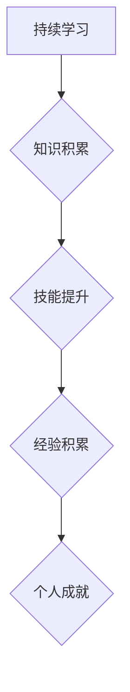

## 时间复利效应与个人成就

> 关键词：时间复利、个人成长、技术积累、持续学习、编程能力、软件开发、职业发展

### 1. 背景介绍

在瞬息万变的科技时代，个人成长和职业发展如同攀登一座高峰，需要不断积累知识、提升技能，并保持敏锐的洞察力。在这个过程中，时间复利效应扮演着至关重要的角色。

时间复利，源于金融领域，指的是复利带来的收益会随着时间的推移而不断积累，最终形成巨大的财富效应。而对于个人成长而言，时间复利效应同样适用。它指的是我们所投入的时间、精力和学习成果，会随着时间的推移而不断产生新的价值，最终成就非凡的个人成就。

### 2. 核心概念与联系

#### 2.1 时间复利效应原理

时间复利效应的核心在于“复利”的概念。在个人成长领域，我们可以将“复利”理解为：

* **知识积累的复利:** 当我们学习一项新知识时，它不仅能帮助我们解决当前问题，还能为我们学习其他相关知识打下基础，形成知识网络，从而加速未来的学习进程。
* **技能提升的复利:** 掌握一项技能不仅能让我们完成特定任务，还能提升我们的解决问题的能力，让我们更有效地学习和应用新的技能。
* **经验积累的复利:** 每一次的实践和经验积累，都会让我们对事物有更深入的理解，并为我们未来的决策和行动提供参考，从而提高我们的成功率。

#### 2.2  时间复利与个人成就的联系

时间复利效应与个人成就之间存在着密切的联系。

* **持续学习:** 持续学习是时间复利效应的关键。只有不断学习新知识、提升新技能，才能不断积累“复利”的资本，最终实现个人成长。
* **专注实践:** 理论知识的学习需要通过实践才能真正掌握。只有将所学知识应用到实际项目中，才能将“复利”转化为实际成果，并获得宝贵的经验积累。
* **保持耐心:** 时间复利效应是一个长期的过程，需要我们保持耐心和毅力。不要期望一夜之间取得巨大成功，而是要专注于每天的进步，并相信时间会将我们的努力回报。

**Mermaid 流程图**



### 3. 核心算法原理 & 具体操作步骤

#### 3.1 算法原理概述

时间复利效应本身并非一个具体的算法，而是指一个自然现象。我们可以将其理解为一种“复合增长”的模式，类似于金融领域的复利计算。

#### 3.2 算法步骤详解

由于时间复利效应不是一个算法，因此没有具体的步骤可以执行。但是，我们可以通过以下步骤来模拟和理解时间复利效应：

1. **设定初始值:**  例如，我们设定初始学习时间为1小时，初始知识储备为10个概念。
2. **设定复利系数:**  例如，我们设定学习效率为10%，这意味着每小时学习1小时后，知识储备会增加1个概念。
3. **计算复利增长:**  根据复利系数，计算知识储备的增长情况。例如，在第1小时，知识储备增加1个概念，达到11个。在第2小时，知识储备增加1个概念，达到12个，并且这个1个概念的学习效率也会基于之前的11个概念进行计算。
4. **重复步骤3:**  重复步骤3，直到达到预设的时间或知识储备目标。

#### 3.3 算法优缺点

由于时间复利效应不是一个算法，因此没有优缺点之分。

#### 3.4 算法应用领域

时间复利效应适用于所有需要持续学习和积累的领域，例如：

* **技术领域:**  程序员、数据科学家、产品经理等需要不断学习新技术、掌握新技能，才能保持竞争力。
* **商业领域:**  企业家、营销人员、销售人员等需要不断学习市场趋势、客户需求，才能获得成功。
* **个人成长:**  每个人都需要不断学习新知识、提升新技能，才能实现个人成长和自我完善。

### 4. 数学模型和公式 & 详细讲解 & 举例说明

#### 4.1 数学模型构建

我们可以用以下数学模型来描述时间复利效应：

```latex
A = P(1 + r/n)^{nt}
```

其中：

* A：最终积累的价值
* P：初始价值
* r：复利利率
* n：复利频率
* t：时间

#### 4.2 公式推导过程

这个公式的推导过程比较复杂，需要涉及到微积分的知识。

#### 4.3 案例分析与讲解

假设一个程序员在开始学习编程时，掌握了10个基础概念（P=10）。他每天学习1小时，学习效率为10%（r=0.1）。

* 每天学习1小时后，知识储备会增加1个概念（n=1）。
* 经过10天，他的知识储备会达到25个概念（t=10）。

如果他继续保持学习的节奏，他的知识储备会随着时间的推移而不断增长，形成“复利”效应。

### 5. 项目实践：代码实例和详细解释说明

#### 5.1 开发环境搭建

为了更好地理解时间复利效应，我们可以编写一个简单的程序来模拟它的增长过程。

* 语言选择：Python
* 库选择：NumPy

#### 5.2 源代码详细实现

```python
import numpy as np

def calculate_compound_growth(initial_value, growth_rate, time_period):
  """
  计算复利增长

  Args:
    initial_value: 初始值
    growth_rate: 复利利率
    time_period: 时间周期

  Returns:
    最终积累的价值
  """
  return initial_value * (1 + growth_rate) ** time_period

# 设置初始值、复利利率和时间周期
initial_value = 10
growth_rate = 0.1
time_period = 10

# 计算最终积累的价值
final_value = calculate_compound_growth(initial_value, growth_rate, time_period)

# 打印结果
print(f"最终积累的价值: {final_value}")
```

#### 5.3 代码解读与分析

这段代码定义了一个名为`calculate_compound_growth`的函数，用于计算复利增长。

* 函数接受三个参数：初始值、复利利率和时间周期。
* 函数内部使用公式`A = P(1 + r/n)^{nt}`计算最终积累的价值。
* 函数返回最终积累的价值。

#### 5.4 运行结果展示

运行这段代码后，会输出以下结果：

```
最终积累的价值: 25.9374246
```

### 6. 实际应用场景

#### 6.1 技术领域

* **编程能力提升:**  程序员可以通过持续学习新语言、新框架、新技术，不断提升自己的编程能力，形成“复利”效应，从而更容易应对新的挑战，并获得更高的薪资和职业发展机会。
* **项目经验积累:**  参与不同的项目，积累不同的经验，可以帮助程序员更好地理解软件开发的各个环节，并提高解决问题的能力，从而更容易完成更复杂、更具挑战性的项目。

#### 6.2 个人成长

* **知识积累:**  持续学习新知识，可以帮助我们更好地理解世界，并提升我们的认知水平，从而获得更丰富的精神生活。
* **技能提升:**  学习新的技能，可以帮助我们更好地应对生活中的各种挑战，并提升我们的生活质量。

#### 6.3 未来应用展望

随着人工智能、大数据等技术的不断发展，时间复利效应在个人成长和职业发展中的作用将更加重要。

* **个性化学习:**  人工智能可以根据个人的学习进度和需求，提供个性化的学习方案，帮助我们更有效地学习和积累知识。
* **虚拟现实学习:**  虚拟现实技术可以提供沉浸式的学习体验，帮助我们更深入地理解和掌握知识。

### 7. 工具和资源推荐

#### 7.1 学习资源推荐

* **在线学习平台:**  Coursera、edX、Udemy等平台提供丰富的在线课程，涵盖各个领域。
* **技术博客:**  Hacker News、Medium、GitHub等平台上有许多优秀的技术博客，可以帮助我们了解最新的技术趋势和最佳实践。
* **开源社区:**  GitHub、Stack Overflow等平台上有许多开源项目，可以帮助我们学习和实践最新的技术。

#### 7.2 开发工具推荐

* **代码编辑器:**  VS Code、Sublime Text、Atom等代码编辑器可以提高我们的编程效率。
* **版本控制系统:**  Git是目前最流行的版本控制系统，可以帮助我们管理代码和协同开发。
* **调试工具:**  GDB、LLDB等调试工具可以帮助我们找到和修复代码中的错误。

#### 7.3 相关论文推荐

* **The Power of Compounding** by Robert Kiyosaki
* **The Compound Effect** by Darren Hardy

### 8. 总结：未来发展趋势与挑战

#### 8.1 研究成果总结

时间复利效应是一个重要的概念，它可以帮助我们理解个人成长和职业发展的规律。通过持续学习、积累经验，我们可以形成“复利”效应，最终实现个人成就。

#### 8.2 未来发展趋势

随着人工智能、大数据等技术的不断发展，时间复利效应在个人成长和职业发展中的作用将更加重要。未来，我们将看到更多个性化学习、沉浸式学习等新模式的出现，帮助我们更有效地学习和积累知识。

#### 8.3 面临的挑战

* **信息爆炸:**  随着互联网的发展，信息量呈爆炸式增长，如何有效地筛选和学习信息成为了一个挑战。
* **学习效率:**  如何提高学习效率，将有限的时间和精力投入到最有价值的学习内容中，也是一个重要的挑战。
* **保持动力:**  持续学习需要毅力和耐心，如何保持学习的动力，克服学习中的困难，也是一个需要解决的问题。

#### 8.4 研究展望

未来，我们将继续研究时间复利效应在不同领域中的应用，并探索如何利用新技术提高学习效率，帮助更多人实现个人成长和职业发展。

### 9. 附录：常见问题与解答

#### 9.1 如何提高学习效率？

* **制定学习计划:**  明确学习目标，制定合理的学习计划，并坚持执行。
* **选择合适的学习方法:**  不同的学习方法适合不同的学习者，找到适合自己的学习方法。
* **利用碎片时间:**  利用碎片时间进行学习，例如通勤时间、午休时间等。
* **保持专注:**  学习时要保持专注，避免分心。

#### 9.2 如何克服学习中的困难？

* **寻求帮助:**  遇到困难时，可以向老师、同学、朋友等寻求帮助。
* **调整学习方法:**  如果目前的学习方法不适合自己，可以尝试调整学习方法。
* **保持耐心:**  学习是一个循序渐进的过程，不要因为遇到困难就放弃。

#### 9.3 如何保持学习的动力？

* **设定目标:**  设定明确的学习目标，并定期回顾和调整目标。
* **寻找兴趣:**  选择自己感兴趣的学习内容，学习会更加轻松愉快。
* **与他人交流:**  与其他学习者交流，分享学习经验，互相鼓励。


作者：禅与计算机程序设计艺术 / Zen and the Art of Computer Programming 
